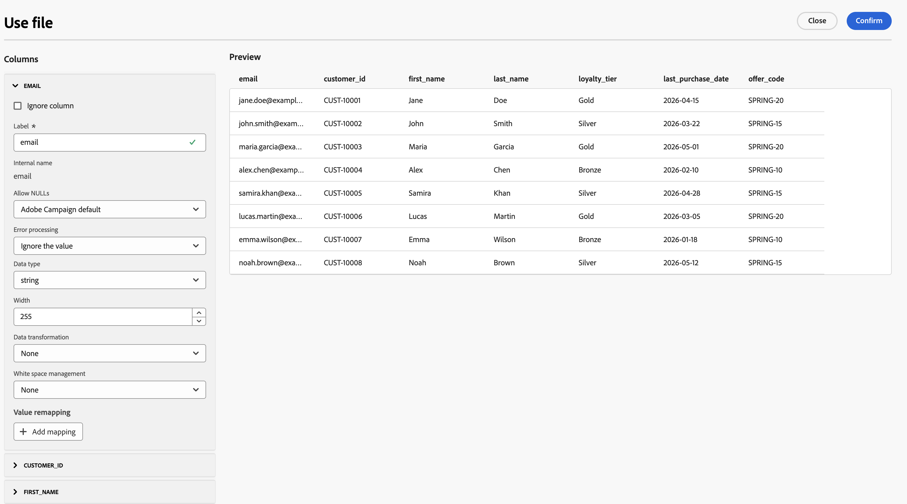

# 載入檔案 {#load-file}

>[!CONTEXTUALHELP]
>id="ajo_orchestration_load_file"
>title="載入檔案活動"
>abstract="**載入檔案**&#x200B;活動是&#x200B;**資料管理**&#x200B;活動。 使用它來處理「協調的行銷活動」畫布上儲存在外部檔案中的設定檔和資料，並定義行銷活動對象。 檔案資料在執行時消耗，且不會儲存為Adobe Experience Platform資料集。 使用身分欄和目標維度，將列調解至現有的收件者。 請聯絡您的Adobe代表以要求存取權。"

**[!UICONTROL 載入檔案]**&#x200B;活動是&#x200B;**[!UICONTROL 資料管理]**&#x200B;活動。 使用它來處理儲存在外部檔案中的設定檔和資料。 如果您的收件者清單來自外部系統（例如，CRM匯出或合作夥伴檔案），而且您想要執行行銷活動而不先建置完整的Adobe Experience Platform擷取管道，則它在協調的行銷活動中支援&#x200B;**檔案型鎖定目標**。

>[!AVAILABILITY]
>
>一組組織的&#x200B;**載入檔案**&#x200B;活動可在&#x200B;**有限可用性**&#x200B;中使用。 如欲請求存取權，請和您的 Adobe 代表聯絡。 如需可用性階段資訊，請參閱[Journey Optimizer發行週期](../../rn/releases.md)。
>
>此活動目前無法與&#x200B;**Healthcare Shield**&#x200B;或&#x200B;**Privacy and Security Shield**&#x200B;搭配使用。

## 護欄與限制 {#limitations}

下列限制適用於載入檔案活動：

* 每個檔案最多可上傳50 MB。
* 僅支援平面結構的CSV和TXT檔案。
* 行銷活動執行時會使用上傳的資料，而不會儲存為Adobe Experience Platform資料集。
* 每一列都必須與您選取之目標維度的現有收件者相符。 載入檔案活動不會從檔案建立新的設定檔。

如需頻道和畫布活動的限制，請參閱[護欄和限制](../guardrails.md#activities-limitations)。

## 先決條件 {#prerequisites}

設定&#x200B;**[!UICONTROL 載入檔案]**&#x200B;活動之前：

1. 建立調解所需的&#x200B;**[!UICONTROL 目標維度]** （例如，收件者）。 [瞭解如何建立目標維度](../target-dimension.md)

1. 確保檔案中的身分值符合該維度的現有記錄。 上傳檔案中的列會與現有的收件者進行調解，活動不會從檔案建立新的設定檔。

## 設定載入檔案活動 {#load-file-configuration}

將活動設定為兩個部分：使用範例檔案定義預期的檔案結構，然後指定要於行銷活動執行時載入的檔案，以及協調列至目標維度的方式。

請依照下列步驟設定&#x200B;**[!UICONTROL 載入檔案]**&#x200B;活動：

1. 新增&#x200B;**[!UICONTROL 載入檔案]**&#x200B;活動至您的協調行銷活動畫布。

   

1. 輸入活動的&#x200B;**[!UICONTROL 標籤]**。

1. 在&#x200B;**[!UICONTROL 範例檔案]**&#x200B;區段中，選取定義預期結構的本機檔案。

   >[!NOTE]
   >
   > 範例檔案僅用於設定欄和格式，其資料不會匯入為行銷活動對象。 格式必須符合行銷活動執行時將載入的檔案。

1. 在&#x200B;**[!UICONTROL 檔案型別]**&#x200B;下拉式清單中，指定檔案使用&#x200B;**分隔欄**&#x200B;或&#x200B;**固定寬度欄**。

   

1. 在&#x200B;**[!UICONTROL 欄]**&#x200B;區段中，展開每個欄並設定其屬性。

   

   以下屬性適用於每個欄。 選取&#x200B;**[!UICONTROL 資料型別]**&#x200B;之後，會顯示該型別的其他選項。 展開下列各節，針對各種資料型別取得完整清單。

   * **[!UICONTROL 忽略資料行]** — 選取時從匯入中排除資料行。
   * **[!UICONTROL 標籤]** — 資料行的顯示名稱（例如，`email`）。
   * **[!UICONTROL 內部名稱]** — 資料行的系統名稱，衍生自檔案標頭（唯讀）。
   * **[!UICONTROL 資料型別]** — 資料行中的資料型別。
   * **[!UICONTROL 允許NULL]** — 指定如何管理資料行中的空白值：

      * **[!UICONTROL Adobe Campaign預設值]** — 僅為數值欄位產生錯誤。 否則插入NULL值。
      * **[!UICONTROL 允許空值]** — 授權空值。 因此插入值 NULL。
      * **[!UICONTROL 一律填入]** — 如果值為空，則產生錯誤。

   * **[!UICONTROL 處理時發生錯誤]** — 定義在資料行中發生錯誤時的行為：

      * **[!UICONTROL 忽略值]** — 忽略該值。
      * **[!UICONTROL 拒絕行]** — 未處理整行。
      * **[!UICONTROL 發生錯誤時使用預設值]** — 將造成錯誤的值取代為&#x200B;**[!UICONTROL 預設值]**&#x200B;欄位中定義的預設值。
      * **[!UICONTROL 在值未重新對應時使用預設值]** — 除非已針對錯誤值定義對應，否則以在&#x200B;**[!UICONTROL 預設值]**&#x200B;欄位中定義的預設值取代造成錯誤的值。
      * **[!UICONTROL 沒有重新對應值時拒絕此行]** — 除非已經為錯誤值定義對應，否則不會處理整行。

   * **[!UICONTROL 預設值]** — 將&#x200B;**[!UICONTROL 錯誤處理]**&#x200B;時使用的預設值設定為使用預設值。
   * **[!UICONTROL 值重新對應]** — 將特定值對應到新值。 按一下&#x200B;**[!UICONTROL 新增對應]**&#x200B;以定義每個對應（例如，將`True`/`False`取代為`1`/`0`）。

   +++字串欄引數

   * **[!UICONTROL 寬度]** — 字元數上限。
   * **[!UICONTROL 資料轉換]** — 套用至字串值（例如，無或大寫/小寫）的大小寫轉換。
   * **[!UICONTROL 空白字元管理]** — 如何處理字串值中的前導或尾隨空格。

   +++

   +++整數和浮點數欄引數

   * **[!UICONTROL 格式]** — 定義如何讀取檔案中的數值：

      * **[!UICONTROL 其他]** — 定義&#x200B;**[!UICONTROL 分隔符號]**&#x200B;區段中的&#x200B;**[!UICONTROL 千位分隔符號]**&#x200B;和&#x200B;**[!UICONTROL 小數分隔符號]**。
      * **[!UICONTROL 1,000.00]** — 逗號做為千位分隔符號，句號做為小數分隔符號。
      * **[!UICONTROL 1 000,00]** — 以千位分隔符號表示空格，以逗號表示小數分隔符號。

   * **[!UICONTROL 分隔符號]** （當&#x200B;**[!UICONTROL 格式]**&#x200B;為&#x200B;**[!UICONTROL 其他]**&#x200B;時）：

      * **[!UICONTROL 千位分隔符號]** — 將千位分組為數值的字元（若未使用，請留空）。
      * **[!UICONTROL 小數分隔符號]** — 用於數值小數部分的字元（例如，`,`或`.`）。

   +++

   +++日期欄引數

   * **[!UICONTROL 日期格式]** — 符合日期在檔案中顯示方式的模式（例如，`yyyy/mm/dd`）。
   * **[!UICONTROL 分隔符號]**：

      * **[!UICONTROL 年、月、日]** — 年、月和日元件之間的字元（例如，`/`）。

   +++

   +++時間欄引數

   * **[!UICONTROL 時間格式]** — 符合時間在檔案中顯示方式的模式（例如，`13:30`表示24小時與分鐘）。
   * **[!UICONTROL 分隔符號]**：

      * **[!UICONTROL 小時、分鐘、秒]** — 小時、分鐘和秒元件之間的字元（例如，`:`）。

   +++

   +++日期和時間欄引數

   * **[!UICONTROL 日期格式]** — 與檔案中日期部分的顯示方式相符的模式。
   * **[!UICONTROL 時間格式]** — 符合時間部分在檔案中顯示方式的模式。
   * **[!UICONTROL 分隔符號]** — 日期與時間元件之間的字元，如欄的UI中所示。

   +++

1. 在&#x200B;**[!UICONTROL 格式]**&#x200B;區段中，指定檔案的結構方式，以便在行銷活動執行時正確讀取列和欄。 目標檔案必須使用與範例檔案相同的格式。

   

   * **[!UICONTROL 使用第一行做為資料行標題]** — 選取時，會將檔案的第一行視為資料行名稱。 從包含標頭列的檔案設定範例時，通常會啟用此選項。
   * **[!UICONTROL 使用行號作為識別碼]** — 選取時，每個資料列都會以其在檔案中的行號識別。
   * **[!UICONTROL 記錄跨越多行]** — 選取時，單一記錄可跨越檔案中的多行（例如，當欄位包含分行符號時）。
   * **[!UICONTROL 要忽略的行數]** — 讀取資料之前，在檔案開頭要略過的行數（例如，註解或中繼資料行）。
   * **[!UICONTROL 時區]** — 匯入日期和時間值時套用的時區。
   * **[!UICONTROL 編碼]** — 檔案的字元編碼。 選取符合您來源檔案的編碼。
   * **[!UICONTROL 字串分隔符號]** — 用來在檔案中括住字串值的字元。
   * **[!UICONTROL 欄分隔符號]** — 分隔檔案中欄的字元。

1. 在&#x200B;**[!UICONTROL 目標檔案]**&#x200B;區段中，選擇檔案的提供方式，例如&#x200B;**[!UICONTROL 從本機電腦上傳檔案]**，以便在此版本中手動上傳。

1. 選取要上傳的CSV或TXT檔案。

   >[!CAUTION]
   >
   > 確保目標檔案遵循與範例檔案相同的格式、欄結構和欄數。 不相符的專案在執行期間可能會造成錯誤。

1. 選取檔案中的身分欄 — 用來比對每列與現有收件者的欄位（例如，電子郵件地址或客戶ID）。

1. 選取要調解的&#x200B;**[!UICONTROL 目標維度]**。

1. 完成設定後，如果UI提供對應列範例，請預覽範例，然後確認。

1. 在&#x200B;**[!UICONTROL 拒絕管理]**&#x200B;區段中，定義檔案處理期間發生錯誤時活動的行為：

   * **[!UICONTROL 允許的錯誤數]** — 活動失敗之前允許的錯誤數上限。
   * **[!UICONTROL 將拒絕專案保留在檔案中]** — 啟用時，無法載入的資料列會寫入伺服器上的拒絕檔案，以供執行後檢閱。

1. 將出站轉變連線到下游活動。

無法與現有收件者調解的列會從對象中排除。 排除的列會記錄在行銷活動執行記錄中；行銷活動不會僅因為某些列不符而失敗。

## 在傳遞中使用檔案對象 {#downstream}

在&#x200B;**[!UICONTROL 載入檔案]**&#x200B;解析對象後，您可以使用標準協調的行銷活動活動：

* **[頻道活動](channels.md)** — 電子郵件、簡訊、推播通知或直接郵件。

* **[擴充](enrichment.md)**&#x200B;或&#x200B;**[調解](reconciliation.md)** — 視需要進一步調整或連結工作表資料。

[瞭解如何協調行銷活動](../orchestrate-activities.md)

## 執行與報告 {#execution}

行銷活動執行時：

* 檔案會在&#x200B;**執行時間**&#x200B;處理。

* 傳遞給下游活動的對象中接受的列。

* 已拒絕或未調解的資料列會被排除；計數和原因會顯示在&#x200B;**執行記錄檔**&#x200B;中（例如，載入的資料列總數、接受的資料列、拒絕的資料列）。

對於標準「協調的行銷活動」基礎結構下的&#x200B;**100,000列** CSV，對象解析的設計可在約&#x200B;**60秒**&#x200B;內完成。

## 相關內容 {#related}

* [建立目標維度](../target-dimension.md)
* [建置客群活動](build-audience.md)
* [讀取客群活動](read-audience.md)
* [調和活動](reconciliation.md)
* [護欄與限制](../guardrails.md)
