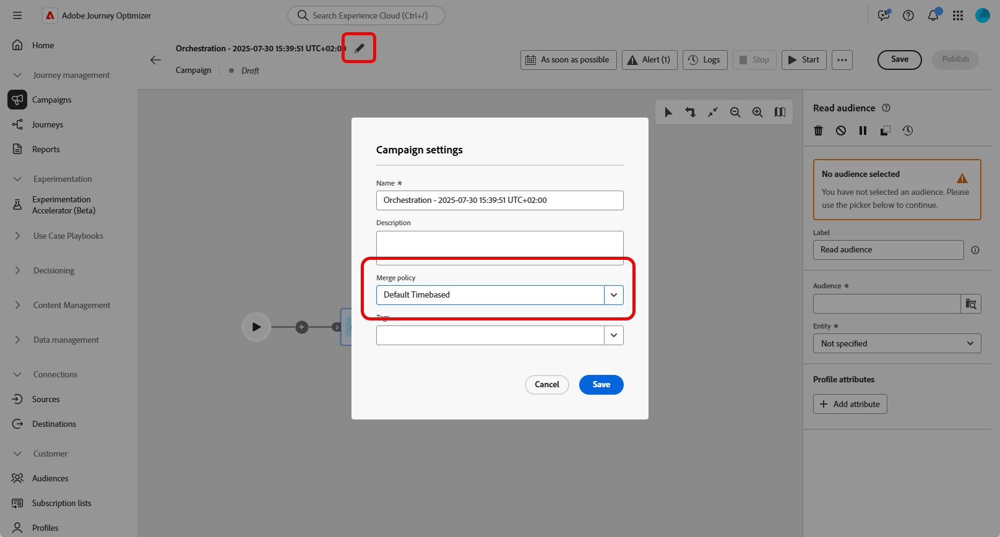
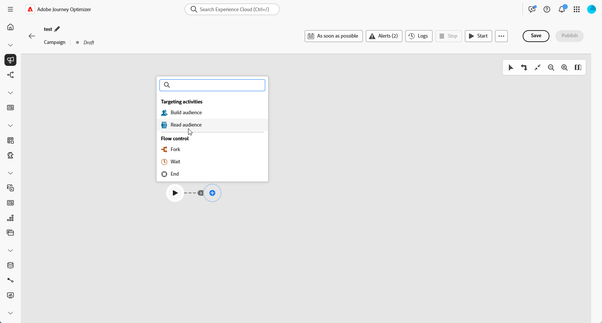
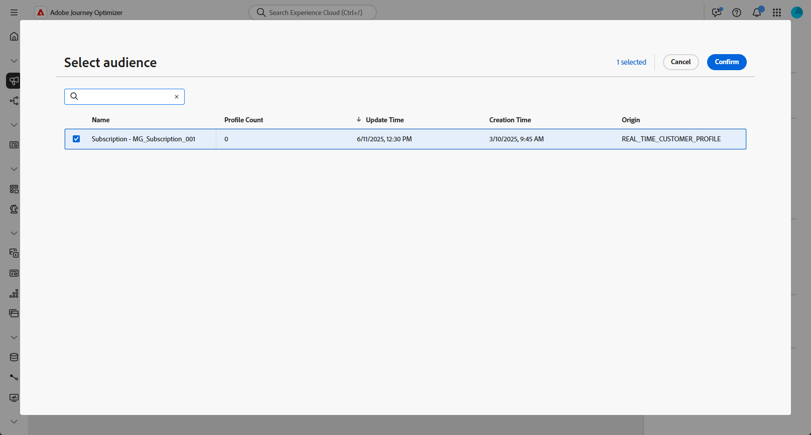
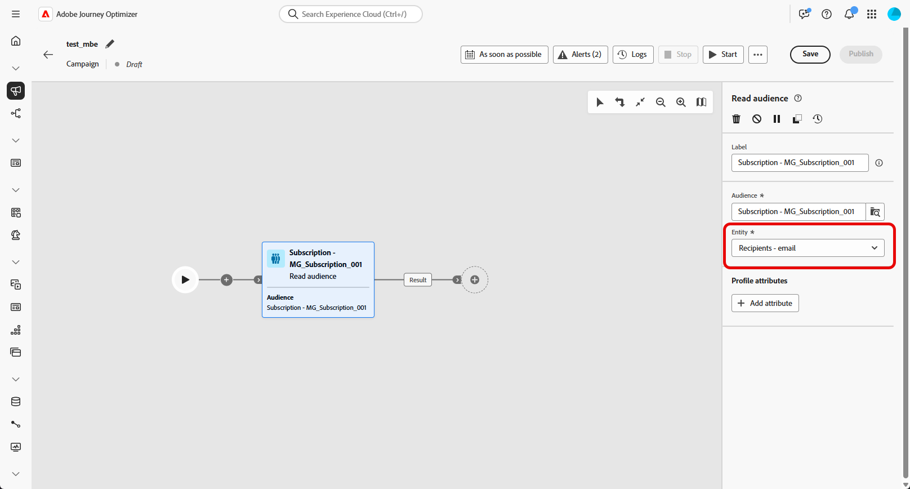
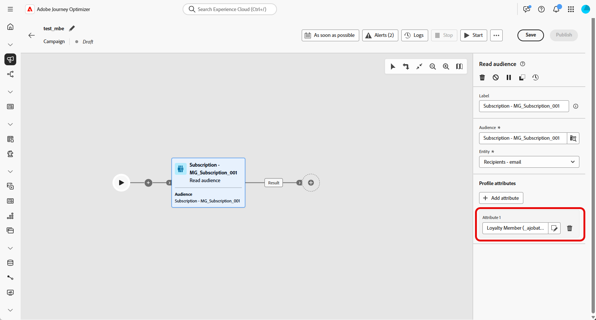
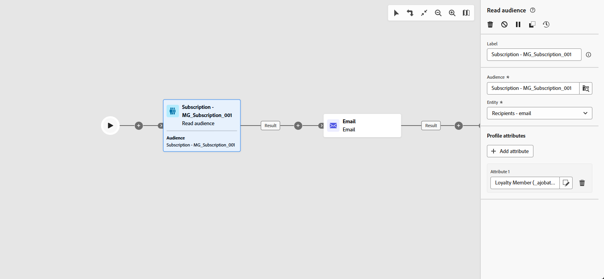

# 讀取客群 {#read-audience}

>[!CONTEXTUALHELP]
>id="ajo_orchestration_read_audience"
>title="建置客群活動"
>abstract="**讀取客群**&#x200B;活動可讓您選取將會進入協調的行銷活動之客群。此客群可以是現有的 Adobe Experience Platform 客群，或是從 CSV 檔案中提取的客群。在協調的行銷活動中傳送訊息時，不會在管道活動中定義訊息客群，而是在&#x200B;**讀取客群**&#x200B;或&#x200B;**建置客群**&#x200B;活動中定義。"

**[!UICONTROL 讀取對象]**&#x200B;活動可讓您擷取現有的對象（先前儲存或匯入），並在協調的行銷活動中重複使用它。 此活動對於鎖定一組預先定義的設定檔而無須執行新的細分程式特別有用。

載入對象後，您可以選擇選取唯一的身分欄位，並使用其他設定檔屬性來豐富對象，以用於目標定位、個人化或報告目的，藉此調整對象。

## 讀取對象快取 {#cache}

測試協調的行銷活動時，**[!UICONTROL 讀取對象]**&#x200B;活動通常需要一些時間來擷取資料，這會使測試執行更久。 若要加快速度，可使用&#x200B;**[!UICONTROL 讀取對象]**&#x200B;快取。

快取會將對象與選取的屬性一起儲存達&#x200B;**兩個小時**。 在這段期間，任何後續的測試執行都可以使用快取的結果，無需再次擷取資料。 **兩小時期間**&#x200B;過後，必須重新擷取資料。

系統會為每個協調的行銷活動儲存快取，而非對象本身。 如果在另一個協調行銷活動中的&#x200B;**[!UICONTROL 讀取對象]**&#x200B;活動中使用了相同的對象，則系統仍需要重新擷取資料。

在下列情況下不會保留快取：

* 當&#x200B;**[!UICONTROL 讀取對象]**&#x200B;活動更新為新屬性時，快取會以新屬性資料重新整理。 因此，更新後的第一次測試執行將需要較長的時間，因為需要再次擷取資料。

* 發佈「已協調的」行銷活動時，因為執行即時「已協調的」行銷活動時會擷取最新資料。

## 設定讀取對象活動 {#read-audience-configuration}

請依照下列步驟設定&#x200B;**[!UICONTROL 讀取對象]**&#x200B;活動：

1. 在新增&#x200B;**[!UICONTROL 讀取對象]**&#x200B;活動之前，請務必在行銷活動設定中選取&#x200B;**[!UICONTROL 合併原則]**。

   

1. 將&#x200B;**[!UICONTROL 讀取對象]**&#x200B;活動新增至您的協調行銷活動。

   

1. 輸入活動的&#x200B;**[!UICONTROL 標籤]**。 此標籤會作為您對象的名稱。

1. 按一下，選取您要針對協調行銷活動鎖定的對象。 [進一步瞭解如何在Journey Optimizer中產生及鎖定對象](../../audience/about-audiences.md)。

   

1. 從您的行銷活動目標維度中選擇&#x200B;**[!UICONTROL 實體&#x200B;]**。 此設定會定義目標實體，以及用於調解對象與目標維度的屬性。

   ➡️ [依照本頁面詳述的步驟建立您的行銷活動目標維度](../target-dimension.md)

   

1. 選取&#x200B;**[!UICONTROL 新增屬性]**，以使用其他資料擴充您選取的對象。 此步驟可讓您將設定檔屬性新增至對象，產生具有這些屬性增強的收件者清單。

1. 選擇要新增至對象的&#x200B;**[!UICONTROL 屬性]**。 屬性選擇器會顯示&#x200B;**聯合設定檔結構描述**&#x200B;中的欄位：

   * 針對以CSV為基礎的對象，這包括&#x200B;**設定檔**&#x200B;屬性和自訂對象層級屬性。 這些屬性可以在以下結構描述路徑下找到：

     `<audienceid> > _ajobatchjourneystage > audienceEnrichment > CustomerAudienceUpload > <audienceid>`

   * 對於標準AEP對象，只有&#x200B;**設定檔**&#x200B;屬性可用，因為它們未包含內嵌的對象特定欄位。

   >[!NOTE]
   >
   > 雖然某些屬性可能會顯示在選擇器中，但其執行階段的可用性取決於對象資料是否已順利調解並與&#x200B;**Adobe Experience Platform設定檔**&#x200B;合併。

   

建立對象後，就以唯讀形式提供使用，且無法再編輯。 它只能在建立流程完全完成後使用。

## 範例

在下列範例中，**[!UICONTROL 讀取對象]**&#x200B;活動是用來擷取先前建立和儲存的訂閱電子報之設定檔對象。 接著會使用&#x200B;**熟客方案會員資格**&#x200B;屬性來豐富對象，以定位已註冊熟客方案會員的使用者。

