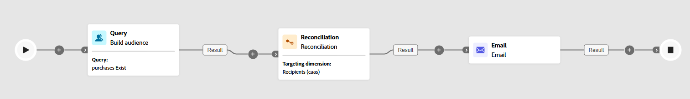

# 調和 {#reconciliation}

>[!CONTEXTUALHELP]
>id="ajo_orchestration_reconciliation"
>title="調和活動"
>abstract="「**調和**」活動是&#x200B;**目標定位**&#x200B;活動，可讓您定義 Adobe Journey Optimizer 和工作表資料之間的連結。"

>[!CONTEXTUALHELP]
>id="ajo_orchestration_reconciliation_field"
>title="調和選取欄位"
>abstract="調和選取欄位"

>[!CONTEXTUALHELP]
>id="ajo_orchestration_reconciliation_condition"
>title="調和建立條件"
>abstract="調和建立條件"

>[!CONTEXTUALHELP]
>id="ajo_orchestration_reconciliation_complement"
>title="調和產生補集"
>abstract="調和產生補集"

**[!UICONTROL 調和]**&#x200B;活動是&#x200B;**[!UICONTROL 目標定位]**&#x200B;活動，它可讓您定義 Adobe Journey Optimizer 資料與工作表資料 (例如從外部檔案載入的資料) 之間的連結。

**[!UICONTROL 擴充]**&#x200B;活動可讓您新增其他資料至您的「已協調」行銷活動，例如，合併來自多個來源的資料或連結至暫時資源。 相對地，**[!UICONTROL 調和]**&#x200B;活動用來比對未識別或外部資料與資料庫中現有的資源。

**[!UICONTROL 調和]**&#x200B;要求系統中已存在相關記錄。例如，如果您匯入列有產品、時間戳記和客戶資訊的購買檔案，產品和客戶必須已存在於資料庫中才能建立連結。

## 設定調和活動 {#reconciliation-configuration}

>[!CONTEXTUALHELP]
>id="ajo_orchestration_reconciliation_targeting"
>title="目標市場選擇維度"
>abstract="選取新的目標市場選擇維度。維度可讓您定義目標群體：收件者、應用程式訂閱者、操作者、訂閱者等。預設會選取目前的目標市場選擇維度。"

>[!CONTEXTUALHELP]
>id="ajo_orchestration_reconciliation_rules"
>title="調和規則"
>abstract="選取用於重複資料刪除的調和規則。若要使用屬性，請選取&#x200B;**簡單屬性**&#x200B;選項，然後選擇來源欄位和目的地欄位。若要使用規則產生器建立自己的調解條件，請選取&#x200B;**進階調解條件**&#x200B;選項。"

>[!CONTEXTUALHELP]
>id="ajo_orchestration_reconciliation_targeting_selection"
>title="選取目標市場選擇維度"
>abstract="選取要調和之輸入資料的目標市場選擇維度。"
>additional-url="https://experienceleague.adobe.com/docs/campaign-web/v8/audiences/gs-audiences-recipients.html?lang=zh-Hant&#targeting-dimensions" text="目標市場選擇維度"

>[!CONTEXTUALHELP]
>id="ajo_orchestration_keep_unreconciled_data"
>title="保留未調和的資料"
>abstract="依預設，未調和的資料保留在傳出轉變中，並可在工作表中供未來使用。若要移除未調和的資料，請停用「**保留未調和的資料**」選項。"

>[!CONTEXTUALHELP]
>id="ajo_orchestration_reconciliation_attribute"
>title="調和屬性"
>abstract="選取用於調和資料的屬性，然後按一下「確認」。"

請按照以下步驟設定「**[!UICONTROL 調和]**」活動：

1. 將&#x200B;**[!UICONTROL 調解]**&#x200B;活動新增至畫布。

1. 選擇新的目標維度，以定義您要定位的客群，例如收件者或訂閱者。

1. 設定欄位以用於將傳入資料與現有設定檔進行比對。

1. 若要使用基本欄位比對資料，請選取「**[!UICONTROL 簡單屬性]**」。

1. 設定比對欄位：

   * **[!UICONTROL 來源]**：列出傳入資料欄位。

   * **[!UICONTROL 目標]**：參考所選目標維度中的欄位。

   兩個值相等即意味著匹配，例如，以&#x200B;**[!UICONTROL 電子郵件]**&#x200B;相符來識別設定檔。

   

1. 若要新增更多匹配規則，請按一下「**[!UICONTROL 新增規則]**」。必須符合所有條件，才能匹配。

1. 如需更複雜的條件，請選擇「**[!UICONTROL 進階調和條件]**」。使用[規則產生器](../orchestrated-rule-builder.md)來定義自訂邏輯。

1. 若要篩選要調解的資料，請按一下&#x200B;**[!UICONTROL 建立篩選器]**，然後在規則產生器中定義條件。

1. 預設情況下，不匹配的資料會保留在傳出轉變中，並儲存在工作表中。若要移除不匹配的資料，請啟用「**[!UICONTROL 保留未調和的資料]**」選項。

## 範例 {#example-reconciliation}

此範例使用 Adobe Journey Optimizer 中的&#x200B;**[!UICONTROL 調和]**&#x200B;活動，以確保電子郵件只傳送給可識別的客戶。資料會透過&#x200B;**[!UICONTROL 讀取客群]**&#x200B;活動傳入，該活動的目標為有先前訂單的使用者。然後&#x200B;**[!UICONTROL 調和]**&#x200B;活動會使用電子郵件欄位，將此傳入資料與資料庫中的現有設定檔比對。

