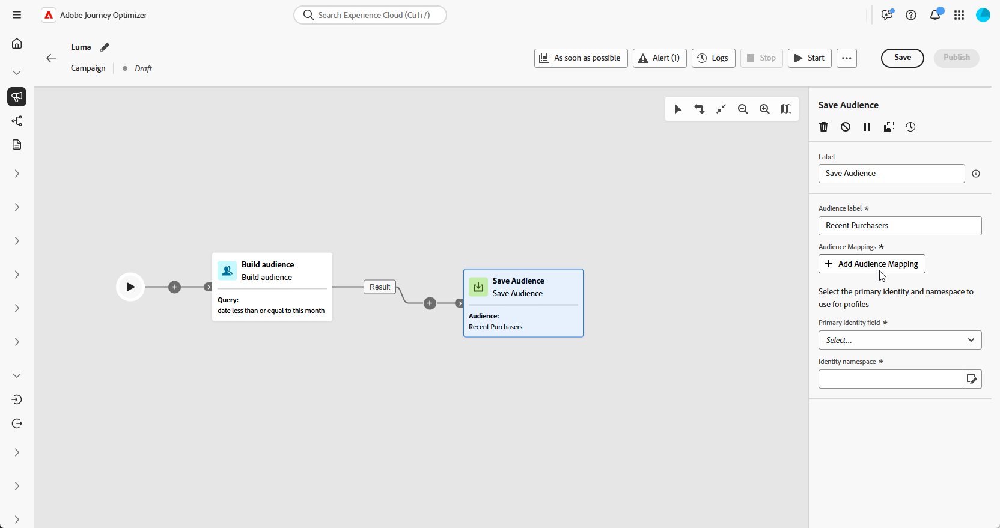
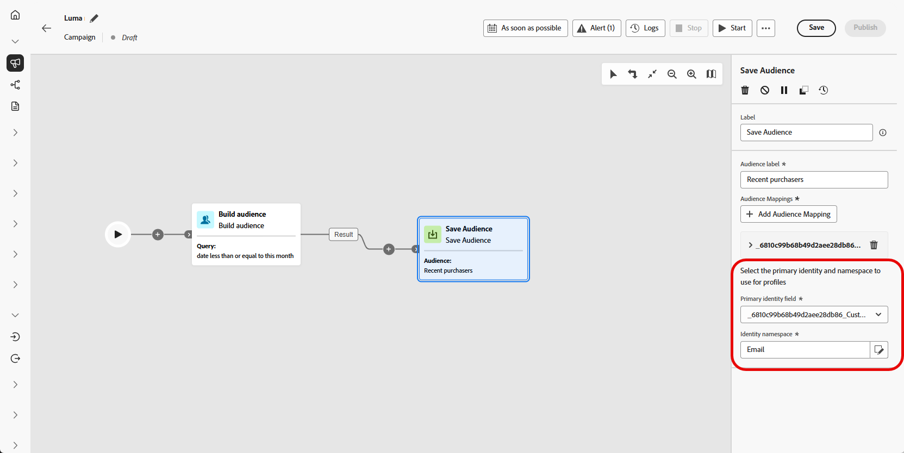
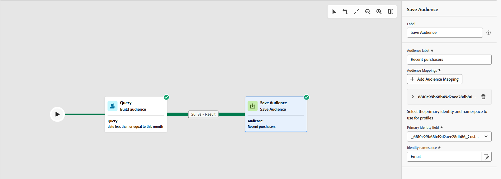
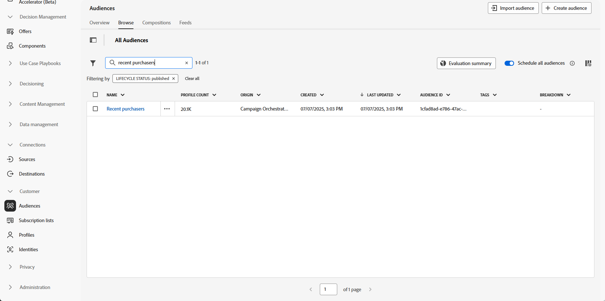

# 儲存客群 {#save-audience}

>[!CONTEXTUALHELP]
>id="ajo_orchestration_save_audience"
>title="儲存客群活動"
>abstract="**儲存客群**&#x200B;活動是一種&#x200B;**目標選擇**&#x200B;活動，讓您可以更新現有的客群，或是從之前在協調式行銷活動中產生的群體中，建立新的客群。一旦建立完畢，就會將這些客群新增至應用程式客群清單，再從&#x200B;**客群**&#x200B;選單那邊存取。"

**[!UICONTROL 儲存對象]**&#x200B;活動是&#x200B;**[!UICONTROL 鎖定目標]**&#x200B;活動，用來根據先前在協調的行銷活動中產生的母體來建立新對象或更新現有對象。 儲存後，對象會新增至應用程式對象清單，並可從&#x200B;**[!UICONTROL 對象]**&#x200B;功能表存取。

它常用於擷取在相同行銷活動工作流程中建立的對象區段，以便在未來的行銷活動中重複使用。 通常會連線到其他目標定位活動，例如&#x200B;**[!UICONTROL 建立對象]**&#x200B;或&#x200B;**[!UICONTROL 合併]**，以儲存最終目標定位母體。
請注意，使用**[!UICONTROL 儲存對象]**&#x200B;活動時，您無法更新現有的對象。 您只能建立新對象，或使用新定義覆寫現有對象。

## 設定儲存客群活動 {#save-audience-configuration}

請按照以下步驟，設定「**[!UICONTROL 儲存客群]**」活動：

1. 新增&#x200B;**[!UICONTROL 儲存對象]**&#x200B;活動至您的協調行銷活動。

1. 輸入&#x200B;**[!UICONTROL 客群標籤]**，就能識別已儲存客群。

   >[!NOTE]
   >
   >對象&#x200B;**[!UICONTROL 標籤]**&#x200B;在所有行銷活動中必須是唯一的。 您無法重複使用已在其他行銷活動的&#x200B;**[!UICONTROL 儲存對象]**&#x200B;活動中使用的對象名稱。

1. 從您的行銷活動目標維度中選擇&#x200B;**[!UICONTROL 設定檔對應欄&#x200B;位]**。 此對應會定義&#x200B;**已儲存對象**&#x200B;中的設定檔在執行期間如何連結至行銷活動的目標維度。

   下拉式清單中只有與目前目標維度（即傳入轉變中的維度）相容的對應，才能確保對象與行銷活動內容之間有適當的調解。

   ➡️ [依照本頁面詳述的步驟建立您的行銷活動目標維度](../target-dimension.md)

   

1. 按一下「**[!UICONTROL 新增對象對應]**」以包含來自&#x200B;**[!UICONTROL 目標維度]**&#x200B;或擴充的&#x200B;**[!UICONTROL 設定檔屬性]**&#x200B;之屬性的其他資料。

   這可讓您除了主要設定檔對應之外，將更多資訊與&#x200B;**[!UICONTROL 已儲存的對象]**&#x200B;活動建立關聯，以強化目標定位和個人化選項。

   

1. 儲存並發佈協調的行銷活動，以完成設定。 這將能產生並儲存客群。

1. 發佈要建立或取代之對象的行銷活動，因為行銷活動處於&#x200B;**[!UICONTROL 草稿模式]**&#x200B;時，**[!UICONTROL 儲存對象]**&#x200B;活動未執行。

接著，儲存的對象內容便可在對象的詳細資料檢視中使用，您可以從&#x200B;**[!UICONTROL 對象]**&#x200B;功能表存取該內容，或者在鎖定對象時選取內容，例如，使用&#x200B;**[!UICONTROL 讀取對象]**&#x200B;活動。

## 範例 {#save-audience-example}

以下範例會示範如何使用鎖定目標，建立簡易客群。 透過在您的「已協調」行銷活動中篩選此母體，查詢可識別過去30天內已預訂旅行的所有收件者。 透過選擇&#x200B;**收件者 — CRMID**&#x200B;作為&#x200B;**目標維度**，對象會鎖定每個個別預訂事件，而非僅鎖定收件者作為整體。 **[!UICONTROL 儲存客群]**&#x200B;活動接著會擷取以上設定檔，以便建立客群，讓近期購買者可重複使用。

