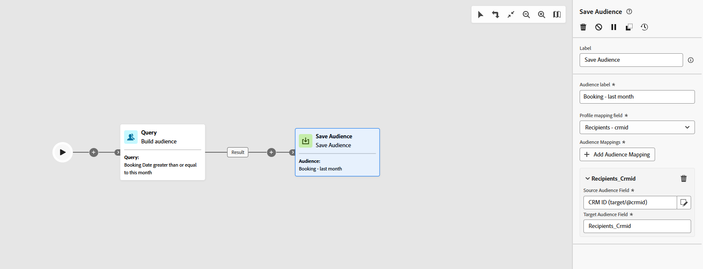

# 儲存客群 {#save-audience}

+++ 目錄

| 歡迎使用協調的行銷活動 | 首次建立協調的行銷活動 | 查詢資料庫 | 協調的行銷活動 |
|---|---|---|---|
| [開始使用協調的行銷活動](../gs-orchestrated-campaigns.md)  建立和管理關聯式結構描述和資料集：  <ul><li>[手動結構描述](../manual-schema.md)</li><li>[檔案上傳結構描述](../file-upload-schema.md)</li><li>[擷取資料](../ingest-data.md)</li></ul>[存取及管理協調的行銷活動](../access-manage-orchestrated-campaigns.md) | [建立協調行銷活動的關鍵步驟](../gs-campaign-creation.md)  [建立並排程行銷活動](../create-orchestrated-campaign.md)  [協調活動](../orchestrate-activities.md)  [開始並監視行銷活動](../start-monitor-campaigns.md)  [報告](../reporting-campaigns.md) | [使用規則產生器](../orchestrated-rule-builder.md)  [建立您的第一個查詢](../build-query.md)  [編輯運算式](../edit-expressions.md)  [重新鎖定目標](../retarget.md) | [開始使用活動](about-activities.md)  活動： [並加入](and-join.md) - [建立對象](build-audience.md) - [變更維度](change-dimension.md) - [頻道活動](channels.md) - [合併](combine.md) - [重複資料刪除](deduplication.md) - [擴充](enrichment.md) - [分支](fork.md) - [調解](reconciliation.md) - <b>[儲存對象](save-audience.md)</b> - [分割](split.md) - [等待](wait.md) |

{style="table-layout:fixed"}

+++

 

>[!BEGINSHADEBOX]

此頁面上的內容不是最終內容，可能會有變動。

>[!ENDSHADEBOX]

**[!UICONTROL 儲存對象]**&#x200B;活動是&#x200B;**[!UICONTROL 鎖定目標]**&#x200B;活動，可讓您更新現有的對象，或是從先前在協調的行銷活動中產生的母體中建立新的對象。 建立後，這些對象會新增至應用程式對象清單，並可從&#x200B;**[!UICONTROL 對象]**&#x200B;功能表存取。

此活動對於保留在相同的協調行銷活動中計算的對象區段特別有用，以便將來行銷活動中重複使用。 它通常連線到其他目標定位活動，例如&#x200B;**[!UICONTROL 建立對象]**&#x200B;或&#x200B;**[!UICONTROL 合併]**，以擷取並儲存產生的母體。

## 設定「儲存對象」活動 {#save-audience-configuration}

請依照下列步驟設定&#x200B;**[!UICONTROL 儲存對象]**&#x200B;活動：

1. 新增&#x200B;**[!UICONTROL 儲存對象]**&#x200B;活動至您協調的行銷活動。

1. 輸入將識別已儲存對象的&#x200B;**[!UICONTROL 對象標籤]**。

1. 按一下&#x200B;**[!UICONTROL 新增對象屬性]**&#x200B;以定義對象資料的結構化與儲存方式，以供日後重複使用。

   

1. 然後，選取適當的&#x200B;**[!UICONTROL 主要身分欄位]**&#x200B;和&#x200B;**[!UICONTROL 身分名稱空間]**，以確保正確的設定檔解析度。

   

1. 儲存並發佈協調的行銷活動，以完成設定。 這將產生並儲存您的對象。

之後儲存的對象內容便可在對象的詳細資料檢視中使用，您可從&#x200B;**[!UICONTROL 對象]**&#x200B;功能表存取該內容。

## 範例 {#save-audience-example}

下列範例示範如何使用鎖定目標建立簡單的對象。 查詢可識別過去30天內購買的所有設定檔。 **[!UICONTROL 儲存對象]**&#x200B;活動接著會擷取這些設定檔，以建立最近購買者可重複使用的對象。

