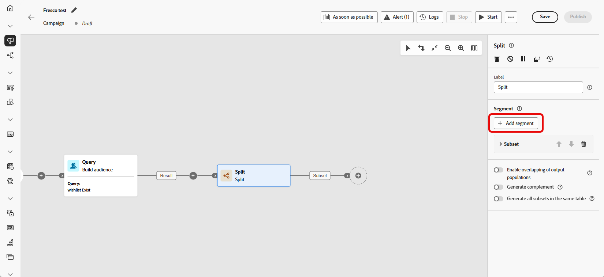
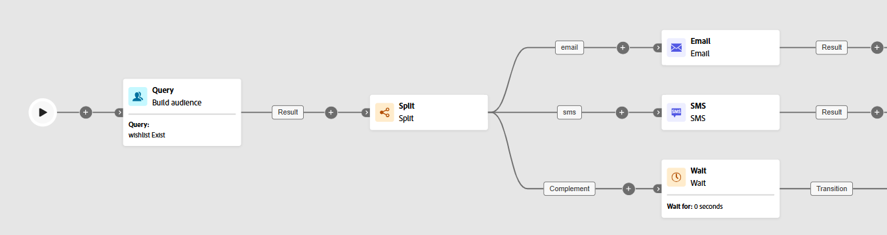

# 分割 {#split}

>[!CONTEXTUALHELP]
>id="ajo_orchestration_split"
>title="分割活動"
>abstract="**分割**&#x200B;活動可讓您根據不同選擇標準 (例如篩選規則或群體大小) 將傳入群體分割到多個子集。"

+++ 目錄

| 歡迎使用協調的行銷活動 | 啟動您的第一個協調行銷活動 | 查詢資料庫 | 協調行銷活動 |
|---|---|---|---|
| [開始使用協調的行銷活動](../gs-orchestrated-campaigns.md)  建立和管理關聯式結構描述和資料集：  <ul><li>[開始使用結構描述和資料集](../gs-schemas.md)</li><li>[手動結構描述](../manual-schema.md)</li><li>[檔案上傳結構描述](../file-upload-schema.md)</li><li>[擷取資料](../ingest-data.md)</li></ul>[存取及管理協調的行銷活動](../access-manage-orchestrated-campaigns.md) | [建立協調行銷活動的關鍵步驟](../gs-campaign-creation.md)  [建立並排程行銷活動](../create-orchestrated-campaign.md)  [協調活動](../orchestrate-activities.md)  [開始並監視行銷活動](../start-monitor-campaigns.md)  [報告](../reporting-campaigns.md) | [使用規則產生器](../orchestrated-rule-builder.md)  [建立您的第一個查詢](../build-query.md)  [編輯運算式](../edit-expressions.md)  [重定向](../retarget.md) | [開始使用活動](about-activities.md)  活動： [同時加入](and-join.md) - [建立客群](build-audience.md) - [變更維度](change-dimension.md) - [頻道活動](channels.md) - [合併](combine.md) - [重複資料刪除](deduplication.md) - [擴充](enrichment.md) - [分支](fork.md) - [調和](reconciliation.md) - [儲存客群](save-audience.md) - <b>[分割](split.md)</b> - [等待](wait.md) |

{style="table-layout:fixed"}

+++

 

>[!BEGINSHADEBOX]

 

此頁面上的內容不是最終內容，可能會有變動。

>[!ENDSHADEBOX]

**[!UICONTROL 分割]**&#x200B;活動是一種&#x200B;**[!UICONTROL 目標定位]**&#x200B;活動，可讓您根據不同選擇標準 (例如篩選規則或群體大小) 將傳入群體分割到多個子集。

## 設定分割活動 {#split-configuration}

>[!CONTEXTUALHELP]
>id="ajo_orchestration_split_segments"
>title="分割活動的區段"
>abstract="依需求新增任意數量的子集，將傳入的群體進行細分。  執行&#x200B;**分割** 活動時，系統會依照子集新增至活動的順序，將群體細分成不同的子集。在開始您的「協調流程」行銷活動之前，請確定您已使用箭頭按鈕，以符合需求的順序訂購子集。"

>[!CONTEXTUALHELP]
>id="ajo_orchestration_split_filter"
>title="分割活動篩選器"
>abstract="若要將篩選條件套用到子集，請按一下「**[!UICONTROL 建立篩選]**」並使用查詢建模工具設定所需的篩選規則。例如，於傳入族群中，將有電子郵件地址存在於資料庫的設定檔包含在內。"

>[!CONTEXTUALHELP]
>id="ajo_orchestration_split_limit"
>title="分割活動限制"
>abstract="若要限制子集選取設定檔的數量，請開啟「**[!UICONTROL 啟用限制]**」選項，並指定要包含的族群數量或百分比。"

>[!CONTEXTUALHELP]
>id="ajo_orchestration_split_sorting"
>title="分割活動排序"
>abstract="為子集設定族群限制時，您可以用指定設定檔屬性按升序或降序順序來排列所選設定檔。為此，請開啟「**啟用排序**」選項。例如，您可以限制子集僅包含購買金額最高的前 50 個設定檔。"

>[!CONTEXTUALHELP]
>id="ajo_orchestration_split_complement"
>title="分割產生補集"
>abstract="設定完所有子集後，您可以選擇與任何子集都不相符的剩餘族群，並將其包含在額外的傳出轉變中。若要這樣做，請開啟「**產生補集**」選項。"

>[!CONTEXTUALHELP]
>id="ajo_orchestration_split_generatesubsets"
>title="在相同表格中產生所有子集"
>abstract="切換此選項可將所有子集歸類至單一的傳出轉換。"

>[!CONTEXTUALHELP]
>id="ajo_orchestration_split_emptytransition"
>title="省略空值轉變"
>abstract="如果傳入群體為空，則切換「**[!UICONTROL 跳過空值轉變]**」選項可停用此子集的輸出轉變。"

>[!CONTEXTUALHELP]
>id="ajo_orchestration_split_enable_overlapping"
>title="啟用輸出群體的重疊"
>abstract=" 「**[!UICONTROL 啟用輸出群體的重疊]**」選項可讓您管理屬於多個子集的群體。當未選取該方塊時，分割活動將確保收件者不能出現在多個輸出轉換中，即使其滿足多個子集的條件也是如此。它們將位於具有符合條件的第一個標籤的目標中。當選取該方塊時，符合篩選條件的收件者，會出現在多個子集中。"

請按照以下步驟設定&#x200B;**[!UICONTROL 分割]**&#x200B;活動：

1. 將&#x200B;**[!UICONTROL 分割]**&#x200B;活動新增至您的協調行銷活動。

1. 活動設定面板隨即開啟，其中包含預設子集。按一下「**[!UICONTROL 新增區段]**」按鈕，新增所需數量的子集，依此來分割傳入群體。

   

   >[!IMPORTANT]
   >
   >**分割**&#x200B;活動會以新增子集的順序處理子集。例如，如果第一個子集擷取到群體的70%，則下一個子集會將其標準套用至剩餘的 30%。
   >
   >在執行您的「協調流程」行銷活動之前，請確定子集已依預期排序。 使用箭頭按鈕來調整其位置。

1. 新增子集後，活動將顯示與子集一樣多的輸出轉變。我們強烈建議變更每個子集的標籤，以便在協調的行銷活動畫布中輕鬆識別它們。

1. 為每個子集設定篩選器：

   1. 按一下子集以開啟其設定。

   1. 按一下「**[!UICONTROL 建立篩選器]**」，以使用查詢建模工具定義篩選規則，例如，選取具有有效電子郵件地址的設定檔。

      

   1. 若要限制選取的設定檔數目，請啟用「**[!UICONTROL 啟用限制]**」並指定數字或百分比。

   1. 若要在子集為空時略過轉變，請啟用「**[!UICONTROL 略過空轉變]」。**

1. 若要包含與任何子集都不相符的設定檔，請啟用「**[!UICONTROL 產生補集]**」。這會為剩餘群體建立額外的傳出轉變。

   >[!NOTE]
   >
   >啟用「**[!UICONTROL 在相同表格中產生所有子集]**」，將所有子集組成單一轉換。

1. 使用「**[!UICONTROL 啟用輸出群體的重疊]**」以允許設定檔出現在多個子集中：

   * **如果取消核取**，每個設定檔只會指派給一個子集，即為符合標準的第一個子集，即使它符合其他子集的條件。

   * **如果已核取**，當設定檔符合每個設定檔的標準時，則可將其包含在多個子集中。

該活動現已完成設定。在協調的行銷活動執行中，母體將依照其加入活動的順序，分割成不同的子集。

## 範例{#split-example}

在以下範例下，我們將利用&#x200B;**[!UICONTROL 分割]**&#x200B;活動根據要使用的通訊管道將客群分割到不同的子集：

* **子集 1「電子郵件」**：包含已提供電話號碼的設定檔。

* **子集 2「簡訊」**：以儲存在資料庫中的行動電話號碼來定位設定檔。

* **補集轉變**：擷取不符合任一子集標準的任何剩餘設定檔。

