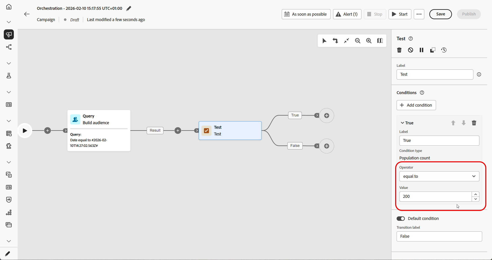
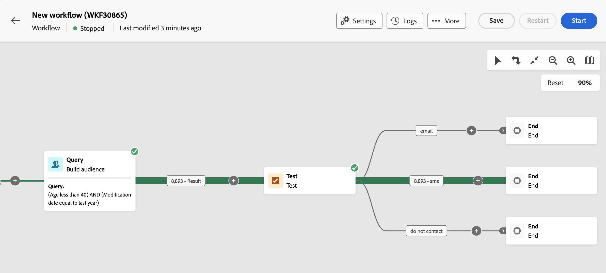
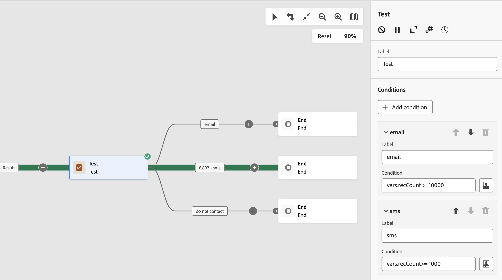

# 測試 {#test}

>[!CONTEXTUALHELP]
>id="ajo_orchestration_test"
>title="測試活動"
>abstract="「**測試**」活動是一種&#x200B;**流量控制**&#x200B;活動。您可以藉此根據指定條件啟用轉變。"

>[!CONTEXTUALHELP]
>id="ajo_orchestration_test_conditions"
>title="條件"
>abstract="「**測試**」活動可以有多個輸出轉換。在協調的行銷活動執行期間，會依序測試每個條件，直到符合其中一個條件為止。 如果未符合任何條件，協調的行銷活動會沿著&#x200B;**[!UICONTROL 預設條件]**&#x200B;的路徑繼續。 如果未啟用預設條件，則「已協調的」行銷活動會在此點停止。"

+++ 目錄

| 歡迎使用協調的行銷活動 | 啟動您的第一個協調行銷活動 | 查詢資料庫 | 協調行銷活動 |
|---|---|---|---|
| [開始使用協調的行銷活動](../gs-orchestrated-campaigns.md)  建立和管理關聯式結構描述和資料集：  <ul><li>[開始使用結構描述和資料集](../gs-schemas.md)</li><li>[手動結構描述](../manual-schema.md)</li><li>[檔案上傳結構描述](../file-upload-schema.md)</li><li>[擷取資料](../ingest-data.md)</li></ul>[存取及管理協調的行銷活動](../access-manage-orchestrated-campaigns.md) | [建立協調行銷活動的關鍵步驟](../gs-campaign-creation.md)  [建立並排程行銷活動](../create-orchestrated-campaign.md)  [協調活動](../orchestrate-activities.md)  [開始並監視行銷活動](../start-monitor-campaigns.md)  [報告](../reporting-campaigns.md) | [使用規則產生器](../orchestrated-rule-builder.md)  [建立您的第一個查詢](../build-query.md)  [編輯運算式](../edit-expressions.md)  [重定向](../retarget.md) | [開始使用活動](about-activities.md)  活動： [同時加入](and-join.md) - [建立客群](build-audience.md) - [變更維度](change-dimension.md) - [頻道活動](channels.md) - [合併](combine.md) - [重複資料刪除](deduplication.md) - [擴充](enrichment.md) - [分支](fork.md) - [調和](reconciliation.md) - [儲存客群](save-audience.md) - [分割](split.md) - [等待](wait.md) |

{style="table-layout:fixed"}

+++

 

>[!BEGINSHADEBOX]

 

此頁面上的內容不是最終內容，可能會有變動。

>[!ENDSHADEBOX]

「**[!UICONTROL 測試]**」活動是一種&#x200B;**[!UICONTROL 流量控制]**&#x200B;活動。您可以藉此根據指定條件啟用轉變。

## 設定測試活動 {#test-configuration}

請按照以下步驟設定&#x200B;**[!UICONTROL 測試]**&#x200B;活動：

1. 將&#x200B;**[!UICONTROL 測試]**&#x200B;活動新增至您的協調行銷活動。

1. 預設情況下，**[!UICONTROL 測試]**&#x200B;活動會呈現簡單的布林值測試。如果符合「真」轉變中定義的條件，則會啟動此轉變。否則，將會啟用預設的「假」轉變。

1. 若要設定與轉變關聯的條件，請按一下「**[!UICONTROL 開啟個人化對話方塊]**」圖示。使用運算式編輯器來定義啟動此轉變所需的規則。您也可以善用事件變數、條件和日期/時間函式。

   此外，您可以修改&#x200B;**[!UICONTROL 標籤]**&#x200B;欄位，在「已協調的行銷活動」畫布上個人化轉變名稱。

   

1. 您可以將多個輸出轉變新增到&#x200B;**[!UICONTROL 測試]**&#x200B;活動。若要這麼做，請按一下「**[!UICONTROL 新增條件]**」按鈕，並為每個轉變設定標籤和相關聯的條件。
v
1. 在協調的行銷活動執行期間，會依序測試每個條件，直到符合其中一個條件為止。 如果未符合任何條件，協調的行銷活動會沿著&#x200B;**[!UICONTROL 預設條件]**&#x200B;的路徑繼續。 如果未啟用預設條件，則行銷活動會在此點停止。

## 範例 {#example}

在此範例中，會根據&#x200B;**[!UICONTROL 建立客群]**&#x200B;活動定為目標的設定檔數量啟動不同的轉變：

* 如果目標設定檔超過 10,000 個，則會傳送電子郵件訊息。
* 若為 1,000 至 10,000 個設定檔，則會傳送簡訊。
* 如果目標設定檔低於 1,000 個，則會導向至「請勿聯絡」轉變。

為此，已在「電子郵件」和「簡訊」條件中運用 `vars.recCount` 事件變數，以計算目標設定檔的數量並啟用適當的轉變。

