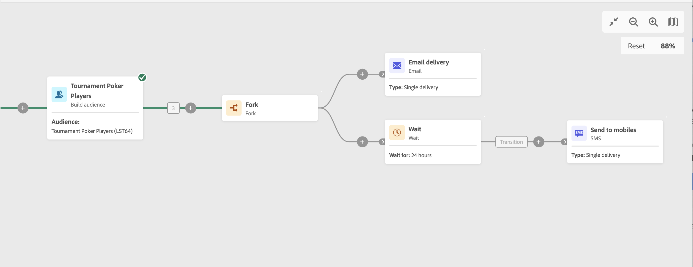

# 等待 {#wait}

>[!CONTEXTUALHELP]
>id="ajo_orchestration_wait"
>title="等待活動"
>abstract="**等待**&#x200B;活動用於延遲從一個活動到另一個活動的轉變。"

+++ 目錄

| 歡迎使用協調的行銷活動 | 啟動您的第一個協調行銷活動 | 查詢資料庫 | 協調的行銷活動活動 |
|---|---|---|---|
| [開始使用協調的行銷活動](gs-orchestrated-campaigns.md)  [設定步驟](configuration-steps.md)  [建立協調行銷活動的重要步驟](gs-campaign-creation.md) | [建立協調的行銷活動](create-orchestrated-campaign.md)  [協調活動](orchestrate-activities.md)  [使用協調的行銷活動傳送訊息](send-messages.md)  [開始並監視行銷活動](start-monitor-campaigns.md)  [報告](reporting-campaigns.md) | [使用查詢Modeler](orchestrated-query-modeler.md)  [建置您的第一個查詢](build-query.md)  [編輯運算式](edit-expressions.md) | [開始使用活動](activities/about-activities.md)  活動： [並加入](activities/and-join.md) - [建置對象](activities/build-audience.md) - [變更維度](activities/change-dimension.md) - [合併](activities/combine.md) - [重複資料刪除](activities/deduplication.md) - [擴充](activities/enrichment.md) - [分支](activities/fork.md) - [調解](activities/reconciliation.md) - [分割](activities/split.md) - [等待](activities/wait.md) |

{style="table-layout:fixed"}

+++

  

「**等待**」活動是一種&#x200B;**流程控制**&#x200B;活動。此活動用於允許正在執行的兩個活動之間經過一定的時間。例如，若要在電子郵件傳送活動後等候數天，請先分析此期間產生的開啟次數和點按次數，再執行任何後續操作 (提醒電子郵件、建立客群等)。

## 設定{#wait-configuration}

請按照以下步驟設定&#x200B;**等待**&#x200B;活動：

1. 將&#x200B;**等待**&#x200B;活動新增至您協調的行銷活動。

1. 指定傳入和傳出轉變之間等待的&#x200B;**持續時間**。

1. 在&#x200B;**期間**&#x200B;欄位中選取時間單位：秒、分鐘、小時、天。

## 範例{#wait-example}

以下範例會說明典型使用案例中的 **等待**&#x200B;活動。已傳送活動的電子郵件邀請。傳送後 24 小時，會將簡訊傳送給同一個群體。

