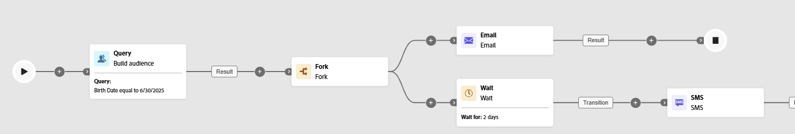

# 等待 {#wait}

>[!CONTEXTUALHELP]
>id="ajo_orchestration_wait"
>title="等待活動"
>abstract="**等待**&#x200B;活動用於延遲從一個活動到另一個活動的轉變。"

**[!UICONTROL 等待]**&#x200B;活動是&#x200B;**[!UICONTROL 流量控制]**&#x200B;元件，用來在協調的行銷活動中的兩個活動之間引入延遲。 這有助於確保您的後續活動在更適當的時間進行，且與使用者參與更相關。

例如，您可以在電子郵件傳送後等候數天，以追蹤開啟次數和點按次數，再傳送後續訊息。

## 設定{#wait-configuration}

請按照以下步驟設定&#x200B;**[!UICONTROL 等待]**&#x200B;活動：

1. 將&#x200B;**[!UICONTROL 等待]**&#x200B;活動新增至您的協調行銷活動。

1. 選取最符合您需求的等待類型：

   * **[!UICONTROL 間隔時間]**：指定繼續進行下一個活動之前的延遲時間，單位為秒、分鐘、小時或天。

   * **[!UICONTROL 固定時間]**：設定下一個活動開始的特定日期和時間。

   

## 範例{#wait-example}

以下範例會說明典型使用案例中的&#x200B;**[!UICONTROL 等待]**&#x200B;活動。內含促銷代碼的電子郵件會傳送給慶祝生日的輪廓。29 天後，系統會傳送簡訊給相同群組，提醒他們生日促銷代碼即將到期。

