# 建立首次規則 {#build-query}

+++ 目錄

| 歡迎使用協調的行銷活動 | 啟動您的第一個協調行銷活動 | 查詢資料庫 | 協調行銷活動 |
|---|---|---|---|
| [開始使用協調的行銷活動](gs-orchestrated-campaigns.md)  建立和管理關聯式結構描述和資料集：  <ul><li>[開始使用結構描述和資料集](gs-schemas.md)</li><li>[手動結構描述](manual-schema.md)</li><li>[檔案上傳結構描述](file-upload-schema.md)</li><li>[擷取資料](ingest-data.md)</li></ul>[存取及管理協調的行銷活動](access-manage-orchestrated-campaigns.md)  [建立協調行銷活動的重要步驟](gs-campaign-creation.md) | [建立並排程行銷活動](create-orchestrated-campaign.md)  [協調活動](orchestrate-activities.md)  [開始並監視行銷活動](start-monitor-campaigns.md)  [報告](reporting-campaigns.md) | [使用規則產生器](orchestrated-rule-builder.md)  <b>[建立您的第一個查詢](build-query.md)</b>  [編輯運算式](edit-expressions.md)  [重定向](retarget.md) | [開始使用活動](activities/about-activities.md)  活動： [同時加入](activities/and-join.md) - [建立客群](activities/build-audience.md) - [變更維度](activities/change-dimension.md) - [頻道活動](activities/channels.md) - [合併](activities/combine.md) - [重複資料刪除](activities/deduplication.md) - [擴充](activities/enrichment.md) - [分支](activities/fork.md) - [調和](activities/reconciliation.md) - [儲存客群](activities/save-audience.md) - [分割](activities/split.md) - [等待](activities/wait.md) |

{style="table-layout:fixed"}

+++

 

>[!BEGINSHADEBOX]

 

此頁面上的內容不是最終內容，可能會有變動。

>[!ENDSHADEBOX]

為「已協調」行銷活動建立規則的主要步驟如下：

1. **新增條件** - 使用資料庫中的屬性和進階運算式來建立自己的條件，藉此建立自訂條件以篩選查詢。
1. **合併條件** - 使用群組和邏輯運算子排列畫布中的條件。
1. **檢查並驗證規則** - 在儲存規則之前，先檢查規則的結果資料。

## 新增條件。 {#conditions}

若要在查詢中新增條件，請遵循下列步驟：

1. 從&#x200B;**[!UICONTROL 建立客群]**&#x200B;活動存取規則產生器。

1. 按一下「**新增條件**」按鈕，為您的查詢建立第一個條件。

   您也可以使用預先定義的篩選器來開始查詢。若要這麼做，請按一下「**[!UICONTROL 選取或儲存篩選器]**」按鈕，然後選擇「**[!UICONTROL 選取預先定義的篩選器]**」。

   

1. 識別資料庫中的屬性，以用作條件的準則。屬性旁的「i」圖示提供有關其儲存位置及資料類型的表格資訊。

   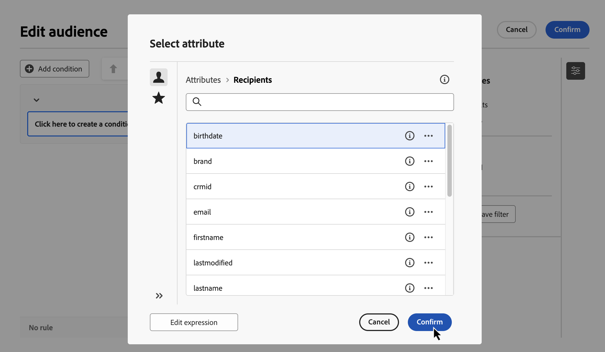

   >[!NOTE]
   >
   >「**編輯運算式**」按鈕可讓您借助資料庫和協助程式函式的欄位，使用運算式編輯器來手動定義運算式。[了解如何編輯運算式](../orchestrated/edit-expressions.md)

1. 按一下屬性旁的「」按鈕，以存取這些其他選項：

+++ 值的分佈

   分析表格中指定屬性的值分佈。此功能對於了解可用的數值、其計數和百分比相當有用。在建立查詢或建立運算式時，此功能還有助於避免出現大小寫或拼字不一致等問題。

   對於具有較多數值的屬性，該工具只會顯示前二十個數值。在這種情況下，會出現&#x200B;**[!UICONTROL 部分載入]**&#x200B;通知來表示有這個限制。您可以套用進階篩選器來最佳化顯示的結果，並專注於特定值或資料子集。

   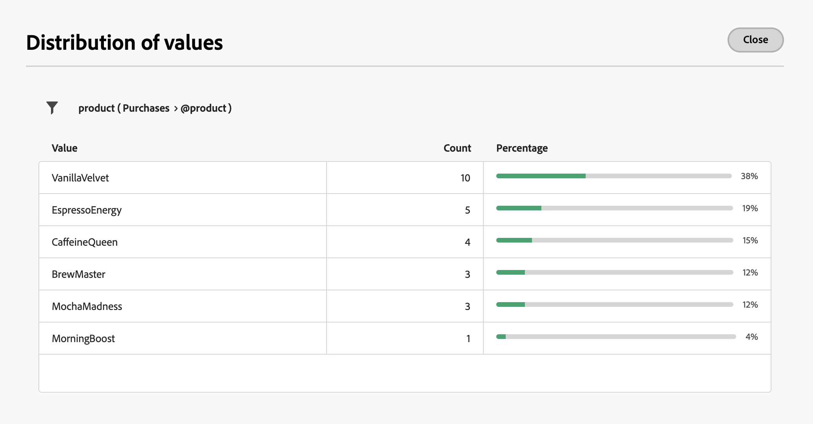

+++

+++ 新增至最愛

   將屬性新增至最愛選單可快速存取您使用頻率最高的屬性。您最多可以在最愛中新增 20 個屬性。最愛和最近使用的屬性與組織內的每位使用者相關聯，確保在不同機器上也能方便存取，並提供跨裝置的順暢體驗。

   若要存取您最喜愛的屬性，請使用「**[!UICONTROL 最愛和最近項目]**」選單。首先顯示最愛屬性，接著顯示最近使用的屬性，讓您輕鬆找到所需的屬性。若要從最愛中移除屬性，請再次選取星形圖示。

   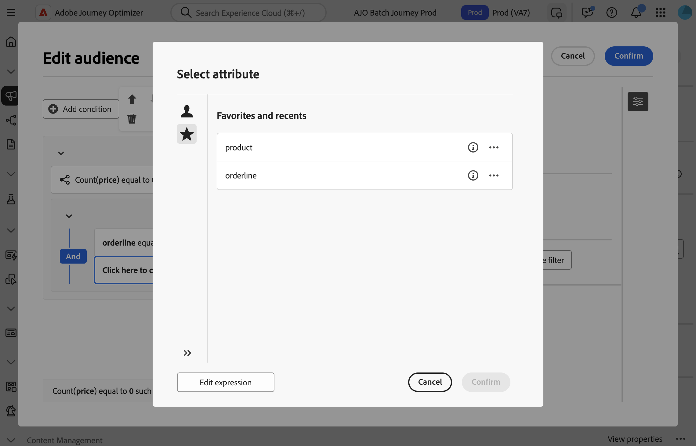

+++

1. 按一下「**[!UICONTROL 確認]**」，將選取的屬性新增至您的條件。

1. 屬性窗格隨即顯示，您可以在其中設定所需的屬性值。

   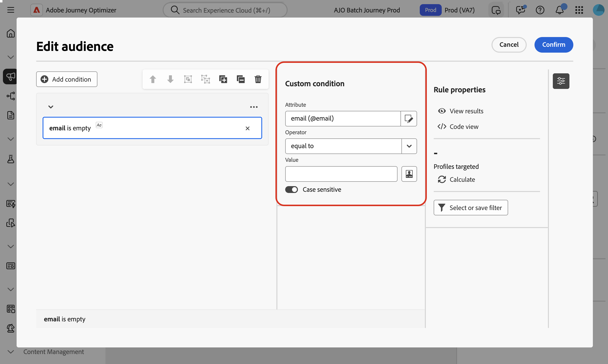

1. 從下拉式清單中選取要套用的&#x200B;**[!UICONTROL 運算子]**。可以使用各種運算子。下拉式清單中可用的運算子取決於屬性的資料類型。

   +++可用運算子清單

   | 運算子 | 目的 | 範例 |
   |---|---|---|
   | 等於 | 傳回與第二個「值」欄中所輸入資料相同的結果。 | 姓氏 (@lastName) 等於「Jones」只會傳回姓氏為 Jones 的收件者。 |
   | 不等於 | 傳回所有與輸入值不相同的值。 | 語言 (@language) 不等於「英文」。 |
   | 大於 | 傳回大於輸入值的值。 | 年齡 (@age) 大於 50 會傳回所有大於「50」的值，例如「51」、「52」。 |
   | 小於 | 傳回小於輸入值的值。 | 「DaysAgo(100)」之前的建立日期 (@created) 將傳回所有在少於 100 天前建立的收件者。 |
   | 大於或等於 | 傳回等於或大於輸入值的所有值。 | 年齡 (@age) 大於或等於「30」將會傳回年齡等於或大於 30 歲的所有收件者。 |
   | 小於或等於 | 傳回等於或小於輸入值的所有值。 | 年齡 (@age) 小於或等於「60」將會傳回年齡等於或小於 60 歲的所有收件者。 |
   | 包含在 | 傳回指定值中包含的結果。這些值必須以逗號分隔。 | 包含在「12/10/1979,12/10/1984」中的出生日期 (@birthDate) 將傳回這些日期之間出生的收件者。 |
   | 不在 | 其運作方式與「包含於」運算子類似。在這裡，系統會根據輸入的值排除收件者。 | 出生日期 (@birthDate) 不包含在「12/10/1979,12/10/1984」中。不會傳回在這些日期內出生的收件者。 |
   | 是空的 | 傳回與第二個「值」欄中的空值相符的結果。 | 行動電話 (@mobilePhone) 是空的會傳回所有沒有行動電話號碼的收件者。 |
   | 不是空的 | 其運作方式與「是空的」運算子相反。不需要在第二個「值」欄中輸入資料。 | 電子郵件 (@email) 不是空的。 |
   | 開始於 | 傳回以輸入值開頭的結果。 | 帳戶號碼 (@account) 以「32010」開頭。 |
   | 開頭不是 | 傳回不是以輸入值開頭的結果。 | 帳戶號碼 (@account) 的開頭不是「20」。 |
   | 包含 | 傳回至少包含輸入值的結果。 | 包含「mail」的電子郵件網域 (@domain) 將傳回包含「mail」的所有網域名稱，例如「gmail.com」。 |
   | 不包含 | 傳回不包含輸入值的結果。 | 電子郵件網域 (@domain) 不包含「vo」。包含「vo」的網域名稱 (例如「voila.fr」) 將不會顯示在結果中。 |
   | 類似 | 與「包含」運算子類似，它可讓您在值中插入 % 萬用字元。 | 姓氏 (@lastName) 類似「Jon%s」。萬用字元可當做「鬼牌」來尋找類似「Jones」的名字。 |
   | 不類似 | 與「包含」運算子類似，它可讓您在值中插入 % 萬用字元。 | 姓氏 (@lastName) 不類似「Smi%h」。不會傳回姓氏為「Smith」的收件者。 |

+++

1. 在「**值**」欄位中，定義預期的值。您也可以使用運算式編輯器，以使用資料庫和協助程式函式的欄位，手動定義運算式。若要這麼做，請按一下「」圖示。[了解如何編輯運算式](../orchestrated/edit-expressions.md)

   對於日期類型屬性，可透過&#x200B;**[!UICONTROL 預設集]**&#x200B;選項使用預先定義的值。

   +++參閱範例

   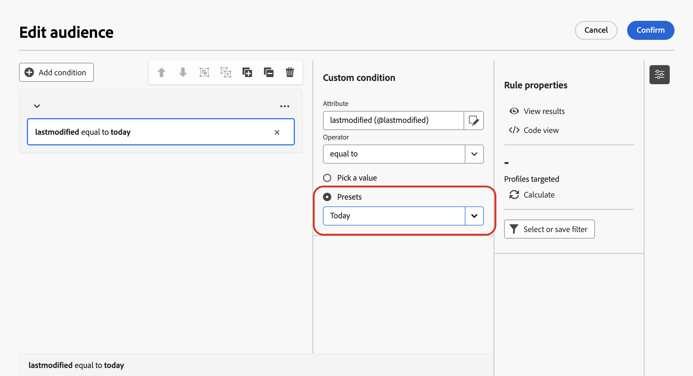

+++

### 連結表格的自訂條件 (1-1 和 1-N 連結){#links}

自訂條件可讓您查詢與規則目前使用之表格連結的表格。這包括具有 1-1 基數連結的表格，或集合表格 (1-N 連結)。

若為 **1-1 連結**，請瀏覽至連結的表格，選取所需的屬性並定義預期值。

您也可以直接選取&#x200B;**值**&#x200B;選擇器中的表格連結並進行確認。在此情況下，必須使用專用的選擇器來選取可用於所選表格的值，如以下範例所示。

+++查詢範例

在此，查詢會鎖定其標籤為「執行中」的品牌。

1. 瀏覽&#x200B;**品牌**&#x200B;表格，並選取「**標籤**」屬性。

   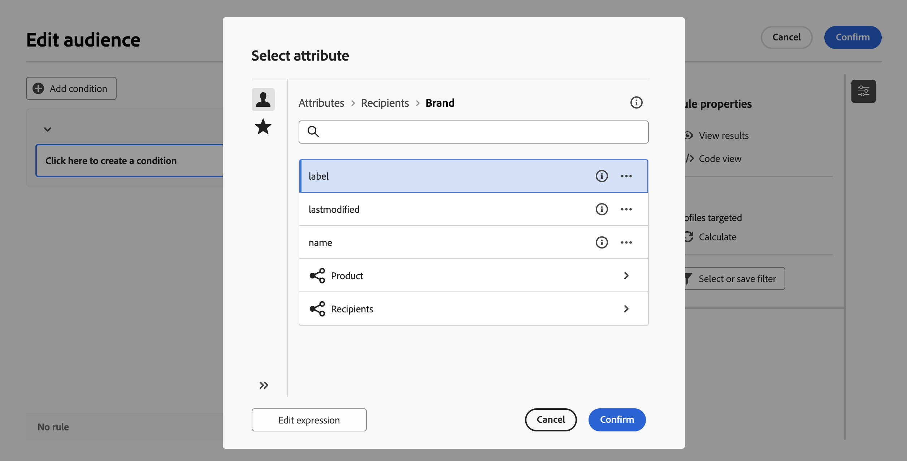

1. 定義屬性的預期值。

   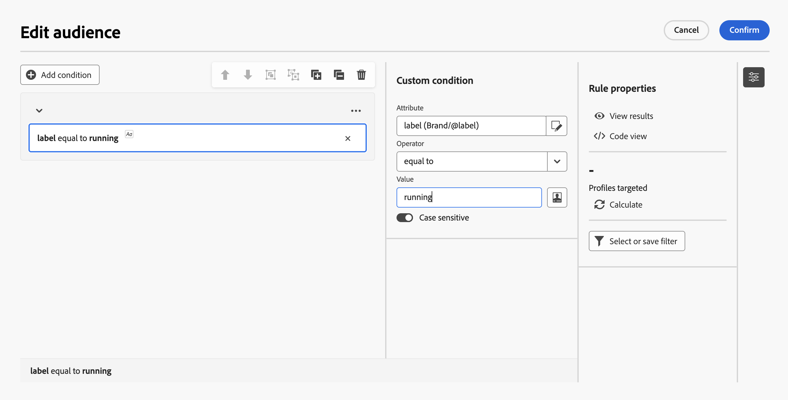

以下是已直接選取表格連結的查詢範例。必須從專用選擇器選取此表格的可用值。

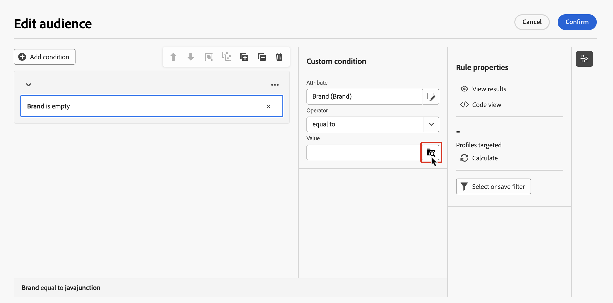

+++

對於 **1-N 連結**，您可以定義子條件來調整查詢，如下列範例所示。

+++查詢範例

在此，查詢會鎖定購買與 Brewmsaster 產品相關且價格超過美金 100 元的收件者。

1. 選取&#x200B;**購買**&#x200B;表格並確認。

1. 按一下「**[!UICONTROL 新增條件]**」以定義要套用至所選表格的子條件。

   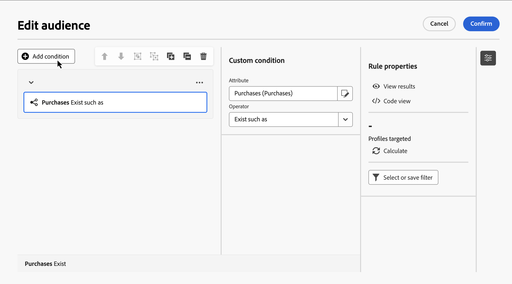

1. 新增子條件以符合您的需求。

   

+++

### 自訂條件與彙總資料 {#aggregate}

自訂條件可讓您執行彙總作業。若要這麼做，您必須直接從集合表格中選取屬性：

1. 瀏覽所需的集合表格，並選取您要執行彙總作業的屬性。

1. 在屬性窗格中，開啟&#x200B;**彙總資料**&#x200B;選項並選取所需的彙總函式。

   

## 使用運算子合併條件 {#operators}

每次在規則中新增條件時，就會使用「**與**」運算子自動連結至現有條件。這表示兩個條件產生的結果會合併在一起。

若想變更條件之間的運算子，請按一下該運算子，然後選取指定運算子。

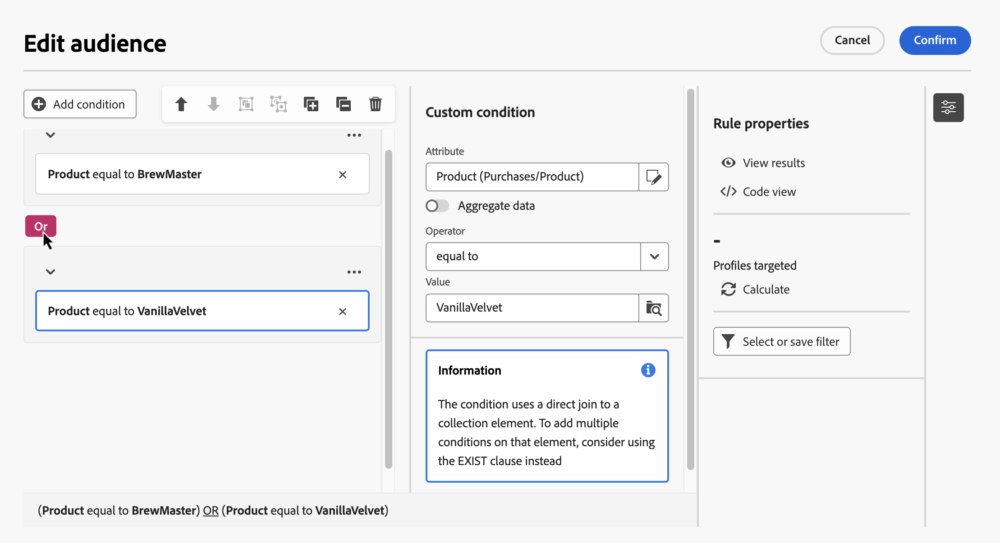

可用模式包括以下：

* **AND (交集)**：合併符合傳出轉變中所有篩選元件的結果。
* **OR (聯合)**：至少加入符合傳出轉變中單一篩選元件的結果。
* **EXCEPT (排除)**：排除符合傳出轉變中所有篩選元件的結果。

## 操控條件 {#manipulate}

規則產生器畫布工具列，有提供可輕鬆操控規則內條件的選項：

| 工具列圖示 | 說明 |
|--- |--- |
|  | 將元件上移動一列。 |
|  | 將元件往下移一列。 |
|  | 請將兩個元件放在同一群組中。 |
|  | 請將單一群組的元件分開。 |
|  | 展開所有群組。 |
|  | 收合所有群組。 |
|  | 移除所有群組和元件。 |

視需求而定，您可能必須將元件分組到相同群組，並將元件連結在一起，以便建立中繼元件群組。

* 若想將兩個現有條件設為群組，請從兩個條件中擇一，然後按一下或按鈕，以便將群組條件設為高於或低於。

* 若要將現有條件群組為新條件，請選取條件，按一下![影像 顯示 [更多動作] 按鈕](assets/do-not-localize/rule-builder-icon-more.svg)按鈕，再選取&#x200B;**[!UICONTROL [新增群組]]**。選取想新增至群組的全新屬性，然後確認。

  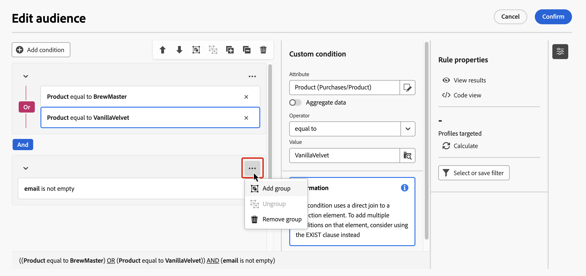

在下方範例中，我們已建立中繼群組，以便將目標鎖定於購買 BrewMaster 或 VanillaVelvet 產品的客戶。

## 檢查並驗證您的查詢

等到在畫布中建立查詢以後，您就可以使用右側的&#x200B;**規則屬性**&#x200B;窗格，方便進行檢查。可用選項如下：

* **檢視結果：**&#x200B;顯示查詢產生的資料。
* **程式碼檢視**：顯示 SQL 中程式碼導向的查詢版本。
* **計算**：更新並顯示規則定位的記錄數目。
* **選取或儲存篩選器**：選擇現有的預先定義篩選器，以便在畫布中使用，或可將查詢儲存為預先定義的篩選器，方便日後重複使用。

 

    >[!IMPORTANT]
    >
    >請從 [規則屬性] 窗格中，選取預先定義的篩選器，以便選取的篩選器，取代畫布中建立的規則。

當規則已就緒，請按一下其中的 **[!UICONTROL [確認]]** 按鈕，即可完成儲存。
