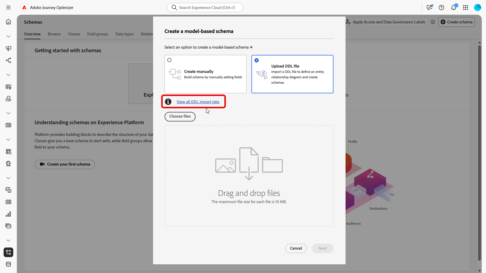

# 設定步驟 {#configuration-steps}

+++ 目錄

| 歡迎使用協調的行銷活動 | 首次建立協調的行銷活動 | 查詢資料庫 | 協調的行銷活動 |
|---|---|---|---|
| [開始使用協調的行銷活動](gs-orchestrated-campaigns.md)<br/><br/><b>[設定步驟](configuration-steps.md)</b><br/><br/>[存取和管理協調的行銷活動](access-manage-orchestrated-campaigns.md)<br/><br/>[建立協調行銷活動的重要步驟](gs-campaign-creation.md) | [建立並排程行銷活動](create-orchestrated-campaign.md)<br/><br/>[協調活動](orchestrate-activities.md)<br/><br/>[開始並監視行銷活動](start-monitor-campaigns.md)<br/><br/>[報告](reporting-campaigns.md) | [使用規則產生器](orchestrated-rule-builder.md)<br/><br/>[建立您的第一個查詢](build-query.md)<br/><br/>[編輯運算式](edit-expressions.md)<br/><br/>[重新鎖定目標](retarget.md) | [開始使用活動](activities/about-activities.md)<br/><br/>活動：<br/>[並加入](activities/and-join.md) - [建立對象](activities/build-audience.md) - [變更維度](activities/change-dimension.md) - [頻道活動](activities/channels.md) - [合併](activities/combine.md) - [重複資料刪除](activities/deduplication.md) - [擴充](activities/enrichment.md) - [分支](activities/fork.md) - [調解](activities/reconciliation.md) - [儲存對象](activities/save-audience.md) - [分割](activities/split.md) - [等待](activities/wait.md) |

{style="table-layout:fixed"}

+++

</br>

>[!BEGINSHADEBOX]

檔案處理中

>[!ENDSHADEBOX]

本指南會逐步引導您建立關聯式結構、設定用於協調行銷活動的資料集、透過S3來源擷取資料，以及在AP平台中查詢擷取的資料。

在此範例中，設定包含整合兩個關鍵實體，**忠誠度交易**&#x200B;和&#x200B;**忠誠度獎勵**，並將它們連結到現有的核心實體&#x200B;**收件者**&#x200B;和&#x200B;**品牌**。


1. [上傳DDL檔案](#upload-ddl)

   為協調的行銷活動定義關聯式資料模型，包括&#x200B;**熟客交易**&#x200B;和&#x200B;**熟客獎勵**&#x200B;實體，以及必要的索引鍵和版本設定屬性。

1. [選取實體](#entities)

   在架構中的表格之間建立有意義的關係，以建立有凝聚力且相互連線的資料模型。

1. [連結綱要](#link-schema)

   將&#x200B;**忠誠度交易**&#x200B;實體連結至&#x200B;**收件者**，並將&#x200B;**忠誠度獎勵**&#x200B;連結至&#x200B;**品牌**，以建立支援個人化客戶歷程的連線資料模型。

1. [擷取資料](#ingest)

   將資料從支援的來源（例如SFTP、雲端儲存空間或資料庫）匯入Adobe Experience Platform。

## 上傳 DDL 檔案 {#upload-ddl}

本節提供如何透過上傳DDL （資料定義語言）檔案在Adobe Experience Platform中建立關聯式綱要的逐步指南。 使用DDL檔案可讓您預先定義資料模型的結構，包括表格、屬性、索引鍵和關係。

1. 登入AP平台。

1. 導覽至&#x200B;**資料管理** > **結構描述**。

1. 按一下&#x200B;**建立結構描述**。

1. 系統會提示您選取兩種結構描述型別：

   * **標準**
   * **關聯式**，專門用於協調的行銷活動

   

1. 選取&#x200B;**上傳DDL檔案**&#x200B;以定義實體關聯圖並建立結構描述。

   表格結構必須包含：
   * 至少一個主索引鍵
   * 版本識別碼，例如`lastmodified`或`datetime`型別的`number`欄位。

1. 拖放您的DDL檔案，然後按一下&#x200B;**[!UICONTROL 下一步]**。

1. 輸入您的&#x200B;**[!UICONTROL 結構描述名稱]**。

1. 設定每個結構描述及其欄，確定已指定主索引鍵。

   必須指定一個屬性（例如`lastmodified`）做為版本描述項。 這個屬性（通常是`datetime`、`long`或`int`型別）是內嵌程式所必須的，以確保資料集以最新資料版本更新。

   

1. 按一下&#x200B;**[!UICONTROL 完成]**。

您現在可以在畫布內驗證表格和欄位定義。 [在下列章節中瞭解更多](#entities)

## 選取實體 {#entities}

若要定義架構內各表格之間的邏輯連線，請遵循下列步驟。

1. 存取資料模型的畫布檢視，並選擇您要連結的兩個表格

1. 按一下Source加入旁的按鈕，然後拖曳並引導箭頭朝向Target加入以建立連線。

   

1. 填寫指定的表單以定義連結，並在設定後按一下&#x200B;**套用**。

   

   **基數**：

   * **1-N**：來源表格的一個出現次數可以具有多個目標表格的對應出現次數，但目標表格的一個出現次數最多可以具有來源表格的一個對應出現次數。

   * **N-1**：目標表格的一個出現次數可以有來源表格的多個對應出現次數，但來源表格的一個出現次數最多可以有目標表格的對應出現次數。

   * **1-1**：來源資料表的一個執行個體最多可以具有目標資料表的一個對應執行個體。

1. 資料模型中定義的所有連結都會在畫布檢視中以箭頭表示。 按一下兩個表格之間的箭頭，即可檢視詳細資訊、進行編輯或視需要移除連結。

   

1. 使用工具列來自訂和調整您的畫布。

   

   * **放大**：放大畫布以更清楚檢視資料模型的詳細資料。

   * **縮小**：縮小畫布大小，以更廣的檢視您的資料模型。

   * **符合檢視**：調整縮放以符合可見區域中的所有結構描述。

   * **篩選器**：選擇要顯示在畫布中的結構描述。

   * **強制自動配置**：自動排列結構描述以取得更好的組織。

   * **顯示地圖**：切換迷你地圖覆蓋，以更輕鬆地導覽大型或複雜的結構描述配置。

1. 完成時，按一下&#x200B;**儲存**。 此動作會建立結構描述和相關聯的資料集，並啟用資料集以用於協調的行銷活動。

1. 按一下&#x200B;**[!UICONTROL 開啟工作]**&#x200B;以監視建立工作的進度。 此程式可能需要幾分鐘的時間，視DDL檔案中定義的表格數量而定。

   

## 連結綱要 {#link-schema}

在&#x200B;**熟客交易**&#x200B;結構描述與&#x200B;**收件者**&#x200B;結構描述之間建立關係，以將每個交易與正確的客戶記錄建立關聯。

1. 瀏覽至&#x200B;**[!UICONTROL 結構描述]**，並開啟您先前建立的&#x200B;**熟客方案交易**。

1. 按一下客戶&#x200B;**[!UICONTROL 欄位屬性]**&#x200B;中的&#x200B;**[!UICONTROL 新增關係]**。

   

1. 選取&#x200B;**[!UICONTROL 多對一]**&#x200B;做為關聯性&#x200B;**[!UICONTROL 型別]**。

1. 連結至現有的&#x200B;**收件者**&#x200B;結構描述。

   

1. 輸入來自目前結構描述&#x200B;**[!UICONTROL 的]**&#x200B;關聯性名稱以及來自參考結構描述&#x200B;**[!UICONTROL 的]**&#x200B;關聯性名稱。

1. 按一下&#x200B;**[!UICONTROL 套用]**&#x200B;以儲存變更。

繼續建立&#x200B;**忠誠度獎勵**&#x200B;結構描述與&#x200B;**品牌**&#x200B;結構描述之間的關係，將每個獎勵專案與適當的品牌建立關聯。


## 擷取資料 {#ingest}

Adobe Experience Platform可讓您從外部來源擷取資料，同時使用Experience Platform服務來建構、加標籤及增強傳入資料。 您可以從多種來源 (如 Adobe 應用程式、雲端型的儲存空間、資料庫和其他許多來源) 內嵌資料。 

1. 從&#x200B;**[!UICONTROL 連線]**&#x200B;功能表，存取&#x200B;**[!UICONTROL 來源]**&#x200B;功能表。

1. 選取&#x200B;**[!UICONTROL 雲端儲存空間]**&#x200B;類別，然後選取Amazon S3，並按一下&#x200B;**[!UICONTROL 新增資料]**。

   

1. 連線您的S3帳戶：

   * 使用現有帳戶

   * 使用新帳戶

   [在Adobe Experience Platform檔案中進一步瞭解](https://experienceleague.adobe.com/zh-hant/docs/experience-platform/destinations/catalog/cloud-storage/amazon-s3#connect)

   

1. 選擇您的資料夾&#x200B;**[!UICONTROL 資料格式]**、**[!UICONTROL 分隔符號]**&#x200B;和&#x200B;**[!UICONTROL 壓縮型別]**。

1. 瀏覽連線的S3來源，直到您找到先前建立的兩個資料夾，即&#x200B;**熟客獎勵**&#x200B;和&#x200B;**熟客交易**。

1. 選取包含您資料的資料夾。

   選取資料夾可確保自動處理所有具有相同結構的目前和未來檔案。 然而，選取單一檔案則需要手動上傳每個新的資料增量。

   

1. 選擇您的資料夾&#x200B;**[!UICONTROL 資料格式]**、**[!UICONTROL 分隔符號]**&#x200B;和&#x200B;**[!UICONTROL 壓縮型別]**。 檢閱您的範例資料是否準確，然後按[下一步] **&#x200B;**。

   

1. 核取&#x200B;**[!UICONTROL 啟用變更資料擷取]**，以從對應至關聯式結構描述且已定義主索引鍵和版本描述項的資料集中選取。

1. 選取您[先前建立的資料集](#entities)，然後按一下&#x200B;**[!UICONTROL 下一步]**。

   

1. 在&#x200B;**[!UICONTROL 對應]**&#x200B;視窗中，確認每個來源檔案屬性與目標結構描述中的對應欄位正確對應。

   完成後，按一下&#x200B;**[!UICONTROL 下一步]**。

   

1. 根據您想要的頻率設定資料流程&#x200B;**[!UICONTROL 排程]**。

1. 按一下&#x200B;**[!UICONTROL 完成]**&#x200B;以建立資料流程。 它會根據定義的排程自動執行。

1. 從&#x200B;**[!UICONTROL 連線]**&#x200B;功能表中，選取&#x200B;**[!UICONTROL 來源]**&#x200B;並存取&#x200B;**[!UICONTROL 資料流程]**&#x200B;索引標籤，以追蹤流程執行、檢閱擷取的記錄，以及疑難排解任何錯誤。

   

<!--manual
## Create a relational schema manual


1. Log in to the AP Platform.
1. Navigate to the **Schema Management** section.
1. Click on **Create Schema**.

1. You will be prompted to select between two schema types:
    * **Standard**
    * **Relational** (used specifically for AGO campaigns)

1. Click on **Create Manual**.
1. Provide a **Schema Name** (e.g., `test_demo_ck001`).
1. Choose **Schema Type**:
    - **Record Type** (required for AGO campaigns)
    - **Time Series** (not applicable here)
1. Click **Finish** to proceed to the schema design canvas.

## Select entities and fields to import

1. In the canvas, add attributes (fields) to your schema.
1. Add a **Primary Key** (mandatory).
1. Add a **Version Descriptor** attribute (for CDC support):
    - This must be of type **DateTime** or **Numeric** (Integer, Long, Short, Byte).
    - Common example: `last_modified`

> **Why?** The **Primary Key** uniquely identifies each record, and the **Version Descriptor** tracks changes, supporting CDC (Change Data Capture) and data mirroring.

1. Mark the appropriate fields as **Primary Key** and **Version Descriptor**.
1. Click **Save**.

---


## 5. Creating a Dataset

1. Navigate to **Datasets**.
1. Click on **Create Dataset**.
1. Select the schema you just created.
1. Assign a **Dataset Name** (same as schema is fine).
1. Optionally, add tags (e.g., `AGO_campaigns`).
6. Ensure the checkbox **"Relational Schema"** is checked.
7. Click **Finish**.

> **Note:** Only one dataset can be created per relational schema.


## 6. Enabling the Dataset

1. Click **Enable** for the dataset.
1. Wait a few moments for the status to show **Enabled**.

> **Why?** Without enabling, the dataset cannot be used in orchestrated campaigns or ingest data.

## 7. Creating a Data Source (S3)

1. Navigate to **Sources**.
1. Click **Create Source**.
1. Choose the source type (e.g., **S3 Bucket**).
1. Provide connection details:
    - Bucket Path (optionally include subfolder path)
1. Save the source.

## 8. Preparing and Uploading Data

1. Prepare your CSV file with:
    - Column headers matching your schema attributes
    - `last_modified` column
    - `change_type` column (`U`/`DU` for upsert, `D` for delete)

> **Important:** `change_type` is required but does not need to be defined in the schema.

1. Save the file as `.csv`.

1. Upload the file to the specified folder in your S3 bucket.


## 9. Ingesting Data from S3

1. Go to **Sources** and find your S3 source.
1. Click **Add Data**.
1. Select the uploaded file.
1. Specify the file format as **CSV** and any compression type if applicable.
1. Review the data preview (ensure `change_type`, `last_modified`, and primary key are visible).
1. Click **Next**.

### Enable Change Data Capture (CDC)

- Check **Enable Change Data Capture**.
- Select the dataset enabled for AGO campaigns.

### Field Mapping

- Fields are auto-mapped (note that `change_type` is not mapped and that's expected).
- Click **Next**.

### Scheduling

- Schedule ingestion frequency (minute, hour, day, week).
- Set start time (immediate or future).
- Click **Finish** to create the data flow.

## 10. Monitoring Data Flow

1. Navigate back to **Sources > Data Flows**.
1. Wait 4–5 minutes for the first run (initial overhead).
1. Monitor:
    - Status (Started, Completed)
    - Number of records ingested
    - Errors (if any)

> **Tip:** Ingested data first lands in the **Data Lake**.

## 11. Data Replication to Data Store

The **Data Store** is updated:

- Every **15 minutes**, or

- If **Data Lake size exceeds 5MB**

This is a background replication process.


## 12. Querying the Dataset

1. Navigate to **Query Services**.
1. Click **Create Query**.
1. Example query:

   ```sql
   SELECT * FROM test_demo_ck001;
   ```

1. Run the query.

> **Note:** If ingestion is incomplete, query will return an error. Check data flow status.

-->