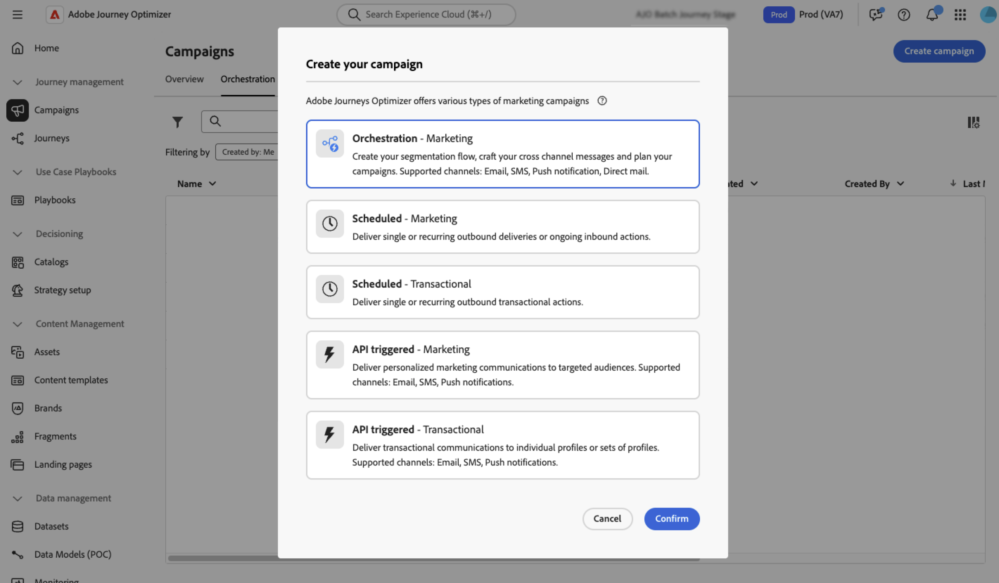

# 建立及排程協調的行銷活動 {#create-first-campaign}

+++ 目錄

| 歡迎使用協調的行銷活動 | 啟動您的第一個協調行銷活動 | 查詢資料庫 | 協調行銷活動 |
|---|---|---|---|
| [開始使用協調的行銷活動](gs-orchestrated-campaigns.md)  建立和管理關聯式結構描述和資料集：  <ul><li>[開始使用結構描述和資料集](gs-schemas.md)</li><li>[手動結構描述](manual-schema.md)</li><li>[檔案上傳結構描述](file-upload-schema.md)</li><li>[擷取資料](ingest-data.md)</li></ul>[存取及管理協調的行銷活動](access-manage-orchestrated-campaigns.md)  [建立協調行銷活動的重要步驟](gs-campaign-creation.md) | <b>[建立並排程行銷活動](create-orchestrated-campaign.md)</b>  [協調活動](orchestrate-activities.md)  [開始並監視行銷活動](start-monitor-campaigns.md)  [報告](reporting-campaigns.md) | [使用規則產生器](orchestrated-rule-builder.md)  [建立您的第一個查詢](build-query.md)  [編輯運算式](edit-expressions.md)  [重定向](retarget.md) | [開始使用活動](activities/about-activities.md)  活動： [同時加入](activities/and-join.md) - [建立客群](activities/build-audience.md) - [變更維度](activities/change-dimension.md) - [頻道活動](activities/channels.md) - [合併](activities/combine.md) - [重複資料刪除](activities/deduplication.md) - [擴充](activities/enrichment.md) - [分支](activities/fork.md) - [調和](activities/reconciliation.md) - [儲存客群](activities/save-audience.md) - [分割](activities/split.md) - [等待](activities/wait.md) |

{style="table-layout:fixed"}

+++
 

>[!BEGINSHADEBOX]

 

此頁面上的內容不是最終內容，可能會有變動。

>[!ENDSHADEBOX]

在[!DNL Adobe Journey Optimizer]中建立協調的行銷活動，並設定其執行排程，以控制其啟動時間和執行頻率。 選擇在特定日期與時間，立即啟動行銷活動，或可使用彈性排程選項，例如按照每日、每週或每月頻率，重複啟動行銷活動。

## 建立行銷活動。 {#create}

>[!CONTEXTUALHELP]
>id="ajo_campaign_creation_workflow"
>title="協調的行銷活動清單"
>abstract="**協調流程**&#x200B;索引標籤會列出所有協調的促銷活動。 按一下「已協調」行銷活動的名稱以進行編輯。 使用&#x200B;**建立協調的行銷活動**&#x200B;按鈕，新增協調的行銷活動。"

若要建立「協調流程」行銷活動，請遵循下列步驟：

1. 瀏覽至&#x200B;**[!UICONTROL 行銷活動]**&#x200B;功能表並選取&#x200B;**[!UICONTROL 協調流程]**&#x200B;標籤。

1. 按一下「**[!UICONTROL 建立行銷活動]**」按鈕，然後選取「**[!UICONTROL 協調流程 — 行銷]**」行銷活動型別。

   

1. 定義行銷活動屬性。 若要這麼做，請按一下行銷活動名稱旁的按鈕。

   

   1. 輸入行銷活動的&#x200B;**[!UICONTROL 名稱]**&#x200B;和&#x200B;**[!UICONTROL 描述]**。

   1. 為您的行銷活動選取&#x200B;**[!UICONTROL 合併原則]**。

      在[!DNL Adobe Experience Platform]中，每個對象都與特定的合併原則繫結，該原則會定義如何將設定檔資訊合併以形成合併的設定檔。 當您在讀取對象活動中選取合併原則時，只有根據該合併原則的對象才可用。 依預設，系統會使用預設的合併原則，但您可以視需要變更它。 如需合併原則的詳細資訊，請參閱[Adobe Experience Platform檔案](https://experienceleague.adobe.com/zh-hant/docs/experience-platform/profile/merge-policies/overview){target="_blank"}。

   1. 使用&#x200B;**[!UICONTROL 標籤]**&#x200B;欄位將Adobe Experience Platform統一標籤指派給您的行銷活動。 這可讓您輕鬆分類，並改善協調行銷活動清單中的搜尋。 [了解如何使用標籤](../start/search-filter-categorize.md#tags)

   1. 按一下&#x200B;**[!UICONTROL 儲存]**。

## 排程行銷活動 {#schedule}

>[!CONTEXTUALHELP]
>id="ajo_orchestration_scheduler"
>title="排程器"
>abstract="身為行銷活動管理員，您可以將行銷活動安排在特定時間自動啟動，從而為行銷通訊提供精確的時間表及準確的目標選擇資料。"

>[!CONTEXTUALHELP]
>id="ajo_orchestration_schedule_validity"
>title="排程器有效性"
>abstract="您可以定義排程器的有效期限。它可以是永久的 (預設)，也可以在特定日期之前有效。"

>[!CONTEXTUALHELP]
>id="ajo_orchestration_schedule_options"
>title="排程器選項"
>abstract="定義排程器的頻率。它可以在特定時刻執行，可每天、每週或每月執行一次或多次。"

根據預設，協調的行銷活動在手動啟動時開始，並在執行相關活動後結束。 如果您偏好延遲執行或循環執行行銷活動，可以定義行銷活動的排程。

排程協調行銷活動時，請考量下列最佳實務，以確保最佳效能和預期行為：

* 請勿將協調的行銷活動排程為超過每15分鐘執行一次，因為它可能會阻礙整體系統效能並在資料庫中建立區塊。
* 如果您想在協調的行銷活動中傳送單次訊息，可將其設定為執行&#x200B;**一次**。
* 如果您想要在協調的行銷活動中傳送循環訊息，您必須使用&#x200B;**排程**&#x200B;選項並設定執行頻率。 循環傳遞活動不允許您自己定義排程。

若想設定行銷活動排程，請遵循下列步驟：

1. 開啟行銷活動，然後&#x200B;**[!UICONTROL 儘快按一下]**&#x200B;按鈕。

   

1. 選取行銷活動的執行頻率，然後設定可用選項。 設定會依選取的頻率而有所不同：

   +++一次

   在指定的日期和時間執行單次行銷活動。

   * **[!UICONTROL 日期]**：選取應執行行銷活動的日期。
   * **[!UICONTROL 時間]**：選取應執行行銷活動的特定時間。

+++

   +++每日

   每日或在選取的日期執行行銷活動。

   * **[!UICONTROL 每日週期]**：選擇行銷活動執行的頻率：
      * **[!UICONTROL 每天]**：在一週的每一天 (包括週末) 執行行銷活動。
      * **[!UICONTROL 工作日]**：僅從星期一到星期五執行行銷活動。
      * **[!UICONTROL 經過特定期間]**：在定義的日期範圍內 (例如 7 月 1 日至 7 月 15 日) 每天執行行銷活動。行銷活動不會在此範圍以外執行。
      * **[!UICONTROL 一星期的選定日]**：僅在一星期的指定日執行行銷活動 (例如，星期一、星期三、星期五)。

   * **[!UICONTROL 開始時間]**：定義行銷活動每天應執行的時間。

+++

   +++一天幾次

   同一天內執行多次行銷活動。您可以選擇特定時間或設定定期頻率。

   * **[!UICONTROL 選取的時數]**：選取行銷活動應執行的特定時間，並設定其每日週期 (在一週的每一天或某些天執行)。
   * **[!UICONTROL 定期]**：選擇每 n 分鐘或小時執行一次行銷活動。您也可以定義一天內允許執行的時間範圍。

+++

   +++每週

   每週執行行銷活動，並提供特定日的選項。

   * **[!UICONTROL 頻率]**：選擇行銷活動應該執行的頻率 (例如，每週、每 2 週)。
   * **[!UICONTROL 從日期開始]**：選取週期應開始的日期。
   * **[!UICONTROL 每日週期]**：選擇一週中的特定日來執行 (例如，每個星期一和星期四)。
   * **[!UICONTROL 開始時間]**：設定行銷活動在選定日應該執行的時間。

+++

   +++每月

   每月執行行銷活動，並提供特定日的選項。

   * **[!UICONTROL 每月週期]**：選取行銷活動是每個月執行，還是只在特定月份執行。
   * **[!UICONTROL 每日週期]**：
      * **[!UICONTROL 每天]**：在該月的每個行事曆日 (包括週末) 執行行銷活動。
      * **[!UICONTROL 每月的最後一天]**：僅在每月的最後一個行事曆日執行行銷活動 (例如，1 月 31 日、2 月 28/29 日)。
      * **[!UICONTROL 一個月的特定日 (例如，15 日)]**：在指定日執行行銷活動 (例如，每個月的 15 日)。
      * **[!UICONTROL 一週的第一天/最後一天或第 n 天]** (例如，第一個星期一)：⋯⋯在指定的工作日執行行銷活動 (例如，每週的 15 日)。
      * **[!UICONTROL 一週的選定日]**：在指定日執行行銷活動。

   * **[!UICONTROL 開始時間]**：設定行銷活動應執行的時間。

+++

1. 使用&#x200B;**[!UICONTROL 有效期間]**&#x200B;設定來定義特定的開始和結束日期，將行銷活動的執行限制在有限的時間範圍內。

1. 對於週期性排程，按一下「**[!UICONTROL 預覽啟動時間]**」按鈕，以根據目前設定預覽即將執行的確切日期和時間。這有助於在啟用前驗證排程，並確保行銷活動可如預期般執行。

>[!NOTE]
>
>在 [!DNL Adobe Journey Optimizer] 中排程行銷活動時，請確定您的開始日期/時間與所要的首次傳遞一致。對於定期行銷活動，如果初始排程時間已過，行銷活動將根據其週期規則滾動至下一個可用時段。

在下列範例中，活動已設定為讓「協調的行銷活動」在2025年10月1日至2026年1月1日這週內的每一天，於上午9點和12點每日執行兩次。

{width="50%" align="left"}

## 後續步驟 {#next}

設定行銷活動設定和排程後，您就可以開始協調它將執行的不同任務。[了解如何協調行銷活動](../orchestrated/orchestrate-activities.md)
