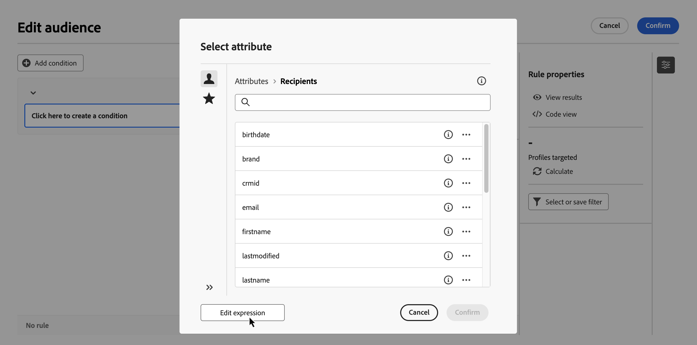
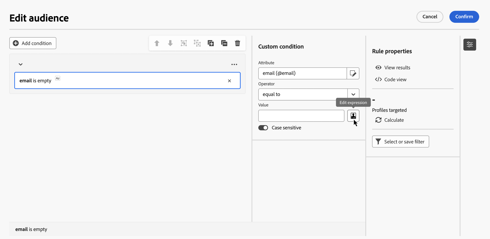
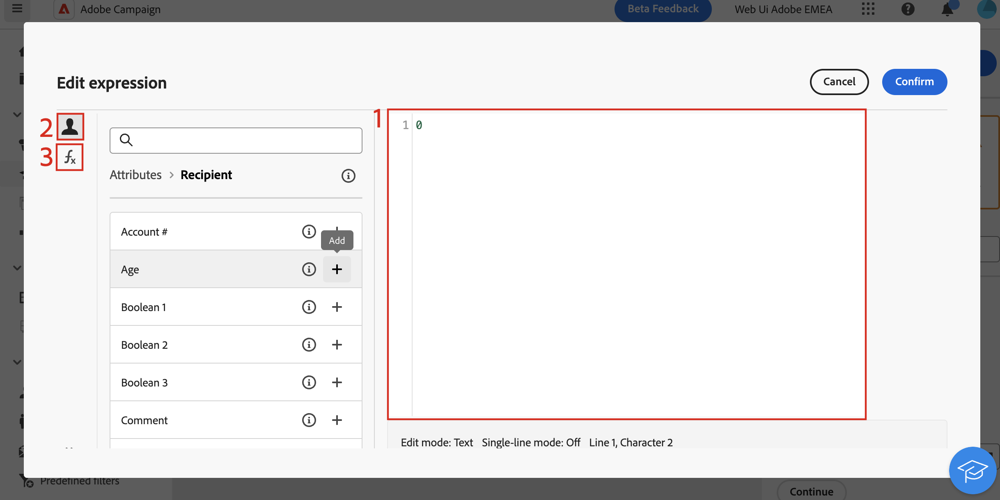

# 編輯運算式 {#edit-expressions}

+++ 目錄

| 歡迎使用協調的行銷活動 | 啟動您的第一個協調行銷活動 | 查詢資料庫 | 協調行銷活動 |
|---|---|---|---|
| [開始使用協調的行銷活動](gs-orchestrated-campaigns.md)  建立和管理關聯式結構描述和資料集：  <ul><li>[開始使用結構描述與資料集](gs-schemas.md)</li><li>[手動結構描述](manual-schema.md)</li><li>[檔案上傳結構描述](file-upload-schema.md)</li><li>[擷取資料](ingest-data.md)</li></ul>[存取及管理協調的行銷活動](access-manage-orchestrated-campaigns.md)  [建立協調行銷活動的重要步驟](gs-campaign-creation.md) | [建立並排程行銷活動](create-orchestrated-campaign.md)  [協調活動](orchestrate-activities.md)  [開始並監視行銷活動](start-monitor-campaigns.md)  [報告](reporting-campaigns.md) | [使用規則產生器](orchestrated-rule-builder.md)  [建立您的第一個查詢](build-query.md)  <b>[編輯運算式](edit-expressions.md)</b>  [重定向](retarget.md) | [開始使用活動](activities/about-activities.md)  活動： [同時加入](activities/and-join.md) - [建立客群](activities/build-audience.md) - [變更維度](activities/change-dimension.md) - [頻道活動](activities/channels.md) - [合併](activities/combine.md) - [重複資料刪除](activities/deduplication.md) - [擴充](activities/enrichment.md) - [分支](activities/fork.md) - [調和](activities/reconciliation.md) - [儲存客群](activities/save-audience.md) - [分割](activities/split.md) - [等待](activities/wait.md) |

{style="table-layout:fixed"}

+++
 

>[!BEGINSHADEBOX]

此頁面上的內容不是最終內容，可能會有所變更。

>[!ENDSHADEBOX]

>[!NOTE]
>
>下節提供如何使用運算式編輯器建立規則的資訊。請記住，用來建立規則的語法與用來新增個人化的語法不同。

## 使用運算式編輯器 {#edit}

編輯運算式需要手動輸入條件以形成規則。此模式可讓您使用進階函式，這些函式可讓您控制用於執行特定查詢的值，例如控制日期、字串、數值欄位和排序。

設定自訂條件時，可按下規則產生器的「**[!UICONTROL 編輯運算式]**」按鈕打開運算式編輯器，適用於「**[!UICONTROL 屬性]**」和「**[!UICONTROL 值]**」欄位。

| 從「**屬性**」欄位存取 | 從「**值**」欄位存取 |
| --- | --- |
| {zoomable="yes"}{width="200" align="center" zoomable="yes"} | {zoomable="yes"}{width="200" align="center" zoomable="yes"} |

運算式編輯器提供：

* 定義運算式的&#x200B;**輸入欄位 (1)**。
* 可用&#x200B;**欄位 (2)** 清單，可用於運算式中，並對應至查詢的目標維度。
* **協助程式函式 (3)**，依類別排序。

直接在輸入欄位中輸入運算式以編輯運算式。若要新增欄位或協助程式函式，請將游標置於要新增的運算式上，然後按一下「+」按鈕。

{zoomable="yes"}

## 協助程式功能

查詢編輯工具可讓您使用進階功能，根據所需結果和操作資料的類型執行複雜的篩選。可使用下列函式：

### 彙總

彙總函式會針對一組值執行計算。

<table>
<tbody>
<tr>
<td><strong>名稱</strong></td>
<td><strong>說明</strong></td>
<td><strong>語法</strong></td>
</tr>
<tr>
<td><strong>Avg</strong></td>
<td>傳回數值類型欄的平均值</td>
<td>Avg(&lt;值&gt;)</td>
</tr>
<tr>
<td><strong>Count</strong></td>
<td>計算欄的非空值數量。</td>
<td>Count(&lt;值&gt;)</td>
</tr>
<tr>
<td><strong>CountAll</strong></td>
<td>計算傳回的值 (所有欄位)</td>
<td>CountAll()</td>
</tr>
<tr>
<td><strong>Countdistinct</strong></td>
<td>計算欄中不同的非空值數量</td>
<td>Countdistinct(&lt;值&gt;)</td>
</tr>
<tr>
<td><strong>Max</strong></td>
<td>傳回數值、字串或日期類型欄位中的最大值</td>
<td>Max(&lt;值&gt;)</td>
</tr>
<tr>
<td><strong>Min</strong></td>
<td>傳回數值、字串或日期類型欄中的最小值</td>
<td>Min(&lt;值&gt;)</td>
</tr>
<tr>
<td><strong>StdDev</strong></td>
<td>傳回數值、字串或日期欄位中的標準差</td>
<td>StdDev(&lt;值&gt;)</td>
</tr>
<tr>
<td><strong>StringAgg</strong></td>
<td>傳回字串類型欄值的字串串連，以便將第二個引數中的字元分隔開來</td>
<td>StringAgg(&lt;值&gt;, &lt;字串&gt;)</td>
</tr>
<tr>
<td><strong>Sum</strong></td>
<td>傳回數字、字串或日期類型欄位的數值總和</td>
<td>Sum(&lt;值&gt;)</td>
</tr>
</tbody>
</table>

### 日期

日期函數可操控日期或時間值。

<table>
<tbody>
<tr>
<td><strong>名稱</strong></td>
<td><strong>說明</strong></td>
<td><strong>語法</strong></td>
</tr>
<tr>
<td><strong>AddDays</strong></td>
<td>將天數新增至日期</td>
<td>AddDays(&lt;日期&gt;, &lt;數字&gt;)</td>
</tr>
<tr>
<td><strong>AddHours</strong></td>
<td>將時數新增至日期</td>
<td>AddHours(&lt;日期&gt;, &lt;數字&gt;)</td>
</tr>
<tr>
<td><strong>AddMinutes</strong></td>
<td>將分鐘數新增至日期</td>
<td>AddMinutes(&lt;日期&gt;, &lt;數字&gt;)</td>
</tr>
<tr>
<td><strong>AddMonths</strong></td>
<td>將月份新增至日期</td>
<td>AddMonths(&lt;日期&gt;, &lt;數字&gt;)</td>
</tr>
<tr>
<td><strong>AddSeconds</strong></td>
<td>將秒數新增至日期</td>
<td>AddSeconds(&lt;日期&gt;, &lt;數字&gt;)</td>
</tr>
<tr>
<td><strong>AddYears</strong></td>
<td>將年數新增至日期</td>
<td>AddYears(&lt;日期&gt;, &lt;數字&gt;)</td>
</tr>
<tr>
<td><strong>ConvertNTZ</strong></td>
<td>套用定義的工作階段 TZ，就能將時間戳記 NTZ (沒有時區的時間戳記) 轉換成 TZ (有時區的時間戳記)</td>
<td>ConvertNTZ(&lt;日期+時間&gt;)</td>
</tr>
<tr>
<td><strong>DateCmp</strong></td>
<td>比較兩個日期</td>
<td>DateCmp(&lt;日期&gt;, &lt;日期&gt;)</td>
</tr>
<tr>
<td><strong>DateOnly</strong></td>
<td>只會傳回日期 (時間設在 00:00)</td>
<td>DateOnly(&lt;日期&gt;)</td>
</tr>
<tr>
<td><strong>Day</strong></td>
<td>傳回代表日期的數字</td>
<td>Day(&lt;日期&gt;)</td>
</tr>
<tr>
<td><strong>DayOfYear</strong></td>
<td>傳回日期中某年的某天的數字</td>
<td>DayOfYear(&lt;日期&gt;)</td>
</tr>
<tr>
<td><strong>DaysAgo</strong></td>
<td>傳回與目前日期對應的日期減去 n 天</td>
<td>DaysAgo(&lt;數字&gt;)</td>
</tr>
<tr>
<td><strong>DaysAgoInt</strong></td>
<td>傳回與目前日期對應的日期 (整數 yyyymmdd) 減去 n 天</td>
<td>DaysAgoInt(&lt;數字&gt;)</td>
</tr>
<tr>
<td><strong>DaysDiff</strong></td>
<td>傳回兩個日期之間的天數</td>
<td>DaysDiff(&lt;結束日期&gt;, &lt;開始日期&gt;)</td>
</tr>
<tr>
<td><strong>DaysOld</strong></td>
<td>傳回日期的年齡 (以天為單位)</td>
<td>DaysOld(&lt;日期&gt;)</td>
</tr>
<tr>
<td><strong>GetDate</strong></td>
<td>返回伺服器的目前系統日期</td>
<td>GetDate()</td>
</tr>
<tr>
<td><strong>Hour</strong></td>
<td>傳回日期的小時數</td>
<td>Hour(&lt;日期&gt;)</td>
</tr>
<tr>
<td><strong>HoursDiff</strong></td>
<td>傳回兩個日期之間的小時數</td>
<td>HoursDiff(&lt;結束日期&gt;, &lt;開始日期&gt;)</td>
</tr>
<tr>
<td><strong>Minute</strong></td>
<td>傳回日期的分鐘數</td>
<td>Minute(&lt;日期&gt;)</td>
</tr>
<tr>
<td><strong>MinutesDiff</strong></td>
<td>傳回兩個日期之間的分鐘數</td>
<td>MinutesDiff(&lt;結束日期&gt;, &lt;開始日期&gt;)</td>
</tr>
<tr>
<td><strong>Month</strong></td>
<td>傳回代表日期月份的數字</td>
<td>Month(&lt;日期&gt;)</td>
</tr>
<tr>
<td><strong>MonthsAgo</strong></td>
<td>傳回與目前日期對應的日期減去 n 個月</td>
<td>MonthsAgo(&lt;數字&gt;)</td>
</tr>
<tr>
<td><strong>MonthsDiff</strong></td>
<td>傳回兩個日期之間的年數</td>
<td>MonthsDiff(&lt;結束日期&gt;, &lt;開始日期&gt;)</td>
</tr>
<tr>
<td><strong>MonthsOld</strong></td>
<td>傳回日期的年齡 (以月為單位)</td>
<td>MonthsOld(&lt;日期&gt;)</td>
</tr>
<tr>
<td><strong>Oldest</strong></td>
<td>傳回範圍中最早的日期</td>
<td>Oldest(&lt;日期, 日期&gt;)</td>
</tr>
<tr>
<td><strong>Second</strong></td>
<td>傳回日期的秒數</td>
<td>Second(&lt;日期&gt;)</td>
</tr>
<tr>
<td><strong>SecondsDiff</strong></td>
<td>傳回兩個日期之間的秒數</td>
<td>SecondsDiff(&lt;結束日期&gt;, &lt;開始日期&gt;)</td>
</tr>
<tr>
<td><strong>SubDays</strong></td>
<td>從日期減去天數</td>
<td>SubDays(&lt;日期&gt;, &lt;數字&gt;)</td>
</tr>
<tr>
<td><strong>SubHours</strong></td>
<td>從日期減去小時數</td>
<td>SubHours(&lt;日期&gt;, &lt;數字&gt;)</td>
</tr>
<tr>
<td><strong>SubMinutes</strong></td>
<td>從日期減去分鐘數</td>
<td>SubMinutes(&lt;日期&gt;, &lt;數字&gt;)</td>
</tr>
<tr>
<td><strong>SubMonths</strong></td>
<td>從日期減去月數</td>
<td>SubMonths(&lt;日期&gt;, &lt;數字&gt;)</td>
</tr>
<tr>
<td><strong>SubSeconds</strong></td>
<td>從日期減去秒數</td>
<td>SubSeconds(&lt;日期&gt;, &lt;數字&gt;)</td>
</tr>
<tr>
<td><strong>SubYears</strong></td>
<td>從日期減去年數</td>
<td>SubYears(&lt;日期&gt;, &lt;數字&gt;)</td>
</tr>
<tr>
<td><strong>ToDate</strong></td>
<td>將日期 + 時間轉換為日期</td>
<td>ToDate(&lt;日期 + 時間&gt;)</td>
</tr>
<tr>
<td><strong>ToDateTime</strong></td>
<td>將字串轉換為日期 + 時間</td>
<td>ToDateTime(&lt;字串&gt;)</td>
</tr>
<tr>
<td><strong>ToTimestamp</strong></td>
<td>將字串轉換為時間戳記</td>
<td>ToTimestamp(&lt;字串&gt;)</td>
</tr>
<tr>
<td><strong>ToTimeZone</strong></td>
<td>將日期 + 時間轉換為時區</td>
<td>ToTimeZone(&lt;日期&gt;, &lt;時區&gt;)</td>
</tr>
<tr>
<td><strong>TruncDate</strong></td>
<td>將日期 + 時間四捨五入至最接近的秒數</td>
<td>TruncDate(@lastModified, &lt;秒數&gt;)</td>
</tr>
<tr>
<td><strong>TruncDateTZ</strong></td>
<td>將日期 + 時間四捨五入為以秒為單位的指定精確度</td>
<td>TruncDateTZ(&lt;日期&gt;, &lt;秒數&gt;, &lt;時區&gt;)</td>
</tr>
<tr>
<td><strong>TruncQuarter</strong></td>
<td>將日期捨入為季度</td>
<td>TruncQuarter(&lt;日期&gt;)</td>
</tr>
<tr>
<td><strong>TruncTime</strong></td>
<td>將時間部分捨入到最接近的秒數</td>
<td>TruncTime(&lt;日期&gt;, &lt;秒數&gt;)</td>
</tr>
<tr>
<td><strong>TruncWeek</strong></td>
<td>將日期捨入為一週</td>
<td>TruncWeek(&lt;日期&gt;)</td>
</tr>
<tr>
<td><strong>TruncYear</strong></td>
<td>將日期 + 時間捨入至年度的 1 月 1 日</td>
<td>TruncYear(&lt;日期&gt;)</td>
</tr>
<tr>
<td><strong>WeekDay</strong></td>
<td>傳回代表日期當週某天的數字 (0=星期一，6=星期日)</td>
<td>WeekDay(&lt;日期&gt;)</td>
</tr>
<tr>
<td><strong>Year</strong></td>
<td>傳回代表日期年份的數字</td>
<td>Year(&lt;日期&gt;)</td>
</tr>
<tr>
<td><strong>YearAndMonth</strong></td>
<td>傳回代表日期的年月份數字</td>
<td>YearAndMonth(&lt;日期&gt;)</td>
</tr>
<tr>
<td><strong>YearsAgo</strong></td>
<td>傳回指定日期、目前日期之間的年數</td>
<td>YearsAgo(&lt;日期&gt;)</td>
</tr>
<tr>
<td><strong>YearsDiff</strong></td>
<td>傳回兩個日期之間的年數</td>
<td>YearsDiff(&lt;結束日期&gt;, &lt;開始日期&gt;)</td>
</tr>
<tr>
<td><strong>YearsOld</strong></td>
<td>傳回日期的年齡</td>
<td>YearsOld(&lt;日期&gt;)</td>
</tr>
</tbody>
</table>

>[!NOTE]
>
>請注意，**DateOnly**&#x200B;函式會考量伺服器的時區，部會只計算運算子所在時區。

### 地理行銷

地理行銷函式用於操縱地理值。

<table> 
 <tbody> 
  <tr> 
   <td> <strong>名稱</strong>  </td> 
   <td> <strong>說明</strong>  </td> 
   <td> <strong>語法</strong>  </td> 
  </tr> 
  <tr> 
   <td> <strong>Distance</strong>  </td> 
   <td> 傳回由經度和緯度，通常會以度來表示，定義兩點之間的距離  </td> 
   <td> Distance(&lt;經度 A&gt;, &lt;緯度 A&gt;, &lt;經度 B&gt;, &lt;緯度 B&gt;)  </td>  
  </tr> 
 </tbody> 
</table>

### 數值

數值函數可用來將文轉換為數字。

<table> 
 <tbody> 
  <tr> 
   <td> <strong>名稱</strong>  </td> 
   <td> <strong>說明</strong>  </td> 
   <td> <strong>語法</strong>  </td> 
  </tr> 
  <tr> 
   <td> <strong>Abs</strong>  </td> 
   <td> 返回數字的絕對值  </td> 
   <td> Abs(&lt;數字&gt;)  </td>  
  </tr> 
  <tr> 
   <td> <strong>Ceil</strong>  </td> 
   <td> 傳回大於或等於數字的最小整數  </td> 
   <td> Ceil(&lt;數字&gt;)  </td>  
  </tr> 
  <tr> 
   <td> <strong>Floor</strong>  </td> 
   <td> 傳回大於或等於數字的最小整數  </td> 
   <td> Floor(&lt;數字&gt;)  </td>  
  </tr> 
  <tr> 
   <td> <strong>Greatest</strong>  </td> 
   <td> 傳回兩個數字中的較大值  </td> 
   <td> Greatest(&lt;數字 1&gt;, &lt;數字 2&gt;)  </td>  
  </tr> 
  <tr> 
   <td> <strong>Least</strong>  </td> 
   <td> 傳回兩個數字中的較小者  </td> 
   <td> Least(&lt;數字 1&gt;, &lt;數字 2&gt;)  </td>  
  </tr> 
  <tr> 
   <td> <strong>Mod</strong>  </td> 
   <td> 傳回 n1 除以 n2 的整數餘數  </td> 
   <td> Mod(&lt;數字 1&gt;, &lt;數字 2&gt;)  </td>  
  </tr> 
  <tr> 
   <td> <strong>Percent</strong>  </td> 
   <td> 傳回兩個數字的比率，以百分比表示  </td> 
   <td> Percent(&lt;數字 1&gt;, &lt;數字 2&gt;)  </td>  
  </tr> 
  <tr> 
   <td> <strong>Random</strong>  </td> 
   <td> 傳回隨機值  </td> 
   <td> Random()  </td> 
  </tr> 
  <tr> 
   <td> <strong>Round</strong>  </td> 
   <td> 將數字四捨五入為 n 個小數  </td> 
   <td> Round(&lt;數字&gt;, &lt;小數位數&gt;)  </td>  
  </tr> 
  <tr> 
   <td> <strong>Sign</strong>  </td> 
   <td> 傳回數字元號  </td> 
   <td> Sign(&lt;數字&gt;)  </td>  
  </tr> 
  <tr> 
   <td> <strong>ToDouble</strong>  </td> 
   <td> 將整數轉換為浮點數  </td> 
   <td> ToDouble(&lt;數字&gt;)  </td>  
  </tr> 
  <tr> 
   <td> <strong>ToInt64</strong>  </td> 
   <td> 將浮點數轉換為　64　位整數  </td> 
   <td> ToInt64(&lt;數字&gt;)  </td>  
  </tr> 
  <tr> 
   <td> <strong>ToInteger</strong>  </td> 
   <td> 將浮點數轉換為整數  </td> 
   <td> ToInteger(&lt;數字&gt;)  </td>  
  </tr> 
  <tr> 
   <td> <strong>Trunc</strong>  </td> 
   <td> 截斷　n1　到　n2　小數  </td> 
   <td> Trunc(&lt;n1&gt;, &lt;n2&gt;)  </td>  
  </tr> 
 </tbody> 
</table>

### 其他

此表包含剩餘的可用函式。

<table> 
 <tbody> 
  <tr> 
   <td> <strong>名稱</strong>  </td> 
   <td> <strong>說明</strong>  </td> 
   <td> <strong>語法</strong>  </td> 
  </tr> 
  <tr> 
   <td> <strong>AESEncrypt</strong>  </td> 
   <td> 加密引數中提供的字串  </td> 
   <td> AESEncrypt(&lt;值&gt;)  </td> 
  </tr>
  <tr> 
   <td> <strong>Case</strong>  </td> 
   <td> 如果條件為真，則傳回值 1。如果為假，則傳回值 2。  </td> 
   <td> Case(When(&lt;條件&gt;, &lt;值 1&gt;), Else(&lt;值 2&gt;))  </td> 
  </tr> 
  <tr> 
   <td> <strong>ClearBit</strong>  </td> 
   <td> 刪除值中的旗標  </td> 
   <td> ClearBit(&lt;識別碼&gt;, &lt;旗標&gt;)  </td>  
  </tr> 
  <tr> 
   <td> <strong>Coalesce</strong>  </td> 
   <td> 如果值　1　為　零或　null，則傳回值　2，否則傳回值　1  </td> 
   <td> Coalesce(&lt;值 1&gt;, &lt;值 2&gt;)  </td>  
  </tr> 
  <tr> 
   <td> <strong>Decode</strong>  </td> 
   <td> 如果值 1 = 值 2，則傳回值 3。如果不等，則傳回值 4。  </td> 
   <td> Decode(&lt;值 1&gt;, &lt;值 2&gt;, &lt;值 3&gt;, &lt;值 4&gt;)  </td>  
  </tr>

<tr> 
   <td> <strong>Else</strong>  </td> 
   <td> 傳回值　1 (只能用作　case　函式的參數)  </td> 
   <td> Else(&lt;值 1&gt;, &lt;值 2&gt;)  </td>  
  </tr> 
  <tr> 
   <td> <strong>GetEmailDomain</strong>  </td> 
   <td> 從電子郵件地址中擷取網域  </td> 
   <td> GetEmailDomain(&lt;值&gt;)  </td>  
  </tr> 
  <tr> 
   <td> <strong>GetMirrorURL</strong>  </td> 
   <td> 檢索鏡像頁面伺服器的URL  </td> 
   <td> GetMirrorURL(&lt;值&gt;)  </td>  
  </tr> 
  <tr> 
   <td> <strong>Iif</strong>  </td> 
   <td> 如果運算式為真，則傳回值 1。如果為假，則傳回值 2  </td> 
   <td> Iif(&lt;條件&gt;, &lt;值 1&gt;, &lt;值 2&gt;)  </td>  
  </tr> 
  <tr> 
   <td> <strong>IsBitSet</strong>  </td> 
   <td> 指出旗標是否在值中  </td> 
   <td> IsBitSet(&lt;識別碼&gt;, &lt;旗標&gt;)  </td>  
  </tr> 
  <tr> 
   <td> <strong>IsEmptyString</strong>  </td> 
   <td> 如果字串 1 為空，則傳回值 2，否則傳回值 3  </td> 
   <td> IsEmptyString(&lt;值 1&gt;, &lt;值 2&gt;, &lt;值 3&gt;)  </td>  
  </tr> 
  <tr> 
   <td> <strong>NewUUID</strong>  </td> 
   <td> 傳回唯一識別碼  </td> 
   <td> NewUUID()  </td>  
  </tr> 
  <tr> 
   <td> <strong>NoNull</strong>  </td> 
   <td> 如果引數為　NULL，則返回空字串  </td> 
   <td> NoNull(&lt;值&gt;)  </td>   
  </tr> 
  <tr> 
   <td> <strong>RowId</strong>  </td> 
   <td> 返回行號  </td> 
   <td> RowId  </td> 
  </tr> 
  <tr> 
   <td> <strong>SetBit</strong>  </td> 
   <td> 強制值中的旗標  </td> 
   <td> SetBit(&lt;識別碼&gt;, &lt;旗標&gt;)  </td>  
  </tr> 
  <tr> 
   <td> <strong>ToBoolean</strong>  </td> 
   <td> 將數字轉換為布林值  </td> 
   <td> ToBoolean(&lt;數字&gt;)  </td>   
  </tr> 
  <tr> 
   <td> <strong>When</strong>  </td> 
   <td> 如果運算式為真，則傳回值 1。否則，傳回值 2 (只能用作 case 函式的參數)  </td> 
   <td> When(&lt;條件&gt;, &lt;值 1&gt;)  </td>  
  </tr> 
 </tbody> 
</table>

### 字串

字串函式可用來控制一組字串。

<table> 
 <tbody> 
  <tr> 
   <td> <strong>名稱</strong>  </td> 
   <td> <strong>說明</strong>  </td> 
   <td> <strong>語法</strong>  </td> 
  </tr> 
  <tr> 
   <td> <strong>AllNonNull2</strong>  </td> 
   <td> 指示所有參數是否為非空值且非空白  </td> 
   <td> AllNonNull2(&lt;字串&gt;, &lt;字串&gt;) </td> 
  </tr> 
  <tr> 
   <td> <strong>AllNonNull3</strong>  </td> 
   <td> 指示所有參數是否為非空值且非空白  </td> 
   <td> AllNonNull3(&lt;字串&gt;, &lt;字串&gt;, &lt;字串&gt;) </td> 
  </tr> 
  <tr> 
   <td> <strong>Ascii</strong>  </td> 
   <td> 傳回字串中第一個字元的 ASCII 值  </td> 
   <td> Ascii(&lt;字串&gt;) </td> 
  </tr> 
  <tr> 
   <td> <strong>Char</strong>  </td> 
   <td> 傳回與　'n' ASCII　代碼對應的字元  </td> 
   <td> Char(&lt;數字&gt;) </td>  
  </tr> 
  <tr> 
   <td> <strong>Charindex</strong>  </td> 
   <td> 傳回字串 2 在字串 1 中的位置。  </td> 
   <td> Charindex(&lt;字串&gt;, &lt;字串&gt;) </td> 
  </tr> 
  <tr> 
   <td> <strong>DataLength</strong>  </td> 
   <td> 傳回字串的位元組大小  </td> 
   <td> dataLength(&lt;字串&gt;) </td> 
  </tr> 
  <tr> 
   <td> <strong>GetLine</strong>  </td> 
   <td> 傳回字串的第　n　行 (從　1　到　n)  </td> 
   <td> GetLine(&lt;字串&gt;) </td> 
  </tr> 
  <tr> 
   <td> <strong>IfEquals</strong>  </td> 
   <td> 如果前兩個參數相等，就會傳回第三個參數。如果不是，就會傳回最後一個參數  </td> 
   <td> IfEquals(&lt;字串&gt;, &lt;字串&gt;, &lt;字串&gt;, &lt;字串&gt;) </td> 
  </tr> 
  <tr> 
   <td> <strong>IsMemoNull</strong>  </td> 
   <td> 指示作為參數傳遞的備忘錄是否為空  </td> 
   <td> IsMemoNull(&lt;備忘錄&gt;) </td> 
  </tr> 
  <tr> 
   <td> <strong>JuxtWords</strong>  </td> 
   <td> 將傳遞的兩個字串當成參數進行加以串連。如有必要，請在字串之間新增空格。  </td> 
   <td> JuxtWords(&lt;字串&gt;, &lt;字串&gt;) </td> 
  </tr> 
  <tr> 
   <td> <strong>JuxtWords3</strong>  </td> 
   <td> 將傳遞的兩個字串當成參數進行加以串連。如有必要，請在字串之間新增空格  </td> 
   <td> JuxtWords3(&lt;字串&gt;, &lt;字串&gt;, &lt;字串&gt;) </td>  
  </tr> 
  <tr> 
   <td> <strong>Left</strong>  </td> 
   <td> 傳回字串的前　n　個字元  </td> 
   <td> Left(&lt;字串&gt;, &lt;數字&gt;) </td> 
  </tr> 
  <tr> 
   <td> <strong>Length</strong>  </td> 
   <td> 傳回字串的長度  </td> 
   <td> Length(&lt;字串&gt;) </td> 
  </tr> 
  <tr> 
   <td> <strong>Line</strong>  </td> 
   <td> 從字串中擷取第 n 行  </td> 
   <td> Line(&lt;字串&gt;,&lt;數字&gt;) </td> 
  </tr>
  <tr> 
   <td> <strong>Lower</strong>  </td> 
   <td> 傳回小寫字串  </td> 
   <td> Lower(&lt;字串&gt;) </td> 
  </tr> 
  <tr> 
   <td> <strong>LPad</strong>  </td> 
   <td> 傳回左側的已完成字串  </td> 
   <td> LPad (&lt;字串&gt;, &lt;數字&gt;, &lt;字元&gt;) </td> 
  </tr> 
  <tr> 
   <td> <strong>Ltrim</strong>  </td> 
   <td> 移除字串左側的空格  </td> 
   <td> Ltrim(&lt;字串&gt;) </td> 
  </tr> 
  <tr> 
   <td> <strong>Md5Digest</strong>  </td> 
   <td> 返回字串　MD5　鍵的十六進位表示  </td> 
   <td> Md5Digest(&lt;字串&gt;) </td> 
  </tr> 
  <tr> 
   <td> <strong>MemoContains</strong>  </td> 
   <td> 指定備忘錄是否包含作為參數傳遞的字串  </td> 
   <td> MemoContains(&lt;備忘錄&gt;, &lt;字串&gt;) </td> 
  </tr> 
  <tr> 
   <td> <strong>NodeValue</strong>  </td> 
   <td> 從 XPath 和欄位資料中擷取到 XML 欄位的數值  </td> 
   <td> NodeValue (&lt;字串&gt;, &lt;字串&gt;) </td> 
  </tr> 
  <tr> 
   <td> <strong>Replace</strong>  </td> 
   <td> 將出現的所有指定字串值，換成其他字串值。  </td> 
   <td> Replace(&lt;字串&gt;,&lt;字串&gt;,&lt;字串&gt;) </td> 
  </tr> 
  <tr> 
   <td> <strong>Right</strong>  </td> 
   <td> 傳回字串的最後　n　個字元  </td> 
   <td> Right(&lt;字串&gt;)  </td> 
  </tr> 
  <tr> 
   <td> <strong>RPad</strong>  </td> 
   <td> 傳回右側的已完成字串  </td> 
   <td> RPad(&lt;字串&gt;, &lt;數字&gt;, &lt;字元&gt;) </td> 
  </tr> 
  <tr> 
   <td> <strong>Rtrim</strong>  </td> 
   <td> 移除字串右側的空格  </td> 
   <td> Rtrim(&lt;字串&gt;)  </td> 
  </tr> 
  <tr> 
   <td> <strong>Sha256Digest</strong>  </td> 
   <td> 字串 SHA256 鍵的十六進位表示。  </td> 
   <td> Sha256Digest (&lt;字串&gt;)  </td> 
  </tr> 
  <tr> 
   <td> <strong>Sha512Digest</strong>  </td> 
   <td> 字串 SHA512 鍵的十六進位表示。  </td> 
   <td> Sha512Digest (&lt;字串&gt;)  </td> 
  </tr> 
  <tr> 
   <td> <strong>Smart</strong>  </td> 
   <td> 傳回字串，每個字詞的首字母以大寫表示  </td> 
   <td> Smart(&lt;字串&gt;)  </td> 
  </tr> 
  <tr> 
   <td> <strong>Substring</strong>  </td> 
   <td> 從字串的字元 n1 開始提取長度為 n2 的子字串  </td> 
   <td> Substring(&lt;字串&gt;, &lt;位移&gt;, &lt;長度&gt;)  </td>  
  </tr> 
  <tr> 
   <td> <strong>ToString</strong>  </td> 
   <td> 將數字轉換為字串  </td> 
   <td> ToString(&lt;數字&gt;, &lt;數字&gt;)  </td>  
  </tr> 
  <tr> 
   <td> <strong>Upper</strong>  </td> 
   <td> 以大寫傳回字串  </td> 
   <td> Upper(&lt;字串&gt;)  </td>  
  </tr> 
  <tr> 
   <td> <strong>VirtualLink</strong>  </td> 
   <td> 傳回連結的外鍵，如果其他兩個參數相等，則傳遞為參數  </td> 
   <td> VirtualLink(&lt;數字&gt;、&lt;數字&gt;、&lt;數字&gt;)  </td>  
  </tr> 
  <tr> 
   <td> <strong>VirtualLinkStr</strong>  </td> 
   <td> 如果其他兩個參數相等，則傳回該連結的外鍵　(text)　  </td> 
   <td> VirtualLinkStr(&lt;字串&gt;, &lt;數字&gt;, &lt;數字&gt;)  </td>  
  </tr> 
 </tbody> 
</table>

### 視窗

<table> 
 <tbody> 
  <tr> 
   <td> <strong>名稱</strong>  </td> 
   <td> <strong>說明</strong>  </td> 
   <td> <strong>語法</strong>  </td> 
  </tr> 
  <tr> 
   <td> <strong>_Over__</strong>  </td> 
   <td> 執行以第 1 個參數輸入的 SQL 函式呼叫，取代以第 2 個參數輸入的「分割」或「排序」欄位  </td> 
   <td> _Over_ (&lt;值&gt;, &lt;值&gt;)  </td>  
  </tr> 
  <tr> 
   <td> <strong>Desc</strong>  </td> 
   <td> 套用遞減排序  </td> 
   <td> Desc(&lt;值 1&gt;)  </td>  
  </tr> 
  <tr> 
   <td> <strong>OrderBy</strong>  </td> 
   <td> 對分區內的結果進行排序  </td> 
   <td> OrderBy(&lt;值 1&gt;)  </td>  
  </tr> 
  <tr> 
   <td> <strong>PartitionBy</strong>  </td> 
   <td> 對表上的查詢結果進行分區  </td> 
   <td> PartitionBy(&lt;值 1&gt;)  </td>  
  </tr> 
  <tr> 
   <td> <strong>RowNum</strong>  </td> 
   <td> 根據表格分割和排序序列產生行號。  </td> 
   <td> RowNum(PartitionBy(&lt;值 1&gt;), OrderBy(&lt;值 1&gt;))  </td> 
  </tr> 
 </tbody> 
</table>
