# 透過瀏覽活動與客戶互動 {#engage-customers-uc}

>[!BEGINSHADEBOX]

請注意，此使用案例始於已存在於Experience Platform中的受眾，特別是即時網路行為受眾，它會收集發生瀏覽活動的資訊。 [在Adobe Experience Platform中進一步瞭解](https://experienceleague.adobe.com/zh-hant/docs/experience-platform/rtcdp/intro/rtcdp-intro/get-started#audiences)

**此使用案例所需的結構描述：**

* **收件者**：用作目標維度，欄位為： `email`，`churnprop`
* **願望清單**：包含欄位： `description`、`priceref`、`imageurl`

➡️ [瞭解如何設定以模型為基礎的結構描述](gs-schemas.md)

>[!ENDSHADEBOX]

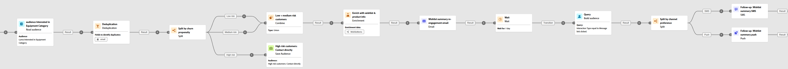{zoomable="yes"}

此行銷活動會鎖定瀏覽過練習裝置類別的客戶。 對象會依流失風險（某人停止參與或購買的可能性）進行重複資料刪除和分段。

高風險客戶會聚集到單獨的新受眾中，稍後用於特定通訊，而低和中等風險客戶則透過個人化電子郵件和後續追蹤進行多步驟歷程。

1. 首先，設定專門針對&#x200B;**願望清單重新參與**&#x200B;的新行銷活動。 這可確保您的訊息著重於已透過將產品儲存至願望清單而顯示購買意圖的客戶。

   {zoomable="yes"}

1. 填寫您的&#x200B;**[!UICONTROL 行銷活動設定]**，例如行銷活動名稱、說明、開始和結束日期以及相關標籤。

1. 新增&#x200B;**[!UICONTROL 讀取對象]**&#x200B;活動，以從Adobe Experience Platform中選取預先定義的對象，也就是在您網站上瀏覽過練習裝置類別的客戶。

   收件者是以從&#x200B;**[!UICONTROL 實體]**&#x200B;欄位中選取的電子郵件地址識別。

   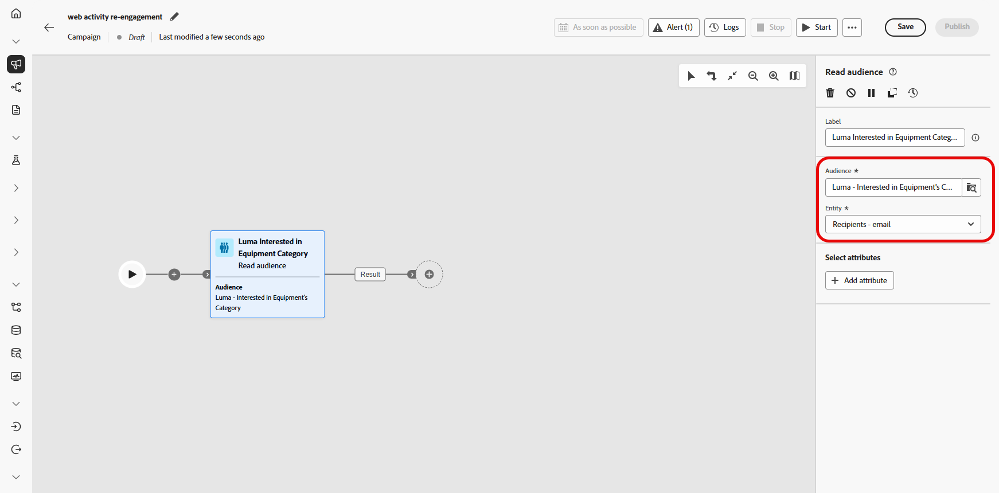{zoomable="yes"}

1. 新增&#x200B;**[!UICONTROL 重複資料刪除]**&#x200B;活動，從您的對象中移除重複的電子郵件地址，確保每個客戶只會收到一則訊息。

1. 按一下&#x200B;**[!UICONTROL 新增屬性]**，並選取電子郵件作為重複資料刪除的屬性。

   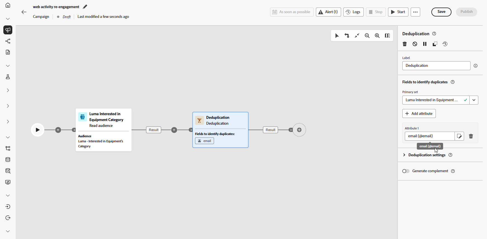{zoomable="yes"}

1. 接著，新增&#x200B;**[!UICONTROL 分割]**&#x200B;活動以依據客戶流失的可能性來劃分客戶，好讓您為每個客戶群組提供量身打造的個人化體驗。

   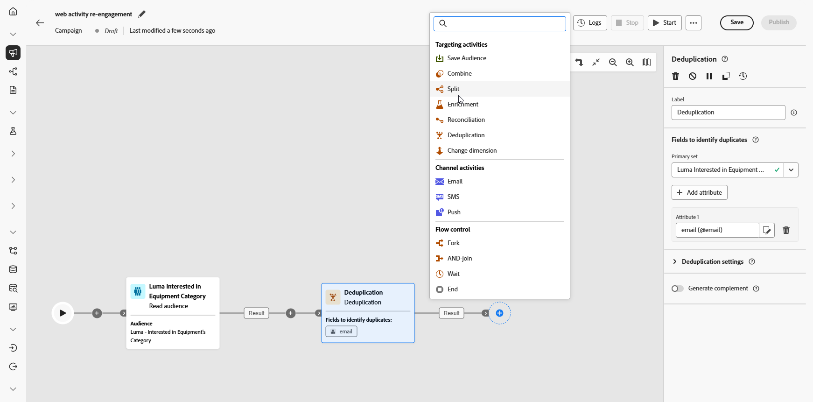{zoomable="yes"}

1. 按一下&#x200B;**[!UICONTROL 新增區段]**&#x200B;以建立三個群組：

   * 低風險

   * Medium風險

   * 高風險

   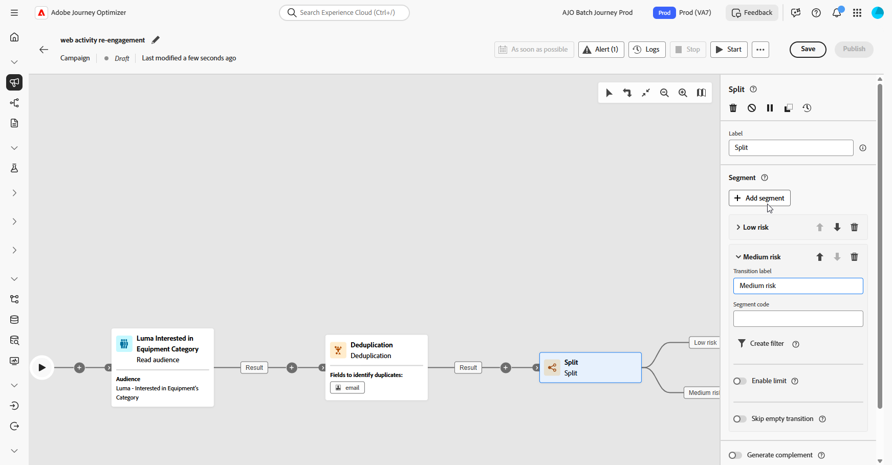{zoomable="yes"}

1. 按一下&#x200B;**[!UICONTROL 建立篩選器]**&#x200B;以定義每個群組的流失機率。

   使用&#x200B;**條件編輯器**&#x200B;來設定決定每個客戶流失風險的特定值。

   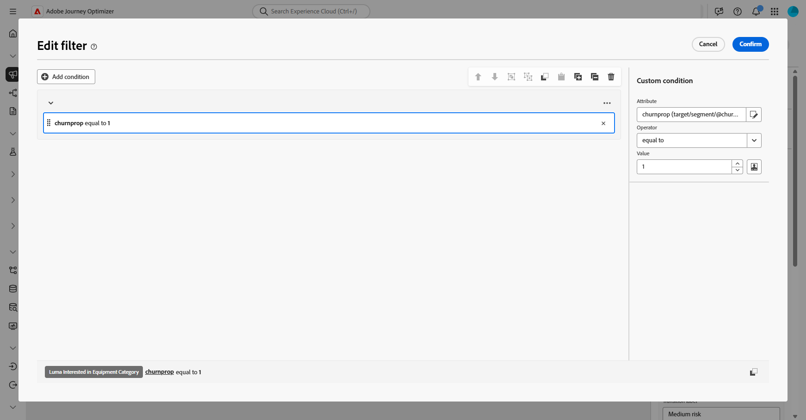{zoomable="yes"}

1. 每個區段的處理方式不同：

   * [低/中風險](#low-medium-risk)
   * [高風險](#high-risk)

1. 在您的行銷活動經過測試且準備就緒後，按一下「**[!UICONTROL 發佈]**」，讓行銷活動上線。

行銷活動執行後，探索報表控制面板以檢閱績效量度和關鍵深入分析。

➡️ [進一步瞭解報告](../reports/campaign-global-report-cja.md)

## 高風險區段 {#high-risk}

對於被視為具有高流失風險的客戶，請建立專用的受眾區段。 此對象稍後會用於個別的目標通訊。

1. 新增&#x200B;**[!UICONTROL 儲存對象]**。

   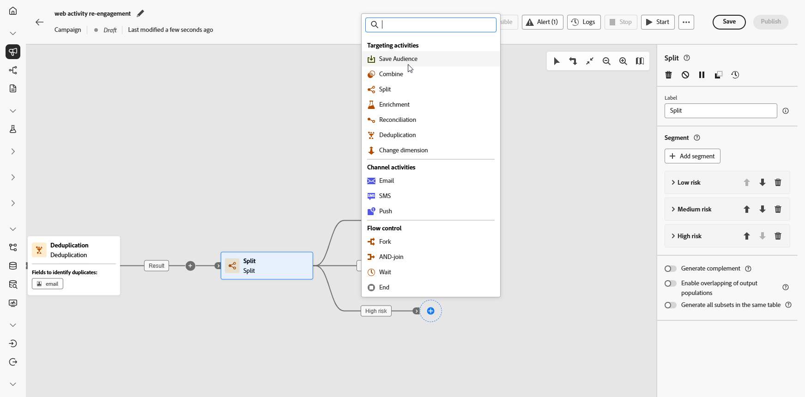{zoomable="yes"}

1. 將&#x200B;**[!UICONTROL 標籤]**&#x200B;新增至您的對象，並選擇&#x200B;**[!UICONTROL 設定檔對應欄位]**，此處&#x200B;**收件者 — 電子郵件**。

   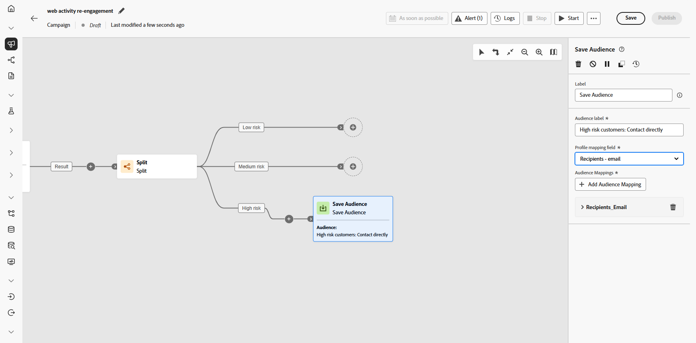{zoomable="yes"}

然後，此對象會儲存至Experience Cloud，以便稍後用於特定目標行銷活動。

## 低/中風險區段 {#low-medium-risk}

對於流失風險低和中等的客戶，設定旨在加強參與的多步驟行銷活動：

1. 結合低風險和Medium風險與&#x200B;**[!UICONTROL 聯合]**&#x200B;活動。

   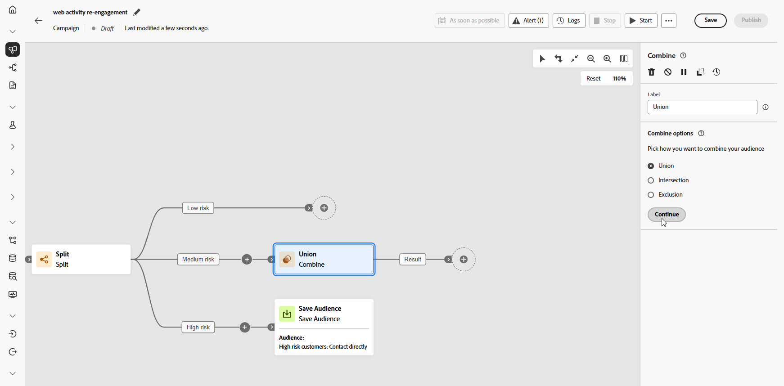{zoomable="yes"}

1. 新增&#x200B;**[!UICONTROL 擴充]**&#x200B;活動，以使用願望清單和產品資訊個人化行銷活動。

1. 按一下&#x200B;**[!UICONTROL 新增屬性]**&#x200B;以建立下列三個屬性：

   * `Wishlist > description`
   * `Wishlist > priceref`
   * `Wishlist > imageurl`

   這會透過詳細的願望清單資訊豐富訊息。

   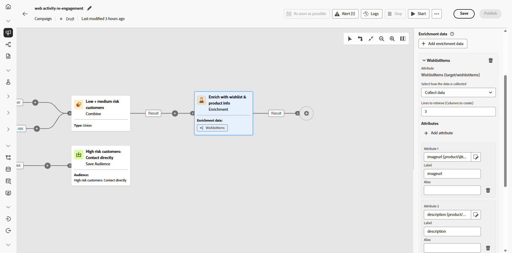{zoomable="yes"}

1. 根據對電子郵件的參與度，建立新的對象以用於重新目標定位。

   在此處，我們會根據電子郵件點選事件建立受眾，以重新鎖定與先前傳送之電子郵件互動的所有人員，更具體地說，是按一下該訊息中的連結。

   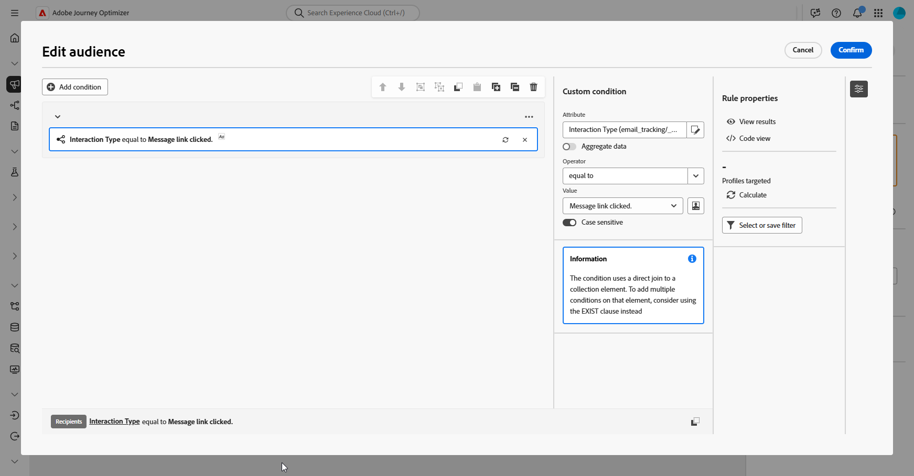{zoomable="yes"}

1. 平均分配參與度以透過SMS或推播通知傳送後續追蹤以鼓勵轉換。

   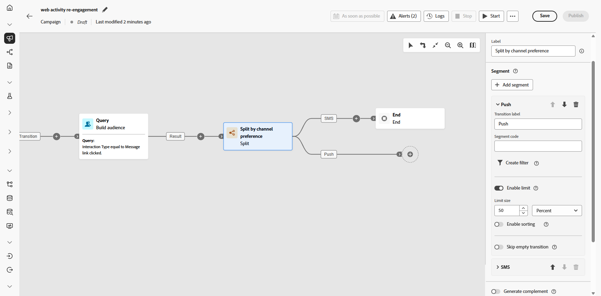{zoomable="yes"}

1. 為每個頻道建立訊息內容，包括設定檔屬性（例如收件者的名稱），以及擴充資料（例如願望清單專案），以個人化每封訊息。

   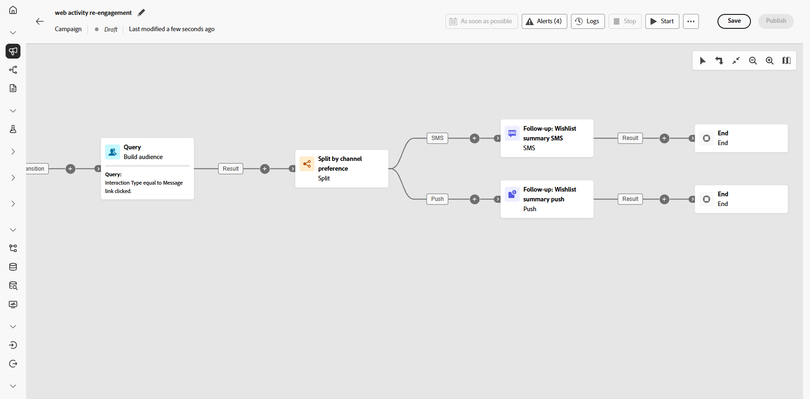{zoomable="yes"}
