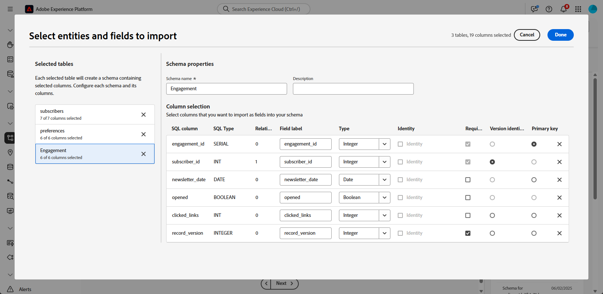
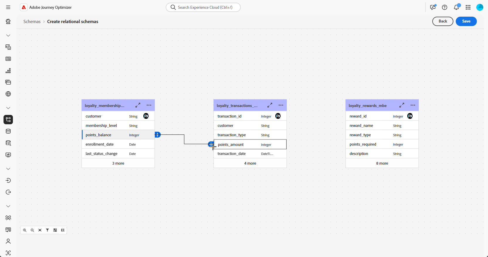
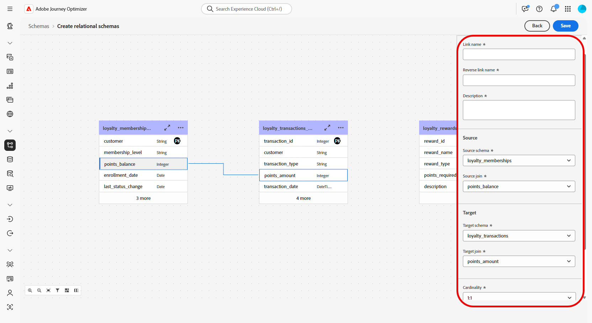
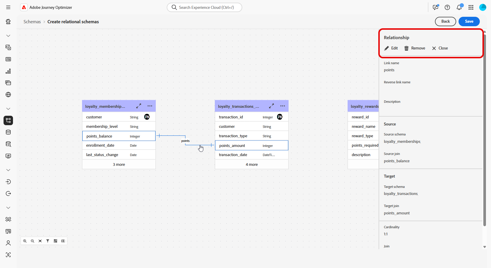
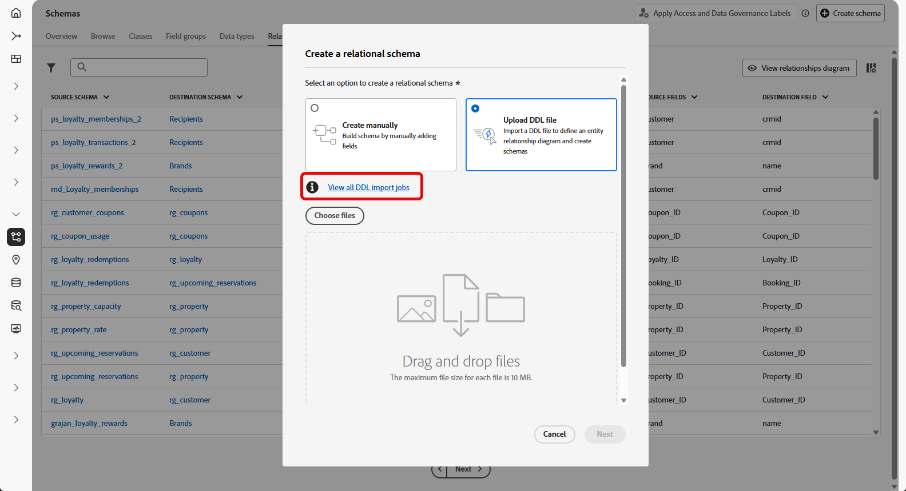
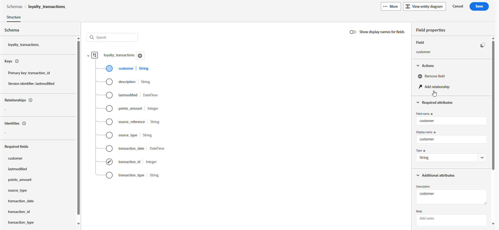
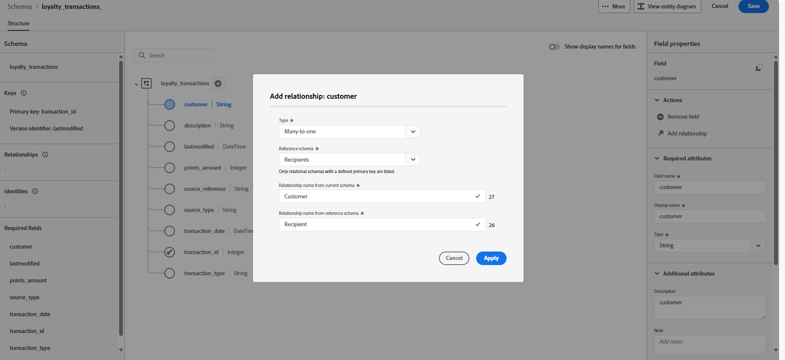
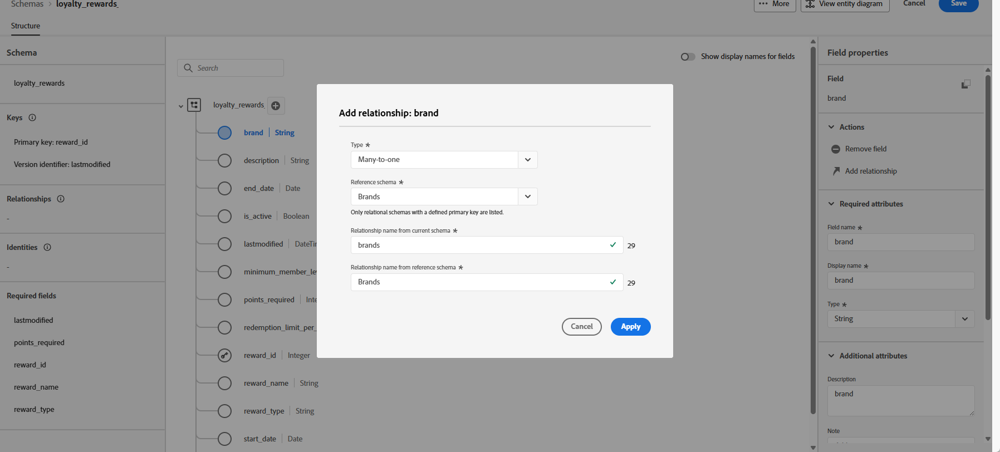

# 使用DDL檔案建立模型型方案 {#file-upload-schema}

透過建立結構描述（例如&#x200B;**忠誠會員資格**、**忠誠度交易**&#x200B;和&#x200B;**忠誠度獎勵**），定義協調行銷活動所需的模型型資料模型。 每個結構描述都必須包含主索引鍵、版本設定屬性以及適當的關聯性，以參照實體，例如&#x200B;**收件者**&#x200B;或&#x200B;**品牌**。

您可以透過介面手動建立結構描述，或使用DDL檔案大量匯入結構描述。

本節提供如何透過上傳DDL （資料定義語言）檔案在Adobe Experience Platform中建立模型架構的逐步指引。 使用 DDL 檔案，讓您可以預先定義資料模式的結構，包括表格、屬性、索引鍵和關係。

1. [上傳DDL檔案](#ddl-upload)以建立模型架構並定義其結構。

1. [定義資料模型中資料表之間的關係](#relationships)。

1. [連結結構描述](#link-schema)，以將您的模型型資料與現有的設定檔實體（例如收件者或品牌）連結。

1. 從支援的來源[將資料擷取到](ingest-data.md)您的資料集中。

➡️ [在Adobe Experience Platform檔案中進一步瞭解以模型為基礎的結構描述](https://experienceleague.adobe.com/zh-hant/docs/experience-platform/xdm/schema/model-based)

## 上傳DDL檔案{#ddl-upload}

透過上傳DDL檔案，您可以預先定義資料模型的結構，包括表格、屬性、索引鍵和關係。

支援以Excel為基礎的結構描述檔案上傳。 下載[提供的範本](assets/template.zip)以輕鬆準備您的結構描述定義。

+++在Adobe Experience Platform中建立模型架構時，支援下列功能

* **列舉**\
  以DDL為基礎和手動建立結構描述均支援ENUM欄位，可讓您使用一組固定的允許值來定義屬性。
其範例如下：

  ```
  CREATE TABLE orders (
  order_id     INT NOT NULL,
  product_id   INT NOT NULL,
  order_date   DATE NOT NULL,
  customer_id  INT NOT NULL,
  quantity     INT NOT NULL,
  order_status enum ('PENDING', 'SHIPPED', 'DELIVERED', 'CANCELLED'),
  PRIMARY KEY (order_id, product_id)
  );
  ```

* 資料控管的&#x200B;**結構描述標籤**\
  架構欄位層級支援標籤功能，可強制資料治理原則，例如存取控制和使用限制。 如需詳細資訊，請參閱[Adobe Experience Platform檔案](https://experienceleague.adobe.com/docs/experience-platform/xdm/home.html?lang=zh-Hant)。

+++

1. 登入Adobe Experience Platform。

1. 導覽至&#x200B;**資料管理** > **結構描述**&#x200B;功能表。

1. 按一下&#x200B;**建立結構描述**。

1. 選取&#x200B;**[!UICONTROL 以模型為基礎的]**&#x200B;作為您的&#x200B;**結構描述型別**。

   

1. 選取&#x200B;**[!UICONTROL 匯入 DDL 檔案]**，以便定義實體關係圖，同時建立結構描述。

   表格結構必須包含以下元素：
   * 至少一個主索引鍵。
   * 版本識別碼，例如`lastmodified`欄位類型`datetime`或`number`。
   * 針對變更資料擷取(CDC)擷取，為名為`_change_request_type`且型別為`String`的特殊欄，其指示資料變更的型別（例如，插入、更新、刪除）並啟用增量處理。
   * DDL檔案所定義的資料表不能超過200個。


   >[!IMPORTANT]
   >
   > 任何用於定位的結構描述都必須包含至少一個型別`String`的身分欄位，並具有相關聯的&#x200B;**身分名稱空間**。\
   >這可確保與Adobe Journey Optimizer的定位和身分解析功能相容。

1. 拖放 DDL 檔案，然後按一下&#x200B;**[!UICONTROL 下一步]**。

   請注意，支援的DDL檔案大小上限為10MB。

1. 輸入&#x200B;**[!UICONTROL 結構描述名稱]**。

1. 設定每個結構描述及其欄，確保已指定主索引鍵和版本描述項。

   必須將一個屬性（例如`lastmodified`）指定為版本描述項（型別`datetime`、`long`或`int`），以確保資料集以最新資料更新。 使用者可以變更版本描述項，一旦設定，該描述項就成為必要。 屬性不能同時是主索引鍵(PK)和版本描述項。

   

1. 將屬性標示為`identity`並將它對應到定義的身分名稱空間。

1. 重新命名、刪除或新增說明至每個表格。

1. 完成後，請按一下&#x200B;**[!UICONTROL 完成]**。

目前可以在畫布內，驗證表格和欄位定義。[請參閱下列章節深入了解](#entities)

## 定義關係 {#relationships}

建立架構時，您可以直接在DDL檔案中指定關係。 如果您偏好在檔案外部定義關係，可以在介面中依照下列步驟來定義。

1. 存取資料模式的畫布視圖，然後選擇您想連結的兩個表格

1. 按一下來源聯結旁的按鈕，然後拖放並導引箭頭朝向目標聯結，以便建立連線。

   >[!NOTE]
   >
   >如果在DDL檔案中定義複合金鑰，則支援複合金鑰。

   

1. 請填寫指定表單，以便定義連結，並在完成設定後，按一下&#x200B;**套用**。

   

   **基數**：

   * **1-N**：來源表格的單一發生次數可以擁有眾多目標表格對應的發生次數，但目標表格的單一發生次數，最多只可以擁有來源表格的單一對應發生次數。

   * **N-1**：目標表格的單一發生次數可以擁有眾多來源表格對應的發生次數，但來源表格單一發生次數，最多只可以擁有目標表格的單一對應發生次數。

   * **1-1**：來源表格的單一發生次數，最多可以擁有目標表格對應的單一發生次數。

1. 資料模式中定義的所有連結，全都會顯示在畫布視圖下方，會以箭頭表示。 請按一下兩個表格之間的箭頭，即可檢視詳細資訊，進行編輯，或可視需要移除連結。

   

1. 使用工具列，即可自訂、調整您的畫布。

   

   * **放大顯示**：放大畫布，即可更清楚地檢視資料模式的詳細資料。

   * **縮小顯示**：縮小畫布大小，以便廣泛地檢視您的資料模式。

   * **符合視圖**：調整縮放，即可符合可見區域中的所有結構描述。

   * **篩選器**：請選擇想要顯示在畫布中的結構描述。

   * **強制自動版面**：自動排列結構描述，以便以更好的方式組織內容。

   * **顯示地圖**：切換迷你地圖覆蓋，即可協助瀏覽大型或複雜的結構描述版面配置。

   * **全部展開/全部收合**：快速展開或收合所有結構描述節點，以顯示或隱藏其屬性。

   * **下載**：以.png檔案格式下載ER圖表。

1. 完成後，請按一下&#x200B;**儲存**。 此動作會建立結構描述、相關資料集，同時啟用資料集，即可用於協調行銷活動。

1. 請按一下&#x200B;**[!UICONTROL 開啟工作]**，以便監視建立工作的進度。 此流程可能需要幾分鐘的時間，全視 DDL 檔案中定義的表格數目而定。

   您也可以開啟&#x200B;**[!UICONTROL 上傳DDL檔案]**&#x200B;視窗並選取&#x200B;**[!UICONTROL 檢視所有DDL匯入工作]**，以存取您的DDL匯入工作。

   

## 連結結構描述 {#link-schema}

>[!IMPORTANT]
>
> 系統只會辨識DDL檔案中明確定義的關係。 任何存在於DDL檔案外部的實體關係都會被忽略且不處理。

請在&#x200B;**忠誠度交易**&#x200B;結構描述與&#x200B;**收件者**&#x200B;結構描述之間，建立關係，以便將每次交易和對的客戶記錄之間建立起關係。

1. 瀏覽至&#x200B;**[!UICONTROL 結構描述]**，開啟之前建立的&#x200B;**忠誠度交易**。

1. 按一下客戶&#x200B;**[!UICONTROL 欄位屬性]**&#x200B;中的&#x200B;**[!UICONTROL 新增關係]**。

   

1. 選取&#x200B;**[!UICONTROL 多對一]**&#x200B;作為關係&#x200B;**[!UICONTROL 類型]**。

1. 連結至現有的&#x200B;**收件者**&#x200B;結構描述。

   

1. 輸入來自&#x200B;**目前結構描述的關係名稱**&#x200B;[!UICONTROL &#x200B;以及&#x200B;]&#x200B;**來自參考結構描述的關係名稱**。

1. 按一下&#x200B;**[!UICONTROL 套用]**，以便儲存變更內容。

繼續建立&#x200B;**忠誠度獎勵**&#x200B;結構描述與&#x200B;**品牌**&#x200B;結構描述之間的關係，在每個獎勵輸入與合適品牌之間建立關聯。


