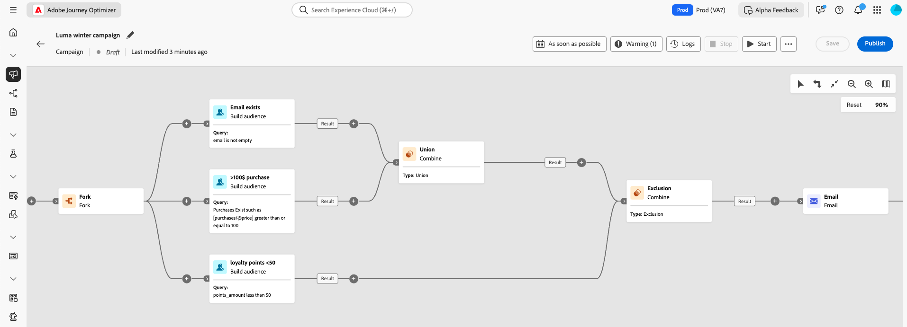
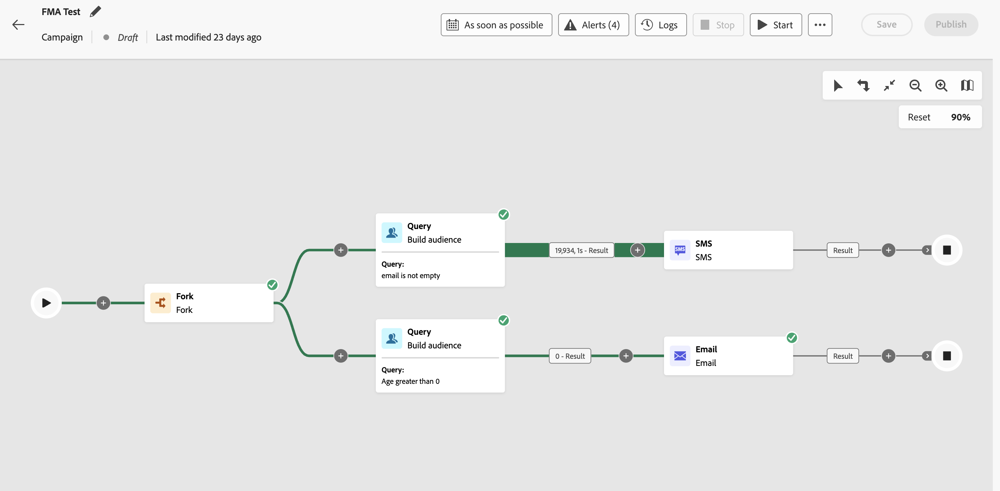

# 開始使用協調的行銷活動 {#orchestrated-camp}

>[!CONTEXTUALHELP]
>id="campaigns_overview_orchestrated"
>title="協調的行銷活動概觀"
>abstract="<b>行銷活動協調</b> 分割、合併、擴充及操作關聯式資料集來定義您的客群   <b>利用多實體資料</b> 了解協調式行銷活動如何利用關聯式資料集來擴充資料，以執行 Segmentation &amp; personalization  <b>臨時分段和精準計數</b> 利用精準計數逐步建置您的區段  <b>可用管道</b> 電子郵件、簡訊、推播通知、直接郵件"

[!DNL Adobe Journey Optimizer] 中的行銷活動協調可跨頻道支援品牌啟動的複雜行銷活動，協助您大規模提高參與度、收入和客戶忠誠度。

>[!IMPORTANT]
>
>若要存取行銷活動協調，您的授權必須包含 **Journey Optimizer - 行銷活動和歷程**&#x200B;或 **Journey Optimizer - 行銷活動**&#x200B;套件。請聯絡您的 Adobe 代表以確認您的授權並在需要時進行更新。

雖然跨頻道行銷至關重要，但協調的行銷活動可使其順暢無礙。透過視覺化的拖放介面，您可以跨多個頻道設計和自動化複雜的行銷工作流程，從細分到訊息傳遞。所有事情都在單個直觀環境中進行，專為速度、控制能力和效率而打造。

{zoomable="yes"}

## 核心功能

行銷活動協調的四大建立支柱如下：

<table style="table-layout:auto">
<tr style="border: 0;">
<td></a></td><td><b>隨選客群</b> 立即跨資料集查詢，以使用任何資料類型與維度的組合來建立客群細分群體。</td></tr>
<tr style="border: 0;">
<td></a></td><td><b>多實體細分和傳送</b> 超越以人員為基礎的行銷活動，可精準使用產品目錄、商店位置或服務資料等實體來鎖定目標。  
支援多層級傳送，其中每個輪廓和每個關聯的次要實體會傳送一封訊息。 這些次要實體可包括聯絡地址、預訂、訂閱、合約或其他連結的資料。 例如，這可讓行銷活動傳送至輪廓的所有已知地址，或為該輪廓相關聯的每個預訂傳送。</td></tr>
<tr style="border: 0;">
<td></a></td><td><b>預先傳送可見度與精確度</b> 在行銷活動推出前，取得精確的細分計數與完整的行銷活動範圍可確保精確度與可信度。</td></tr>
<tr style="border: 0;">
<td></a></td><td><b>多步驟行銷活動工作流程</b> 設計多步驟行銷活動，涵蓋每日訊息到複雜的行銷活動，例如季節性促銷活動或主要產品發佈。</td></tr>
</table>

## 協調的行銷活動與歷程

雖然「協調的行銷活動」視覺效果與歷程類似，但可以解決不同的用途與使用案例：

* **歷程** - 1 對 1 畫布，每個輪廓都以自己的步調在不同步驟中行進。 每個客戶的狀態會保留在其內容中，以觸發即時動作。

* **協調的行銷活動** - 與歷程不同，協調的行銷活動使用計算區段的批次畫布來運作。 可同時處理所有輪廓。

兩個畫布已針對各自的使用案例進行最佳化： 「歷程」畫布會發佈存留較長時間的歷程，而「行銷活動」畫布旨在反複和增量執行批次行銷活動。

## 協調的行銷活動內含哪些內容？ {#gs-ms-campaign-inside}

協調的行銷活動畫布代表應該發生的情況。其會說明要執行的各種任務以及任務如何連結在一起。

每個協調的行銷活動包含：

* **活動**：活動指要執行的任務。各種活動在圖表中會以圖示表示。每種活動都有特定屬性和所有活動共有的其他屬性。

  在協調的行銷活動圖表中，一個特定活動可以產生多個任務，特別是存在循環或週期性動作時。

* **轉變**：轉變會將來源活動連結到目標活動並定義其序列。

* **工作表**：工作表包含轉變攜帶的所有資訊。每個協調的行銷活動會使用多個工作表。在這些表格中傳達的資料可以用於整個協調行銷活動的生命週期。

## 一起來深入探討

由於您已經了解何謂協調的行銷活動，您現在可以深入了解這些文件章節，以開始使用該功能。

<table><tr style="border: 0; text-align: center;">
<td>

<a href="gs-campaign-creation.md"><strong>設定步驟</strong></a>

</td>
<td>

<a href="create-orchestrated-campaign.md"><strong>建立協調的行銷活動</strong>

</td>
<td>

<a href="activities/about-activities.md"><strong>使用活動</strong></a>

</td>
</tr></table>
