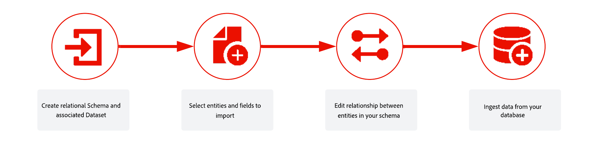

# 開始使用模型架構和資料集{#gs-schemas}

本指南會逐步引導您建立以模型為基礎的結構描述、設定用於協調行銷活動的資料集以及擷取資料。

{zoomable="yes"}

## 重要概念

在協調行銷活動的內容中，**資料集**&#x200B;是資料集合的儲存和管理結構，通常是包含結構描述（列）和欄位（欄）的表格。 成功擷取至Experience Platform的資料會以資料集的形式儲存在資料湖中。

**結構描述**&#x200B;代表並驗證資料的結構和格式。它提供真實世界物件（例如人）的抽象定義，並概述物件的每個例項中應包含哪些資料（例如名稱、生日等）。

**資料模型**&#x200B;是標準化資料的概念藍圖

它說明：

* 實體（例如客戶、行銷活動、區段）
* 這些實體的屬性（例如，客戶名稱、促銷活動開始日期）
* 實體之間的關係（例如，客戶屬於區段，行銷活動目標區段）

資料模型是邏輯和概念性的，不會與協調行銷活動中的實體實作繫結

在&#x200B;**以模型為基礎的資料模型**&#x200B;中，資料會整理成與其他資料表相關的資料表。

* 每個表格都有列（記錄）和欄（屬性）
* 每個表格都有一個主索引鍵來唯一識別列
* 資料表之間的關係是使用外部索引鍵來表示

**模型型結構描述**&#x200B;是模型型資料模型的正式定義。

它會指定：

* 表格集
* 每個表格中的欄
* 限制
* 跨資料表的關係

在以模型為基礎的資料模型中組織結構描述或表格，就是將資料結構化成多個表格。 確保每個表格儲存一種實體/結構描述型別

➡️ [在Adobe Experience Platform檔案中進一步瞭解結構描述](https://experienceleague.adobe.com/zh-hant/docs/experience-platform/xdm/ui/resources/schemas#create-model-based-schema)

## 實施步驟 {#implementation}

若要內嵌資料並建立以模型為基礎的結構描述，請遵循下列步驟：

1. 使用DDL檔案[手動建立](manual-schema.md)模型架構[或](file-upload-schema.md)

   定義資料模型的結構，包括表格、屬性和關係。 選擇在使用者介面中手動建置綱要，或上傳DDL檔案以加快設定。

   手動建立結構時，也必須手動建立及啟用資料集。 使用DDL檔案時，資料集的建立和啟用是自動的。

1. [連結結構描述](file-upload-schema.md)

   在您的結構描述之間建立關係，以確保資料一致性並啟用跨實體查詢。 例如，將熟客方案交易連結至收件者，或將獎勵連結至品牌。

1. [建立資料集](manual-schema.md#dataset)

   定義結構描述後，您需要根據它建立資料集。 此資料集可當作您擷取資料的儲存空間。

1. [啟用協調的行銷活動](manual-schema.md#enable)

   資料集會儲存您擷取的資料，且必須啟用「協調的行銷活動」，以確保您可在Adobe Journey Optimizer中存取這些資料。

1. [擷取資料](ingest-data.md)

   將資料從支援的來源（例如SFTP、雲端儲存空間或資料庫）匯入Adobe Experience Platform。

