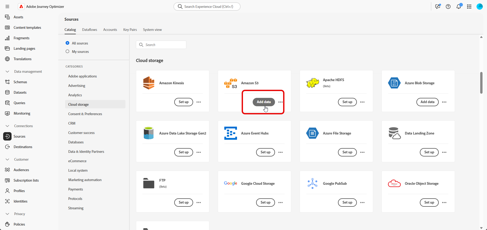
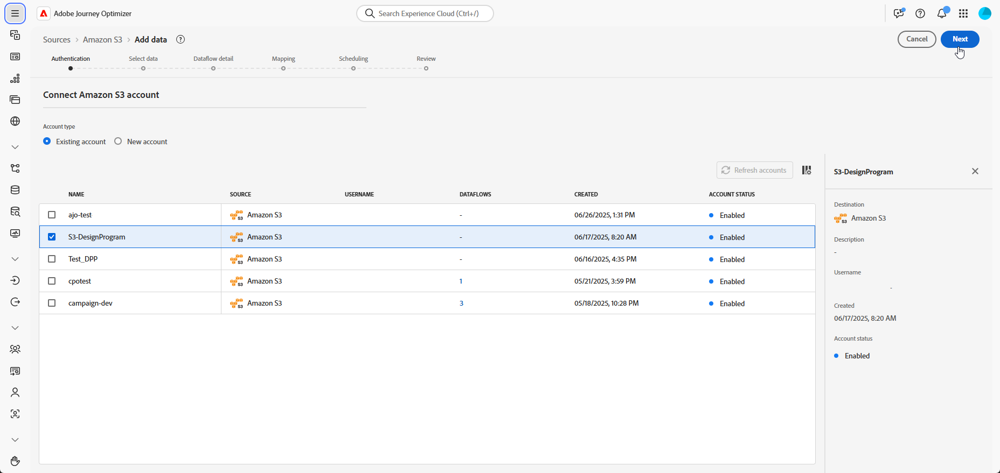
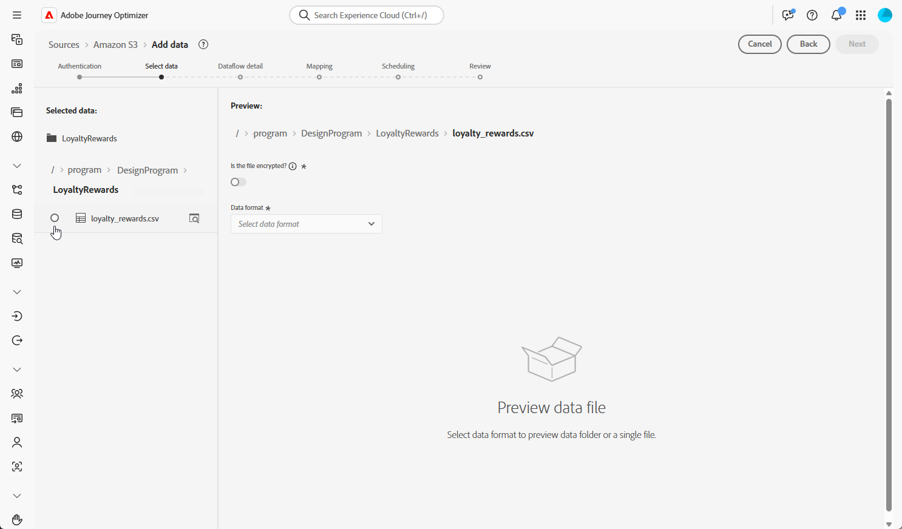
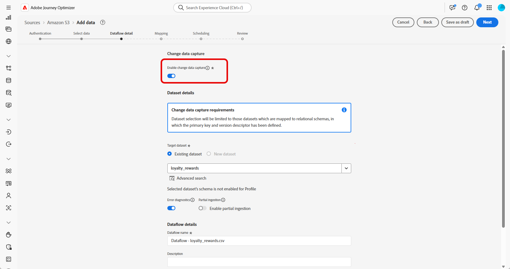
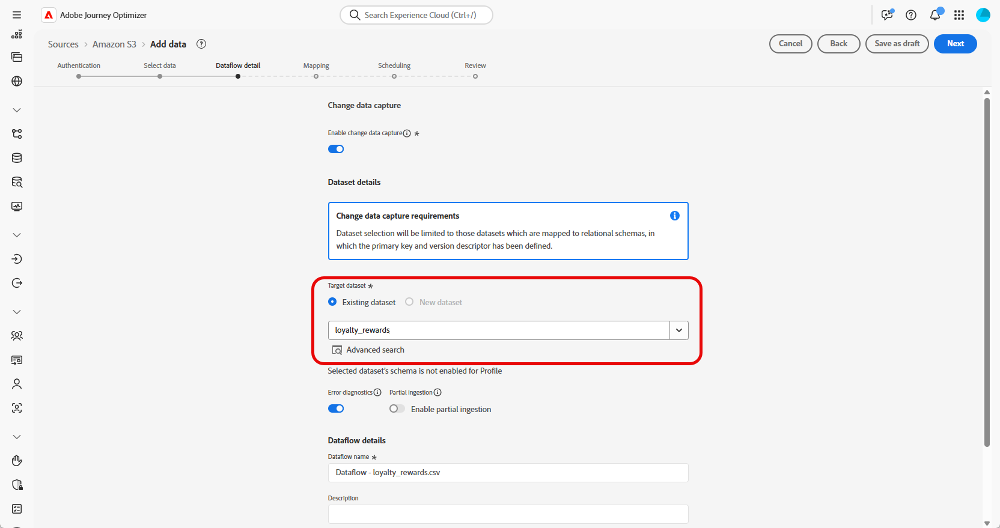
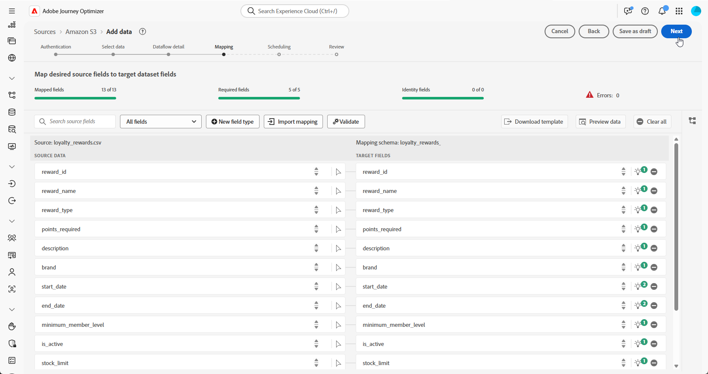
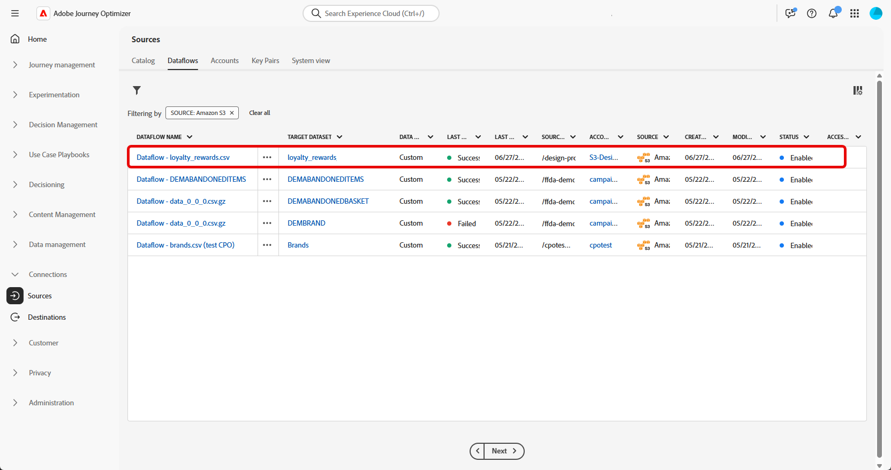

# 擷取資料 {#ingest-data}

>[!IMPORTANT]
>
>若要變更資料集的資料來源，您必須先刪除現有的資料流，才能建立參照相同資料集和新來源的新資料流。
>
>Adobe Experience Platform在資料流和資料集之間實施嚴格的一對一關係。 這可讓您維持來源與資料集之間的同步，以取得精確的增量擷取。

Adobe Experience Platform 讓您可以從外部來源擷取資料，同時可以使用 Experience Platform 服務來建立、加標籤，同時強化傳入資料。 您可以從多種來源 (如 Adobe 應用程式、雲端型儲存空間、資料庫和其他許多來源) 擷取資料。 

資料集是資料集合的儲存和管理結構，通常是包含方案 (欄) 和欄位 (列) 的表格。 成功擷取至Experience Platform的資料會以資料集的形式儲存在資料湖中。

## 協調行銷活動的支援來源 {#supported}

下列來源支援搭配協調行銷活動使用：

<table>
  <thead>
    <tr>
      <th>類型</th>
      <th>來源</th>
    </tr>
  </thead>
  <tbody>
    <tr>
      <td rowspan="3">雲端儲存空間</td>
      <td><a href="https://experienceleague.adobe.com/en/docs/experience-platform/sources/ui-tutorials/create/cloud-storage/s3">Amazon S3</a></td>
    </tr>
    <tr>
      <td><a href="https://experienceleague.adobe.com/en/docs/experience-platform/sources/ui-tutorials/create/cloud-storage/google-cloud-storage">Google Cloud Storage</a></td>
    </tr>
    <tr>
      <td><a href="https://experienceleague.adobe.com/en/docs/experience-platform/sources/ui-tutorials/create/cloud-storage/sftp">SFTP</a></td>
    </tr>
      <td rowspan="4">雲端資料倉儲</td>
      <td><a href="https://experienceleague.adobe.com/en/docs/experience-platform/sources/ui-tutorials/create/databases/snowflake">Snowflake</a></td>
    </tr>
    <tr>
      <td><a href="https://experienceleague.adobe.com/en/docs/experience-platform/sources/ui-tutorials/create/databases/bigquery">Google BigQuery</a></td>
    </tr>
    <tr>
      <td><a href="https://experienceleague.adobe.com/en/docs/experience-platform/sources/ui-tutorials/create/cloud-storage/data-landing-zone">資料登陸區域<a></td>
    </tr>
    <tr>
      <td><a href="https://experienceleague.adobe.com/en/docs/experience-platform/sources/ui-tutorials/create/databases/databricks">Azure Databricks</a></td>
    </tr>
    <tr>
      <td rowspan="3">檔案式上傳</td>
      <td><a href="https://experienceleague.adobe.com/en/docs/experience-platform/sources/ui-tutorials/create/local-system/local-file-upload">本機檔案上傳<a></td>
    </tr>

</tbody>
</table>

## 關聯式結構描述資料衛生的准則 {#cdc}

對於啟用&#x200B;**[!UICONTROL 變更資料擷取]**&#x200B;的資料集，所有資料變更（包括刪除）都會自動從來源系統映象到Adobe Experience Platform。

由於Adobe Journey Optimizer行銷活動要求所有已上線的資料集都必須透過&#x200B;**[!UICONTROL 變更資料擷取]**&#x200B;啟用，因此客戶有責任管理來源處的刪除工作。 從來源系統刪除的任何記錄都會自動從Adobe Experience Platform中的對應資料集中移除。

若要透過檔案式擷取刪除記錄，客戶的資料檔案應使用`D`欄位中的`Change Request Type`值來標示記錄。 這表示應在Adobe Experience Platform中刪除記錄，映象來源系統。

如果客戶只想從Adobe Experience Platform中刪除記錄，而不想影響原始來源資料，則可使用下列選項：

* 變更資料擷取復寫的&#x200B;**Proxy或淨化資料表**

  客戶可以建立Proxy或淨化來源表格，以控制要將哪些記錄複製到Adobe Experience Platform。 然後，即可從此中介表格中選擇性地管理刪除。

* **透過資料Distiller刪除**

  如果授權，**資料Distiller**&#x200B;可用於直接在Adobe Experience Platform中支援刪除作業，不受來源系統影響。

  [進一步瞭解資料Distiller](https://experienceleague.adobe.com/en/docs/experience-platform/query/data-distiller/overview)

## 設定資料流

此範例示範如何設定將結構化資料擷取至Adobe Experience Platform的資料流程。 設定的資料流程支援自動化、排程擷取，並可啟用即時更新。

1. 請從&#x200B;**[!UICONTROL 連線]**&#x200B;選單那邊，存取&#x200B;**[!UICONTROL 來源]**&#x200B;選單。

1. 根據[協調行銷活動的支援來源](#supported)選擇您的來源。

   

1. 如果您選擇雲端型來源，請連線您的雲端儲存空間或Google雲端儲存空間帳戶。

   

1. 選擇要擷取至Adobe Experience Platform的資料。

   

1. 從&#x200B;**[!UICONTROL 資料集詳細資料]**&#x200B;頁面，勾選&#x200B;**[!UICONTROL 啟用變更資料擷取]**，以僅顯示對應到關聯式結構描述並包含主索引鍵和版本描述項的資料集。

[進一步瞭解關聯式結構描述資料衛生的准則](#cdc)

   >[!IMPORTANT]
   >
   > 僅針對&#x200B;**檔案型來源**，資料檔案中的每一列都必須包含值為`_change_request_type` (upsert)或`U` (delete)的`D`欄。 若沒有此欄，系統不會將資料識別為支援變更追蹤，且不會出現「協調的行銷活動」切換，導致資料集無法選取以進行目標定位。

   

1. 選取您先前建立的資料集，然後按一下&#x200B;**[!UICONTROL 下一步]**。

   

1. 如果您只使用檔案型來源，請從&#x200B;**[!UICONTROL 選取資料]**&#x200B;視窗，上傳本機檔案並預覽其結構和內容。

   請注意，支援的大小上限為100MB。

1. 在&#x200B;**[!UICONTROL 對應]**&#x200B;視窗中，確認每個來源檔案屬性與目標結構描述中的對應欄位正確對應。 [進一步瞭解目標維度](target-dimension.md)。

   完成後，請按一下&#x200B;**[!UICONTROL 下一步]**。

   

1. 請根據想要的頻率，設定資料流量的&#x200B;**[!UICONTROL 排程]**。

1. 按一下&#x200B;**[!UICONTROL 完成]**，以便建立資料流一般會根據定義的排程自動執行。

1. 從&#x200B;**[!UICONTROL 連線]**&#x200B;選單中，選取&#x200B;**[!UICONTROL 來源]**&#x200B;並存取&#x200B;**[!UICONTROL 資料流]**&#x200B;索引標籤，以追蹤流量執行、檢閱擷取的記錄，以及疑難排解任何錯誤。

   

