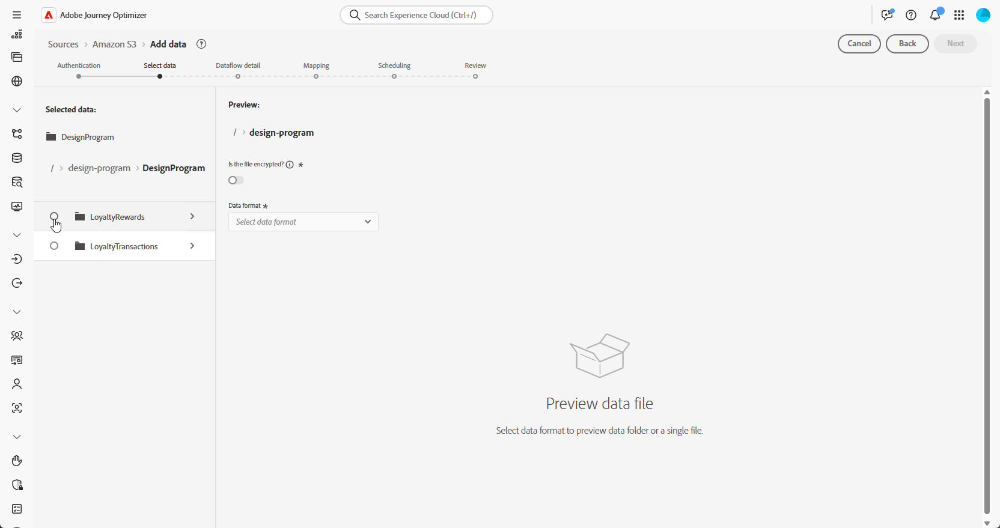

# 擷取資料 {#ingest-data}

+++ 目錄

| 歡迎使用協調的行銷活動 | 首次建立協調的行銷活動 | 查詢資料庫 | 協調的行銷活動 |
|---|---|---|---|
| [開始使用協調的行銷活動](gs-orchestrated-campaigns.md)  建立和管理關聯式結構描述和資料集  <ul><li>[手動結構描述](manual-schema.md)</li><li>[檔案上傳結構描述](file-upload-schema.md)</li><li>[擷取資料](ingest-data.md)</li></ul>  [存取及管理協調的行銷活動](access-manage-orchestrated-campaigns.md)  [建立協調行銷活動的重要步驟](gs-campaign-creation.md) | [建立並排程行銷活動](create-orchestrated-campaign.md)  [協調活動](orchestrate-activities.md)  [開始並監視行銷活動](start-monitor-campaigns.md)  [報告](reporting-campaigns.md) | [使用規則產生器](orchestrated-rule-builder.md)  [建立您的第一個查詢](build-query.md)  [編輯運算式](edit-expressions.md)  [重新鎖定目標](retarget.md) | [開始使用活動](activities/about-activities.md)  活動： [並加入](activities/and-join.md) - [建立對象](activities/build-audience.md) - [變更維度](activities/change-dimension.md) - [頻道活動](activities/channels.md) - [合併](activities/combine.md) - [重複資料刪除](activities/deduplication.md) - [擴充](activities/enrichment.md) - [分支](activities/fork.md) - [調解](activities/reconciliation.md) - [儲存對象](activities/save-audience.md) - [分割](activities/split.md) - [等待](activities/wait.md) |

{style="table-layout:fixed"}

+++

 

>[!BEGINSHADEBOX]

此頁面上的內容不是最終內容，可能會有變動。

>[!ENDSHADEBOX]

## 使用雲端儲存空間 {#ingest}

<!--
>[!IMPORTANT]
>
>Each dataset in Adobe Experience Platform supports only one active dataflow at a time. For detailed setup guidance on how to switch data sources, refer to this [section](#cdc-ingestion).
-->

Adobe Experience Platform可讓您從外部來源擷取資料，同時使用Experience Platform服務來建構、加標籤及增強傳入資料。 您可以從多種來源 (如 Adobe 應用程式、雲端型的儲存空間、資料庫和其他許多來源) 內嵌資料。 

1. 從&#x200B;**[!UICONTROL 連線]**&#x200B;功能表，存取&#x200B;**[!UICONTROL 來源]**&#x200B;功能表。

1. 選取&#x200B;**[!UICONTROL 雲端儲存空間]**&#x200B;類別，然後選取Amazon S3，並按一下&#x200B;**[!UICONTROL 新增資料]**。

   

1. 連線您的S3帳戶：

   * 使用現有帳戶

   * 使用新帳戶

   [在Adobe Experience Platform檔案中進一步瞭解](https://experienceleague.adobe.com/en/docs/experience-platform/destinations/catalog/cloud-storage/amazon-s3#connect)

   

1. 選擇您的資料夾&#x200B;**[!UICONTROL 資料格式]**、**[!UICONTROL 分隔符號]**&#x200B;和&#x200B;**[!UICONTROL 壓縮型別]**。

1. 瀏覽連線的S3來源，直到您找到先前建立的兩個資料夾，即&#x200B;**熟客獎勵**&#x200B;和&#x200B;**熟客交易**。

1. 選取包含您資料的資料夾。

   選取資料夾可確保自動處理所有具有相同結構的目前和未來檔案。 然而，選取單一檔案則需要手動上傳每個新的資料增量。

   

1. 選擇您的資料夾&#x200B;**[!UICONTROL 資料格式]**、**[!UICONTROL 分隔符號]**&#x200B;和&#x200B;**[!UICONTROL 壓縮型別]**。 檢閱您的範例資料是否準確，然後按[下一步] ****。

   

1. 核取&#x200B;**[!UICONTROL 啟用變更資料擷取]**，以從對應至關聯式結構描述且已定義主索引鍵和版本描述項的資料集中選取。

1. 選取您[先前建立的資料集](#entities)，然後按一下&#x200B;**[!UICONTROL 下一步]**。

   

1. 在&#x200B;**[!UICONTROL 對應]**&#x200B;視窗中，確認每個來源檔案屬性與目標結構描述中的對應欄位正確對應。

   完成後，按一下&#x200B;**[!UICONTROL 下一步]**。

   

1. 根據您想要的頻率設定資料流程&#x200B;**[!UICONTROL 排程]**。

1. 按一下&#x200B;**[!UICONTROL 完成]**&#x200B;以建立資料流程。 它會根據定義的排程自動執行。

1. 從&#x200B;**[!UICONTROL 連線]**&#x200B;功能表中，選取&#x200B;**[!UICONTROL 來源]**&#x200B;並存取&#x200B;**[!UICONTROL 資料流程]**&#x200B;索引標籤，以追蹤流程執行、檢閱擷取的記錄，以及疑難排解任何錯誤。

   

<!--### Setting Up Change data capture ingestion {#cdc-ingestion}

If you need to change the data source, you must delete the existing dataflow and create a new one pointing to the same dataset with the new source.

When using Change Data Capture (CDC), it is essential that the source and dataset remain in sync to ensure accurate incremental updates. Follow the steps below:

1. **Schema Requirements**
   - Your schema must include:
     - A **primary key** (e.g., `transaction_id`)
     - A **versioning field** (e.g., `lastmodified` or an incrementing `version_id`)
   - Enable the dataset for **Orchestrated Campaigns** if needed.

2. **CDC Dataflow Setup**
   - During dataflow creation, after choosing your source and files:
     - **Enable the CDC option**
     - Select your CDC-ready dataset
     - Confirm field mappings (especially version field)

3. **Keep Source and Target in Sync**
   - The source system must consistently update the version field so the platform can detect changes accurately.

Once set up, the platform will automatically ingest **only changed or new records** each time the flow runs.
-->