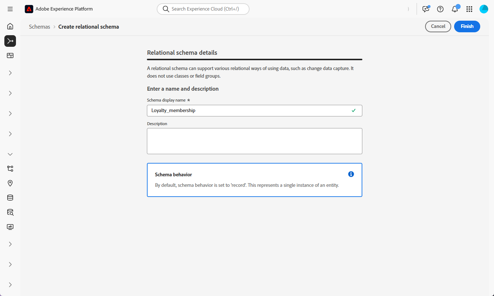
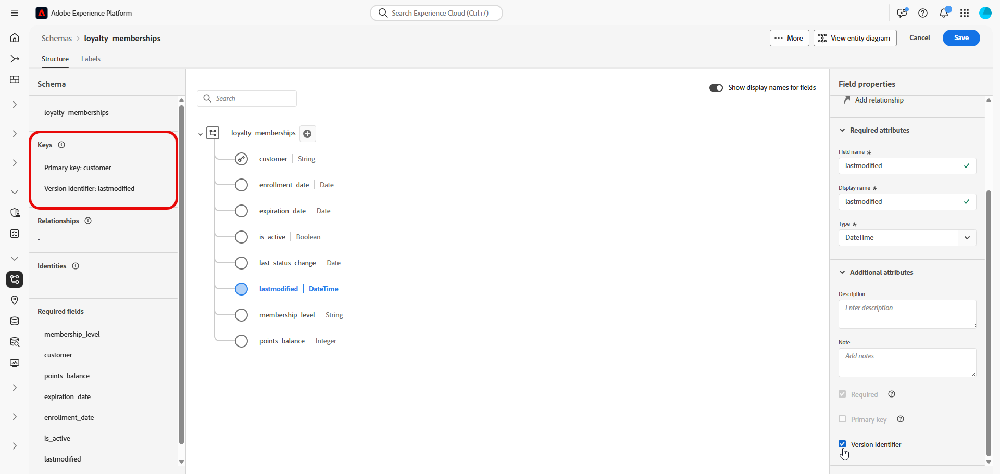
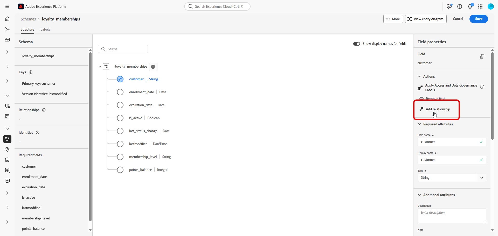
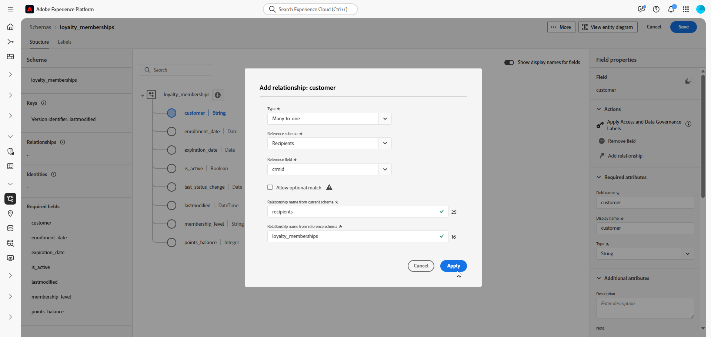
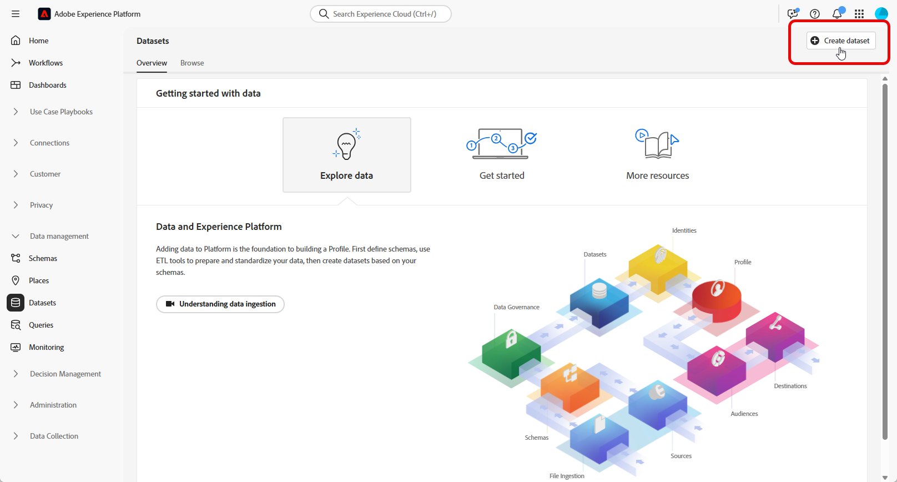
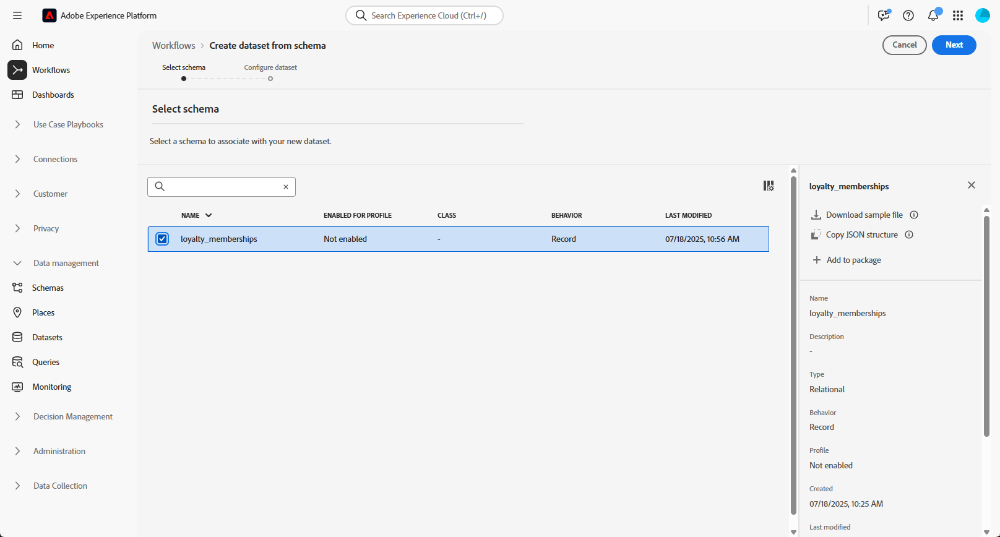
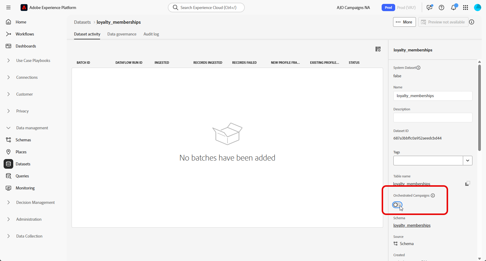

# 設定手動模型架構 {#manual-schema}

可以直接透過使用者介面建立以模型為基礎的結構描述，以啟用屬性、主索引鍵、版本設定欄位和關係的詳細設定。

下列範例手動定義&#x200B;**忠誠會員資格**&#x200B;結構描述，以說明協調行銷活動的必要結構。

1. [使用Adobe Experience Platform介面手動建立模型型結構描述](#schema)。

1. [新增屬性](#schema-attributes)，例如客戶ID、成員資格等級和狀態列位。

1. [將您的結構描述](#link-schema)連結至內建結構描述，例如行銷活動定位的收件者。

1. [根據您的結構描述建立資料集](#dataset)，並將其啟用以用於協調的行銷活動。

1. 從支援的來源[將資料擷取到](ingest-data.md)您的資料集中。

➡️ [在Adobe Experience Platform檔案中進一步瞭解手動以模型為基礎的結構描述](https://experienceleague.adobe.com/zh-hant/docs/experience-platform/xdm/ui/resources/schemas#create-manually)

## 建立您的結構描述 {#schema}

首先，在Adobe Experience Platform中手動建立新的模型型結構描述。 此程式可讓您從頭開始定義結構描述結構，包括其名稱和行為。

1. 登入Adobe Experience Platform。

1. 導覽至&#x200B;**[!UICONTROL 資料管理]** > **[!UICONTROL 結構描述]**&#x200B;功能表。

1. 按一下&#x200B;**[!UICONTROL 建立結構描述]**。

1. 選取&#x200B;**[!UICONTROL 以模型為基礎的]**&#x200B;作為您的&#x200B;**結構描述型別**。

   {zoomable="yes"}

1. 選擇&#x200B;**[!UICONTROL 手動建立]**，以手動新增欄位來建置結構描述。

1. 輸入您的&#x200B;**[!UICONTROL 結構描述顯示名稱]**。

   {zoomable="yes"}

1. 按一下&#x200B;**完成**&#x200B;以繼續您的結構描述建立。

您現在可以開始將屬性新增到結構描述以定義其結構。

## 將屬性新增到結構描述 {#schema-attributes}

接下來，新增屬性以定義結構描述的結構。 這些欄位代表協調行銷活動中使用的關鍵資料點，例如客戶識別碼、成員資格詳細資料和活動日期。 精確地定義它們可確保可靠的個人化、細分和追蹤。

任何用於定位的結構描述都必須包含至少一個型別`String`的身分欄位，並具有相關聯的身分名稱空間。 這可確保與Adobe Journey Optimizer的定位和身分解析功能相容。

+++在Adobe Experience Platform中建立模型架構時，支援下列功能

* **列舉**\
  以DDL為基礎和手動建立結構描述均支援ENUM欄位，可讓您使用一組固定的允許值來定義屬性。

* 資料控管的&#x200B;**結構描述標籤**\
  架構欄位層級支援標籤功能，可強制資料治理原則，例如存取控制和使用限制。 如需詳細資訊，請參閱[Adobe Experience Platform檔案](https://experienceleague.adobe.com/docs/experience-platform/xdm/home.html?lang=zh-Hant)。

* **複合索引鍵**\
  以模型為基礎的結構描述定義支援複合主索引鍵，可一起使用多個欄位以唯一識別記錄。

+++

1. 在畫布中，按一下結構描述名稱&#x200B;**旁的**&#x200B;以開始新增屬性。

   {zoomable="yes"}

1. 輸入您的屬性&#x200B;**[!UICONTROL 欄位名稱]**、**[!UICONTROL 顯示名稱]**&#x200B;和&#x200B;**[!UICONTROL 型別]**。

   在此範例中，我們已將下表詳述的屬性新增至&#x200B;**忠誠會員資格**&#x200B;結構描述。

   +++ 屬性範例

   | 屬性名稱 | 資料類型 | 其他屬性 |
   |-|-|-|
   | 客戶 | STRING | 主索引鍵 |
   | membership_level | STRING | 必要 |
   | points_balance | 整數 | 必要 |
   | enrollment_date | 日期 | 必要 |
   | last_status_change | 日期 | 必要 |
   | expiration_date | 日期 | - |
   | is_active | 布林值 | 必要 |
   | lastmodified | 日期時間 | 必要 |

   +++ 

1. 將適當的欄位指派為&#x200B;**[!UICONTROL 主索引鍵]**&#x200B;和&#x200B;**[!UICONTROL 版本描述項]**。

   建立手動結構描述時，請確定包括下列重要欄位：

   * 至少有單一主索引鍵
   * 版本識別碼，例如`lastmodified`欄位類型`datetime`或`number`。
   * 針對變更資料擷取(CDC)擷取，為名為`_change_request_type`且型別為`String`的特殊欄，其指示資料變更的型別（例如，插入、更新、刪除）並啟用增量處理。 請注意，`_change_request_type`不應該是資料表結構描述的一部分，應該只在內嵌期間新增到資料檔案。

   {zoomable="yes"}

1. 按一下&#x200B;**[!UICONTROL 儲存]**。

建立並儲存屬性後，您可以定義關係，將綱要與其他關聯式綱要連結。

➡️ [在Adobe Experience Platform檔案中進一步瞭解關聯式結構描述](https://experienceleague.adobe.com/zh-hant/docs/experience-platform/xdm/schema/relational#how-relational-schemas-differ-from-standard-xdm-schemas)

## 連結結構描述 {#link-schema}

在兩個結構描述之間建立關係，可讓您使用主要設定檔結構描述以外的資料來增強協調的行銷活動。

1. 從您新建立的結構描述中，選取要做為連結使用的屬性，然後按一下&#x200B;**[!UICONTROL 新增關係]**。

   {zoomable="yes"}

1. 選擇&#x200B;**[!UICONTROL 參考結構描述]**&#x200B;和&#x200B;**[!UICONTROL 參考欄位]**&#x200B;以建立關係。

   在此範例中，`customer`屬性連結至`recipients`結構描述。

   {zoomable="yes"}

1. 輸入目前結構描述和參照結構描述中的關係名稱。

1. 設定後，按一下&#x200B;**[!UICONTROL 套用]**。

## 為結構描述建立資料集 {#dataset}

定義結構描述後，您現在可以根據它建立資料集。 資料集會儲存您擷取的資料，且必須啟用，才能存取協調的行銷活動。

1. 導覽至&#x200B;**[!UICONTROL 資料管理]** > **[!UICONTROL 資料集]**&#x200B;功能表，然後按一下&#x200B;**[!UICONTROL 建立資料集]**。

   {zoomable="yes"}

1. 選取&#x200B;**[!UICONTROL 從結構描述]**&#x200B;建立資料集。

1. 選擇您先前建立的結構描述（在此&#x200B;**忠誠度會員資格**），然後按一下&#x200B;**[!UICONTROL 下一步]**。

   {zoomable="yes"}

1. 輸入您&#x200B;**[!UICONTROL 資料集]**&#x200B;的&#x200B;**[!UICONTROL 名稱]**，然後按一下&#x200B;**[!UICONTROL 完成]**。

您現在需要啟用協調行銷活動的資料集。

## 為協調的行銷活動啟用資料集 {#enable}

>[!CONTEXTUALHELP]
>id="ajo_oc_enable_dataset_for_oc"
>title="協調的行銷活動"
>abstract="建立資料集後，您需要明確地為協調的行銷活動啟用它。 此步驟會確保您的資料集可用於Adobe Journey Optimizer中的即時協調與個人化。"

建立資料集後，您需要明確地為協調的行銷活動啟用它。 此步驟會確保您的資料集可用於Adobe Journey Optimizer中的即時協調與個人化。

請參閱[Adobe Developer檔案](https://developer.adobe.com/journey-optimizer-apis/references/orchestrated-campaign-dataset/#tag/DatasetEnablement)，驗證或啟用資料集上的「協調的行銷活動延伸」。

1. 在&#x200B;**[!UICONTROL 資料集]**&#x200B;清單中找出您的資料集。

1. 從&#x200B;**[!UICONTROL 資料集]**&#x200B;設定中，啟用&#x200B;**協調行銷活動**&#x200B;選項，以標籤資料集可在您的協調行銷活動中使用。

   {zoomable="yes"}

1. 請稍候幾分鐘，讓啟用程式完成。 請注意，只有在完全啟用此設定後，才能擷取資料及使用行銷活動。

您現在可以使用您選擇的來源，開始將資料擷取到您的結構描述中。

➡️ [瞭解如何內嵌資料](ingest-data.md)
