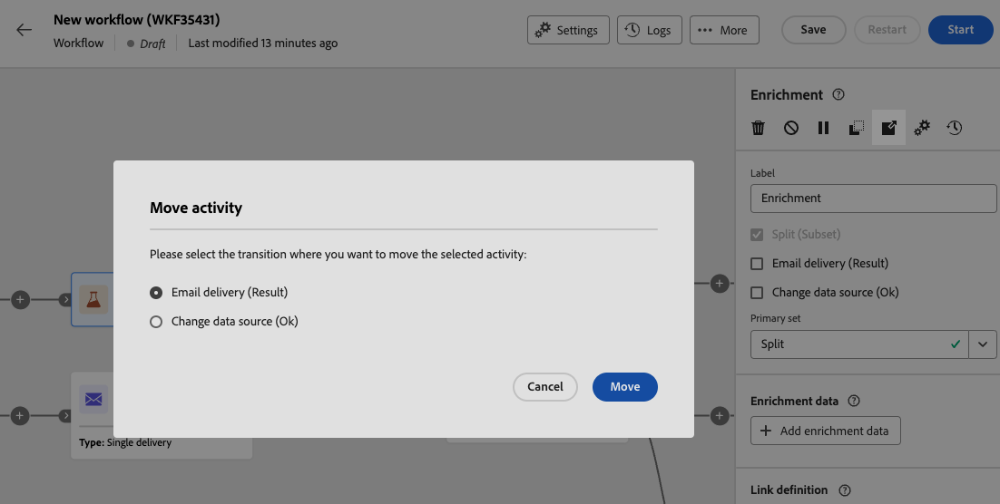
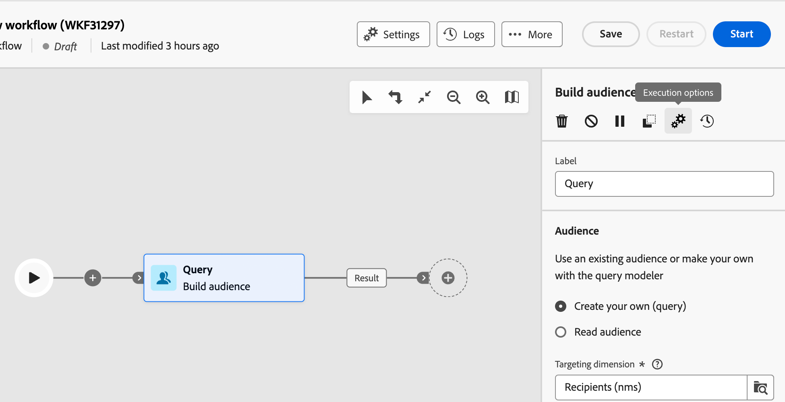

# 協調行銷活動 {#orchestrate}

+++ 目錄

| 歡迎使用協調的行銷活動 | 首次建立協調的行銷活動 | 查詢資料庫 | 協調的行銷活動 |
|---|---|---|---|
| [開始使用協調的行銷活動](gs-orchestrated-campaigns.md)  [設定步驟](configuration-steps.md)  [存取及管理協調的行銷活動](access-manage-orchestrated-campaigns.md) | [建立協調行銷活動的關鍵步驟](gs-campaign-creation.md)  [建立並排程行銷活動](create-orchestrated-campaign.md)  <b>[協調活動](orchestrate-activities.md)</b>  [傳送包含協調行銷活動的訊息](send-messages.md)  [開始並監視行銷活動](start-monitor-campaigns.md)  [報告](reporting-campaigns.md) | [使用規則產生器](orchestrated-rule-builder.md)  [建立您的第一個查詢](build-query.md)  [編輯運算式](edit-expressions.md) | [開始使用活動](activities/about-activities.md)  活動： [並加入](activities/and-join.md) - [建置對象](activities/build-audience.md) - [變更維度](activities/change-dimension.md) - [合併](activities/combine.md) - [重複資料刪除](activities/deduplication.md) - [擴充](activities/enrichment.md) - [分支](activities/fork.md) - [調解](activities/reconciliation.md) - [分割](activities/split.md) - [等待](activities/wait.md) |

{style="table-layout:fixed"}

+++

 

一旦您[建立協調的行銷活動](gs-campaign-creation.md)後，無論是從協調的行銷活動功能表還是在行銷活動中，您都可以開始協調它將執行的不同工作。 為此，我們提供視覺畫布，讓您建構協調的行銷活動圖表。 在此圖表中，您可以新增各種活動，並依序連線它們。

## 新增活動 {#add}

在設定的這個階段，圖表會顯示開始圖示，代表協調行銷活動的開始。 若要新增您的第一個活動，請按一下連線到開始圖示的&#x200B;**+**&#x200B;按鈕。

可新增至圖表的活動清單隨即顯示。 可用的活動取決於您在協調的行銷活動圖表中的位置。 例如，新增第一個活動時，您可以透過鎖定對象、分割協調的行銷活動路徑或設定&#x200B;**等待**&#x200B;活動以延遲協調的行銷活動執行，來開始協調的行銷活動。 另一方面，在&#x200B;**建立對象**&#x200B;活動後，您可以調整目標定位活動、傳送傳遞至具有頻道活動的對象，或組織具有流量控制活動的協調行銷活動程式。

{zoomable="yes"}

將活動新增到圖表後，右側窗格會出現，可讓您使用特定設定來設定新新增的活動。 有關如何設定每個活動的詳細資訊，請參閱[本節](activities/about-activities.md)。

{zoomable="yes"}

重複此程式，根據您想要協調的行銷活動執行的工作，視需要新增儘可能多的活動。 請注意，您也可以在兩個活動之間插入新活動。 若要這麼做，請按一下活動之間轉變上的&#x200B;**+**&#x200B;按鈕，選取所需的活動，並在右窗格中設定它。

若要移除活動，請在畫布中選取該活動，然後按一下活動屬性中的&#x200B;**刪除**&#x200B;圖示。

>[!TIP]
>
>您可以選擇個人化每個活動之間的轉變名稱。 要執行此操作，請選取轉變並在右窗格中變更其標籤。

## 工具列 {#toolbar}

位於畫布右上角的工具列提供可輕鬆操控活動並在畫布中導覽的選項：

* **多重選取模式**：選取多個活動以一次刪除所有活動，或複製並貼上這些活動。 請參閱[本節](#copy)。
* **旋轉**：垂直切換畫布。
* **符合熒幕大小**：調整畫布縮放等級以符合熒幕。
* **縮小** / **放大**：縮小或進入畫布。
* **顯示地圖**：開啟顯示您所在位置的畫布快照。

{zoomable="yes"}{width="50%"}

## 管理活動 {#manage}

新增活動時，屬性窗格中會顯示動作按鈕，可讓您執行多項作業。

{zoomable="yes"}

您可以：

* 從畫布中&#x200B;**刪除**&#x200B;活動。
* **停用/啟用**&#x200B;活動。 執行協調的行銷活動時，停用的活動以及相同路徑上的下列活動不會執行，且協調的行銷活動會停止。
* **暫停/繼續**&#x200B;活動。 執行協調的行銷活動時，會在暫停的活動中暫停。 系統不會執行對應的任務，以及在相同路徑中跟隨著該任務的所有任務。
* **複製**&#x200B;活動。 請參閱[本節](#copy)。
* 存取活動的&#x200B;**記錄檔與工作**。

若干&#x200B;**目標定位**&#x200B;活動（例如&#x200B;**合併**&#x200B;或&#x200B;**重複資料刪除**），可讓您處理剩餘母體，並將其納入其他出站轉變中。 例如，如果您使用&#x200B;**分割**&#x200B;活動，則補數包含不符合任何先前定義之子集的母體。 若要使用此功能，請啟動&#x200B;**產生補充**&#x200B;選項。

## 移動或複製活動 {#move-copy}

### 複製貼上活動 {#copy}

您可以複製協調的行銷活動並貼到任何工作流程中。 目的地已協調的行銷活動可以在不同的瀏覽器分頁中。

若要複製活動，您有兩個選擇：

* 使用動作按鈕複製一個活動。

  {zoomable="yes"}{width="70%"}

* 使用工具列按鈕複製多個活動。

  {zoomable="yes"}{width="70%"}

若要貼上複製的活動，請按一下轉變上的&#x200B;**+**&#x200B;按鈕，然後選取「貼上X活動」。

{zoomable="yes"}{width="50%"}

<!--
### Move activities and their child nodes {#move}

Journey Optimizer allows you to move an activity, along with the entire content of its child nodes (including all transitions and activities within it) to the end of another transition within the same orchestrated campaign.

This process disconnects the activity and everything in its outbound transition from the initial location, moving it to the new target transition.

To move an activity:

1. Select the activity you wish to move.
1. In the activity's properties pane, click the **Move** button.
1. Select the transition where you want to place the activity and its outbound transition, then confirm.

## Execution options {#execution}

All activities allow you to manage their execution options. Select an activity and click on the **Execution options** button. This lets you define the activity's execution mode and behavior in case of errors.

{zoomable="yes"}{width="70%"}

### Properties

The **Execution** field allows you to define the action to be carried out when the task is started.

The **Maximum execution duration** field allows you to specify a duration such as "30s" or "1h". If the activity is not finished after the duration specified has been elapsed, an alert is triggered. This has no impact on how the orchestrated campaign functions.

The **Time zone** field allows you to select the time zone of the activity. Adobe Journey Optimizer allows you to manage the time differences between multiple countries on the same instance. The setting applied is configured when the instance is created.

**The Affinity** field allows you to force an orchestrated campaign or an orchestrated campaign activity to execute on a particular machine. To do this, you must specify one or several affinities for the orchestrated campaign or activity in question.

The **Behavior** field allows you to define the procedure to follow if asynchronous tasks are used.

### Error management

The **In case of error** field allows you to specify the action to be carried out should the activity encounter an error.

### Initialization script

The **Initialization script** lets you initialize variables or modify activity properties. Click the **Edit code** button and type the snippet of code to execute. The script is called when the activity executes. 

## Example {#example}

Here is an orchestrated campaign example designed to send an email to all customers (other than VIP customers) with an email who are interested in coffee machines.

{zoomable="yes"}{zoomable="yes"}

To achieve this, activities below have been added:

* A **[!UICONTROL Fork]** activity that divides the orchestrated campaign into three paths (one for each set of customer),
* **[!UICONTROL Build audience]** activities to target the three sets of customers:

    * Customers with an email,
    * Customers belonging to the pre-existing "Interrested in Coffee Machine(s)" audience,
    * Customers belonging to the pre-existing "VIP ro reward" audience.

* A **[!UICONTROL Combine]** activity that groups together customers with an email and those interested in coffee machines,
* A **[!UICONTROL Combine]** activity that excludes VIP customers,
* An **[!UICONTROL Email delivery]** activity that sends an email to the resulting customers. 

Once you have completed the orchestrated campaign, add en **[!UICONTROL End]** activity at the end of the diagram. This activity allow you to visually mark the end of a workflow and has no functional impact.

After successfully designing the orchestrated campaign diagram, you can execute the orchestrated campaign and track the progress of its various tasks. [Learn how to start an orchestrated campaign and monitor its execution](start-monitor-campaigns.md)
-->