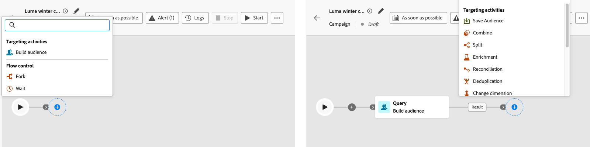
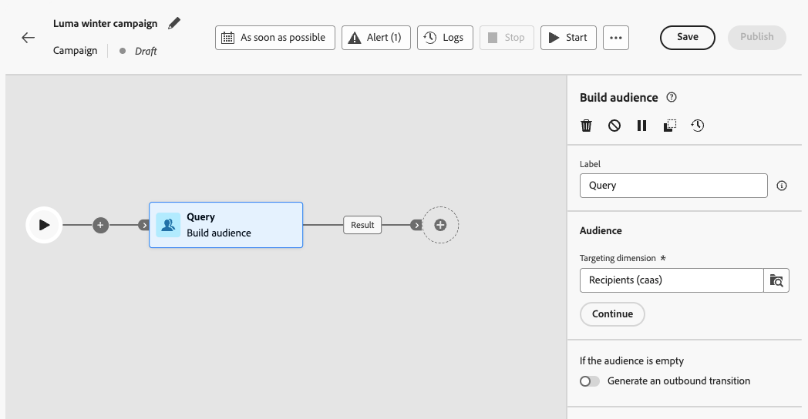
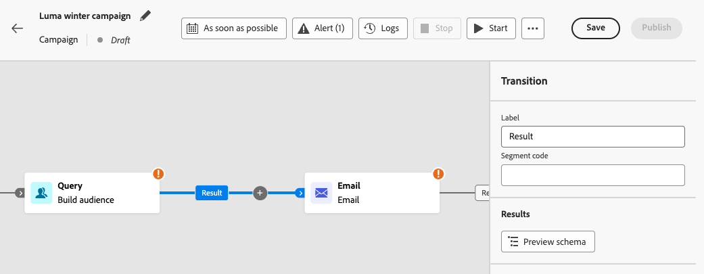
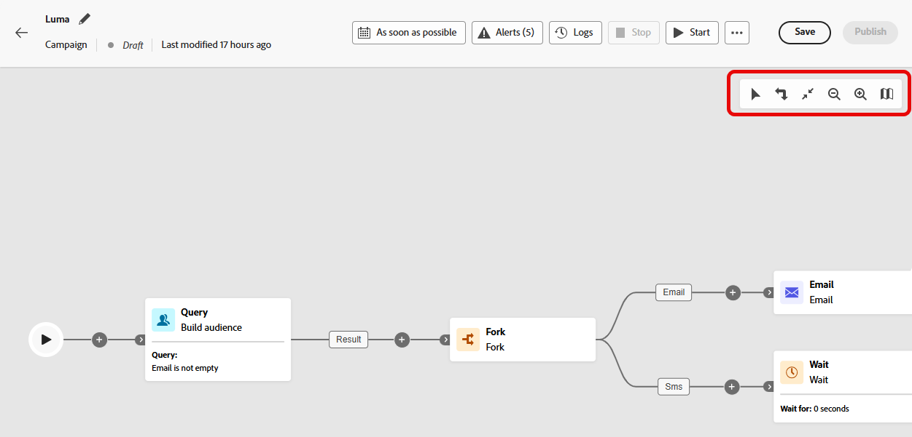
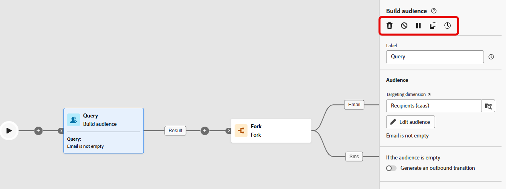
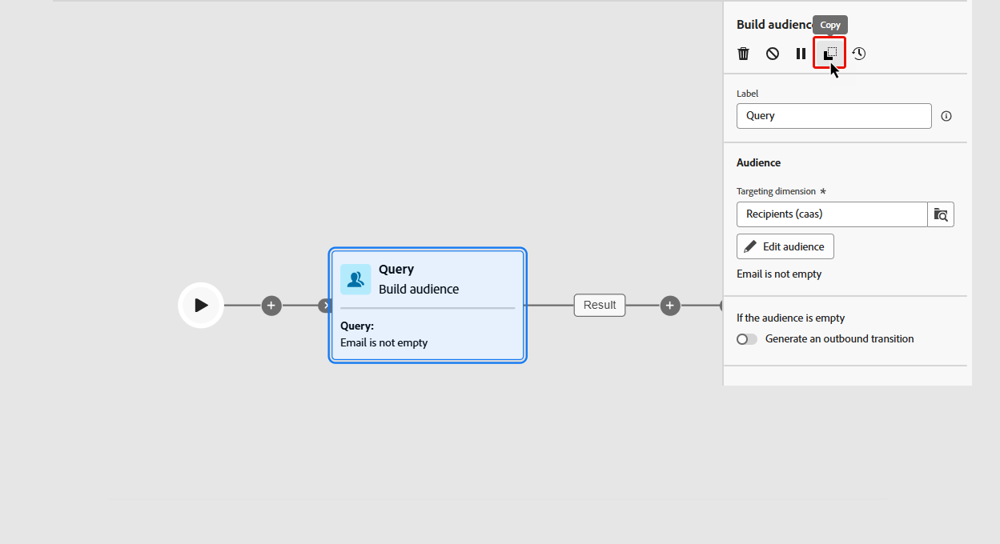
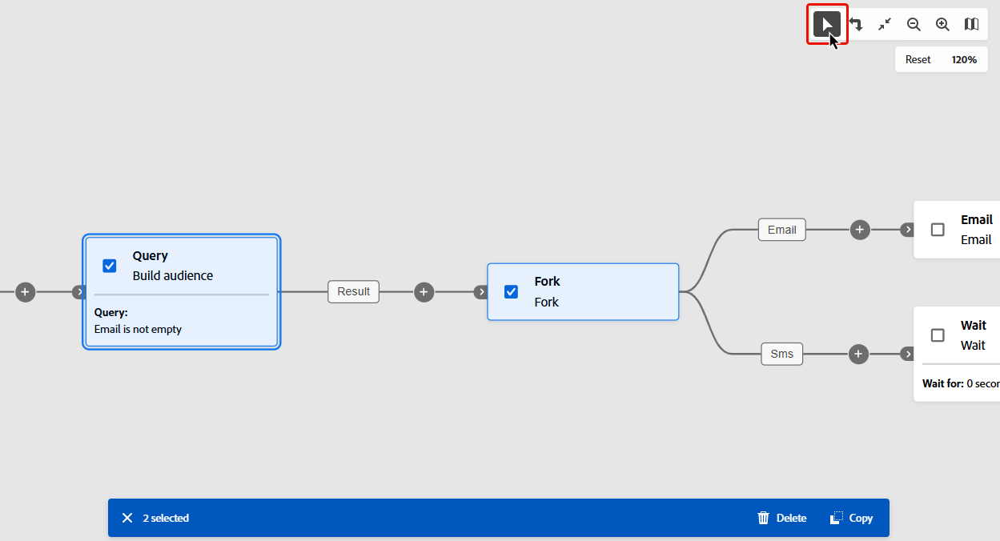

# 協調行銷活動 {#orchestrate}

一旦您[建立協調的行銷活動](gs-campaign-creation.md)後，您就可以開始協調它將執行的不同工作。 為此，提供了視覺畫布，可讓您建構「已協調的行銷活動」畫布。 在此畫布中，您可以新增各種活動，並依序連線它們。

## 新增活動 {#add}

在設定的這個階段，「協調的」行銷活動畫布會顯示一個開始圖示，代表您的「協調的」行銷活動開始。 若要新增您的第一個活動，請按一下連線到開始圖示的「**+**」按鈕。

可新增至「已協調的行銷活動」畫布的活動清單隨即顯示。 可用的活動取決於您在「已協調」行銷活動畫布中的位置。 例如，新增第一個活動時，您可以透過鎖定對象、分割協調行銷活動路徑或設定&#x200B;**等待**&#x200B;活動以延遲協調行銷活動執行，來開始協調行銷活動。 另一方面，在&#x200B;**建立對象**&#x200B;活動後，您可以調整目標定位活動、傳送傳遞至具有頻道活動的對象，或組織具有流程控制活動的「協調流程」行銷活動程式。

{zoomable="yes"}

將活動新增到畫布後，右側窗格會出現，允許您使用特定設定進行配置。 有關如何設定每個活動的詳細資訊，請參閱[此章節](activities/about-activities.md)。

{zoomable="yes"}

重複此程式，根據您希望「協調流程」行銷活動執行的工作，視需要新增儘可能多的活動。 請注意，您也可以在兩個活動之間插入新活動。若要這麼做，請按一下活動之間轉變上的「**+**」按鈕，選取所需的活動，並在右側窗格中進行設定。

您可以選擇自訂每個活動之間的轉變名稱。 要執行此操作，請選取轉變並在右側窗格中變更其標籤。

### 畫布工具列 {#toolbar}

畫布工具列提供可輕鬆操控活動並在畫布中導覽的選項：

：選取多個活動，一次性刪除所有活動或複製並貼上它們。[瞭解如何複製並貼上活動](#copy)

：垂直切換畫布。

：根據熒幕大小調整畫布縮放等級。

 ：縮小或放大畫布。

：開啟畫布的快照，顯示您所在的位置。

### 管理活動 {#manage}

新增活動時，屬性窗格中會顯示動作按鈕，可讓您執行多項作業。

：從畫布中刪除活動。

 ：停用/啟用活動。執行「已協調流程」行銷活動時，不會執行相同路徑上的停用活動和下列活動，且「已協調流程」行銷活動會停止。

 ：暫停/繼續活動。執行「已協調」行銷活動時，會在暫停的活動中暫停。 系統不會執行對應的任務，以及在相同路徑中跟隨著該任務的所有任務。

您可以使用畫布中的任何活動作為中斷點，以暫停行銷活動執行。 這表示此活動只會執行促銷活動，直到此活動為止，然後暫停執行。 暫停執行時，分段引擎會保留暫時資料供您預覽。 您可以在暫停的活動之前選取入站轉變，以檢視傳輸的資料。 深入瞭解此章節： [視覺流量監視](../orchestrated/start-monitor-campaigns.md#flow)

：複製活動。[瞭解如何複製並貼上活動](#copy)

：存取活動的記錄與任務。

若干&#x200B;**目標定位**&#x200B;活動 (例如&#x200B;**合併**&#x200B;或&#x200B;**重複資料刪除**)，可讓您處理剩餘群體，並將其納入其他傳出轉變中。例如，如果您使用&#x200B;**分割**&#x200B;活動，則補集包含不符合任何先前定義之子集的群體。若要使用此功能，請啟動「**[!UICONTROL 產生補集]**」選項。

### 複製並貼上活動 {#copy}

您可以複製活動，並將其貼到任何已協調的行銷活動畫布中。 目標行銷活動可以在不同的瀏覽器索引標籤中。

* 若要複製一個活動，請按一下活動屬性窗格中的按鈕。
* 若要複製多個活動，請按一下畫布工具列中的圖示。

| 複製一個活動 | 複製多個活動 |
|  ---  |  ---  |
| {width="200" align="center" zoomable="yes"} | {width="200" align="center" zoomable="yes"} |

若要貼上活動，請按一下轉變上的「**+**」按鈕，然後選取「貼上 x 活動」。

{zoomable="yes"}{width="50%"}

## 畫布範例 {#example}

以下是Orchestrated行銷活動範例，其設計旨在傳送電子郵件給購買至少100$的所有客戶，同時排除所有忠誠度低於50的客戶。

{zoomable="yes"}

為達成此目的，已新增下列活動：

* **[!UICONTROL 分支]**&#x200B;活動將協調的行銷活動分為三個路徑。
* **[!UICONTROL 建立客群]**&#x200B;活動以三組客戶為目標：

   * 擁有電子郵件的客戶，
   * 已購買至少美金 100 元的客戶，
   * 忠誠度點數少於 50 的客戶。

* **[!UICONTROL 合併]**&#x200B;活動群組將擁有電子郵件的客戶與已購買至少美金 100 元的客戶合併，
* **[!UICONTROL 合併]**&#x200B;活動會排除忠誠度低於 50 點的客戶，
* **[!UICONTROL 電子郵件傳遞]**&#x200B;活動會傳送電子郵件給產生的客戶。

## 後續步驟 {#next}

成功設計協調行銷活動畫布後，您可以執行協調行銷活動並追蹤其各種任務的進度。 [瞭解如何開始協調的行銷活動並監視其執行](start-monitor-campaigns.md)
