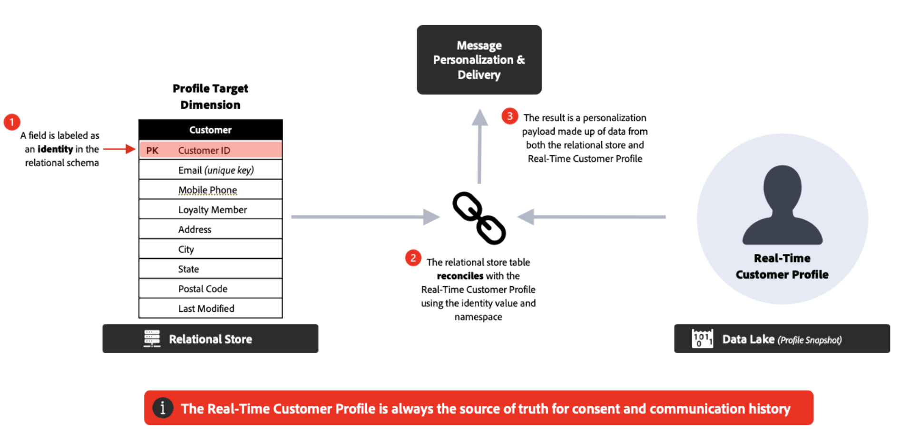

# 常見問題 {#faq-oc}

您將找到有關Adobe Journey Optimizer協調行銷活動的常見問題集。

需要更多詳細資料？使用此頁面底部的意見回饋選項來提出您的問題，或與 [Adobe Journey Optimizer 社群](https://experienceleaguecommunities.adobe.com/t5/adobe-journey-optimizer/ct-p/journey-optimizer?profile.language=zh-Hant){target="_blank"}聯絡。

+++ 什麼是Campaign協調流程？

Campaign Orchestration是Journey Optimizer的一項功能，可支援單步驟或多步驟工作流程，這些工作流程會利用關聯式資料存放區來建立和細分對象，以進行批次參與。

它為Journey Optimizer帶來新的行銷活動型別： **協調的行銷活動**。 協調的行銷活動可協助品牌大規模執行複雜的一對多行銷活動。 它們專為品牌啟動的參與而設計，例如促銷活動、季節性行銷活動或帳戶型通訊。

相較於單一傳送/動作行銷活動，它們為傳出行銷帶來&#x200B;**協調流程和順序**：對象會一起透過多步驟工作流程，而不是接收一次性爆炸。

**了解更多**

* [開始使用協調的行銷活動](gs-orchestrated-campaigns.md)
* [建立您的第一個協調行銷活動](gs-campaign-creation.md)

+++

+++ 我可以使用協調的行銷活動做什麼？

主要功能包括：

* **隨選受眾**：使用關聯式查詢立即建立並調整目標群組。
* **多實體分段**：透過連線客戶資料與相關實體（例如，帳戶、購買、預訂）來建立精確受眾。
* **預先傳送可見度**：在啟動以最佳化鎖定目標之前，請檢視正確的對象計數。
* **多步驟工作流程**：執行循序行銷活動，例如季節性促銷活動、產品上市或忠誠度優惠。

**最佳作法**

* 在設計工作流程之前定義&#x200B;**清除行銷活動目標**。
* 從&#x200B;**試驗對象**&#x200B;開始，在縮放之前驗證計數和邏輯。
* 儘可能保持分段規則&#x200B;**簡單**，以最佳化效能和透明度。
* 對對象和行銷活動使用&#x200B;**一致的命名慣例**，以簡化管理。

**了解更多**

* [建立協調的行銷活動](create-orchestrated-campaign.md)
* [使用行銷活動](activities/about-activities.md)
* [使用查詢建模器建置規則](build-query.md)

+++

+++ 如何存取Campaign協調流程？

若要存取行銷活動協調，您的授權必須包含 **Journey Optimizer - 行銷活動和歷程**&#x200B;或 **Journey Optimizer - 行銷活動**&#x200B;套件。請聯絡您的 Adobe 代表以確認您的授權並在需要時進行更新。

**了解更多**

* [開始使用協調的行銷活動](gs-orchestrated-campaigns.md)
* [Adobe Journey Optimizer 產品說明](https://helpx.adobe.com/tw/legal/product-descriptions/adobe-journey-optimizer.html){target="_blank"}

+++

+++ 協調的行銷活動與歷程有何不同？

* **協調的行銷活動**：最適合&#x200B;**批次、一對多**&#x200B;行銷活動。 對象會依排程大量進度。
* **歷程**：最適合&#x200B;**即時、一對一**&#x200B;參與。 每位客戶都會以自己的速度在歷程中移動，由行為或事件觸發。

**最佳實務**：搭配使用 — 針對已觸發、回應式體驗的歷程，以及針對已規劃、日曆型方案的協調行銷活動。

**了解更多**

* [開始使用協調的行銷活動](gs-orchestrated-campaigns.md)
* [建立您的第一個歷程](../building-journeys/journey-gs.md)
* [開始使用行銷活動](../campaigns/get-started-with-campaigns.md)

+++

+++ 什麼是多實體分段？

Adobe Journey Optimizer中的Campaign Orchestration使用關聯式資料庫。 此型別的資料模型有透過1:1或1:many關係連線的個別資料結構描述。 這可讓使用者在任何結構描述上開始查詢（不僅在收件者層級），然後來回切換至其他相關結構描述，例如購買、產品、預訂或收件者詳細資訊，在如何建立及完善區段和受眾方面提供極大的彈性。

**範例** — 鎖定訂閱在未來30天內到期的所有收件者。 在Campaign Orchestration中，查詢可以從「訂閱」綱要開始，僅搜尋該綱要的到期日欄，並傳回所有到期的訂閱，然後向上彙整至與那些特定訂閱ID相關的收件者資料，這些訂閱ID傳回結果的速度和效率比在收件者層級開始每個查詢的資料模型更高。

**了解更多**

* [開始使用結構描述和資料集](gs-schemas.md)
* [設定目標維度](target-dimension.md)
* [使用查詢建模器建置規則](build-query.md)

+++

+++ 資料模型如何運作？

行銷活動使用&#x200B;**關聯式資料庫**。 這可讓您查詢不同的資料集（例如客戶、產品、訂閱），並靈活地連結這些資料集以進行進階分段。

**最佳作法**

* 組織資料集，以便&#x200B;**關係（聯結）**&#x200B;反映商業邏輯。
* 請避免不必要的連結，以維持查詢效能。
* 執行大規模擷取之前，請先驗證範例結果。

**了解更多**

* [開始使用結構描述和資料集](gs-schemas.md)
* [手動建立結構描述](manual-schema.md)
* [擷取資料](ingest-data.md)

+++

+++ 我可以利用關聯式資料個人化訊息嗎？

可以。在Campaign Orchestration中，可以更新稱為「人員實體」的收件者設定檔，以及用於個人化的資料。 此外，關聯式資料庫中連結實體的擴充資料也可用於個人化。 您可以使用客戶設定檔以及連結的資料（例如購買或訂閱），在所有支援的管道中將內容個人化。

**推薦**

* 使用&#x200B;**異動和行為資料**&#x200B;來提供相關優惠。
* 結合&#x200B;**靜態屬性** （例如忠誠度等級）與&#x200B;**動態屬性** （例如上次購買日期）。
* 保持個人化簡潔 — 含有資料的多載訊息可能會損害可讀性。

**了解更多**

* [使用擴充活動](activities/enrichment.md)
* [在協調的行銷活動中新增管道活動](activities/channels.md)

+++

<!--
## Do Orchestrated campaigns integrate with other Adobe solutions? {#integrations}

Yes. Campaign orchestration is natively integrated with:

* **Customer Journey Analytics**: Campaign orchestration reports are available.  
* **Real-Time CDP**: Audiences built in Campaigns can be read in Real-Time CDP.  
* **Federated Audience Composition (FAC)**: Available as an add-on.  -->

+++ 支援哪些管道？

您可以建立協調的行銷活動，以傳送&#x200B;**電子郵件**、**簡訊**、**推播通知**&#x200B;及&#x200B;**直接郵件**。

**了解更多**

* [在協調的行銷活動中新增管道活動](activities/channels.md)
* [使用行銷活動](activities/about-activities.md)

+++

+++ 可以在同一個協調的行銷活動中啟動多個通訊和不同的管道嗎？

是，協調的行銷活動支援跨頻道協調。 您可以將電子郵件、簡訊和推播通知活動結合到多步驟行銷活動畫布中，以建立全面的客戶體驗。

**了解更多**

* [在協調的行銷活動中新增管道活動](activities/channels.md)
* [使用行銷活動](activities/about-activities.md)

+++

+++ 是否提供協調的行銷活動範本？

否，您無法定義或使用行銷活動範本，但可以在通訊中使用內容範本。

**了解更多**

* [在協調的行銷活動中新增管道活動](activities/channels.md)
* [建立協調的行銷活動](create-orchestrated-campaign.md)

+++

+++ 訊息的內容設計工具是否專屬於協調的行銷活動？

否，內容設計工具(包括電子郵件Designer)在所有Journey Optimizer功能中都很常見。

**了解更多**

* [在協調的行銷活動中新增管道活動](activities/channels.md)
* [使用擴充活動](activities/enrichment.md)

+++

+++ 在協調的行銷活動中，不同的管道如何連線？

頻道元件和執行階段是所有Journey Optimizer行銷活動的共同點，但支援的頻道不同。 協調的行銷活動支援電子郵件、簡訊和推播通知。

**了解更多**

* [在協調的行銷活動中新增管道活動](activities/channels.md)
* [護欄與限制](guardrails.md)

+++

+++ 協調的行銷活動可以與傳出頻道（網頁、inApp）連線嗎？

否，協調的行銷活動不支援Web和應用程式內傳入頻道。 僅支援傳出頻道（電子郵件、簡訊和推播通知）。

**了解更多**

* [護欄與限制](guardrails.md)
* [在協調的行銷活動中新增管道活動](activities/channels.md)

+++

+++ 許可權和同意呢？

協調行銷活動和歷程的許可權和同意在Adobe Experience Platform中集中管理。 這些設定會在傳送前套用至每個收件者的兩個解決方案。

**最佳作法**

* 套用&#x200B;**集中治理** — 避免在行銷活動層級個別管理同意。
* 定期稽核同意資料以偵測不一致。
* 遵守&#x200B;**特定管道的選擇退出** — 不要假設全域同意涵蓋所有管道。

**了解更多**

* [開始使用協調的行銷活動](gs-orchestrated-campaigns.md)
* [護欄與限制](guardrails.md)

+++

+++ 我可以在協調的行銷活動中執行臨時細分嗎？

在Campaign Orchestration中，我們將臨機區段稱為「即時區段」，您可以即時存取關聯式存放區中的所有可用資料，在其上建立複雜的查詢，並透過傳出頻道（例如：電子郵件+簡訊）取得即時啟用的結果。

**提示**

* 針對&#x200B;**時效性需求** （例如Flash促銷活動）使用臨機區段。
* 儲存並記錄有用的查詢，以便在未來的行銷活動中重複使用。
* 在啟用之前驗證對象人數，以防止傳送量少或傳送量多。

**了解更多**

* [使用查詢建模器建置規則](build-query.md)
* [使用建置客群活動](activities/build-audience.md)
* [設定目標維度](target-dimension.md)

+++

+++ Campaign Orchestration是否僅存取透過批次載入的資料，或查詢即時更新的表格（例如Analytics資料）？

Journey Optimizer Campaign Orchestration可以在關聯式結構描述之上建立臨時查詢。 關聯式結構描述目前僅支援批次來源。 此外，它支援從任何型別的Adobe Experience Platform對象讀取對象活動。

**了解更多**

* [開始使用結構描述和資料集](gs-schemas.md)
* [擷取資料](ingest-data.md)
* [使用讀取客群活動](activities/read-audience.md)

+++

+++ 協調的行銷活動是否支援決策？

否，協調的行銷活動不支援決策功能。 針對決策功能，請改用標準Journey Optimizer歷程或動作行銷活動。

**了解更多**

* [開始使用體驗決策](../experience-decisioning/gs-experience-decisioning.md)
* [建立您的第一個歷程](../building-journeys/journey-gs.md)
* [開始使用行銷活動](../campaigns/get-started-with-campaigns.md)

+++

+++ 跨環境的部署如何運作？

在協調行銷活動中建立的物件（例如對象、工作流程）會與建立這些物件的沙箱繫結。 跨環境（開發、階段、生產）的標準封裝和部署工作流程目前不適用於協調的行銷活動。

**最佳作法**

* 維護&#x200B;**個獨立的沙箱**&#x200B;以用於實驗、QA和生產。
* 完整記錄設定，以視需要啟用手動復寫。
* 與治理團隊保持一致，以減少環境之間的設定漂移。

**了解更多**

* [開始使用協調的行銷活動](gs-orchestrated-campaigns.md)
* [護欄與限制](guardrails.md)

+++

<!--
## Are there recommended practices for running campaigns at scale? {#scale}

Yes, follow the best practices below:  

* **Plan campaigns around business calendars** (product launches, seasonal peaks) to align volume and resources.  
* Use **audience pre-views** before sending to confirm the expected size and avoid surprises.  
* Where possible, **stagger send times** to avoid overwhelming downstream systems (e.g., call centers, websites).  
* Establish a **monitoring routine**—track delivery logs, error rates, and opt-outs after each send.  
* Run **post-campaign analysis** in Customer Journey Analytics to refine targeting and orchestration for the next cycle.  
-->

+++ 收件者和設定檔實體之間的關係為何？

根據Adobe Experience Platform設定檔進行傳送時，會對收件者執行分段。 收件者目標維度會使用在協調行銷活動中用於分段的其他資料來擴充統一設定檔，而收件者會在執行階段與設定檔進行調解，以便傳送訊息及檢查同意原則和業務規則。 此調解對於在設定檔層級統一商業規則和同意應用程式非常有用。

**了解更多**

* [設定目標維度](target-dimension.md)
* [開始使用結構描述和資料集](gs-schemas.md)
* [使用查詢建模器建置規則](build-query.md)

+++

+++ 在哪些情況下，建議使用收件者與設定檔實體？

回答「是」會建議最佳資料存放區，但請務必根據您的使用案例和限制，向您的Adobe代表確認最佳方法。

| 關聯式存放區 | 即時客戶輪廓 |
|---------|----------|
| 資料來源是否已關聯？ | 資料串流的來源嗎？ |
| 您打算擷取資料原樣用於行銷使用案例嗎？ | 資料的時效性是一項主要需求嗎？ |
| 行銷啟動使用案例是否需要大量歷史資料（`>` 2個月）？ | 是否有即時動作或決定需要資料的情況？ |
| 建立、評估和啟用對象是否有臨時需求？ | 使用預先計算的彙總時，行為資料是否可限製為`<` 90天？ |
|  | 需要即時個人化訊息的資料嗎？ |

**了解更多**

* [設定目標維度](target-dimension.md)
* [開始使用結構描述和資料集](gs-schemas.md)
* [使用查詢建模器建置規則](build-query.md)

+++

+++ 每個協調的行銷活動的最大活動數是多少？

已協調的行銷活動中的活動數限製為500。

**了解更多**

* [護欄與限制](guardrails.md)
* [使用行銷活動](activities/about-activities.md)

+++

+++ 是否可以執行擴充功能以新增其他資料？

可以，您可以擴充關聯式存放區和Adobe Experience Platform受眾的資料。 使用擴充活動，以使用相關結構描述的其他屬性來增強您的受眾資料。

**了解更多**

* [使用擴充活動](activities/enrichment.md)
* [設定調和活動](activities/reconciliation.md)

+++

+++ 所有篩選器皆必須透過對象定義，還是可以設定某種型別的篩選器？

協調的行銷活動支援預先定義的篩選器：您可以定義查詢並將其儲存為篩選器，將其新增至您的最愛，以及在進一步的細分任務中重複使用。 預先定義的篩選器可包含引數，以便您在使用時輸入值。 [瞭解如何使用預先定義的篩選器](predefined-filters.md)。

**了解更多**

* [使用查詢建模器建置規則](build-query.md)
* [使用建置客群活動](activities/build-audience.md)
* [使用預先定義的篩選器](orchestrated-rule-builder.md)

+++

## 其他資源

如需更多學習與更新內容，請探索下列資源：

* [協調的行銷活動護欄和限制](guardrails.md)
* [開始使用協調行銷活動中的結構描述和資料集](gs-schemas.md)
* [建立您的第一個協調行銷活動](gs-campaign-creation.md)
* [Journey Optimizer 產品描述](https://helpx.adobe.com/tw/legal/product-descriptions/adobe-journey-optimizer.html){target="_blank"}
