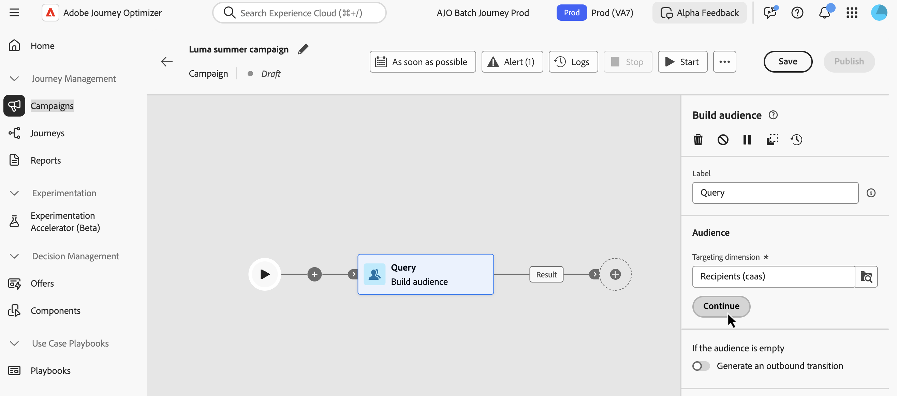

# 使用規則產生器 {#orchestrated-rule-builder}

+++ 目錄

| 歡迎使用協調的行銷活動 | 啟動您的第一個協調行銷活動 | 查詢資料庫 | 協調的行銷活動活動 |
|---|---|---|---|
| [開始使用協調的行銷活動](gs-orchestrated-campaigns.md)  [設定步驟](configuration-steps.md)  [建立協調行銷活動的重要步驟](gs-campaign-creation.md) | [建立協調的行銷活動](create-orchestrated-campaign.md)  [協調活動](orchestrate-activities.md)  [使用協調的行銷活動傳送訊息](send-messages.md)  [開始並監視行銷活動](start-monitor-campaigns.md)  [報告](reporting-campaigns.md) | [使用規則產生器](orchestrated-rule-builder.md)  [建立您的第一個查詢](build-query.md)  [編輯運算式](edit-expressions.md) | [開始使用活動](activities/about-activities.md)  活動： [並加入](activities/and-join.md) - [建置對象](activities/build-audience.md) - [變更維度](activities/change-dimension.md) - [合併](activities/combine.md) - [重複資料刪除](activities/deduplication.md) - [擴充](activities/enrichment.md) - [分支](activities/fork.md) - [調解](activities/reconciliation.md) - [分割](activities/split.md) - [等待](activities/wait.md) |

{style="table-layout:fixed"}

+++

 

協調的行銷活動隨附規則產生器，可簡化根據各種條件篩選資料庫的程式。 規則產生器能有效管理非常複雜和冗長的查詢，提供增強的彈性和精確度。

它也支援條件內的預先定義篩選器，讓使用者能夠輕鬆調整查詢，同時利用進階運算式和運運算元實現全面的受眾目標定位和細分策略。

## 存取規則產生器

在&#x200B;**[!UICONTROL 建立對象]**&#x200B;活動中建立查詢以鎖定對象時，可以使用規則產生器。 它可讓您指定想要鎖定的母體，並根據您的需求輕鬆建立新的受眾。

## 規則產生器介面 {#interface}

規則產生器提供中央畫布，您可在其中建立查詢，並提供規則相關資訊的屬性窗格。

* **中央畫布**&#x200B;是您新增並合併不同元件以建置規則的地方。 工具列提供可輕鬆操控規則元件的選項：

  | 工具列圖示 | 說明 |
  |--- |--- |
  |  | 將元件向上移動一列。 |
  |  | 將元件下移一列。 |
  |  | 將兩個元件放在一個群組中。 |
  |  | 將單一群組的元件分開。 |
  |  | 展開所有群組。 |
  |  | 摺疊所有群組。 |
  |  | 移除所有群組和元件。 |

* **[!UICONTROL 規則屬性]**&#x200B;窗格會提供有關您規則的資訊。 它可讓您執行各種作業來檢查規則，並確保它符合您的需求。

  建立查詢以建立對象時，會顯示此窗格。 [瞭解如何檢查及驗證您的查詢](build-query.md#check-and-validate-your-query)
