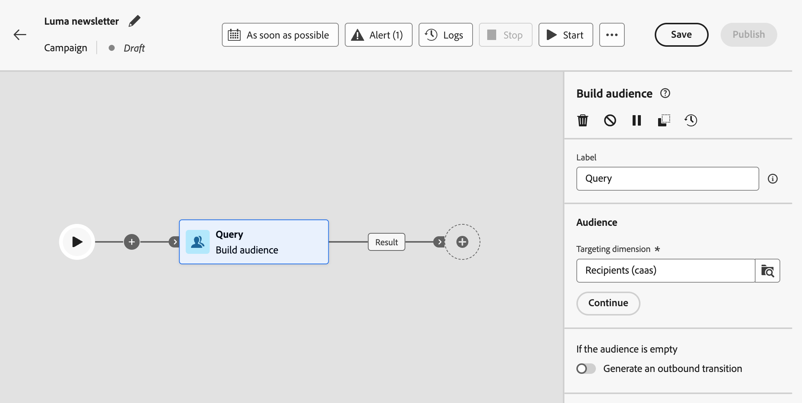
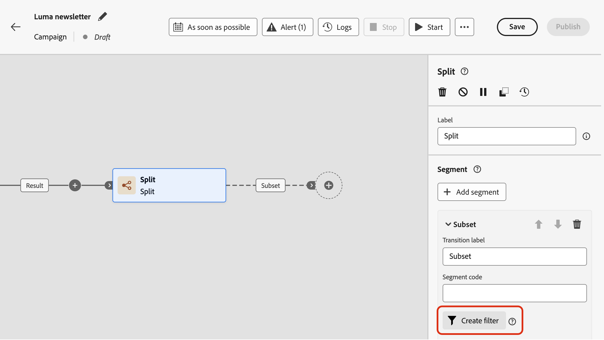
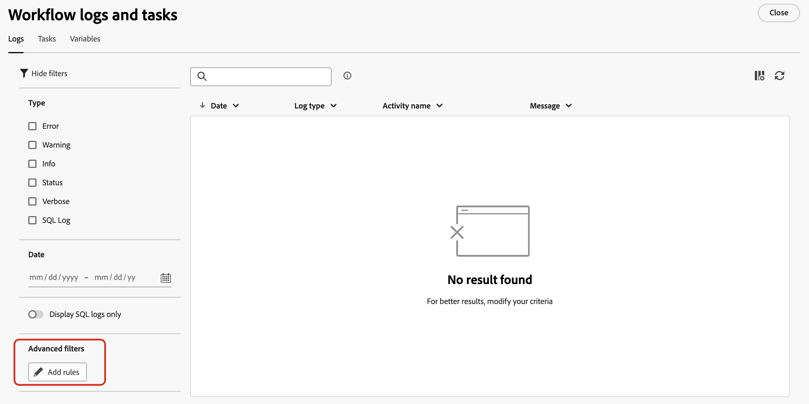

# 使用規則產生器 {#orchestrated-rule-builder}

協調的行銷活動隨附規則產生器，可簡化根據各種條件篩選資料庫的流程。規則產生器能有效管理非常複雜和冗長的查詢，提供增強的彈性和精確度。

它也支援條件內預先定義的篩選器，使您可輕鬆調整查詢，同時利用進階運算式和運算子實現全面的客群目標定位和細分策略。

## 存取規則產生器

您必須在每個需要定義規則以篩選資料的內容中，都能使用規則產生器。

| 使用方式 | 範例 |
|  ---  |  ---  |
| **建立對象**：使用&#x200B;**[!UICONTROL 建立對象]**&#x200B;活動，指定您要在協調行銷活動中鎖定的母體，並輕鬆建立符合您需求的新對象。 [了解如何建立客群](../orchestrated/activities/build-audience.md) | {width="200" align="center" zoomable="yes"} |
| **在行銷活動畫布中建立條件**：使用&#x200B;**[!UICONTROL 分割]**&#x200B;活動在行銷活動畫布中套用規則，以符合您的特定需求。[了解如何使用分割活動](../orchestrated/activities/split.md) | {width="200" align="center" zoomable="yes"} |
| **建立進階篩選器**：建置規則以篩選清單中顯示的資料，例如行銷活動記錄檔或目標維度。 | {width="200" align="center" zoomable="yes"} |

## 規則產生器介面 {#interface}

規則產生器提供中央畫布，您可在其中建立查詢，以及提供規則相關資訊的屬性窗格。

* 您可以在&#x200B;**中央畫布**&#x200B;新增並合併不同元件以建立規則。[了解如何建立規則](../orchestrated/build-query.md)

* **[!UICONTROL 規則屬性]**&#x200B;窗格會提供有關您規則的資訊。它可讓您執行各種作業來檢查規則，並確保它符合您的需求。

  建立查詢以建立客群時，會顯示此窗格。[了解如何檢查及驗證您的查詢](build-query.md#check-and-validate-your-query)
