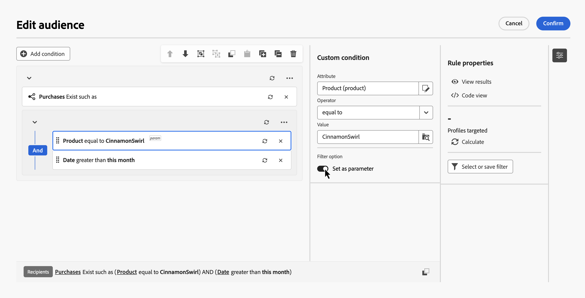
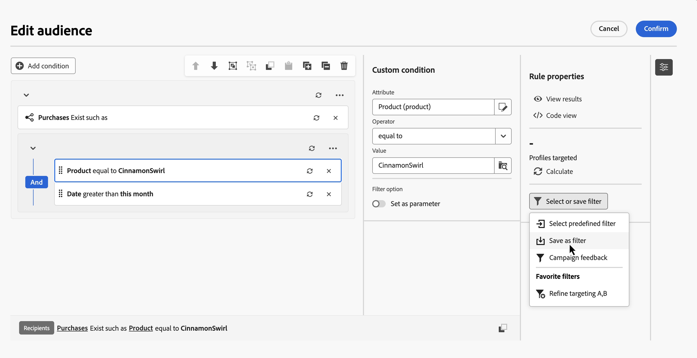
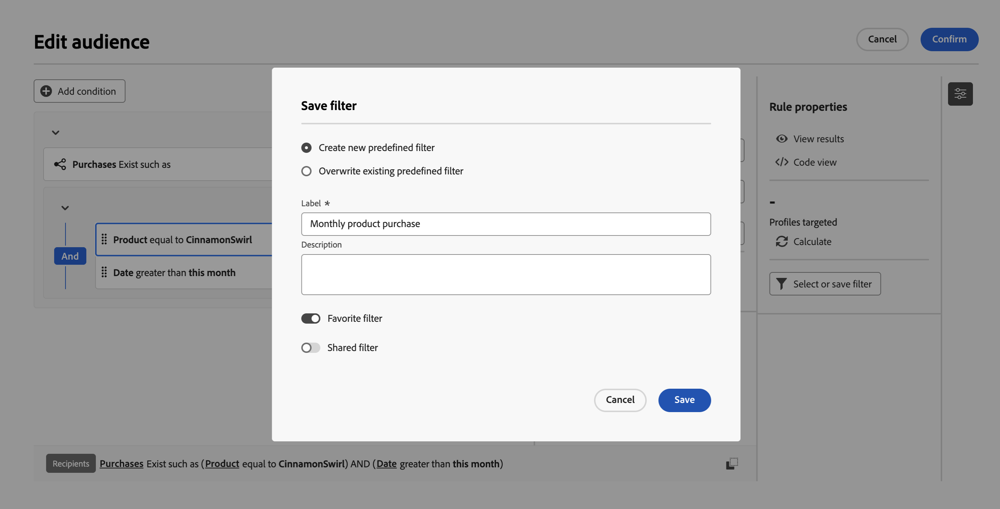
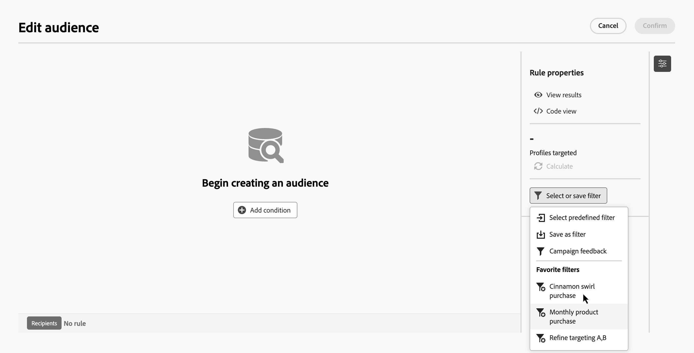
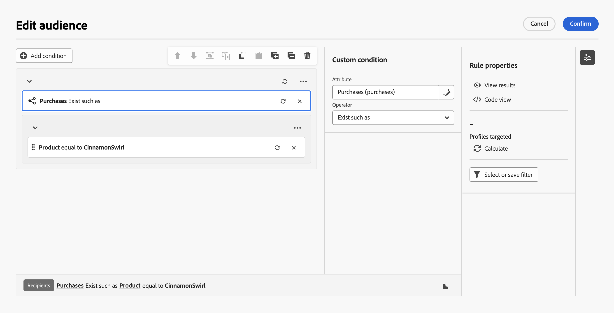
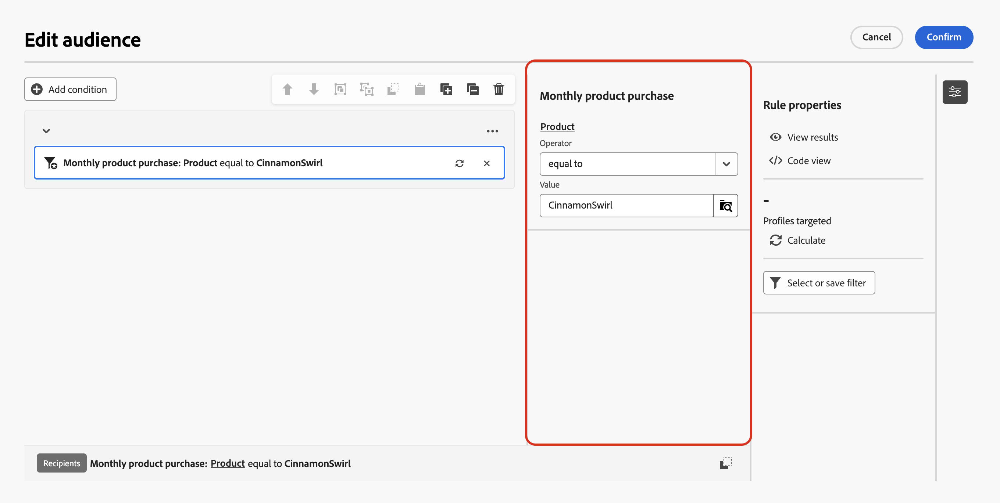
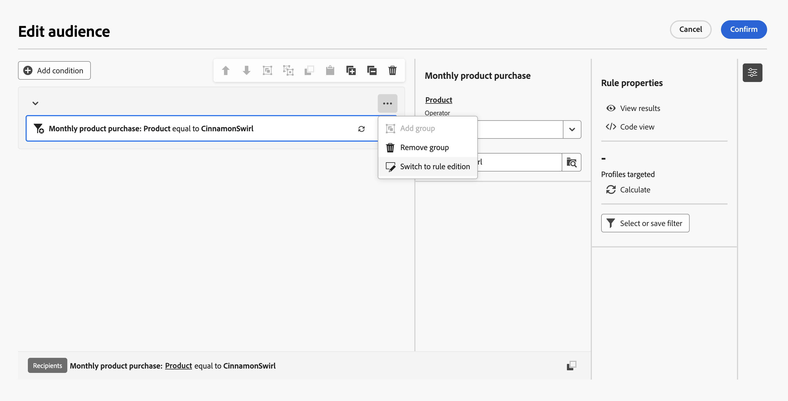
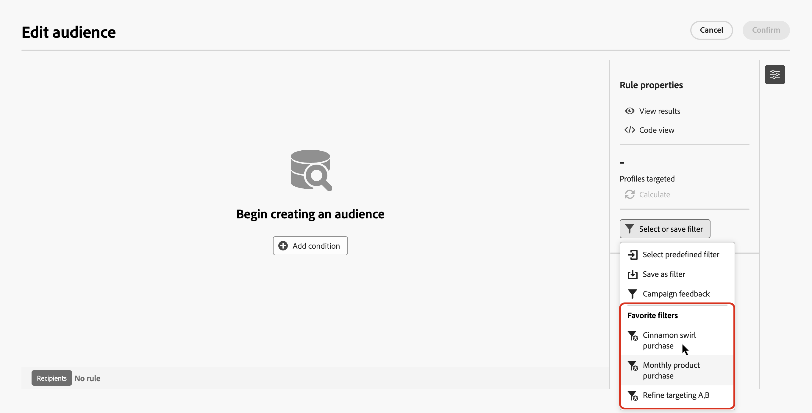
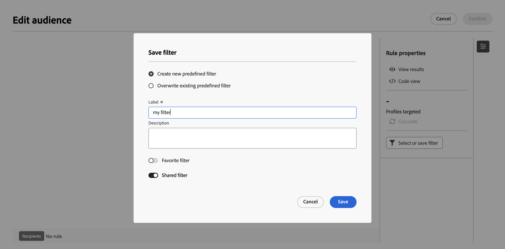
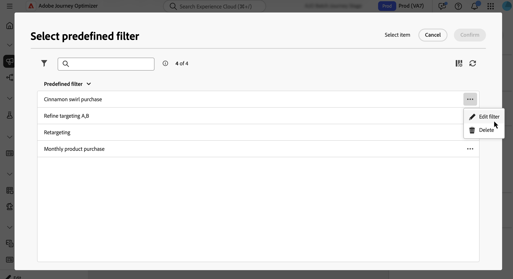

# 使用預先定義的篩選器 {#predefined-filters}

預先定義的篩選器是儲存的規則，您可以在規則產生器中重複使用。 使用這些範本來避免重新建立常見查詢，並標準化跨協調行銷活動的目標定位邏輯。

您可以將預先定義的篩選器標示為我的最愛、與其他使用者共用，以及新增引數，以便在套用篩選器時編輯選取的欄位。

## 建立預先定義的篩選器 {#create}

儲存規則產生器中的自訂篩選器，以供日後使用。 請依照下列步驟操作：

1. 開啟規則產生器並定義您的篩選條件。[了解如何建立規則](../orchestrated/build-query.md)

1. 可選：若要在使用篩選時讓某些欄位可編輯，請選取該欄位並開啟&#x200B;**[!UICONTROL 設定為引數]**。 當您套用篩選器時，只能編輯這些欄位。

   

1. 若要儲存篩選器，請按一下[選取或儲存篩選器]，然後選取[儲存篩選器]。****。****

   

1. 輸入篩選的標籤和說明，然後按一下[儲存]。****

   * 若要將篩選器另存為最愛，請切換開啟「**[!UICONTROL 最愛篩選器]**」選項。請參閱[此章節](#fav-filter)深入瞭解。
   * 若要讓其他使用者可以存取篩選器，請啟用&#x200B;**[!UICONTROL 共用篩選器]**&#x200B;選項。 請參閱[此章節](#share-filter)深入瞭解。

   

您的自訂篩選器現在可在&#x200B;**預先定義的篩選器**&#x200B;清單中使用。

## 在規則中使用預先定義的篩選器 {#apply}

在規則產生器中定義查詢時，可以使用預先定義的篩選器。

1. 在&#x200B;**[!UICONTROL 規則屬性]**&#x200B;窗格中，按一下&#x200B;**[!UICONTROL 選取或儲存篩選器]**。

1. 選擇&#x200B;**[!UICONTROL 選取預先定義的篩選器]**&#x200B;並選取篩選器。 如果已新增至我的最愛，您也可以直接從清單中選取預先定義的篩選器。

   

   >[!IMPORTANT]
   >
   >選取預先定義的篩選器會以選取的篩選器取代畫布中已建置的規則。

1. 篩選器會在畫布中開啟。 視需要繼續編輯條件。

   

   如果您選取的篩選器包含引數，則只能編輯標籤為引數的欄位。 它們會顯示在&#x200B;**[!UICONTROL 規則屬性]**&#x200B;窗格旁的窗格中。

   

   若要編輯預先定義的篩選器本身，請按一下並選取&#x200B;**[!UICONTROL 切換至規則版本]**。 所有變更只會套用至您正在建置的目前規則。 預先定義的篩選器不會被修改。

   

## 將篩選器另存為最愛 {#fav-filter}

建立預先定義的篩選器時，請啟用&#x200B;**[!UICONTROL 我的最愛篩選器]**&#x200B;選項，以在您的最愛中檢視此預先定義的篩選器。

篩選器儲存為我的最愛時，會顯示在篩選器清單的&#x200B;**[!UICONTROL 我的最愛篩選器]**&#x200B;區段中，如下所示：

## 共用預先定義的篩選器 {#share-filter}

依預設，您建立的預先定義篩選器是私人的且僅供您檢視。 若要讓組織中的其他操作者可存取篩選器，請啟用&#x200B;**[!UICONTROL 共用篩選器]**&#x200B;選項。

共用的篩選器會出現在所有使用者的預先定義篩選器清單中，好讓他們在自己的規則中使用這些篩選器。

## 管理預先定義的篩選器 {#manage-predefined-filter}

若要編輯或刪除預先定義的篩選器，請執行下列步驟：

1. 使用規則組建中的&#x200B;**[!UICONTROL 選取或儲存篩選器]**&#x200B;按鈕，開啟預先定義的篩選器清單。

1. 選取篩選器旁的並選擇所需的動作。

