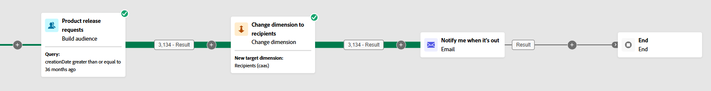
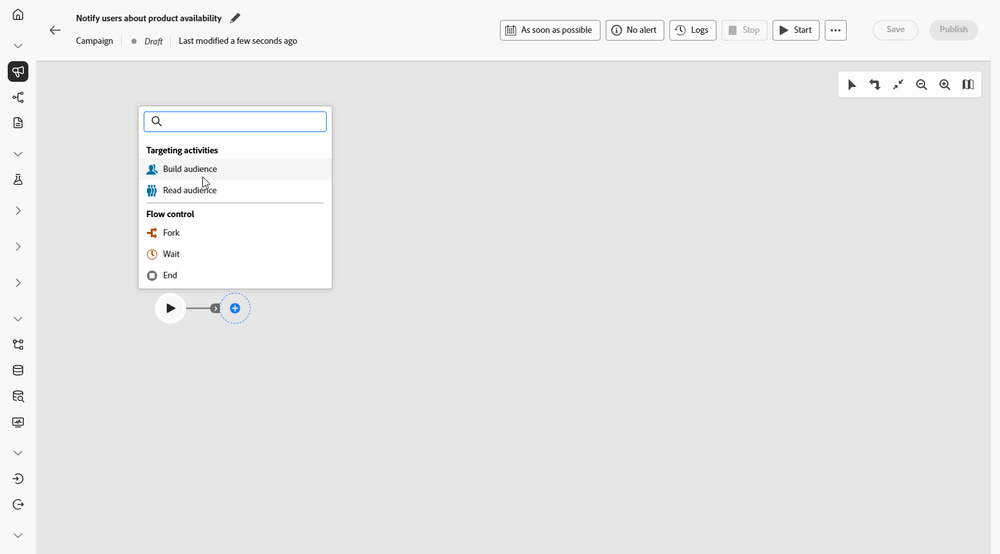
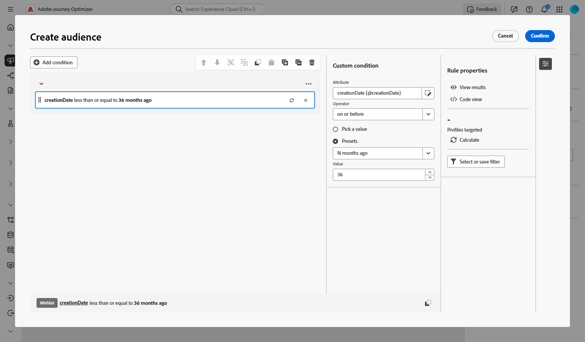
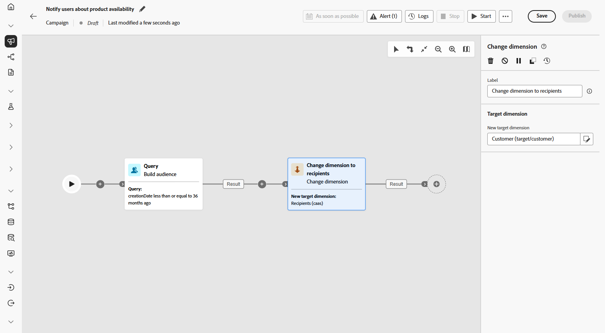
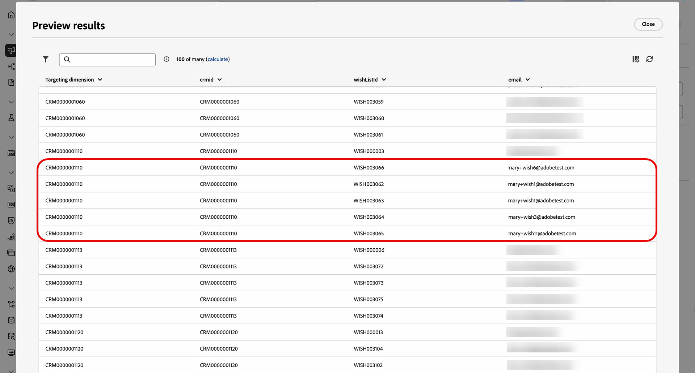
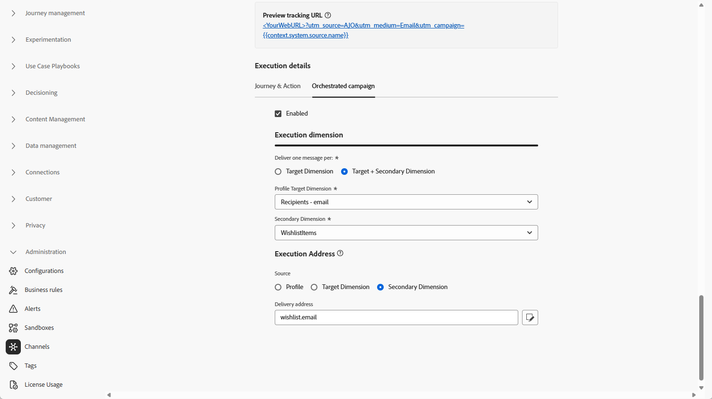
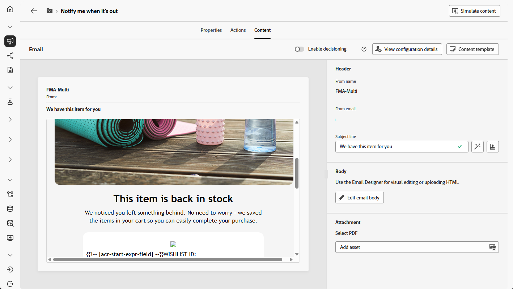

# 通知使用者產品可用性 {#product-availability-uc}

>[!BEGINSHADEBOX]

此使用案例顯示多層級傳送：使用與個別專案儲存的電子郵件地址（而不是收件者記錄），為每個願望清單專案產生不同的電子郵件。 這可讓客戶收到其願望清單上每個產品的個別通知，即使他們針對不同專案使用不同電子郵件地址亦然。

>[!ENDSHADEBOX]

{zoomable="yes"}

設計庫存通知，通知客戶其願望清單中的專案何時再次可用。 此訊息可協助重新吸引感興趣的客戶，並鼓勵他們在補充存貨的同時完成購買。

1. 首先，設定專門針對希望清單重新參與的新行銷活動。 這可確保您的訊息著重於已透過將產品儲存至願望清單而顯示購買意圖的客戶。

   {zoomable="yes"}

1. 填寫您的&#x200B;**[!UICONTROL 行銷活動設定]**，例如行銷活動名稱、說明、開始和結束日期以及相關標籤。

1. 新增願望清單為&#x200B;**[!UICONTROL 目標維度]**&#x200B;的&#x200B;**[!UICONTROL 建置對象]**&#x200B;活動。

   {zoomable="yes"}

1. 新增您的條件，以僅包含過去36個月建立的願望清單。

   {zoomable="yes"}

1. 新增&#x200B;**[!UICONTROL 變更維度]**&#x200B;活動，以將願望清單切換回目標定位的個別客戶集。

   {zoomable="yes"}

1. 開始草稿模式後，使用願望清單詳細資料預覽對象。 如需深入分析，請按一下輸出結果，然後選取&#x200B;**[!UICONTROL 預覽結果]**。

   在這裡，資料會顯示收件者及其願望清單專案。 有些客戶有多個願望清單專案，並透過多級傳送，收到每個專案的個別電子郵件。 在某些情況下，客戶會使用不同的電子郵件地址來分別提出補貨請求。

   {zoomable="yes"}

1. 若要針對每個專案傳送個別的電子郵件，請確定[您的電子郵件設定](../orchestrated/target-dimension.md)已設定`Recipients - email`為&#x200B;**[!UICONTROL 設定檔目標Dimension]**，`Wishlistitems`為&#x200B;**[!UICONTROL 次要維度]**。

   然後，從&#x200B;**[!UICONTROL 執行位址]**&#x200B;功能表，選取`wishlist.email`作為&#x200B;**[!UICONTROL 次要維度]**。 每個願望清單專案都會觸發個別電子郵件，使用願望清單資料中儲存的電子郵件地址做為次要維度。

   {zoomable="yes"}

1. 新增&#x200B;**[!UICONTROL 電子郵件]**&#x200B;活動以建立產品可用性訊息。 按一下&#x200B;**[!UICONTROL 編輯內容]**，開始設計您的內容。

   ➡️ [進一步瞭解電子郵件個人化](../email/content-from-scratch.md)

   {zoomable="yes"}

1. 在您的行銷活動經過測試且準備就緒後，按一下「**[!UICONTROL 發佈]**」，讓行銷活動上線。

透過這項精心安排的行銷活動，客戶會收到其每個願望清單專案的個別電子郵件。 每則訊息都會傳送至與該願望清單相關聯的特定電子郵件地址，且會從該特定願望清單專案的詳細資訊中擷取個人化內容。

