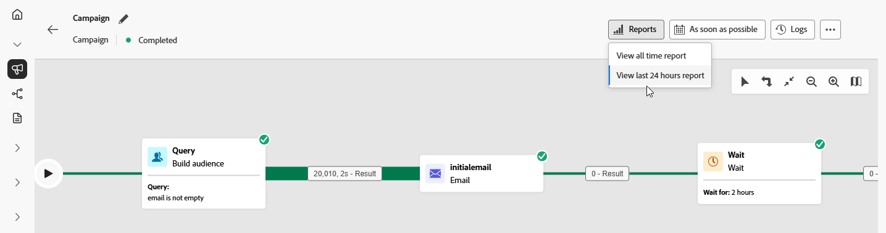

# 協調行銷活動報告 {#report-campaigns}

協調行銷活動會透過強大的報告功能，為您提供可採取行動的洞察。 這些洞察能協助您更加瞭解客群行為、評估客戶歷程中每步驟的績效，做出資料導向決策，以便將未來的行銷活動最佳化。 有了詳細量度和視覺效果，就可以追蹤參與度，同時微調目標定位策略，以便獲得最大影響力。

## 報告類型 {#reporting-types}

<table style="table-layout:auto; width: 100%; border-collapse: collapse;">
  <tbody>
    <tr>
      <td></td>
      <td>
        使用<b>即時報告</b>，在內建儀表板中即時測量並視覺化協調行銷活動的影響和效能。 從<b>檢視過去24小時報告</b>功能表執行您的協調行銷活動後，<b>即時報告</b>中便會提供資料。 若想了解即時報告的詳細資訊，請參閱<a href="../reports/live-report.md">本區段</a>。
      </td>
         
    </tr>
    <tr style="background-color: #FFFFFF;">
      <td></td>
      <td>
        <b>所有時間報告</b> - 報告功能現已完全整合入 Customer Journey Analytics 功能，可跨越兩大平台，將報告標準化，改善資料一致性，提升可靠性。 可到<a href="../reports/report-gs-cja.md">本區段</a>中，進一步了解所有時間報告。
      </td>
    </tr>
  </tbody>
</table>

## 深入瞭解頻道報告

<table style="table-layout:fixed"><tr style="border: 0; text-align: center;" >
<td> <a href="../reports/campaign-global-report-cja-email.md"><strong>電子郵件報告</strong></a></td>
<td> <a href="../reports/campaign-global-report-cja-sms.md"><strong>簡訊報告</strong></a></td>
<td><a href="../reports/campaign-global-report-cja-push.md"><strong>推播報告</strong></a></td><td><a href="../reports/campaign-global-report-cja-direct.md"><strong>直接郵件報告</strong></a></td>
</tr></table>

