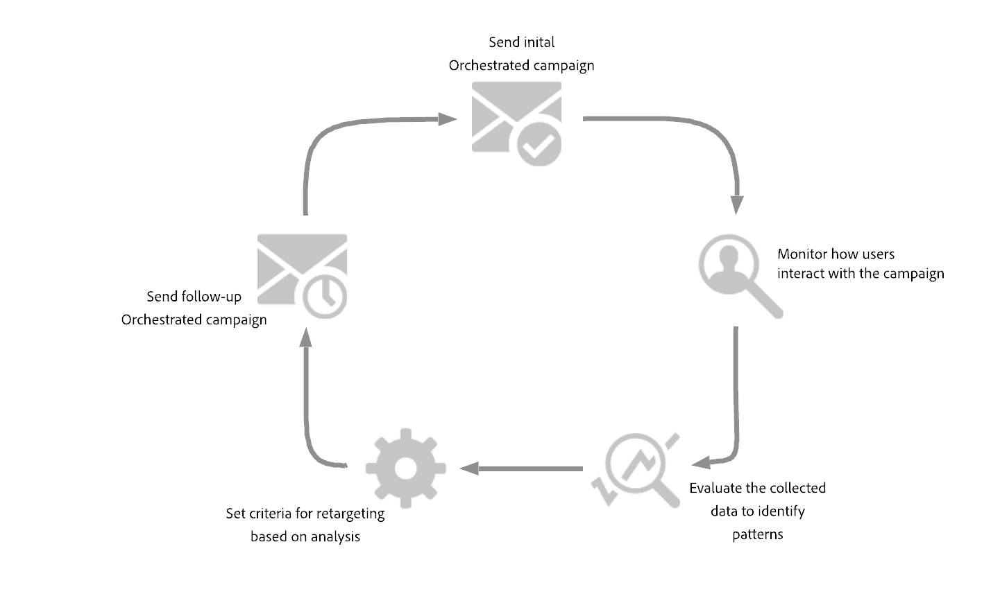
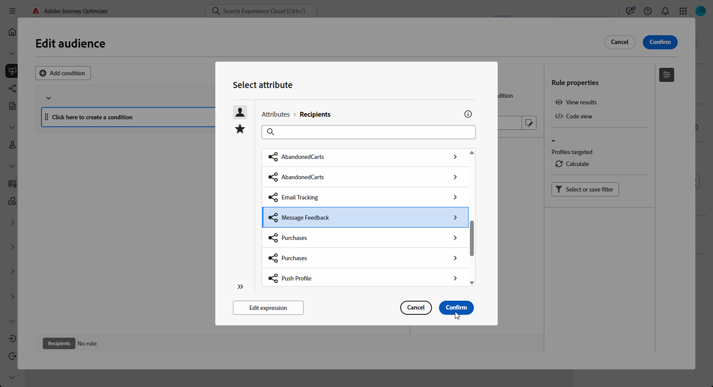
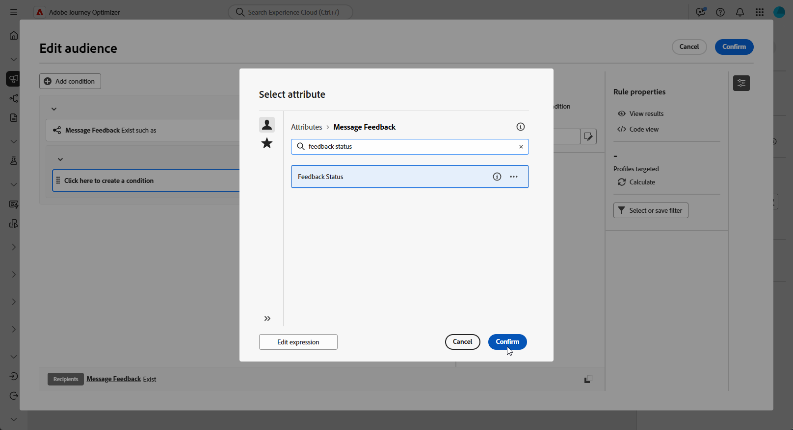
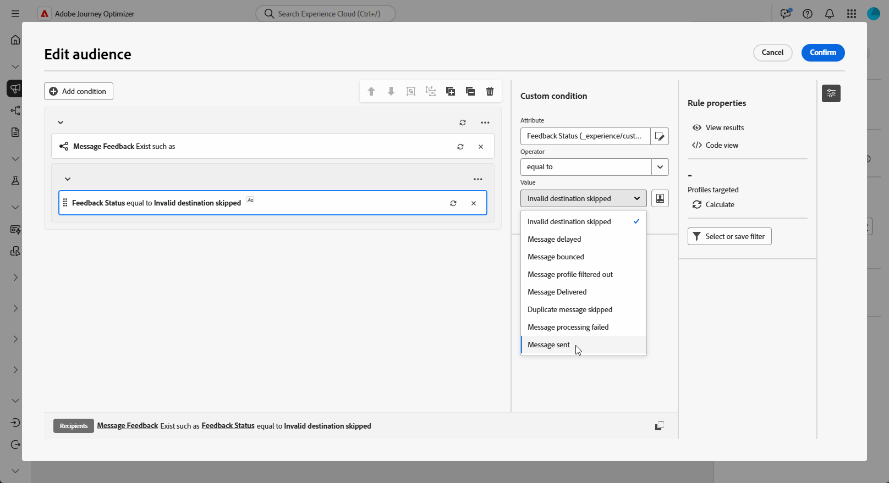
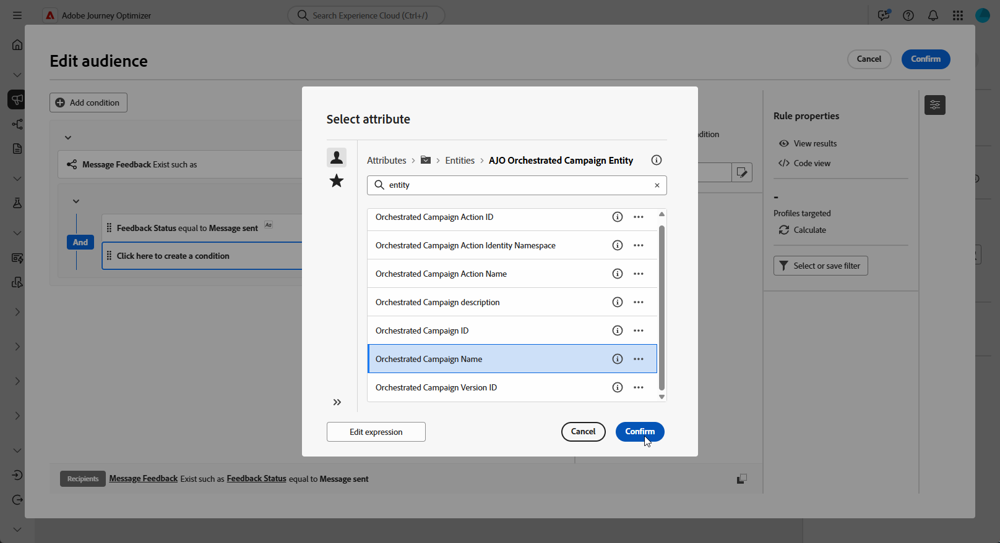
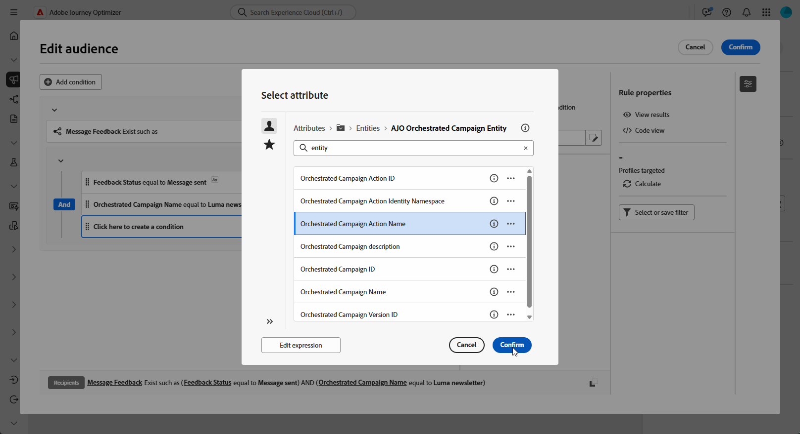
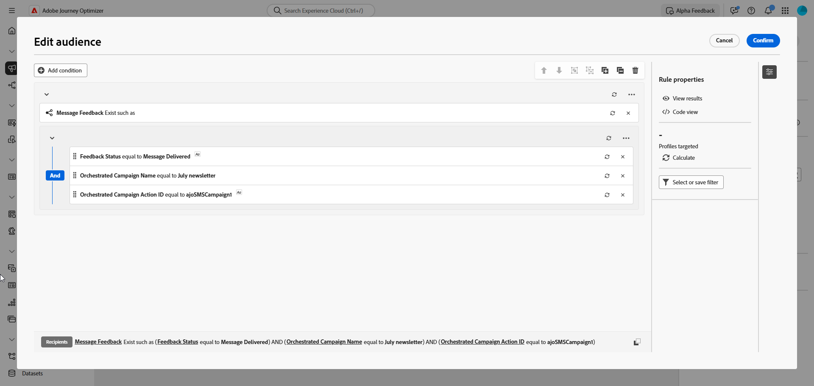
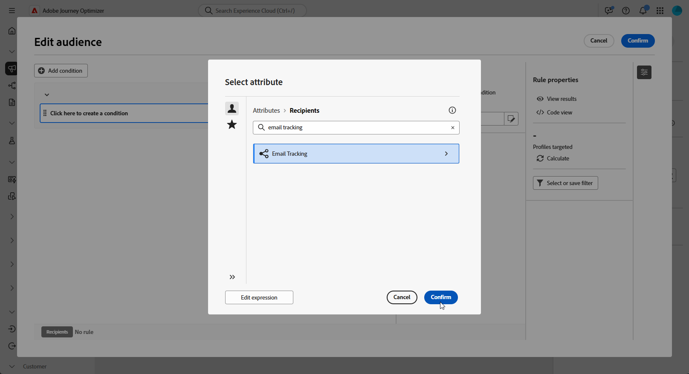
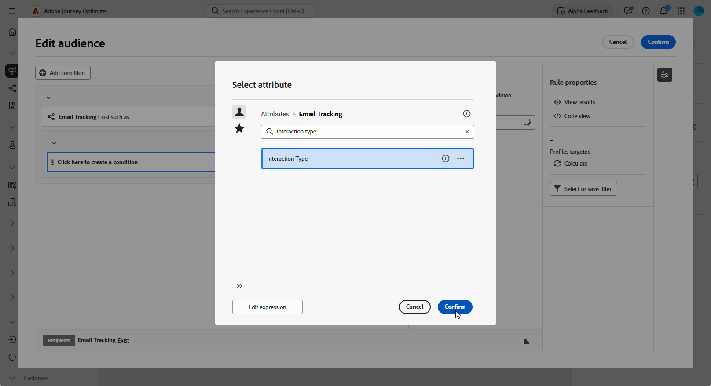
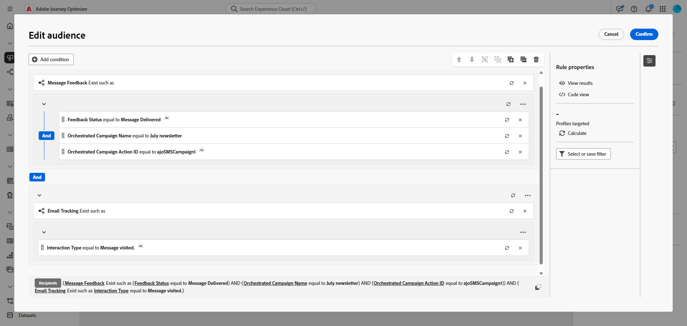

# 建立重新定位查詢 {#retarget}

重新定位可讓您根據收件者對先前已協調行銷活動的回應方式，來追蹤收件者。 例如，您可以傳送第二封電子郵件給已收到但未點按第一封的收件者。

**[!UICONTROL 協調的行銷活動]**&#x200B;為此提供兩個主要屬性：

* **[!UICONTROL 訊息回饋]**：擷取傳遞相關的事件，例如已傳送、已開啟、已退回的訊息等。
* **[!UICONTROL 電子郵件追蹤]**：擷取使用者動作，例如點按和開啟。

{zoomable="yes"}

## 建立意見反應式重新鎖定目標規則 {#feedback-retarget}

回饋式重新目標定位規則可讓您根據&#x200B;**[!UICONTROL 訊息回饋]**&#x200B;屬性中擷取的訊息傳遞事件，重新目標定位收件者。 這些事件包括已傳送、已開啟、已退回或標示為垃圾郵件的郵件等結果。

您可以使用此資料定義規則，識別收到先前訊息的收件者，以啟用根據特定傳遞狀態的後續通訊。

1. 建立新的&#x200B;**[!UICONTROL 協調的行銷活動]**。

1. 新增&#x200B;**[!UICONTROL 建置對象]**&#x200B;活動，並將目標維度設為&#x200B;**[!UICONTROL 收件者(caas)]**。

1. 在&#x200B;**[!UICONTROL 規則產生器]**&#x200B;中，按一下&#x200B;**[!UICONTROL 新增條件]**，然後從&#x200B;**[!UICONTROL 屬性選擇器]**&#x200B;中選取&#x200B;**[!UICONTROL 訊息回饋]**。 按一下&#x200B;**[!UICONTROL 確認]**&#x200B;建立&#x200B;**訊息回饋存在，例如**&#x200B;條件。

   {zoomable="yes"}

1. 選擇&#x200B;**[!UICONTROL 意見狀態]**&#x200B;屬性，以定位訊息傳遞事件。

   +++ 詳細逐步說明

   1. 新增連結到&#x200B;**[!UICONTROL 訊息回饋]**&#x200B;屬性的另一個條件。

   1. 搜尋&#x200B;**[!UICONTROL 意見狀態]**&#x200B;屬性並按一下&#x200B;**[!UICONTROL 確認]**。

      {zoomable="yes"}

   1. 在&#x200B;**[!UICONTROL 自訂條件]**&#x200B;功能表中，於&#x200B;**[!UICONTROL 值]**&#x200B;下拉式清單中選擇要追蹤的傳遞狀態。

      {zoomable="yes"}

   +++

1. 選擇&#x200B;**[!UICONTROL 協調的行銷活動名稱]**&#x200B;屬性，以定位特定的協調行銷活動。

   +++ 詳細逐步說明

   1. 新增連結到&#x200B;**[!UICONTROL 訊息回饋]**&#x200B;屬性的另一個條件，搜尋&#x200B;**[!UICONTROL 實體]**，並導覽至：

      `_experience > CustomerJourneyManagement > Entities > AJO Orchestrated Campaign entity`。

   1. 選取&#x200B;**[!UICONTROL 協調的行銷活動名稱]**。

      {zoomable="yes"}

   1. 在&#x200B;**[!UICONTROL 自訂條件]**&#x200B;功能表中，於&#x200B;**[!UICONTROL 值]**&#x200B;欄位中指定行銷活動名稱。

   +++

1. 選擇&#x200B;**[!UICONTROL 協調的行銷活動動作名稱]**&#x200B;屬性，以針對協調行銷活動內的特定訊息或活動。

   +++ 詳細逐步說明

   1. 新增連結到&#x200B;**[!UICONTROL 訊息回饋]**&#x200B;屬性的另一個條件，搜尋&#x200B;**[!UICONTROL 實體]**，並導覽至：

      `_experience > CustomerJourneyManagement > Entities > AJO Orchestrated Campaign entity`。

   1. 選取&#x200B;**[!UICONTROL 協調的行銷活動動作名稱]**。

      {zoomable="yes"}

   1. 在&#x200B;**[!UICONTROL 自訂條件]**&#x200B;功能表中，於&#x200B;**[!UICONTROL 值]**&#x200B;欄位中指定促銷活動動作名稱。

      按一下活動標籤欄位旁的，即可找到動作名稱。

   +++

1. 或者，您也可以依&#x200B;**[!UICONTROL 促銷活動ID]** (UUID)進行篩選，您可在促銷活動屬性中找到該篩選器。

您現在已設定回饋式重新目標定位規則，以根據先前訊息（例如已傳送、已開啟、已退回或標籤為垃圾訊息）的傳遞狀態來識別收件者。 定義此對象後，您可以新增後續電子郵件，或透過[設定追蹤式重新目標定位規則](#tracking-based)來進一步調整目標定位，此規則會使用使用者互動資料。

{zoomable="yes"}

## 建立追蹤型重新鎖定目標規則 {#tracking-based}

追蹤式重新目標定位規則會使用&#x200B;**[!UICONTROL 電子郵件追蹤]**&#x200B;屬性的資料，根據收件者與訊息的互動來鎖定收件者。 它會擷取使用者動作，例如電子郵件開啟和連結點按。

若要根據訊息互動（例如，開啟或按一下）重新鎖定收件者，請依照下列方式使用&#x200B;**[!UICONTROL 電子郵件追蹤]**&#x200B;實體：

1. 建立新的&#x200B;**[!UICONTROL 協調的行銷活動]**。

1. 新增&#x200B;**[!UICONTROL 建立對象]**&#x200B;活動，並將目標維度設為&#x200B;**[!UICONTROL 收件者(caas)]**，以著重處理先前協調的行銷活動收件者。

1. 在&#x200B;**[!UICONTROL 規則產生器]**&#x200B;中，按一下&#x200B;**[!UICONTROL 新增條件]**，然後從&#x200B;**[!UICONTROL 屬性選擇器]**&#x200B;中選取&#x200B;**[!UICONTROL 電子郵件追蹤]**。

   按一下&#x200B;**[!UICONTROL 確認]**&#x200B;建立&#x200B;**電子郵件追蹤存在，例如**&#x200B;條件。

   {zoomable="yes"}

1. 若要鎖定收件者與訊息的互動，請新增連結至&#x200B;**[!UICONTROL 電子郵件追蹤]**&#x200B;屬性的其他條件，並搜尋&#x200B;**[!UICONTROL 互動型別]**&#x200B;屬性。

   {zoomable="yes"}

1. 從自訂條件選項中，使用&#x200B;**[!UICONTROL 包含在]**&#x200B;中作為運運算元，並根據您的使用案例選取一或多個值，例如&#x200B;**[!UICONTROL 已開啟訊息]**&#x200B;或&#x200B;**[!UICONTROL 已點按訊息連結]**。

   {zoomable="yes"}

您現在已使用&#x200B;**[!UICONTROL 電子郵件追蹤]**&#x200B;屬性的資料，根據收件者與先前訊息（例如電子郵件開啟或連結點按）的互動，設定追蹤式重新目標定位規則以鎖定收件者。 定義此對象後，您可以新增後續動作，或結合[意見型重新目標定位規則](#feedback-retarget)來進一步調整目標定位，以包含已傳送、已退回或標示為垃圾訊息等訊息結果。

{zoomable="yes"}
