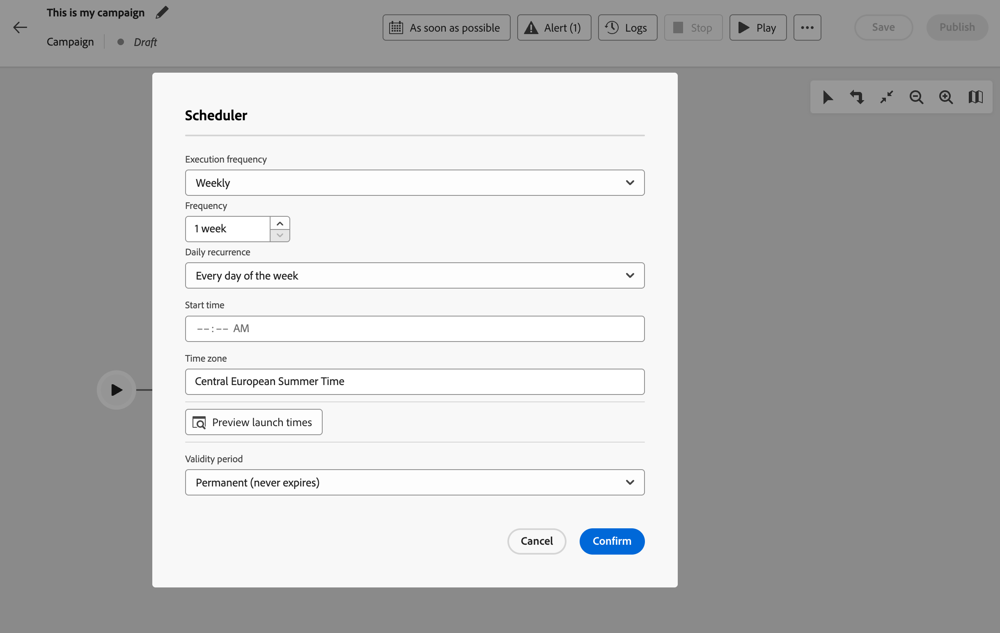
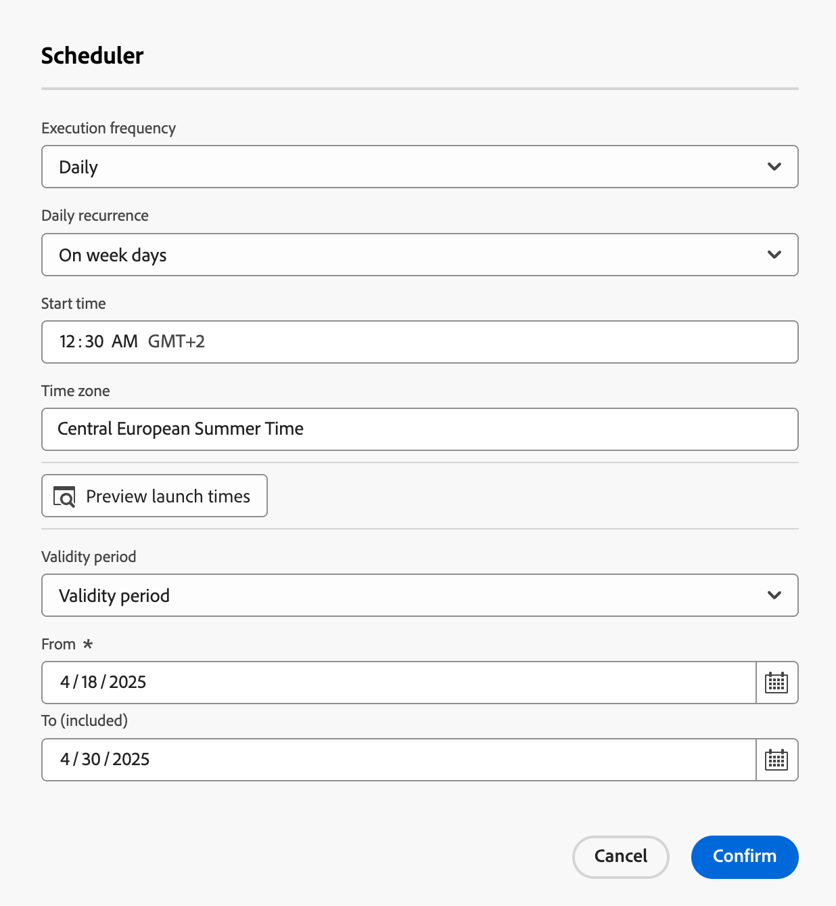

# 安排並開始進行協調過的行銷活動 {#start-monitor}

>[!CONTEXTUALHELP]
>id="ajo_campaign_publication"
>title="發佈協調的行銷活動"
>abstract="若要開始您的行銷活動，您必須發佈該活動。在發佈前，請確定已經清除所有警告。"

+++ 目錄

| 歡迎使用協調的行銷活動 | 啟動您的第一個協調行銷活動 | 查詢資料庫 | 協調的行銷活動活動 |
|---|---|---|---|
| [開始使用協調的行銷活動](gs-orchestrated-campaigns.md)  [設定步驟](configuration-steps.md)  [建立協調行銷活動的重要步驟](gs-campaign-creation.md) | [建立協調的行銷活動](create-orchestrated-campaign.md)  [協調活動](orchestrate-activities.md)  [使用協調的行銷活動傳送訊息](send-messages.md)  [開始並監視行銷活動](start-monitor-campaigns.md)  [報告](reporting-campaigns.md) | [使用規則產生器](orchestrated-rule-builder.md)  [建立您的第一個查詢](build-query.md)  [編輯運算式](edit-expressions.md) | [開始使用活動](activities/about-activities.md)  活動： [並加入](activities/and-join.md) - [建置對象](activities/build-audience.md) - [變更維度](activities/change-dimension.md) - [合併](activities/combine.md) - [重複資料刪除](activities/deduplication.md) - [擴充](activities/enrichment.md) - [分支](activities/fork.md) - [調解](activities/reconciliation.md) - [分割](activities/split.md) - [等待](activities/wait.md) |

{style="table-layout:fixed"}

+++

 

一旦您建立了協調流程並設計了要在畫布中執行的任務，您就可以發佈它並監視其執行方式。

## 排程協調的行銷活動 {#schedule}

>[!CONTEXTUALHELP]
>id="ajo_orchestration_scheduler"
>title="排程器活動"
>abstract="您可以使用行銷活動&#x200B;**排程器**&#x200B;來安排協調過的行銷活動之開始時間。此活動應視為已排程的開始。僅可做為協調的行銷活動的第一個活動。"

身為行銷活動經理，您可以排程行銷活動以於特定時間自動啟動，為行銷通訊提供精確的時間與準確的目標定位資料。

### 最佳作法 {#scheduler-best-practices}

* 請勿將精心安排的行銷活動排程為超過每15分鐘執行一次，因為它可能會阻礙整體系統效能並在資料庫中建立區塊。
* 如果您想在協調的行銷活動中傳送單次訊息，可將其設定為執行&#x200B;**一次**。
* 如果您想要在協調的行銷活動中傳送循環訊息，您必須使用&#x200B;**排程**&#x200B;選項並設定執行頻率。 循環傳遞活動不允許您定義排程。

### 設定行銷活動排程 {#scheduler-configuration}

>[!CONTEXTUALHELP]
>id="ajo_orchestration_schedule_validity"
>title="排程器有效性"
>abstract="您可以定義排程器的有效期限。它可以是永久的 (預設)，也可以在特定日期之前有效。"

>[!CONTEXTUALHELP]
>id="ajo_orchestration_schedule_options"
>title="排程器選項"
>abstract="定義排程器的頻率。它可以在特定時刻執行，可每天、每週或每月執行一次或多次。"

請依照下列步驟設定&#x200B;**協調的行銷活動排程**：

1. 在協調的行銷活動畫布上方選取&#x200B;**儘快**&#x200B;按鈕。

1. 設定&#x200B;**執行頻率**：

   * **一次**：協調的行銷活動只執行一次。

   * **每日**：協調的行銷活動在特定時間執行，一天一次。

   * **一天數次：**&#x200B;協調的行銷活動會定期執行數次。 您可以設定在特定時間或定期執行。

   * **每週**：協調的行銷活動會在指定的時間執行，每週執行一或數次。

   * **每月**：協調的行銷活動會在指定的時間執行，每月執行一或數次。 當您需要執行協調的行銷活動時，可以選取月份。 您也可以在月份的指定週日（例如，當月的第二個星期二）設定執行。

     {width="50%" align="left"}

1. 根據所選頻率定義執行詳細資訊。詳細欄位依使用的頻率（時間、重複頻率、指定天數等）而不同。

1. 按一下&#x200B;**預覽啟動時間**&#x200B;以檢查您協調行銷活動接下來十個執行的排程。

1. 定義排程器的有效期間：

   * **永久（永不過期）**：根據指定的頻率執行協調的行銷活動，對時間範圍或反複專案數沒有任何限制。

   * **有效期間**：協調的行銷活動會根據指定的頻率執行，直到特定日期為止。 您必須指定開始和結束日期。

1. 選取&#x200B;**確認**&#x200B;以儲存您的設定。 執行頻率會顯示在協調的行銷活動畫布上方。

>[!TIP]
>
>如果您想要立即開始協調的行銷活動，請儘快保留&#x200B;**預設值**。

### 範例 {#scheduler-example}

在下列範例中，活動已設定為讓協調的行銷活動在2025年10月1日至2026年1月1日這週每天的9點和12點執行兩次。

{width="50%" align="left"}

## 開始協調的行銷活動 {#start}

若要開始協調的行銷活動，請導覽至&#x200B;**[!UICONTROL 行銷活動]**&#x200B;功能表的&#x200B;**[!UICONTROL 協調流程]**&#x200B;標籤，並選取要開始的行銷活動，然後按一下畫布右上角的&#x200B;**[!UICONTROL 播放]**&#x200B;按鈕。

一旦執行協調的行銷活動後，畫布中的每個活動就會依序執行，直到達到協調的行銷活動結束為止。

您可以使用視覺流量即時追蹤目標設定檔的進度。 這可讓您快速識別每個活動的狀態，以及活動中轉換的個人檔案數。

{zoomable="yes"}

在協調的行銷活動中，透過轉變從一個活動傳輸到另一個活動的資料會儲存在臨時工作表中。 此資料可針對每個轉變顯示。 要執行此操作，請選取轉變以在熒幕右側開啟其屬性。

* 按一下&#x200B;**[!UICONTROL 預覽結構描述]**&#x200B;以顯示工作表的結構描述。
* 按一下&#x200B;**[!UICONTROL 預覽結果]**，以視覺化方式呈現所選轉變中傳輸的資料。

{zoomable="yes"}

## 監視行銷活動的執行

### 監視活動執行 {#activities}

每個活動方塊右上角的視覺指示器可讓您檢查其執行：

| 視覺指示器 | 說明 |
|-----|------------|
| {zoomable="yes"}{width="70%"} | 活動目前正在執行。 |
| {zoomable="yes"}{width="70%"} | 活動需要您注意。 這可能涉及確認傳遞的傳送或採取必要行動。 |
| {zoomable="yes"}{width="70%"} | 活動發生錯誤。 若要解決此問題，請開啟協調的行銷活動記錄檔，以取得詳細資訊。 |
| {zoomable="yes"}{width="70%"} | 已成功執行活動。 |

### 監視記錄和任務 {#logs-tasks}

>[!CONTEXTUALHELP]
>id="ajo_campaign_logs"
>title="記錄和任務"
>abstract="**記錄和任務**&#x200B;畫面提供協調的行銷活動執行歷史記錄，記錄所有使用者動作和發生的錯誤。"

監視記錄檔及工作是分析協調行銷活動並確保其正常執行的關鍵步驟。 可從動作工具列及每個活動屬性窗格中的&#x200B;**[!UICONTROL 記錄檔]**&#x200B;圖示存取。

**[!UICONTROL 記錄檔與工作]**&#x200B;功能表提供協調行銷活動執行的歷程記錄，記錄所有使用者動作和遇到的錯誤。

{zoomable="yes"}

提供兩種資訊：

* **[!UICONTROL Log]**&#x200B;索引標籤包含所有已協調行銷活動的執行歷程記錄。 其會按時間順序，對執行的操作和執行錯誤進行索引。
* **[!UICONTROL 任務]**&#x200B;索引標籤詳細說明活動的執行順序。

在這兩個標籤中，您可以選擇顯示的欄及其順序、套用篩選器，並使用搜尋欄位來快速尋找所需的資訊。

## 協調的行銷活動執行命令 {#execution-commands}

右上角的動作列提供可讓您管理協調行銷活動執行的命令。 您可以：

* **[!UICONTROL 開始]** / **[!UICONTROL 繼續]**&#x200B;執行   已協調的行銷活動，接著會採取進行中狀態。 如果協調的行銷活動已暫停，則會繼續，否則會啟動行銷活動，然後啟動初始活動。

* **[!UICONTROL 暫停]**&#x200B;執行協調的行銷活動，接著會呈現「已暫停」狀態。 在繼續之前，不會啟用任何新活動，但不會暫停進行中的作業。

* **[!UICONTROL 停止]**&#x200B;正在執行的協調行銷活動，其狀態會變成「已完成」。 如果可能的話，進行中的作業會被中斷。 您無法從已停止的同一個位置繼續從協調的行銷活動。
