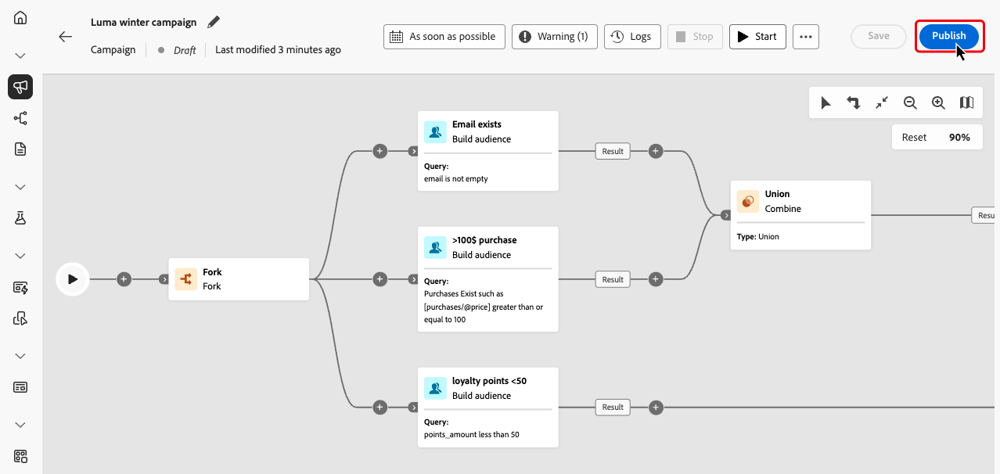
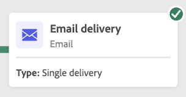
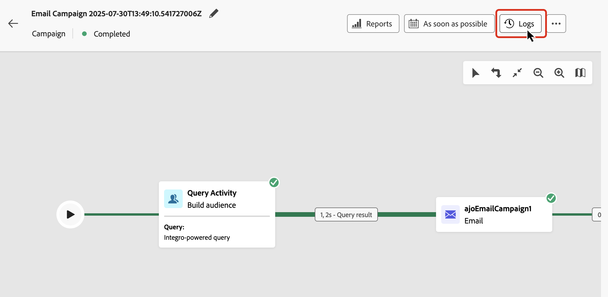
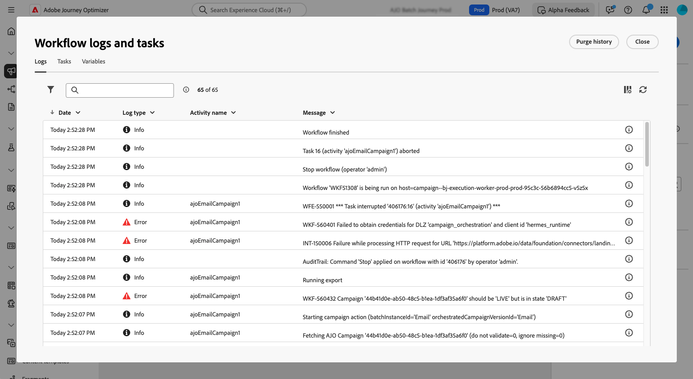

# 開始並監控協調式行銷活動 {#start-monitor}

>[!CONTEXTUALHELP]
>id="ajo_campaign_publication"
>title="發佈協調式行銷活動"
>abstract="若要開始您的行銷活動，您必須發佈該活動。在發佈前，請確定所有錯誤都已清除。"

一旦您建立了協調的行銷活動並設計了要在畫布中執行的任務，您就可以發佈它並監視其執行方式。 您也可以在測試模式下執行行銷活動，以檢查其執行和不同活動的結果。

## 行銷活動生命週期總覽 {#lifecycle}

協調的行銷活動會經過一組已定義的狀態。 發佈工作流程的關鍵階段包括：

| 狀態 | 其含義 |
|---|---|
| **草稿** | 行銷活動正在建置和測試 — 尚未啟用。 |
| **即時** | 行銷活動已發佈且正在執行。 |
| **已關閉** | 週期性行銷活動已關閉以新專案，但作用中設定檔會繼續進行，直到所有活動完成。 |
| **已完成** | 行銷活動執行已完成。 |

>[!NOTE]
>
>如需每個階段的所有狀態（包括「已排程」、「已停止」、「已封存」）和可用動作，請參閱[瞭解行銷活動狀態](../campaigns/manage-campaigns.md#statuses)。

## 發佈前測試您的行銷活動 {#test}

[!DNL Journey Optimizer]可讓您在開始使用前測試協調的行銷活動。 建立行銷活動時，預設會進入&#x200B;**草稿**&#x200B;狀態。 在此狀態下，您可以手動執行行銷活動以測試流量。

>[!IMPORTANT]
>
>畫布中的所有活動都會執行，但&#x200B;**[!UICONTROL 儲存對象]**&#x200B;活動和頻道活動除外。 對您的資料或客群不會造成功能性影響。

若要測試協調的行銷活動，請開啟行銷活動並選取&#x200B;**[!UICONTROL 開始]**。 行銷活動中的每個活動都會依序執行，直到達到畫布結尾為止。

行銷活動畫布工具列中的{zoomable="yes"}

針對&#x200B;**觸發的協調行銷活動**，系統會等待API呼叫啟動行銷活動。 您必須傳送訊號才能繼續測試。 [瞭解如何測試訊號觸發的行銷活動](trigger-orchestrated-campaign.md#complete-and-test)。

在測試期間，您可以使用畫布中的動作列來控制行銷活動的執行。 從那裡，您可以：

* 隨時&#x200B;**停止**&#x200B;執行。
* 再次&#x200B;**開始**&#x200B;執行。
* **重新啟動**&#x200B;執行以重設工作流程，並在單一動作中重新執行。 如果您想要在修改後快速重新測試行銷活動流程，這會特別有用。
* **如果先前已暫停執行，則繼續**&#x200B;執行。

畫布工具列中的&#x200B;**[!UICONTROL 警示]** / **[!UICONTROL 警告]**&#x200B;圖示會通知您發生的問題，包括執行之前可能主動出現的警告，以及在執行期間或執行之後發生的錯誤。

行銷活動畫布工具列中的{zoomable="yes"}

您也可以使用直接顯示在每個活動上的[視覺狀態指標](#activities)，快速識別失敗的活動。如需詳細的疑難排解，請開啟[行銷活動的記錄](#logs-tasks)，其中提供有關錯誤及其內容的深入資訊。

如果您已在畫布中新增頻道活動，您可以使用&#x200B;**[!UICONTROL 模擬內容]**&#x200B;按鈕來預覽和測試訊息的內容。 [瞭解如何使用頻道活動並模擬內容](activities/channels.md#simulate-content-test-profiles)。

>[!TIP]
>
>按一下&#x200B;**[!UICONTROL 發佈]**&#x200B;之前，請確認下列專案：
>* 行銷活動在測試模式下成功執行，[記錄檔](#logs-tasks)中沒有錯誤。
>* 已使用&#x200B;**[!UICONTROL 模擬內容]**&#x200B;預覽訊息內容。
>* 如果這是已排程的行銷活動，則會設定[排程](create-orchestrated-campaign.md#schedule)。
>* 您已檢閱[傳送確認](#confirm-sending)行為 — 對於非週期性行銷活動，在您明確核准發佈後的傳送之前，不會傳送任何訊息。

## 發佈此行銷活動 {#publish}

在您的行銷活動經過測試且準備就緒後，按一下「**[!UICONTROL 發佈]**」，讓行銷活動上線。

行銷活動畫布中的{zoomable="yes"}

>[!NOTE]
>
>如果&#x200B;**[!UICONTROL 發佈]**&#x200B;按鈕已停用（灰色），請從動作列存取記錄檔並檢查錯誤訊息。 所有錯誤必須先修正，才能發佈行銷活動。

視覺流量會重新啟動，而真實設定檔會開始即時流過歷程。

如果發佈動作失敗（例如，由於缺少訊息內容），您會收到警報，必須在重試之前修正問題。 成功發佈後，行銷活動就會開始執行（立即或依排程）、從&#x200B;**草稿**&#x200B;移至&#x200B;**即時**&#x200B;狀態，並變成「唯讀」。

>[!IMPORTANT]
>
>對於非循環行銷活動，訊息傳送會在發佈後暫停，直到您從管道活動的屬性窗格明確確認傳送為止。 此行銷活動將顯示為&#x200B;**即時**，但在確認之前不會傳送任何訊息。 [了解更多](#confirm-sending)

### 發佈時間執行順序 {#publication-sequence}

當您按一下&#x200B;**[!UICONTROL 發佈]**&#x200B;時，會在內部發生下列順序：

1. **排程器啟動** — 如果行銷活動已設定[排程](create-orchestrated-campaign.md#schedule)，排程器會在定義的時間啟動並觸發執行。
1. **儲存對象活動會先執行** — 工作流程中的任何[儲存對象](activities/save-audience.md)活動都會在訊息活動之前執行。 對象殼層是在[對象入口網站](../audience/about-audiences.md#browse)中建立的，且合格的設定檔會開始擷取。
1. **訊息執行開始** — [通道活動](activities/channels.md)開始處理工作流程中的第一個訊息活動。
1. **設定檔快照集查詢** — 設定檔資料會針對在發行集時拍攝的快照集進行解析，而非即時設定檔。 這可確保整個執行的一致性。
1. **同意評估** — 對於相符的設定檔，會直接從設定檔記錄接受同意。 傳送時不會重新評估同意。 [進一步瞭解同意管理](../action/consent.md)
1. **即時設定檔建立** — 在執行期間會即時建立與現有記錄不符的設定檔。
1. **傳遞記錄建立** — 傳遞事件記錄在[`ajo_message_feedback_event`](../data/datasets-query-examples.md#message-feedback-event-dataset)資料集中，這是傳遞記錄和傳送後驗證的主要來源。

若要在執行後驗證結果，請使用Journey Optimizer報告功能。 [進一步瞭解協調的行銷活動報告](reporting-campaigns.md)

## 將行銷活動恢復為草稿 {#back-to-draft}

**[!UICONTROL 返回草稿]**&#x200B;功能可讓您取消發佈，並在特定情況下將協調的行銷活動還原為草稿狀態。 這是為了當作復原機制而設計，可在傳送任何訊息之前修正問題，同時維持促銷活動生命週期的完整性。

此選項適用於兩種情況：

* **排程行銷活動等待執行**：當行銷活動排程在特定時間執行且尚未到達該時間時，您可以使用回到草稿來檢閱和修改行銷活動，然後再開始執行。 但是，如果行銷活動為週期性行銷活動（例如每日排程的行銷活動），且已發生至少一次執行，則此選項不再可用。 在這種情況下，您應該改為[複製行銷活動](../campaigns/manage-campaigns.md#duplicate-a-campaign)。

* **發生執行錯誤的即時行銷活動**：當行銷活動在執行期間遇到錯誤且已暫停，而且尚未完成任何行銷活動執行時，您可以使用回到草稿來修正錯誤並重新發佈行銷活動。

若要將行銷活動切換回草稿狀態，請開啟協調的行銷活動，然後按一下行銷活動畫布工具列中的&#x200B;**[!UICONTROL 返回草稿]**&#x200B;按鈕。

行銷活動會取消發佈，而工作流程會停止。 行銷活動會傳回&#x200B;**草稿**&#x200B;狀態。 您現在可以修正已識別的問題，然後[測試行銷活動](#test)並在準備就緒時再次[發佈](#publish)。

## 確認訊息傳送 {#confirm-sending}

根據預設，對於非週期性協調的行銷活動，訊息傳送會暫停，直到您明確核准傳送為止。 發佈行銷活動後，從管道活動的屬性窗格確認傳送請求。 在確認之前，頻道活動會維持擱置中，不會傳送任何訊息。

發佈之前，您可以從管道活動屬性窗格停用傳送確認。 如需詳細資料，請參閱[確認傳送訊息](activities/channels.md#confirm-message-sending)。

## 監視行銷活動的執行 {#monitor}

### 視覺流量監視 {#flow}

在執行時（在測試或即時模式下），視覺流程會顯示設定檔如何即時穿越歷程。 畫面上會顯示任務之間轉變的設定檔數目。

{zoomable="yes"}

透過轉變從一個活動傳輸到另一個活動的資料會儲存在暫時工作表中。此資料可針對每個轉變顯示。若要檢查在活動之間傳遞的資料：

1. 選取轉變。
1. 在屬性窗格中，按一下「**[!UICONTROL 預覽結構描述]**」以檢視工作表結構描述。選取「**[!UICONTROL 預覽結果]**」以檢視傳輸的資料。

   {zoomable="yes"}

您現在可以檢查在活動之間傳遞的資料，以驗證行銷活動流程，並確認每個活動都在處理預期的設定檔。

### 活動執行指標 {#activities}

視覺狀態指標可協助您了解每個活動的執行方式：

| 視覺指標 | 說明 |
|-----|------------|
| {zoomable="yes"}{width="70%"} | 活動目前正在執行。 |
| {zoomable="yes"}{width="70%"} | 活動需要您注意。 這可能涉及確認傳遞的傳送或採取必要行動。 |
| {zoomable="yes"}{width="70%"} | 活動發生錯誤。 若要解決此問題，請開啟協調的活動記錄檔，以取得詳細資訊。 |
| {zoomable="yes"}{width="70%"} | 已成功執行活動。 |

### 記錄和任務 {#logs-tasks}

>[!CONTEXTUALHELP]
>id="ajo_campaign_logs"
>title="記錄和任務"
>abstract="**記錄和任務**&#x200B;畫面提供執行協調的行銷活動的歷史記錄，其中記錄所有使用者動作和發生的錯誤。"

監視記錄檔和任務是分析協調行銷活動並確保其正常執行的關鍵步驟。 可從畫布工具列的&#x200B;**[!UICONTROL 記錄檔]**&#x200B;按鈕存取記錄檔和工作，該按鈕在測試和即時模式下均可用。

行銷活動畫布工具列中的{zoomable="yes"}

**[!UICONTROL 記錄和任務]**&#x200B;畫面提供執行行銷活動的完整歷史記錄，其中記錄所有使用者動作和發生的錯誤。

顯示行銷活動執行歷程記錄的{zoomable="yes"}

可用的資訊類型有兩種：

* 「**[!UICONTROL 記錄]**」索引標籤包含所有作業和錯誤的時間順序歷史記錄。
* 「**[!UICONTROL 任務]**」索引標籤詳細說明了活動的逐步執行順序。

在這兩個標籤中，您可以選擇顯示的欄及其順序，套用篩選器，並使用搜尋欄位來快速尋找所需的資訊。

## 後續步驟 {#next}

開始協調行銷活動畫布後，您可以使用Journey Optimizer報告功能來獲得見解，例如瞭解受眾行為並測量客戶歷程中每個步驟的績效。 [進一步瞭解協調的行銷活動報告](../orchestrated/reporting-campaigns.md)

有關於協調行銷活動的問題？ 如需從業人員最常見問題的解答，請檢視[協調行銷活動常見問題集](orchestrated-campaigns-faq.md)。
