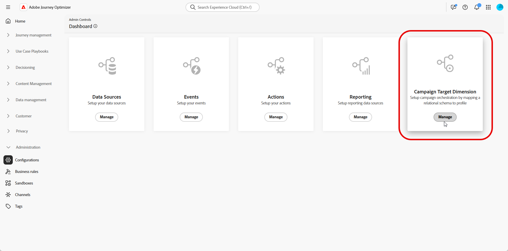
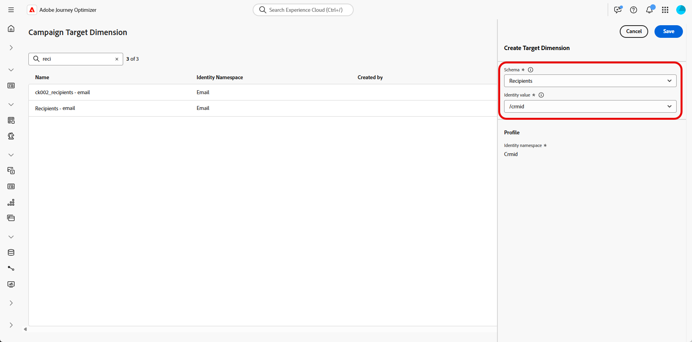
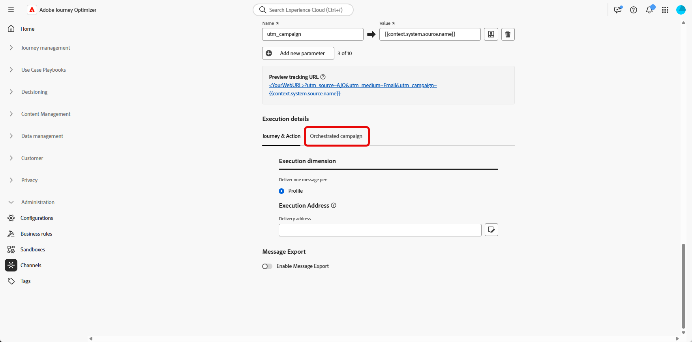
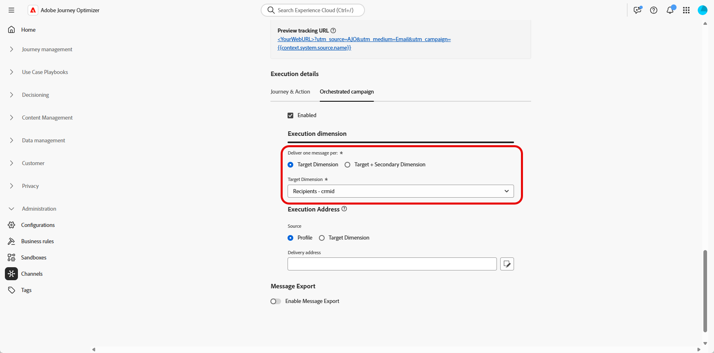

# 設定目標維度 {#configuration}

+++ 目錄

| 歡迎使用協調行銷活動 | 首次投放的協調行銷活動 | 查詢資料庫 | 協調行銷活動 |
|---|---|---|---|
| [開始使用協調的行銷活動](gs-orchestrated-campaigns.md)  建立和管理關聯式結構描述和資料集：  <ul><li>[開始使用結構描述和資料集](gs-schemas.md)</li><li>[手動結構描述](manual-schema.md)</li><li>[檔案上傳結構描述](file-upload-schema.md)</li><li>[擷取資料](ingest-data.md)</li></ul>[存取及管理協調的行銷活動](access-manage-orchestrated-campaigns.md)  [建立協調行銷活動的重要步驟](gs-campaign-creation.md)  [設定Target維度](target-dimension.md) | <b>[建立並排程行銷活動](create-orchestrated-campaign.md)</b>  [協調活動](orchestrate-activities.md)  [開始並監視行銷活動](start-monitor-campaigns.md)  [報告](reporting-campaigns.md) | [使用規則產生器](orchestrated-rule-builder.md)  [建立您的第一個查詢](build-query.md)  [編輯運算式](edit-expressions.md)  [重定向](retarget.md) | [開始使用活動](activities/about-activities.md)  活動： [同時加入](activities/and-join.md) - [建立客群](activities/build-audience.md) - [變更維度](activities/change-dimension.md) - [頻道活動](activities/channels.md) - [合併](activities/combine.md) - [重複資料刪除](activities/deduplication.md) - [擴充](activities/enrichment.md) - [分支](activities/fork.md) - [調和](activities/reconciliation.md) - [儲存客群](activities/save-audience.md) - [分割](activities/split.md) - [等待](activities/wait.md) |

{style="table-layout:fixed"}

+++

 

>[!BEGINSHADEBOX]

 

此頁面上的內容不是最終內容，可能會有變動。

>[!ENDSHADEBOX]

在許多情況下，單一客戶設定檔可連結至多個相關實體，例如訂閱、服務合約或裝置，每個實體有其專屬的識別碼和通訊需求。

透過&#x200B;**協調的行銷活動**，您現在可以使用&#x200B;**Adobe Experience Platform的關聯式結構描述功能**，在實體層級設計和傳遞目標通訊。 這可讓您為每個實體而不是每個收件者劃分割槽段、個人化和報告。

## 建立您的目標維度 {#targeting-dimension}

單一客戶設定檔可與多個相關實體建立關聯，例如合約、裝置或訂閱，每個實體都有自己的唯一識別碼。 此設定可讓您分別針對每個實體進行定位、劃分及報告。

首先，將關聯式結構描述對應至客戶設定檔，以設定行銷活動協調流程。

1. 從&#x200B;**[!UICONTROL 管理]**，存取&#x200B;**[!UICONTROL 組態]**&#x200B;功能表並選取&#x200B;**[!UICONTROL Campaign Target Dimension]**。

   

1. 按一下&#x200B;**[!UICONTROL 建立]**&#x200B;以開始建立您的&#x200B;**[!UICONTROL 目標維度]**。

1. 從下拉式清單中選擇您先前設定的[結構描述](gs-schemas.md)&#x200B;。

1. 選取代表您要鎖定之實體的&#x200B;**[!UICONTROL 身分值]**。

   在此範例中，客戶設定檔連結到多個訂閱，每個訂閱在`crmID`結構描述中由唯一的`Recipient`表示。 透過設定&#x200B;**[!UICONTROL Target Dimension]**&#x200B;使用`Recipient`結構描述及其`crmID`身分，您可以在訂閱層級傳送訊息，而非傳送至主要客戶設定檔，確保每個合約或服務內容都能收到自己的個人化訊息。

   [請到 Adobe Experience Platform 文件](https://experienceleague.adobe.com/zh-hant/docs/experience-platform/xdm/schema/composition#identity)那邊，了解更多相關資訊。

   

1. 按一下&#x200B;**[!UICONTROL 儲存]**&#x200B;以完成設定。

設定&#x200B;**[!UICONTROL 目標Dimension]**&#x200B;後，繼續建立和設定您的&#x200B;**[!UICONTROL 通道設定]**，並定義對應的&#x200B;**[!UICONTROL 執行詳細資料]**。

## 設定您的頻道設定 {#channel-configuration}

設定&#x200B;**[!UICONTROL 目標Dimension]**&#x200B;後，您需要設定電子郵件或簡訊&#x200B;**[!UICONTROL 頻道設定]**，並定義適當的&#x200B;**[!UICONTROL 執行詳細資料]**。 這可確保使用正確的身分和目標定位邏輯來傳送訊息。

1. 從建立和設定您的&#x200B;**[!UICONTROL 頻道設定]**&#x200B;開始。

   您也可以更新現有的&#x200B;**[!UICONTROL 頻道設定]**。

   ➡️ [請依照此頁面中詳述的步驟操作](../email/surface-personalization.md)

1. 從&#x200B;**[!UICONTROL 通道設定]**&#x200B;的&#x200B;**[!UICONTROL 執行詳細資料]**&#x200B;區段，存取&#x200B;**[!UICONTROL 協調的行銷活動]**&#x200B;標籤。

   

1. 按一下&#x200B;**[!UICONTROL 已啟用]**，使其與協調的行銷活動相容。

1. 選擇您的傳送方式：

   * **[!UICONTROL 目標Dimension]**：傳送給主要實體，例如，收件者。

   * **[!UICONTROL 目標+次要Dimension]**：使用主要和次要實體來傳送，例如，收件者+合約。

1. 從下拉式清單中選取您先前建立的[目標Dimension](#targeting-dimension)。

   

1. 在&#x200B;**[!UICONTROL 執行地址]**&#x200B;區段下，選擇應該使用哪個&#x200B;**[!UICONTROL Source]**&#x200B;來擷取傳遞地址，例如電子郵件地址或電話號碼：

   * **[!UICONTROL 設定檔]**：如果傳遞地址（例如電子郵件）直接儲存在主要客戶設定檔中，請選取此選項。

     在向主要客戶傳送訊息（而非特定的關聯實體）時非常有用。

   * **[!UICONTROL 目標Dimension]**：如果傳遞地址儲存在相關實體（例如收件者或訂閱）中，請選擇此專案。

     當每個收件者都有自己的傳遞地址（例如不同的電子郵件或電話號碼）時，這非常有用。

1. 從&#x200B;**[!UICONTROL 傳遞地址]**&#x200B;欄位中，按一下以選擇要用於訊息傳遞的特定欄位。

   

1. 設定之後，按一下&#x200B;**[!UICONTROL 提交]**。

您的頻道現在已準備好搭配&#x200B;**協調的行銷活動**&#x200B;使用，將會根據選取的目標維度傳遞訊息。
