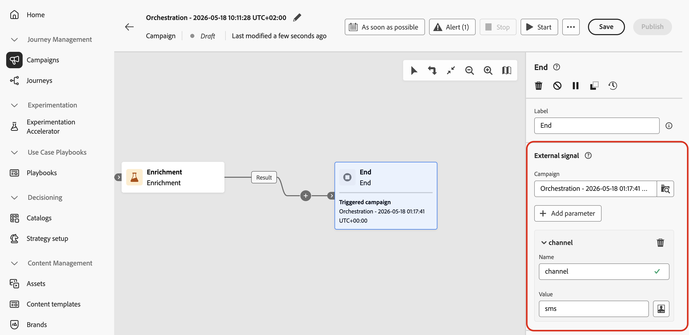

# 使用訊號觸發協調的行銷活動 {#trigger-signal}

您可以使用訊號（而非固定排程）來開始協調的行銷活動。 行銷活動收到訊號時，就會執行，而您可以在裝載中傳遞引數。 變數可用作目標、條件或運算式的變數。

訊號可能來自下列其中一項：

* REST API — 您的應用程式或整合會呼叫觸發端點（請參閱[發佈並觸發行銷活動](#publish)和[API參考](https://developer.adobe.com/journey-optimizer-apis/references/oc-trigger){target="_blank"}）。
* 另一個協調的行銷活動 — 上遊行銷活動的&#x200B;**[!UICONTROL End]**&#x200B;活動會在分支完成時傳送相同型別的訊號。 [瞭解如何設定結束活動](#signal-end)。

此頁面說明如何設定接收訊號（排程、引數、測試、發佈）的行銷活動，以及如何從API或&#x200B;**[!UICONTROL 結束]**&#x200B;活動引發訊號。 變數可用後，如需如何在規則和&#x200B;**[!UICONTROL 測試]**&#x200B;條件中使用變數的詳細資訊，請參閱[在協調的行銷活動中使用變數](variables-orchestrated-campaigns.md)。

如需觸發器端點的完整REST規格（路徑、標頭、內文、回應和錯誤），請參閱Adobe Journey Optimizer API檔案中的[觸發器協調的行銷活動API](https://developer.adobe.com/journey-optimizer-apis/references/oc-trigger){target="_blank"}。

使用訊號觸發協調行銷活動的端對端程式：

1. [排程要由訊號觸發的行銷活動](#configure-signal)
1. [新增訊號承載的引數](#parameters) （選擇性）
1. [建置及測試行銷活動](#build-and-test)
1. [發佈並觸發行銷活動](#publish)

>[!NOTE]
>
>若要使用訊號觸發協調的行銷活動，您需要&#x200B;**[!DNL Publish orchestrated campaigns]**&#x200B;許可權(`orchestrated-campaign.publish`)。 請參閱[內建許可權](../administration/ootb-permissions.md)。

## 排程要由訊號觸發的行銷活動 {#configure-signal}

若要將協調的行銷活動設為從訊號而非排程開始，請遵循下列步驟：

1. 使用訊號開啟您要觸發的「協調流程」行銷活動。

1. 開啟排程設定。 [瞭解如何排程協調的行銷活動](create-orchestrated-campaign.md#schedule)。

1. 選取&#x200B;**[!UICONTROL 由訊號觸發]**，讓行銷活動等待訊號而不是依排程執行。

   {zoomable="yes"}

## 新增訊號承載的引數（選擇性） {#parameters}

您可以在觸發訊號中傳遞引數，並在執行內容中的行銷活動中使用這些引數，例如，在鎖定目標、條件或運算式中。 先在排程設定中定義每個引數，然後在您呼叫觸發程式API或您從上游促銷活動的&#x200B;**[!UICONTROL End]**&#x200B;活動對應引數時，傳遞其值（[請參閱以下的](#signal-end)）。

1. 開啟行銷活動排程器，並選取&#x200B;**[!UICONTROL 新增引數]**。

1. 定義要在訊號裝載中傳送的每個引數名稱和資料型別。 您也可以提供&#x200B;**測試值**，當您在測試模式中觸發行銷活動時，將會使用這些值。 [瞭解如何測試觸發的行銷活動](#build-and-test)。

   {zoomable="yes"}

>[!NOTE]
>
>對於由REST API觸發的協調行銷活動，如果您在排程器未定義的API呼叫中傳遞引數，API呼叫仍會成功，且引數會傳播，您可在運算式中使用。 不過，協調的行銷活動介面將無法協助您使用它，例如，「測試」活動不會列出或顯示排程器中未定義的引數。

## 測試行銷活動 {#build-and-test}

在畫布上建立您的行銷活動，然後透過REST API傳送訊號，在發佈之前在&#x200B;**[!UICONTROL 草稿]**&#x200B;中測試。

* **由REST API觸發的協調行銷活動** — 使用下列步驟在草稿中執行行銷活動，並在發佈之前驗證鎖定目標、引數和傳遞邏輯。

* **由End活動觸發的協調行銷活動** — 您無法在草稿中執行完整的端對端鏈結：一旦發佈上遊行銷活動，其&#x200B;**[!UICONTROL End]**&#x200B;活動只會啟動已發佈的下遊行銷活動。 若要在兩個行銷活動發佈之前測試下游端，請將該行銷活動保留在&#x200B;**[!UICONTROL 草稿]**&#x200B;中，在排程器中設定訊號引數的&#x200B;**[!UICONTROL 測試值]** （[新增訊號承載的引數](#parameters)），然後遵循下列API步驟。 觸發程式API呼叫在執行階段使用與&#x200B;**[!UICONTROL End]**&#x200B;活動相同的裝載，因此您可以在發佈下遊行銷活動並設定上游&#x200B;**[!UICONTROL End]**&#x200B;活動（[從其他行銷活動的End活動](#signal-end)觸發程式）之前，先驗證引數路由和畫布邏輯。

1. 在畫布上新增並連結活動（對象、目標定位、傳送）。 [了解如何協調行銷活動](orchestrate-activities.md)

1. 如果您已在訊號中定義引數，則可以將它們匯入畫布邏輯（例如，在條件或目標定位中）。 在此範例中，&quot;channel&quot;引數是當作&#x200B;**[!UICONTROL 測試]**&#x200B;活動中的條件。

   

   若要在運算式編輯器中使用訊號引數（例如，在&#x200B;**[!UICONTROL 建立對象]**&#x200B;活動中建立查詢），請在運算式欄位中輸入`$(vars/@<parameterName>)`。 以排程器中定義的引數名稱取代`<parameterName>`，例如`$(vars/@channel)`。 [瞭解如何使用運算式編輯器](edit-expressions.md)。

1. 開啟行銷活動排程器，選取「**[!UICONTROL 複製API請求]**」並選擇格式（cURL或HTTP請求）。

   複製的資訊包括協調的行銷活動ID、沙箱名稱、組織ID以及引數的測試值（如果您已新增某些值）。

   

   +++包含引數和測試值的範例cURL請求

   ```bash
   POST https://platform.adobe.io/ajo/campaign-orchestration/orchestratedCampaigns/1c7529c7-7a8c-491a-a2c6-3d8131d2e17d/trigger
   
   Headers:
   Authorization: Bearer ## Access token ##
   Content-Type: application/json
   x-api-key: ## Provide API Key here ##
   x-api-version: 1
   x-gw-ims-org-id: 123456ABCDEFG@LumaOrg
   x-sandbox-name: prod
   
   Body:
   {
   "variables": {
      "channel": "sms"
   }
   }
   ```

   +++

1. 按一下&#x200B;**[!UICONTROL 開始]**&#x200B;以開始行銷活動。

1. 使用您從排程器複製的範例要求傳送觸發API呼叫。 如需要求與回應的詳細資訊，請參閱[觸發協調的行銷活動API](https://developer.adobe.com/journey-optimizer-apis/references/oc-trigger){target="_blank"}。

對測試結果感到滿意時，[發佈行銷活動](#publish)。

## 發佈並觸發行銷活動 {#publish}

在您[測試行銷活動](#build-and-test)之後，請發佈該行銷活動，以便從您的應用程式或其他行銷活動的&#x200B;**[!UICONTROL 結束]**&#x200B;活動接收訊號。 [進一步瞭解如何啟動及監視行銷活動](start-monitor-campaigns.md#publish)。

然後您可以從REST API或其他促銷活動的&#x200B;**[!UICONTROL End]**&#x200B;活動觸發它。 請參閱下列各節。

### 使用REST API傳送訊號 {#publish-api}

發佈後，每次從您自己的應用程式觸發行銷活動時，請依照下列步驟操作：

1. 開啟行銷活動排程器，選取「**[!UICONTROL 複製API請求]**」並選擇格式（cURL或HTTP請求）。

   複製的資訊包括協調的行銷活動ID、沙箱名稱、組織ID以及引數（如果您已新增一些的話）。

   

1. 從您的系統呼叫觸發程式API。 如需即時端點規格，請參閱[Trigger Orchestrated行銷活動API](https://developer.adobe.com/journey-optimizer-apis/references/oc-trigger){target="_blank"}。

   >[!IMPORTANT]
   >
   >對於即時協調的行銷活動，節流護欄會強制兩個API觸發程式執行之間的最小間隔為一小時。 如果您在該間隔經過前再次呼叫API，則API會傳回HTTP 429 （太多請求）。 當您觸發草稿版本以進行測試時，不會套用此護欄。

   如果您將引數新增至訊號裝載，則行銷活動執行時，您在API呼叫中傳遞的值會顯示為行銷活動事件變數。 若要進行檢查，請從行銷活動畫布工具列開啟行銷活動記錄。 在&#x200B;**[!UICONTROL 工作]**&#x200B;標籤中，識別與訊號對應的工作，然後按一下鉛筆圖示以存取相關的事件變數。 [瞭解如何存取記錄檔和工作](start-monitor-campaigns.md#logs-tasks)。

   {zoomable="yes"}

### 從其他行銷活動的「結束」活動傳送訊號 {#signal-end}

使用此路徑鏈結協調的行銷活動：當上遊行銷活動完成分支時，**[!UICONTROL End]**&#x200B;活動會傳送訊號給已設定為&#x200B;**[!UICONTROL 由訊號]**&#x200B;觸發的下遊行銷活動。 這可讓您重複使用較小的行銷活動，並從每個呼叫者傳遞不同的裝載。

>[!NOTE]
>
>* 您可以在相同畫布上使用數個&#x200B;**[!UICONTROL End]**&#x200B;活動，並設定每個活動以觸發不同的下遊行銷活動。
>* 數個行銷活動可以觸發相同的下遊行銷活動。 每個呼叫都可以傳送不同的裝載。

在應先執行的行銷活動上，遵循下列步驟：

1. 開啟應傳送訊號的「已協調」行銷活動，並在分支結尾選取&#x200B;**[!UICONTROL End]**&#x200B;活動，該活動必須在下遊行銷活動開始之前完成。
1. 在&#x200B;**[!UICONTROL 外部訊號]**&#x200B;區段中，選取要觸發的下遊行銷活動。

1. 選擇性地新增引數：使用與下游促銷活動排程相同的名稱，並設定每個值。

   

1. 若要在發佈行銷活動之前，先以草稿模式測試下遊行銷活動，請依照[測試行銷活動](#build-and-test)區段中的步驟，以REST API在草稿中觸發它。

上遊行銷活動執行到足以達到觸發它的&#x200B;**[!UICONTROL End]**&#x200B;活動之前，必須發佈下遊行銷活動。 如果未發佈目標促銷活動時傳送訊號，執行將會失敗。 發佈下遊行銷活動，然後視需要繼續或重新啟動。
