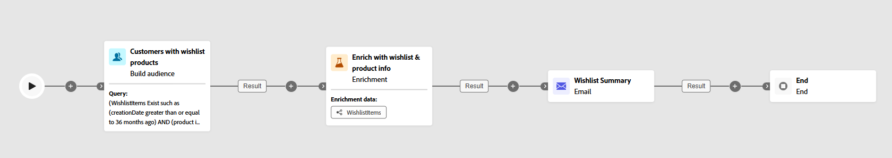
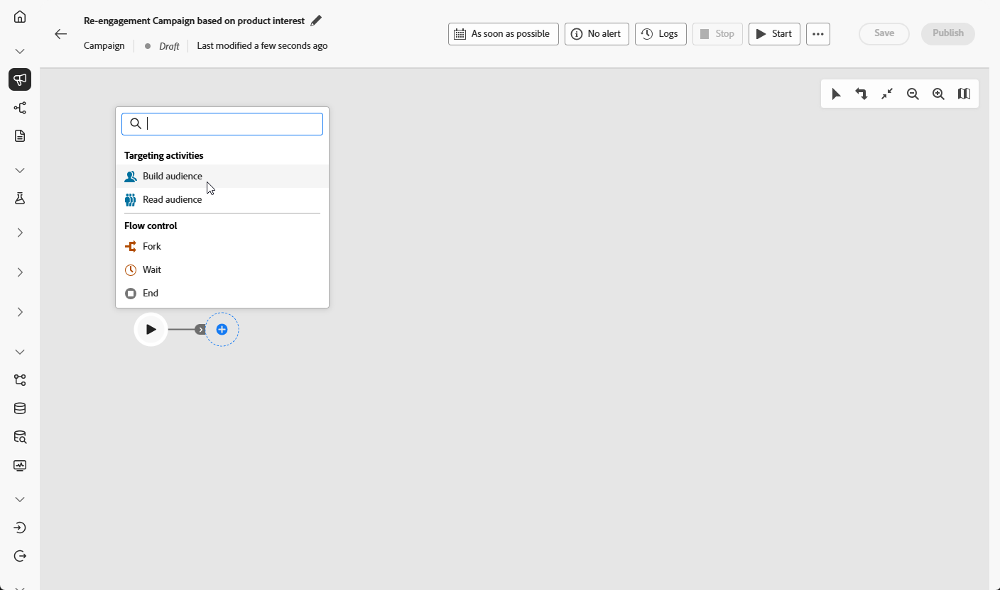
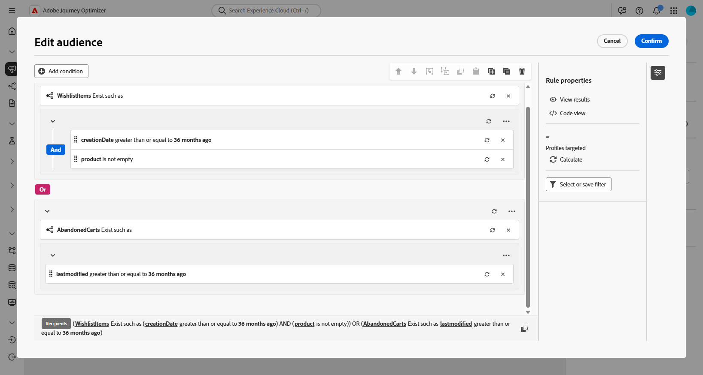
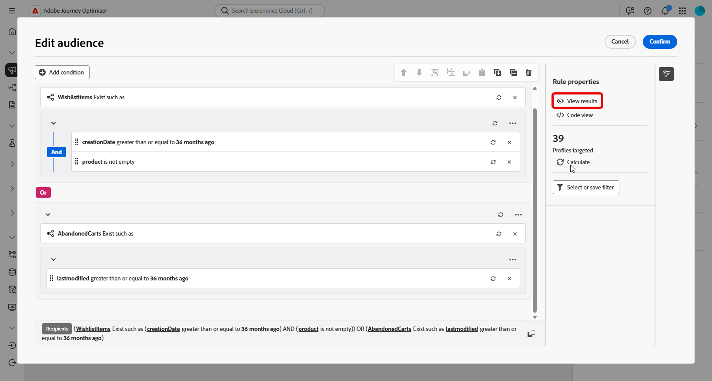
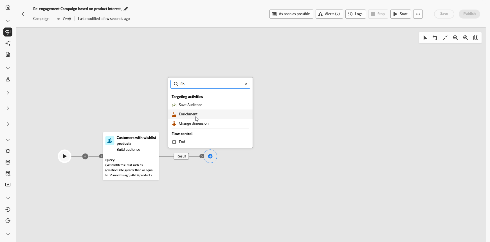
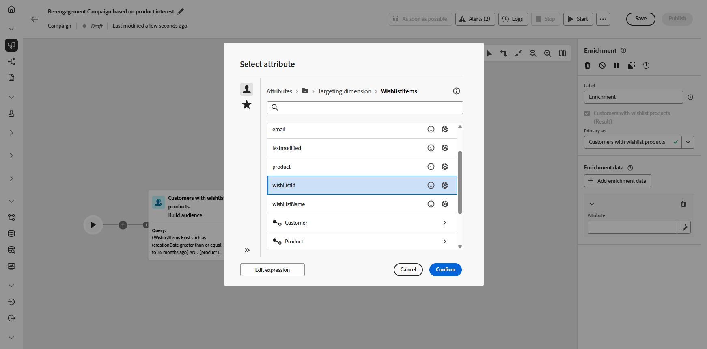
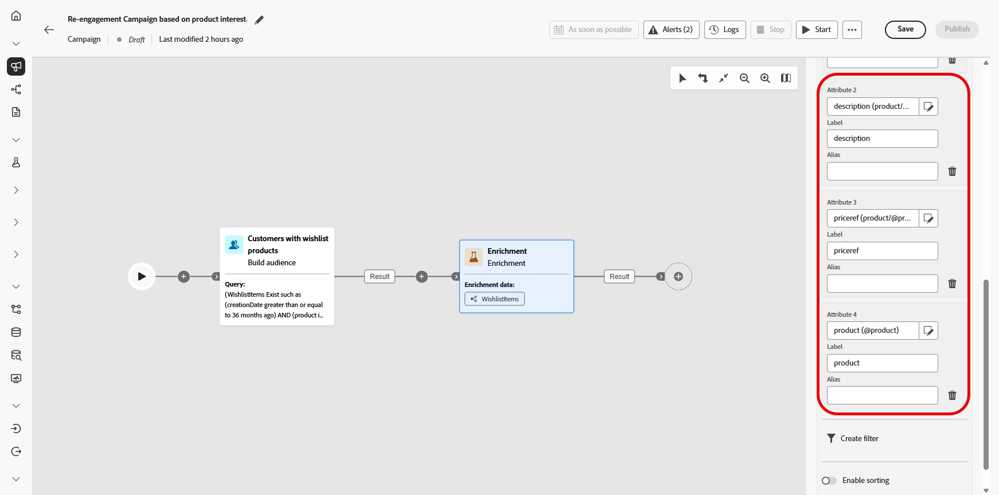
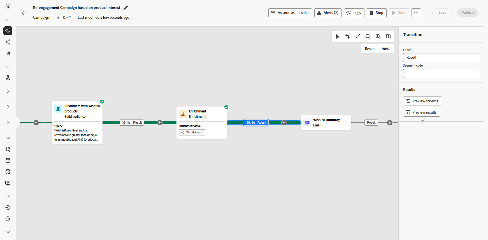

# 傳送願望清單專案更新 {#wishist-uc}

>[!BEGINSHADEBOX]

雖然此範例使用&#x200B;**Wishlist**&#x200B;結構描述，但相同的方法適用於任何與&#x200B;**收件者**&#x200B;具有一對多關係的實體，例如&#x200B;**購買**、**訂閱**，或任何自訂結構描述，其中每個收件者可能有多個關聯記錄。

**此使用案例所需的結構描述：**

* **收件者**：用作目標維度
* **WishlistItems**：包含欄位： `creationDate`、`product`、`Wishlistid`
* **產品**：包含欄位： `description`、`priceref`、`imageurl`
* **放棄的購物車** （選擇性）：包含欄位： `lastmodified`

➡️ [瞭解如何設定以模型為基礎的結構描述](gs-schemas.md)

>[!ENDSHADEBOX]

{zoomable="yes"}

這項精心安排的行銷活動著重於透過提醒訪客儲存至願望清單的產品來重新吸引訪客。 使用Campaign Orchestration，根據願望清單活動以條件定義對象，協助促進訪客回頭轉換。

1. 首先，建立專門針對希望清單重新參與的新行銷活動。 這將有助於將傳訊重點放在其已儲存專案以顯示購買意圖的客戶上。

   {zoomable="yes"}

1. 填寫您的&#x200B;**行銷活動設定**。

1. 新增&#x200B;**[!UICONTROL 建立對象]**&#x200B;活動，以根據願望清單行為識別要定位的客戶群組。

   {zoomable="yes"}

1. 設定此對象的描述性&#x200B;**[!UICONTROL 標籤]**，並選擇&#x200B;**[!UICONTROL 收件者]**&#x200B;作為&#x200B;**[!UICONTROL 目標維度]**。 然後按一下[繼續]&#x200B;**&#x200B;**&#x200B;來設定對象。

1. 按一下&#x200B;**[!UICONTROL 新增條件]**，建立下列條件以精簡您的對象：

   `WishlistItems Exist such as (creationDate greater than or equal to 36 months ago) AND (product is not empty`
或
   `AbandonedCarts Exist such as lastmodified greater than or equal to 36 months ago`

   此對象是根據具有願望清單、包含具有產品影像的專案，或在定義的時間範圍內有放棄的購物車的收件者。

   {zoomable="yes"}

1. 按一下&#x200B;**[!UICONTROL 計算]**&#x200B;以檢視受這些條件影響的設定檔數目，並按一下&#x200B;**[!UICONTROL 檢視結果]**&#x200B;以檢查每個條件的詳細資料，並確認對象符合您的目標區段。

   {zoomable="yes"}

1. 按一下「**[!UICONTROL 確認]**」。

1. 新增&#x200B;**[!UICONTROL 擴充]**&#x200B;活動，以使用&#x200B;**願望清單**&#x200B;和&#x200B;**產品資訊**&#x200B;個人化行銷活動。

   {zoomable="yes"}

1. 按一下「**[!UICONTROL 新增擴充資料]**」。

1. 存取`Targeting dimension > Wishlistitems > Wishlistid`。

   {zoomable="yes"}

1. 選取收集資料的方式，在此案例中為&#x200B;**[!UICONTROL 收集資料]**，以收集您對象的願望清單詳細資料。

1. 選擇要擷取的行數。 依預設，系統會擷取每個願望清單三個專案，但可視行銷活動需求來調整以反白標示較多或較少產品。

1. 按一下&#x200B;**[!UICONTROL 新增屬性]**&#x200B;以建立下列三個屬性：

   * `Product > description`
   * `Product > priceref`
   * `Product > imageurl`

   這會透過詳細的產品資訊來豐富訊息，以提高轉換率。

   {zoomable="yes"}

1. 新增電子郵件活動，為每位客戶建立個人化的重新參與訊息。 按一下&#x200B;**[!UICONTROL 編輯內容]**，開始設計您的內容。

   ➡️ [進一步瞭解電子郵件個人化](../email/content-from-scratch.md)

   {zoomable="yes"}

1. 完成電子郵件後，按一下您協調行銷活動中的&#x200B;**[!UICONTROL 開始]**，儲存行銷活動並以草稿模式執行。

1. 開始草稿模式後，使用願望清單詳細資料預覽對象。

   如需深入分析，請按一下輸出結果，然後選取&#x200B;**[!UICONTROL 預覽結果]**。

   {zoomable="yes"}

行銷活動執行後，我們可以探索報表，其提供一組關於行銷活動表現的強大資料和KPI。

➡️ [進一步瞭解報告](../reports/campaign-global-report-cja.md)
