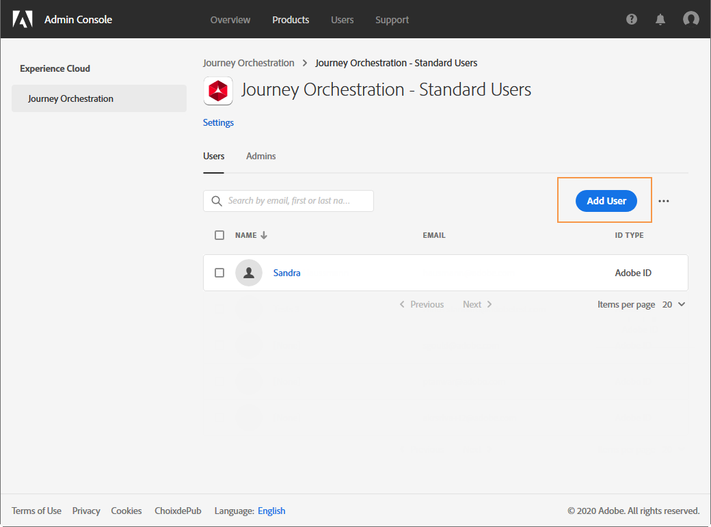

# 管理權限 {#manage-permissions}

## 存取 Journey Optimizer {#access-CJM}

[!DNL Journey Optimizer] 可讓您指派一組權限給您的使用者，以定義使用者可存取的介面部分。

這些權限可由具有 Admin Console 存取權限的管理員加以管理。[進一步瞭解 Adobe Admin Console](https://helpx.adobe.com/tw/enterprise/managing/user-guide.html)。

若要存取 [!DNL Journey Optimizer]，使用者必須：

* 與 [!DNL Journey Optimizer] 權限相關聯之 [!DNL Journey Optimizer] **[!UICONTROL product profile]** 的一部分。

* [!DNL Adobe Experience Platform]**[!UICONTROL product profile]** 的一部分。沒有強制性的權限。使用者應具有從 [!DNL Journey Optimizer] 介面建立及編輯平台區段的 **[!UICONTROL profile management]** 權限。[進一步瞭解存取控制](https://experienceleague.adobe.com/docs/experience-platform/access-control/home.html?lang=zh-Hant#adobe-admin-console)。

在 Admin Console 中，您可以將下列其中一個現成可用的產品設定檔指派給使用者：

* **[!UICONTROL Limited Access User]**：對歷程及報告具有唯讀存取權限的使用者。此產品設定檔包含下列權限：
   * 閱讀歷程
   * 閱讀報告

* **[!UICONTROL Administrators]**：具有管理功能表存取權限的使用者，可管理歷程、事件及報告。此產品設定檔包含下列權限：
   * 管理歷程
   * 發佈歷程
   * 管理事件、資料來源及動作
   * 管理報告

* **[!UICONTROL Standard User]**：具有基本存取權限的使用者，例如歷程管理。此產品設定檔包含下列權限：
   * 管理歷程
   * 發佈歷程
   * 管理報告
   * 讀取事件、資料來源及動作

如果現成可用的設定檔權限不足，而無法管理使用者，您也可以建立自己的產品設定檔。
必須一律將使用者連結至產品設定檔，如此可讓您指派特定的內建權限，例如：

* **[!UICONTROL Read journeys]**
* **[!UICONTROL Read reports]**
* **[!UICONTROL Manage events, data sources and actions]**
* **[!UICONTROL Read events, data sources and actions]**
* **[!UICONTROL Manage journeys]**
* **[!UICONTROL Publish journeys]**
* **[!UICONTROL Manage reports]**

>[!NOTE]
>
> 權限管理不包含訊息：每個使用者都可以建立或修改訊息。

### 建立產品設定檔 {#create-product-profile}

[!DNL Journey Optimizer] 可讓您建立自己的產品設定檔，並將一組權限和沙箱指派給您的使用者。使用產品設定檔，您可以授權或拒絕存取介面中的特定功能或物件。

如需如何建立和管理沙箱的詳細資訊，請參閱 [Adobe Experience Platform 文件](https://experienceleague.adobe.com/docs/experience-platform/sandbox/ui/user-guide.html?lang=zh-Hant)。

若要建立產品設定檔並指派一組權限和沙箱：

1. 在 Admin Console 中，選取 **[!UICONTROL Journey Orchestration]**。在 **[!UICONTROL Product profile]** 索引標籤中，按一下 **[!UICONTROL New Profile]**。

   

1. 為您的新產品設定檔新增 **[!UICONTROL Profile Name]** 及 **[!UICONTROL Description]**。如果您希望設定檔的 **[!UICONTROL Display name]** 是不同的，請取消核取 **[!UICONTROL Same as Profile Name]** 並在 **[!UICONTROL Display name]** 中輸入內容。

1. 在 **[!UICONTROL User Notifications]** 類別中，選擇從此產品設定檔新增或移除使用者時，使用者是否會收到電子郵件通知。

1. 完成後，按一下 **[!UICONTROL Done]**。現在已建立您的新產品設定檔。

   

1. 選取您的新產品設定檔，以開始管理權限。在 **[!UICONTROL Users]** 索引標籤中，將使用者新增至您的產品設定檔。[瞭解如何指派產品設定檔](permissions.md#assigning-product-profile)。

1. 執行上述所列的相同步驟，將 **[!UICONTROL Admin]** 新增至您的產品設定檔。

1. 從 **[!UICONTROL Permissions]** 索引標籤，選取兩個類別（**[!UICONTROL Sandbox]** 或 **[!UICONTROL Authoring]**）之一，以開啟 **[!UICONTROL Edit Permissions]** 頁面並為產品設定檔新增或移除權限。

   

1. 在 **[!UICONTROL Sandboxes]** 權限類別中，選擇要指派給產品設定檔的沙箱。在 **[!UICONTROL Available Permissions Items]** 下方，按一下加號 (+) 圖示，將沙箱指派給您的設定檔。[進一步瞭解 sandbox](https://experienceleague.adobe.com/docs/experience-platform/sandbox/home.html?lang=zh-Hant)。

   

1. 如有需要，請在 **[!UICONTROL Included Permission Items]**&#x200B;下方，按一下旁邊的 X 圖示，以移除產品設定檔的權限。

   

1. 在 **[!UICONTROL Authoring]** 權限類別中，執行與上述步驟相同的步驟，將權限新增至產品設定檔。

   

1. 完成後，按一下 **[!UICONTROL Save]**。

現在已建立並設定您的產品設定檔。連結至此設定檔的使用者現在可以連線至 [!DNL Journey Optimizer]。

### 指派產品設定檔 {#assigning-product-profile}

已將產品設定檔指派給一組使用者，這些使用者在您的組織中會共用相同的權限。您可在本區段中找到每個具備指派權限的現成可用產品設定檔清單。

若要指派可供使用者存取歷程的產品設定檔：

1. 在 Admin Console 中，選取 **[!UICONTROL Journey Orchestration]**。

   

1. 選擇新使用者將與其連結的產品設定檔。

   

1. 按一下 **[!UICONTROL Add user]**。

   您也可以將新使用者新增至使用者群組，以便微調一組共用的權限。[進一步瞭解使用者群組](https://helpx.adobe.com/tw/enterprise/using/user-groups.html)。

   

1. 輸入新使用者的電子郵件地址，然後按一下&#x200B;**[!UICONTROL Save]**。

   

接著，您的使用者應會收到一封電子郵件，並重新導向至您的執行個體。

## 使用 sandbox {#sandboxes}

[!DNL Journey Optimizer] 可讓您將執行個體分割到名為沙箱的個別虛擬環境中。會透過 Admin Console 中的產品設定檔指派沙箱。[瞭解如何指派 sandbox](permissions.md#create-product-profile)。

[!DNL Journey Optimizer] 反映針對指定組織建立的 Adobe Experience Platform sandbox。
可從 Adobe Experience Platform 執行個體建立或重設 Adobe Experience Platform sandbox。[進一步瞭解 sandbox 使用手冊](https://experienceleague.adobe.com/docs/experience-platform/sandbox/ui/user-guide.html?lang=zh-Hant)。

您可在螢幕左上方找到沙箱切換器控制項。若要從一個沙箱切換至另一個沙箱，請按一下切換器中目前作用中的沙箱，然後從下拉式清單中選取另一個沙箱。

## 存取內容 {#content-access}

若要設定內容協助功能，您必須將內容共用資料夾指派給每個 sandbox。 您可以在[!DNL Admin Console]中顯示的&#x200B;**[!UICONTROL Storage]**&#x200B;標籤中為管理員建立和設定共用資料夾。 如果您以系統管理員的身份可以存取[!DNL Admin Console]，則可以建立共用資料夾，並將具有不同存取等級的指派新增到共用資料夾。

請注意，若要讓內容與正確的 sandbox 同步，您必須遵循與 sandbox 相同的語法，例如，如果您的 sandbox 被稱為開發，您的共用資料夾應具有相同的名稱。

[瞭解如何管理共用資料夾](https://helpx.adobe.com/tw/enterprise/admin-guide.html/enterprise/using/manage-adobe-storage.ug.html)。

## Assets Essentials 權限 {#assets-permissions}

Adobe Experience Manager Assets Essentials提供單一、集中的資產存放庫，供您用來填入訊息。
每個資產都儲存在資料夾或子資料夾中。 您可以選擇共用資料夾以及要指派的存取權限等級。

1. 在&#x200B;**[!UICONTROL Assets]**&#x200B;標籤中，瀏覽您的資料夾以尋找需要共用的資料夾。

1. 選擇您的資料夾或資產，然後按一下 **[!UICONTROL Share]**。

   

1. 輸入您要與其共用資料夾存取權限的不同人員的電子郵件地址。

1. 在不同的存取等級之間選擇：

   * **[!UICONTROL Can view]**
   * **[!UICONTROL Can edit]**
   * **[!UICONTROL Has ownership (can share, edit, and delete)]**

   

1. 視需要新增訊息至您的邀請。

1. 按一下 **[!UICONTROL Invite]**。

   
