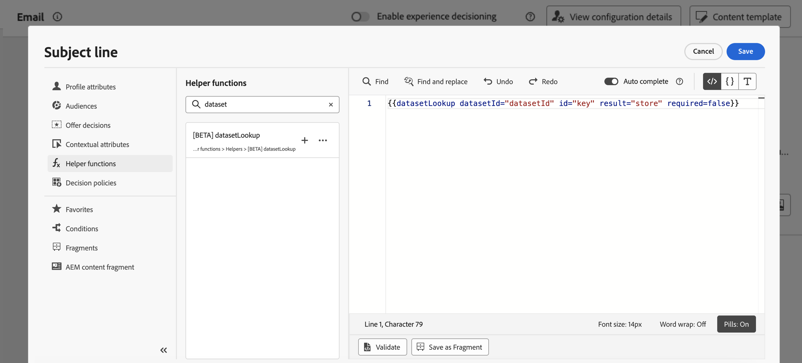
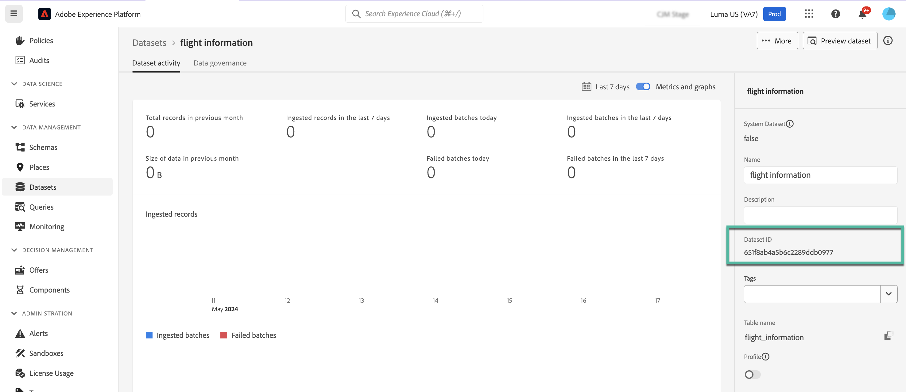
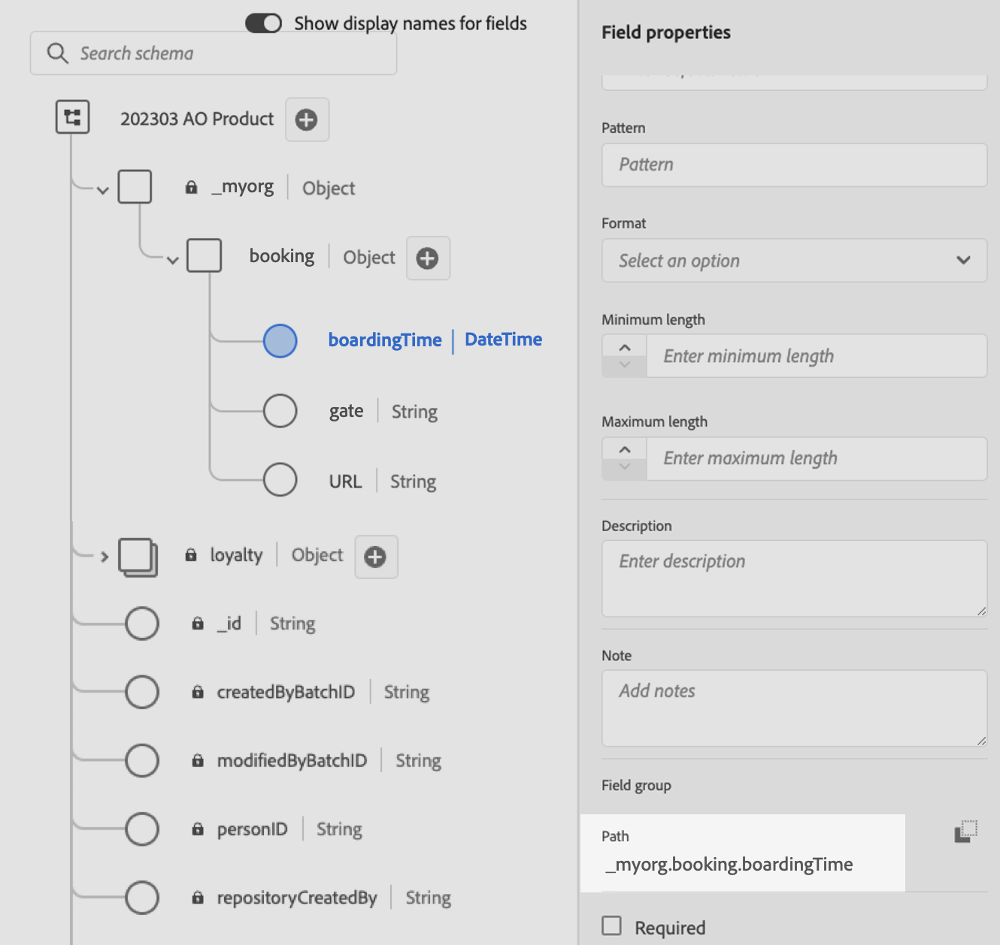
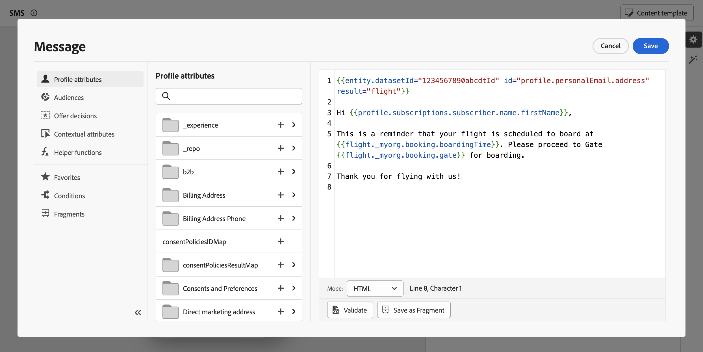

# 使用 Adobe Experience Platform 資料進行個人化 {#aep-data}

>[!AVAILABILITY]
>
>此功能目前以有限可用性版本的形式提供給所有客戶。
>
>目前，「datasetLookup」協助程式函式可用於有限客戶集的運算式片段。 若想取得存取權，請聯絡您的 Adobe 代表。

Journey Optimizer可讓您利用個人化編輯器中Adobe Experience Platform記錄資料集的資料，來[個人化您的內容](../personalization/personalize.md)。 開始之前，必須先啟用查詢個人化所需的資料集以進行查詢。 本節提供詳細資訊： [使用Adobe Experience Platform資料](../data/lookup-aep-data.md)。

在資料集啟用查詢個人化後，您就可以使用其資料將您的內容個人化為[!DNL Journey Optimizer]。

1. 開啟個人化編輯器，您可在每個內容中定義個人化（例如訊息），此編輯器可供使用。 [瞭解如何使用個人化編輯器](../personalization/personalization-build-expressions.md)

1. 導覽至協助程式函式清單，並將&#x200B;**datasetLookup**&#x200B;協助程式函式新增至程式碼窗格。

   

1. 此函式提供預先定義的語法，可讓您從Adobe Experience Platform資料集呼叫欄位。 語法如下：

   ```
   {{datasetLookup datasetId="datasetId" id="key" result="store" required=false}}
   ```

   * **datasetId**&#x200B;為您正在處理的資料集識別碼。
   * **id**&#x200B;是來源資料行的識別碼，應該以查詢資料集的主要身分聯結。

     >[!NOTE]
     >
     >為此欄位輸入的值可以是欄位識別碼(*profile.packages.packageSKU*)、在歷程事件中傳遞的欄位(*context.journey.events.event_ID.productSKU*)，或是靜態值(*sku007653*)。 無論如何，系統都會使用值，並在資料集中查詢，以檢查它是否符合索引鍵。
     >
     >如果索引鍵使用常值字串值，請將文字放在引號中。 例如： `{{datasetLookup datasetId="datasetId" id="SKU1234" result="store" required=false}}`。 如果使用屬性值做為動態索引鍵，請移除引號。 例如： `{{datasetLookup datasetId="datasetId" id=category.product.SKU result="SKU" required=false}}`

   * **result**&#x200B;為任意名稱，您必須提供該名稱，以參考您要從資料集擷取的所有欄位值。 此值將在您的程式碼中用於呼叫每個欄位。

   * **required=false**：如果required設為TRUE，則只有在找到相符的索引鍵時，才會傳遞訊息。 如果設為false，則不需要比對索引鍵，仍可傳送訊息。 請注意，如果設為false，建議您說明訊息內容的遞補或預設值。

   +++在哪裡擷取資料集ID？

   可在Adobe Experience Platform使用者介面中擷取資料集ID。 在[Adobe Experience Platform檔案](https://experienceleague.adobe.com/zh-hant/docs/experience-platform/catalog/datasets/user-guide#view-datasets){target="_blank"}中瞭解如何使用資料集。

   

   +++

1. 調整語法以符合您的需求。 在此範例中，我們要擷取和乘客航班相關的資料。 語法如下：

   ```
   {{datasetLookup datasetId="1234567890abcdtId" id=profile.upcomingFlightId result="flight"}}
   ```

   * 我們正在處理其ID為「1234567890abcdtId」的資料集，
   * 我們想要用來與查詢資料集建立聯結的欄位是&#x200B;*profile.upformingFlightId*，
   * 我們想要在「飛行」參考下包含所有欄位值。

1. 一旦設定好要在Adobe Experience Platform資料集中呼叫的語法，您就可以指定要擷取的欄位。 語法如下：

   ```
   {{result.fieldId}}
   ```

   >[!NOTE]
   >
   >參考資料集欄位時，請確定您符合結構描述中定義的完整欄位路徑。

   * **result**&#x200B;是您已指派給&#x200B;**MultiEntity**&#x200B;協助程式函式中&#x200B;**result**&#x200B;引數的值。 在此範例中，「飛行」。
   * **fieldID**&#x200B;是您要擷取的欄位識別碼。 瀏覽與您的資料集相關的記錄結構描述時，[!DNL Adobe Experience Platform]使用者介面中會顯示此ID：

     +++在何處擷取欄位ID？

     在Adobe Experience Platform使用者介面中預覽資料集時，可以擷取欄位ID。 在[Adobe Experience Platform檔案](https://experienceleague.adobe.com/zh-hant/docs/experience-platform/catalog/datasets/user-guide#preview){target="_blank"}中瞭解如何預覽資料集。

     

     +++

   在此範例中，我們想使用與乘客登機時間和登機口相關的資訊。 因此，我們新增這兩行：

   * `{{flight._myorg.booking.boardingTime}}`
   * `{{flight._myorg.booking.gate}}`

1. 現在您的程式碼已準備就緒，您可以照常完成您的內容，並使用&#x200B;**模擬內容**&#x200B;按鈕來測試內容，以檢查個人化。 [瞭解如何預覽和測試內容](../content-management/preview-test.md)


   
