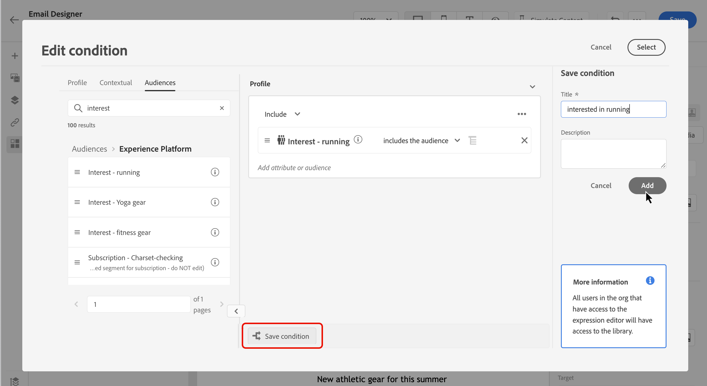
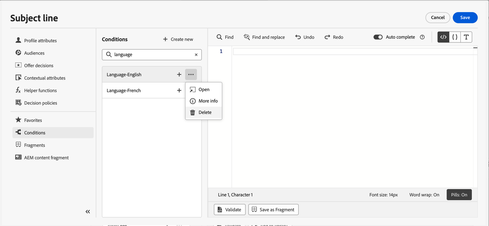

# 使用條件規則 {#conditions}

條件式規則是一組規則，根據設定檔屬性、對象成員資格或內容事件等各種條件，定義應在訊息中顯示的內容。

條件式規則是使用個人化編輯器建立的，且可在您想要在整個內容中重複使用時儲存。 [瞭解如何將條件規則儲存至資料庫](#save)

>[!NOTE]
>
>個人需要[管理程式庫專案](../administration/ootb-product-profiles.md)許可權才能儲存或刪除條件式規則。 已儲存的條件可供組織內的所有使用者使用。

## 存取條件規則產生器 {#access}

條件式規則是從個人化編輯器內的&#x200B;**[!UICONTROL 條件]**&#x200B;功能表建立的，該功能表可存取：

* 從電子郵件Designer，為電子郵件內文中的元件啟用動態內容時。 [瞭解如何將動態內容新增至電子郵件](dynamic-content.md#emails)

  

* 在任何您可以使用[個人化編輯器](personalization-build-expressions.md)新增個人化的欄位中。

  

## 建立條件式規則 {#create-condition}

>[!CONTEXTUALHELP]
>id="ajo_expression_editor_conditions_create"
>title="建立條件"
>abstract="結合設定檔屬性、內容關聯式事件或對象以建置定義在訊息中應顯示哪些內容的規則。"

>[!CONTEXTUALHELP]
>id="ajo_expression_editor_conditions"
>title="建立條件"
>abstract="結合設定檔屬性、內容關聯式事件或對象以建置定義在訊息中應顯示哪些內容的規則。"

建立條件規則的步驟如下：

1. 從個人化編輯器或電子郵件Designer存取&#x200B;**[!UICONTROL 條件]**&#x200B;功能表，然後按一下&#x200B;**[!UICONTROL 新建]**。

1. 根據您的需求建置條件式規則。 若要這麼做，請從左側選單拖放並排列所需的屬性至畫布中。

   將屬性合併至畫布的步驟與區段建立體驗類似。 如需如何使用規則產生器畫布的詳細資訊，請參閱[本檔案](https://experienceleague.adobe.com/docs/experience-platform/segmentation/ui/segment-builder.html#rule-builder-canvas)。

   

   屬性會組織為三個索引標籤：

   * **[!UICONTROL 設定檔]**：
      * **[!UICONTROL 對象]**&#x200B;列出[Adobe Experience Platform細分服務](https://experienceleague.adobe.com/docs/experience-platform/segmentation/home.html?lang=zh-Hant){target="_blank"}的所有對象屬性（即狀態、版本等）。
      * **[!UICONTROL XDM個人設定檔]**&#x200B;列出與Adobe Experience Platform中定義的[體驗資料模型(XDM)結構描述](https://experienceleague.adobe.com/docs/experience-platform/xdm/home.html?lang=zh-Hant){target="_blank"}相關聯的所有設定檔屬性。
   * **[!UICONTROL 內容]**：當您的訊息用於歷程時，內容歷程欄位可透過此索引標籤使用。
   * **[!UICONTROL 對象]**：列出從[Adobe Experience Platform細分服務](https://experienceleague.adobe.com/docs/experience-platform/segmentation/home.html?lang=zh-Hant){target="_blank"}中建立的區段定義產生的所有對象。

1. 條件式規則準備就緒後，您就可以將其新增至訊息，以建立動態內容。 [瞭解如何新增動態內容](dynamic-content.md)

   您也可以儲存規則以允許進一步重複使用。 [瞭解如何儲存條件](#save)

## 儲存條件規則 {#save}

如果有您經常重複使用的條件規則，您可以將其儲存至條件程式庫。 所有已儲存的規則都會共用，並可由組織內的個人存取及使用。

>[!NOTE]
>
>使用歷程內容屬性的條件式規則無法儲存至程式庫。

1. 在條件版本畫面中，按一下&#x200B;**[!UICONTROL 儲存條件]**&#x200B;按鈕。

1. 提供規則的名稱和說明（選擇性），然後按一下[新增]。****

   

1. 條件規則會儲存至程式庫。 您現在可以使用它來建立訊息中的動態內容。 [瞭解如何新增動態內容](dynamic-content.md)

>[!CAUTION]
>
>為條件式內容變體命名時，僅使用英數字元(A-Z、a-z、0-9)。 在變體名稱中使用特殊字元（例如`<`、`>`、`=`、`{`、`}`等）可能會導致範本編輯器中斷或隱藏元件。

## 編輯和刪除儲存的條件規則 {#edit-delete}

您可以隨時使用省略符號按鈕刪除條件規則。

無法修改儲存至程式庫的條件式規則。 不過，您仍可使用它們來建立新規則。 若要這麼做，請開啟條件規則，進行所需的變更，然後儲存至程式庫。 [瞭解如何將條件儲存至資料庫](#save)
