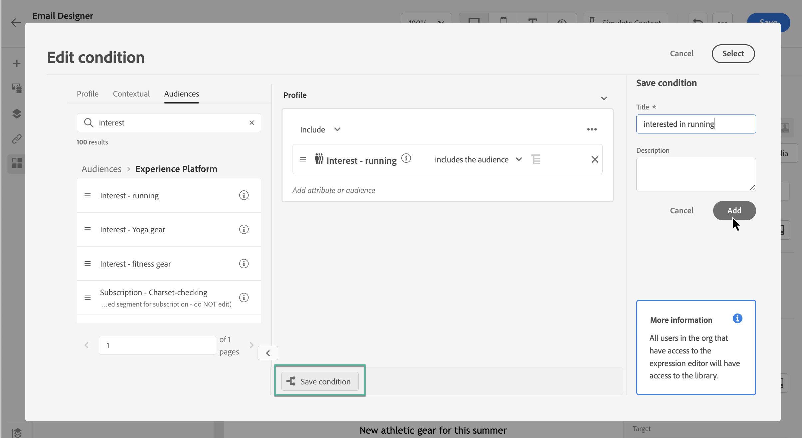

# 使用條件規則 {#conditions}

條件式規則是一組規則，根據設定檔屬性、對象成員資格或內容事件等各種條件，定義應在訊息中顯示的內容。

條件式規則是使用個人化編輯器建立的，且可在您想要在整個內容中重複使用時儲存。 [瞭解如何將條件規則儲存至程式庫](#save)

>[!NOTE]
>
>個人需要 [管理程式庫專案](../administration/ootb-product-profiles.md) 儲存或刪除條件規則的許可權。 已儲存的條件可供組織內的所有使用者使用。

## 存取條件規則產生器 {#access}

條件式規則是從以下位置建立的： **[!UICONTROL 條件]** 個人化編輯器中的選單，可從以下位置存取：

* 從電子郵件設計工具，為電子郵件內文中的元件啟用動態內容時。 [瞭解如何將動態內容新增至電子郵件](dynamic-content.md#emails)

  

* 在任何您可以使用新增個人化的欄位中 [個人化編輯器](personalization-build-expressions.md).

  

## 建立條件規則 {#create-condition}

>[!CONTEXTUALHELP]
>id="ajo_expression_editor_conditions_create"
>title="建立條件"
>abstract="結合設定檔屬性、情境式事件或對象，以建立定義應在訊息中顯示哪些內容的規則。"

>[!CONTEXTUALHELP]
>id="ajo_expression_editor_conditions"
>title="建立條件"
>abstract="結合設定檔屬性、情境式事件或對象，以建立定義應在訊息中顯示哪些內容的規則。"

建立條件規則的步驟如下：

1. 存取 **[!UICONTROL 條件]** 「電子郵件設計工具」中的功能表，然後按一下 **[!UICONTROL 新建]**.

1. 根據您的需求建置條件式規則。 若要這麼做，請從左側選單拖放並排列所需的屬性至畫布中。

將屬性合併至畫布的步驟與區段建立體驗類似。 如需如何使用規則產生器畫布的詳細資訊，請參閱 [本檔案](https://experienceleague.adobe.com/docs/experience-platform/segmentation/ui/segment-builder.html#rule-builder-canvas).

    
    
    屬性會組織為三個索引標籤：
    
    * **[!UICONTROL 個人資料]**：
    * **[!UICONTROL 受眾]**列出所有對象屬性（即狀態、版本等） 若為[Adobe Experience Platform劃分服務](https://experienceleague.adobe.com/docs/experience-platform/segmentation/home.html)，
    * **[!UICONTROL XDM個別設定檔]**列出與Adobe Experience Platform中定義的[Experience Data Model (XDM)架構](https://experienceleague.adobe.com/docs/experience-platform/xdm/home.html)相關聯的所有設定檔屬性。
    * **[!UICONTROL 關聯式]**：當您的訊息用於歷程時，內容歷程欄位可透過此索引標籤使用。
    * **[!UICONTROL 受眾]范**：列出從[Adobe Experience Platform細分服務](https://experienceleague.adobe.com/docs/experience-platform/segmentation/home.html)中建立的區段定義產生的所有對象。

1. 條件式規則準備就緒後，您就可以將其新增至訊息，以建立動態內容。 [瞭解如何新增動態內容](dynamic-content.md)

   您也可以儲存規則以允許進一步重複使用。 [瞭解如何儲存條件](#save)

## 儲存條件規則 {#save}

如果存在您將會經常重複使用的條件規則，您可以將其儲存到條件程式庫。 所有已儲存的規則都會共用，並可由組織內的個人存取及使用。

>[!NOTE]
>
>使用歷程內容屬性的條件式規則無法儲存至程式庫。

1. 在條件版本畫面中，按一下 **[!UICONTROL 儲存條件]** 按鈕。

1. 為規則提供名稱和說明（選用），然後按一下 **[!UICONTROL 新增]**.

   

1. 條件規則會儲存至程式庫。 您現在可以使用它來建立訊息中的動態內容。 [瞭解如何新增動態內容](dynamic-content.md)

## 編輯和刪除儲存的條件規則 {#edit-delete}

您可以隨時使用省略符號按鈕刪除條件規則。

無法修改儲存至程式庫的條件式規則。 不過，您仍可使用它們來建立新規則。 若要這麼做，請開啟條件規則，進行所需的變更，然後儲存至程式庫。 [瞭解如何將條件儲存至程式庫](#save)
