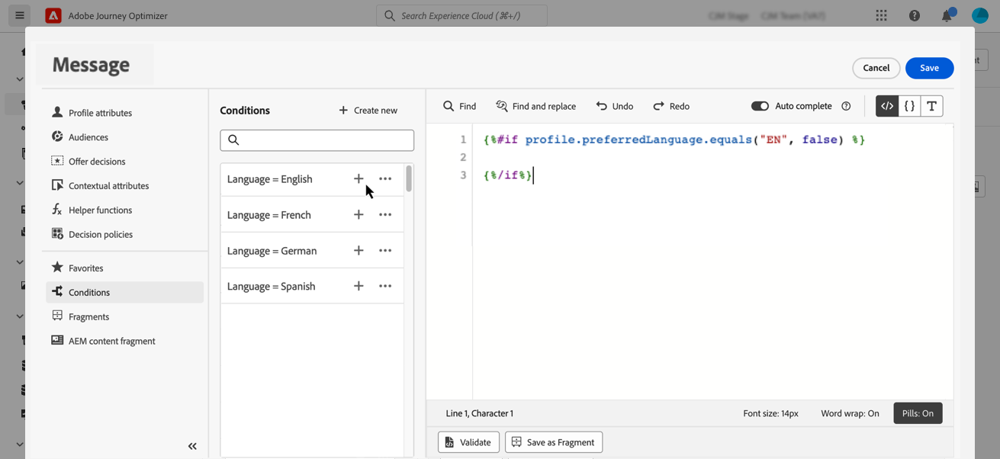
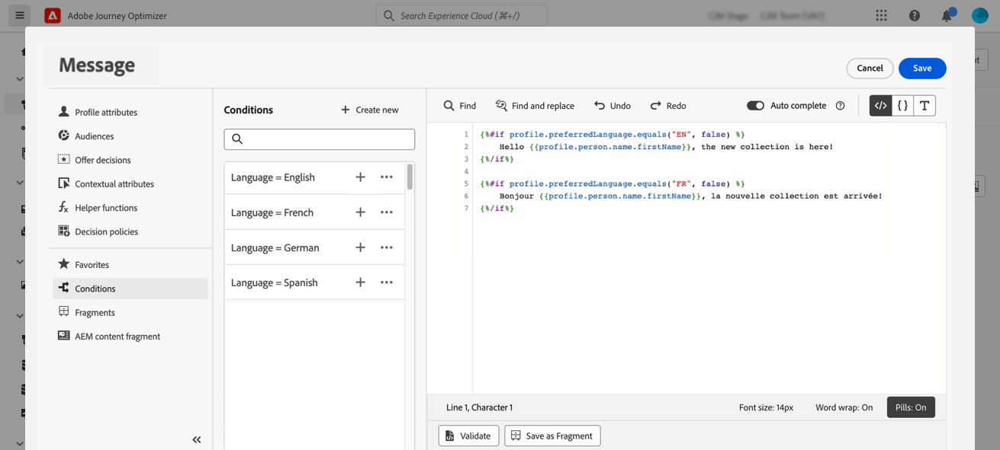

# 建立動態內容 {#dynamic-content}

Adobe Journey Optimizer可讓您善用程式庫中建立的條件規則，將動態內容新增至訊息。

動態內容可建立到任何欄位中，您可在其中使用個人化編輯器新增個人化。 這包括主旨列、連結、推播通知內容或文字型別優惠的表示方式。 [進一步瞭解個人化](personalize.md)

此外，您可以在電子郵件Designer中使用條件式規則，以建立內容元件的多個變體。

## 將動態內容新增至運算式 {#perso-expressions}

在運算式中新增動態內容的步驟如下：

1. 導覽至您要新增動態內容的欄位，然後開啟個人化編輯器。

1. 選取&#x200B;**[!UICONTROL 條件]**&#x200B;功能表以顯示可用的條件規則清單。 按一下規則旁的+按鈕，將其新增至目前的運算式。

   您也可以選取&#x200B;**[!UICONTROL 新建]**，以建立新規則。 [瞭解如何建立條件](create-conditions.md)

   

1. 在`{%if}`和`{%/if}`標籤之間新增您要在符合條件規則時顯示的內容。 您可以視需要新增任意數量的規則，以建立運算式的多個變體。

   在以下範例中，已根據收件者的偏好語言，為SMS內容建立兩個變體。

   

1. 一旦您的內容準備就緒，您就可以使用&#x200B;**[!UICONTROL 模擬內容]**&#x200B;按鈕預覽不同的變體。 [瞭解如何測試和預覽訊息](../content-management/preview-test.md)

   

>[!CAUTION]
>
>如果電子郵件Designer在新增條件區塊後無法正確呈現，請確認每個新條件的語法正確，且不存在重複或衝突的陳述式。 如果問題仍然存在，請考慮重新建置新範本中有問題的區段，並以增量方式測試每個條件區塊。

## 將動態內容新增至電子郵件中 {#emails}

>[!CONTEXTUALHELP]
>id="ac_conditional_content"
>title="條件式內容"
>abstract="使用條件式規則建立內容元件的多個變體。如果傳送訊息時未符合任何條件，將顯示預設變體的內容。"

>[!CONTEXTUALHELP]
>id="ac_conditional_content_select"
>title="條件式內容"
>abstract="使用儲存在資料庫中的條件式規則或建立新規則。"

在電子郵件Designer中建立內容元件變體的步驟如下：

1. 在[電子郵件Designer](../email/content-from-scratch.md)中，選取內容元件，然後按一下&#x200B;**[!UICONTROL 啟用條件式內容]**。

   

1. **[!UICONTROL 條件式內容]**&#x200B;窗格會顯示在左側。 在此窗格中，您可以使用條件來建立所選內容元件的多個變體。

   選取&#x200B;**[!UICONTROL 選取條件]**&#x200B;按鈕，設定您的第一個變體。

   

1. 條件程式庫隨即顯示。 選取要與變體關聯的條件規則，然後按一下&#x200B;**[!UICONTROL 選取]**。 在此範例中，我們要根據收件者偏好的語言調整元件文字。

   

   您也可以按一下[新建] **&#x200B;**&#x200B;來建立新規則。 [瞭解如何建立條件](create-conditions.md)

1. 條件式規則會與變體相關聯。 若要提高可讀性，請從[更多動作]圖示中選取&#x200B;**[!UICONTROL 重新命名]**&#x200B;動作，以重新命名變體。

   

1. 設定在傳送訊息時符合規則時元件應如何顯示。 在此範例中，如果法文是收件者的慣用語言，我們會想要以法文顯示文字。

   

1. 視需要為內容元件新增任意數量的變體。 您可以隨時切換不同的變體，以檢查內容元件會根據條件規則如何顯示。

   >[!NOTE]
   >
   >* 如果傳送訊息時不符合變體中所定義的規則，內容元件將會顯示&#x200B;**[!UICONTROL 預設變體]**&#x200B;中所定義的內容。
   >
   >* 條件式內容將會以變體的顯示順序，根據關聯的規則進行評估。 如果未符合其他條件，則一律顯示預設變體。
   >
   >* 針對包含多個條件變體的電子郵件來模擬或轉譯校樣時，Journey Optimizer 可能需要更多處理時間。 如果您遇到逾時或錯誤訊息，請考慮減少變體總數或簡化條件規則。 在[此頁面](../content-management/preview-test.md)瞭解更多有關測試內容的資訊。

1. 若要刪除變體，請按一下所需變體旁的「更多動作」圖示，並選取&#x200B;**[!UICONTROL 刪除]**。

   
