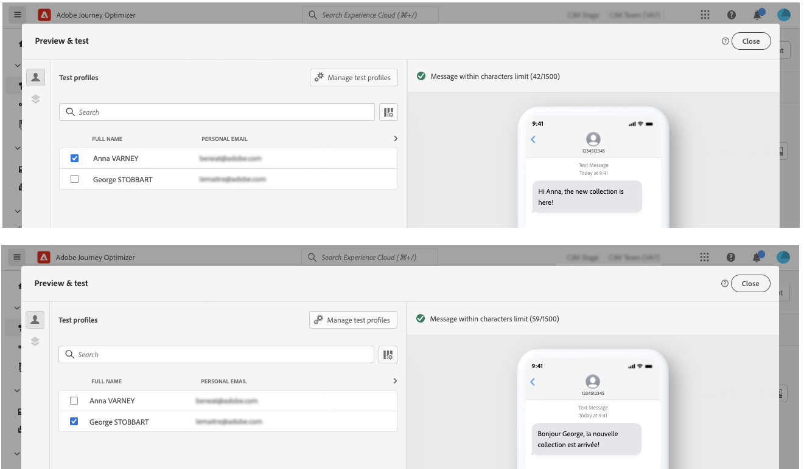

# 建立動態內容 {#dynamic-content}

Adobe Journey Optimizer可讓您運用程式庫中建立的條件式規則，將動態內容新增至訊息中。

動態內容可以建立至任何欄位，讓您使用運算式編輯器新增個人化內容。 這包括主旨行、連結、推播通知內容或文字類型選件的表示法。 [深入了解個人化內容](personalization-contexts.md)

此外，您可以在電子郵件設計工具中使用條件式規則，以建立內容元件的多種變體。

## 將動態內容新增至運算式 {#perso-expressions}

在運算式中新增動態內容的步驟如下：

1. 導覽至您要新增動態內容的欄位，然後開啟「運算式編輯器」。

1. 選取 **[!UICONTROL 條件]** 功能表來顯示可用條件規則清單。 按一下規則旁的+按鈕，將其新增至目前的運算式。

   您也可以選取 **[!UICONTROL 新建]**. [了解如何建立條件](create-conditions.md)

   

1. 在 `{%if}` 和 `{%/if}` 標籤符合條件規則時要顯示的內容。 您可以視需要新增任意數量的規則，以建立運算式的數種變體。

   在下列範例中，已根據收件者的偏好語言，為SMS內容建立兩種變體。

   

1. 內容準備就緒後，您可以使用 **[!UICONTROL 模擬內容]** 按鈕。 [了解如何測試和預覽訊息](../design/preview.md)

   

## 將動態內容新增至電子郵件 {#emails}

>[!CONTEXTUALHELP]
>id="ac_conditional_content"
>title="條件式內容"
>abstract="使用條件規則來建立內容元件的多個變體。 如果傳送訊息時未符合任何條件，則會顯示來自預設變體的內容。"

>[!CONTEXTUALHELP]
>id="ac_conditional_content_select"
>title="條件式內容"
>abstract="使用儲存至程式庫的條件式規則或建立新規則。"

在「電子郵件設計工具」中建立內容元件變體的步驟如下：

1. 在電子郵件設計工具中，選取內容元件，然後按一下 **[!UICONTROL 啟用條件式內容]**.

   

1. 此 **[!UICONTROL 條件式內容]** 窗格顯示在左側。 在此窗格中，您可以使用條件建立所選內容元件的多個變體。

   選取 **[!UICONTROL 套用條件]** 按鈕。

   

1. 條件程式庫隨即顯示。 選取要關聯至變體的條件式規則，然後按一下 **[!UICONTROL 選擇]**. 在此範例中，我們會根據收件者的偏好語言來調整元件文字。

   

   您也可以按一下「 **[!UICONTROL 新建]**. [了解如何建立條件](create-conditions.md)

1. 條件規則與變體相關聯。 為提高可讀性，建議您按一下橢圓功能表來重新命名變體。

   現在，設定在傳送訊息時符合規則時，元件的顯示方式。 在此範例中，如果文字是收件者的慣用語言，我們會想要以法文顯示。

   

1. 視需要為內容元件新增多個變體。 您可以隨時在不同變體之間切換，以根據條件規則檢查內容元件的顯示方式。

   >[!NOTE]
   >如果傳送訊息時不符合變體中定義的任何規則，內容元件將顯示 **[!UICONTROL 預設變體]**.
   >
   >系統會根據相關規則，依變體的顯示順序來評估條件式內容。 如果未符合其他條件，則一律會顯示預設變體。
