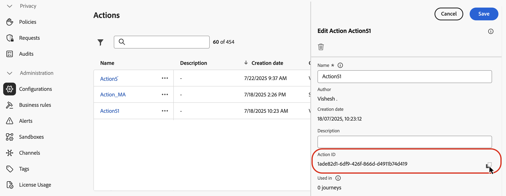
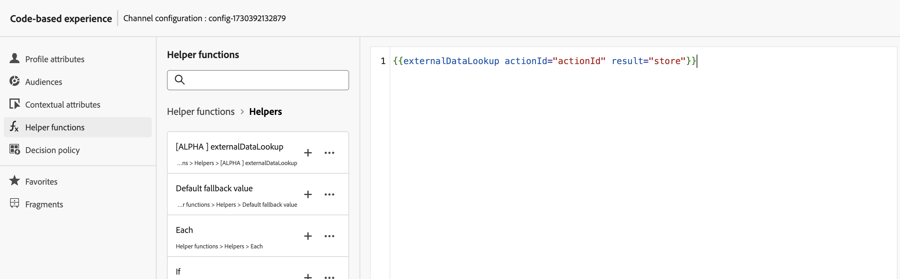
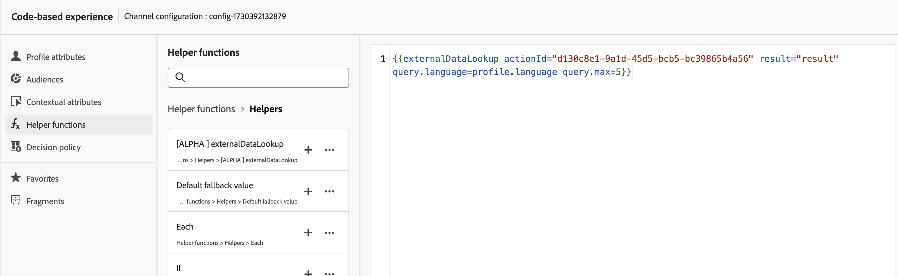
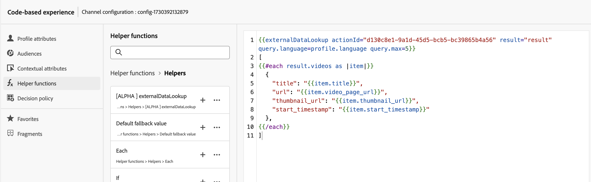
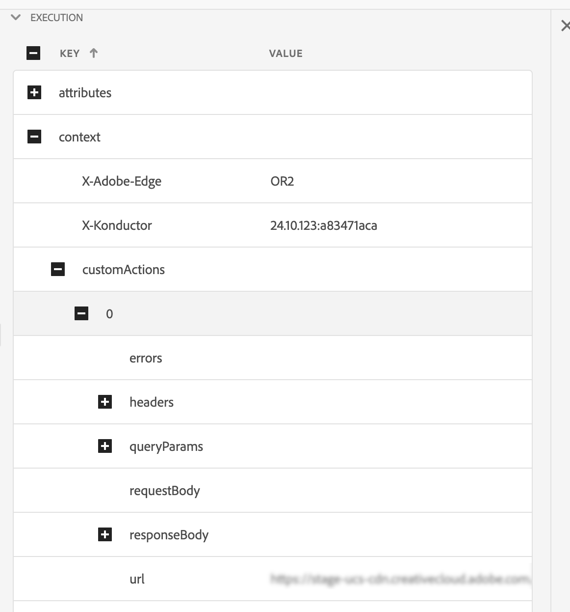

# 外部資料查詢協助程式

`externalDataLookup`個人化編輯器中的[!DNL Journey Optimizer]協助程式可用來從外部端點動態擷取資料，以用於產生傳入通道（例如程式碼式體驗、網頁和應用程式內訊息通道）的內容。

>[!AVAILABILITY]
>
>此功能僅適用於一組組織（可用性限制）。

若要使用協助程式，您必須先在&#x200B;**[!UICONTROL 管理]** > **[!UICONTROL 組態]**&#x200B;功能表中定義動作。 「動作」可讓您設定有關外部端點的詳細資訊，例如URL、GET與POST方法、標頭引數、查詢引數、POST內文JSON結構描述和回應JSON結構描述。

定義動作後，即可同時使用兩者：

* 在歷程中，在自訂動作活動中擷取內容，
* 在歷程與傳入行銷活動中，在externalDataLookup協助程式中，擷取傳入動作中的資料。

## 護欄與限制

也請參閱[!DNL Journey Optimizer]傳入頻道行銷活動和Journeys#GuardrailsandGuidelines中的自訂動作。

* **預設逾時** — 依預設，[!DNL Journey Optimizer]在呼叫外部端點時會使用300毫秒的逾時。 請聯絡您的Adobe代表，提高端點的此逾時。
* **回應結構描述瀏覽與運算式驗證** — 在個人化編輯器中，插入運算式時無法瀏覽端點回應的結構描述。 [!DNL Journey Optimizer]不會驗證運算式中所使用回應中對JSON屬性的參考。
* **引數支援的資料型別** — 透過externalDataLookup協助程式替代之承載變數引數的支援資料型別為`String`、`Integer`、`Decimal`、`Boolean`、`listString`、`listInt`、`listInteger`、`listDecimal`。
* **自動重新整理更新的動作** — 動作設定的變更不會反映在即時行銷活動和歷程中的對應externalDataLookup呼叫中。 為了反映變更，您需要複製或修改任何在externalDataLookup協助程式中使用動作的即時行銷活動或歷程。
* **變數替代** — 目前，externalDataLookup協助程式引數中不支援使用變數。
* **動態路徑** — 目前不支援動態URL路徑。
* **多重傳遞呈現** — 支援多重傳遞呈現。
* **驗證** — 目前，externalDataLookup協助程式不支援Action設定中的驗證選項。 同時，針對API金鑰式驗證或其他純文字授權金鑰，您可以在動作設定中將它們指定為標頭欄位。

## 設定動作並使用協助程式

若要定義動作並使用協助程式進行個人化，請遵循下列步驟：

1. 建立動作來設定查閱的端點。 每個端點只需要完成一次，且應由技術使用者完成。 [瞭解如何設定自訂動作](../action/about-custom-action-configuration.md)

   記下動作ID並加以複製。

   

1. 建立傳入行銷活動或歷程動作。 在此範例中，我們將說明如何在程式碼型體驗JSON動作中使用externalDataLookup協助程式，但可用於任何傳入頻道中的個人化欄位。

1. 編輯動作的內容，前往個人化編輯器中的協助程式功能，並導覽至&#x200B;**[!UICONTROL 協助程式功能]** > **[!UICONTROL 協助程式]**。

1. 按一下`+`按鈕以插入externalDataLookup協助程式。 協助程式運算式已插入編輯器中，`actionId`和`result`有預留位置值。

   

   取代預留位置值，如下所示：

   * `actionId`：貼上先前複製的動作ID。
   * `result`：設定您選擇的名稱。 您將使用此結果變數來存取擷取的內容。

1. 新增任何變數引數值，以作為端點呼叫的一部分傳遞。 例如，以下說明如何傳遞語言引數和最大專案引數。

   

1. 使用結果變數來存取擷取的資料，並將其插入傳入動作的內容中。 例如，以下說明如何傳回從端點擷取的JSON專案陣列。

   

## 運作方式

### 執行階段執行

當傳入動作包含externalDataLookup協助程式時，會在AEP Edge Network接收並處理[!DNL Journey Optimizer]個人化請求時動態呼叫端點。

這表示外部端點至少需要能夠處理使用者端針對指定表面傳送至AEP Edge Network的並行負載和輸送量。

### 語法

`{{externalDataLookup actionId="d130c8e2-9a2d-45d5-bcb6-bc39865b4a56" result="result" optional-parameters...}}`

### 傳遞引數

呼叫外部端點時，動作中定義的所有常數標頭值、查詢引數和要求裝載值，都會隨動作設定中指定的值傳送。

對於任何變數標頭值、查詢/路徑引數或要求裝載值，您可以使用引數將值動態傳遞至externalDataLookup協助程式。

引數名稱：

* 標頭引數： `header.<parameter-name>`
* 查詢引數： `query.<parameter-name>`
* 承載引數： `payload.<parameter-name>`
* 路徑引數： `dynamic_path.<parameter-name>`

例如：

```
{{externalDataLookup actionId="..." result="result" header.myHeaderParameter="value1" query.myQueryParameter="value2" payload.myPayloadParameter="value3"}}`
```

引數值可以是固定值，也可以透過參考設定檔欄位或其他內容屬性進行個人化，例如：

```
{{externalDataLookup actionId="..." result="result" query.myQueryParameter=profile.myProfileValue}}
```

可使用點標籤法提供裝載引數，以參考巢狀JSON屬性，例如：

```
{{externalDataLookup actionId="..." result="result" payload.context.channel="web"}}
```

### 存取結果

若要存取從外部端點查詢呼叫擷取的資料，您可以使用個人化運算式和協助程式函式，參考動作定義中回應裝載所定義的欄位。

例如，如果動作中的回應裝載看起來像這樣：

```
{
    "videos": [
        {
            "id": "integer",
            "title": "string",
            "description": "string",
            "thumbnail_url": "string",
            "video_page_url": "string",
            "url": "string",
            "video_type": "string",
            "start_timestamp": "dateOnly",
            "created_on": "dateOnly",
            ...
        }
    ]
}
```

例如，您可以擷取並存取程式碼型Experience HTML動作中第一個影片的說明，如下所示：

```
{{externalDataLookup actionId="d130c8e2-9a2d-45d5-bcb6-bc39865b4a56" result="result"}}
 
First video description: <b>result.videos[0].description</b>
```

或者，舉例來說，您可以擷取並重複這些專案，以便在程式碼型體驗JSON動作中傳回專案陣列，如下所示：

```
{{externalDataLookup actionId="d130c8e2-9a2d-45d5-bcb6-bc39865b4a56" result="result"}}
 
[
{{#each result.videos as |item|}}
    {                                                  
        "title": "{{item.title}}",
        "url": "{{item.video_page_url}}",
        "thumbnail_url": "{{item.thumbnail_url}}",
        "start_timestamp": "{{item.start_timestamp}}"
    },
{{/each}}
]
```

## 疑難排解

### 逾時和錯誤處理

[!DNL Journey Optimizer]在呼叫外部端點時使用嚴格的逾時，以維持Adobe Experience Platform Edge Network的低延遲、高輸送量的效能特性。

如果端點逾時或到達端點時發生任何其他型別的錯誤，則結果變數將為空白。 在此情況下，結果變數內對屬性的任何參照也將是空的。 如果您只顯示內容中的屬性，則會顯示為空白。 如果您嘗試在結果中重複執行陣列屬性，將不會傳回任何專案。

如果您想要更順暢地處理逾時或錯誤，藉由顯示遞補內容，您可以檢查查詢結果是否為空白，並在該情況下顯示遞補內容。

例如，您可以顯示單一屬性的遞補值，如下所示：

```
First video description: 
```

或者，您可以有條件地呈現整個內容區塊，如下所示：

```
{{externalDataLookup actionId="d130c8e2-9a2d-45d5-bcb6-bc39865b4a56" result="result"}}
 

   ... do something with result ...

    ... return fallback content ...

```

### 偵錯

為了協助進行偵錯，外部資料查詢的逾時和錯誤詳細資料包含在Adobe Experience Platform Assurance的Edge Delivery檢視中。 如果您在傳入動作中看不到externalDataLookup協助程式的預期結果，您可以啟動Assurance工作階段、從Web或行動實作起始[!DNL Journey Optimizer]呼叫，並使用Edge Delivery檢視來檢查逾時或錯誤詳細資料。

例如：

在執行詳細資訊中的保證追蹤的Edge Delivery區段底下，已新增新的customActions區塊，其請求和回應詳細資訊類似於以下內容。 如果在執行自訂動作時發生任何問題，錯誤區段應該有助於進行偵錯



## 常見問題集

* 如何將內容屬性從請求以引數的形式傳遞至外部資料查詢？

  使用內容屬性>資料串流>事件功能表來瀏覽您使用的體驗事件結構，並插入相關屬性作為引數值，如下所示：

  ```
  {{externalDataLookup actionId="..." result="result" query.myQueryParameter=context.datastream.event.<schemaId>.my.xdm.attribute}}
  ```

* [!DNL Journey Optimizer]是否執行任何外部端點回應的快取？

  目前不會。 未來將支援此功能。
