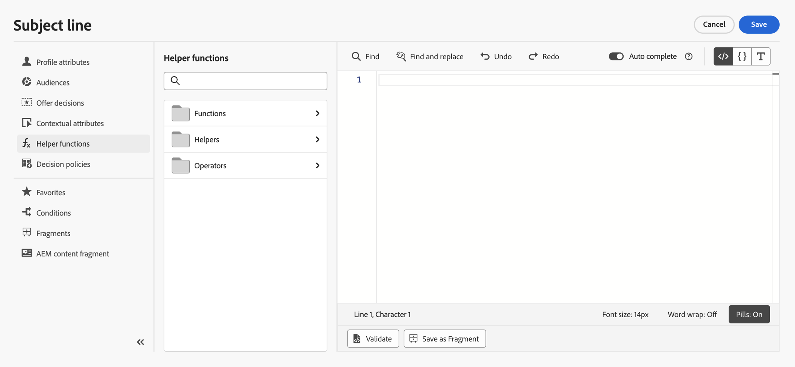

# 開始使用協助程式函式{#functions}

使用[!DNL Journey Optimizer]範本化語言對資料執行作業，例如計算、資料格式設定或轉換、條件，並在個人化的內容中加以處理。 在[此頁面](../personalization-syntax.md)上瞭解個人化語法准則。

➡️ [在此影片中瞭解如何使用協助程式函式](#video)

在個人化編輯器的個人化下拉式清單提供的協助程式功能中，會運用範本語言，如下所示：

在[!DNL Journey Optimizer]個人化編輯器中，協助程式功能分為三個類別： [功能](#functions-helper)、[協助程式](#helper-helper)和[運運算元](#operators-helper)。

選取類別，以存取子類別和函式。

按一下`>`圖示即可存取子類別。 按一下`+`圖示來選取函式：函式會自動新增至個人化畫面。

按一下`...`圖示可檢視函式的說明，並將其新增至您的最愛。 [了解更多](../personalize.md#fav)

>[!NOTE]
>
>個人化編輯器中可用的功能和功能，與[歷程進階運算式編輯器](../../building-journeys/expression/expressionadvanced.md)中可用的功能和功能不同。 例如，`now()`函式僅可用於歷程運算式。 [了解更多](../../email/code-content.md#date-time-limitations)

## 函式{#functions-helper}

### 彙總與陣列函式

<table>
    <tr>
        <td><a href="aggregation.md#average">平均</a></td><td>此函式傳回陣列中所有選取值的算術平均值</td>
    </tr>
    <tr>
        <td><a href="aggregation.md#count">Count</a></td><td>此函式傳回給定陣列中的元素數</td>
    </tr>
    <tr>
        <td><a href="aggregation.md#count-only-null">只計算Null</a></td><td>此函式計算清單中null值的數量。</td>
    </tr>
    <tr>
        <td><a href="aggregation.md#count-with-null">Null計數</a></td><td>此函式計算清單的所有元素，包括null值</td>
    </tr>
    <tr>
        <td><a href="arrays-list.md#distinct">Distinct</a></td><td>此函式從已移除重複值的陣列或清單中取得值</td>
    </tr>
    <tr>
        <td><a href="arrays-list.md#distinct-count-with-null">Null的相異計數</a></td><td>此函式計算不同值的數量，包括空值</td>
    </tr>
    <tr>
        <td><a href="arrays-list.md#head">第一個專案</a></td><td>此函式傳回陣列或清單中的第一個專案</td>
    </tr>
    <tr>
        <td><a href="arrays-list.md#first-n">陣列中的前n個</a></td><td>當根據給定的數值運算式依遞增順序排序時，此函式傳回陣列中的前「N」個專案</td>
    </tr>
    <tr>
        <td><a href="arrays-list.md#in">在</a></td><td>此函式用於決定專案是陣列或清單的成員</td>
    </tr>
    <tr>
        <td><a href="arrays-list.md#includes">包含</a></td><td>此函式決定陣列或清單是否包含給定專案</td>
    </tr>
    <tr>
        <td><a href="arrays-list.md#intersects">相交</a></td><td>此函式決定兩個陣列或清單是否至少有一個通用成員</td>
    </tr>
    <tr>
        <td><a href="arrays-list.md#last-n">陣列中的最後n個</a></td><td>當根據給定的數值運算式依遞增順序排序時，此函式傳回陣列中的最後「N」個專案</td>
    </tr>
    <tr>
        <td><a href="aggregation.md#max">最大值</a></td><td>此函式傳回陣列中所有選取值的最大值</td>
    </tr>
    <tr>
        <td><a href="aggregation.md#min">最小值</a></td><td>此函式傳回陣列中所有選取值的最小值</td>
    </tr>
    <tr>
        <td><a href="arrays-list.md#notin">不在</a></td><td>此函式決定專案是否不是陣列或清單的成員</td>
    </tr>
    <tr>
        <td><a href="arrays-list.md#subset">子集：</a></td><td>此函式決定特定陣列（陣列A）是否是另一個陣列（陣列B）的子集，亦即，如果陣列A中的所有元素都是陣列B的元素</td>
    </tr>
    <tr>
        <td><a href="aggregation.md#sum">Sum</a></td><td>此函式傳回陣列中所有選定值的總和</td>
    </tr>
    <tr>
    <td><a href="arrays-list.md#superset">超集</a></td><td>此函式決定特定陣列（陣列A）是否是另一個陣列（陣列B）的超集，亦即，該陣列A是否包含陣列B中的所有元素</td>
    </tr>
</table>

### 日期時間函式{#date-functions}

<table>
    <tr>
        <td><a href="dates.md#add-days">新增天數</a></td><td>此函式會依指定的天數調整指定日期，使用正值增加值，使用負值減少值。</td>
    </tr>
    <tr>
        <td><a href="dates.md#add-hours">新增小時</a></td><td>此函式依指定的小時數調整指定日期，使用正值增加值，使用負值減少值。</td>
    </tr>
    <tr>
        <td><a href="dates.md#add-minutes">新增分鐘</a></td><td>此函式以指定的分鐘數調整指定日期，使用正值增加值，使用負值減少值。</td>
    </tr>
    <tr>
        <td><a href="dates.md#add-months">新增月份</a></td><td>此函式會依指定的月份數調整指定日期，使用正值增加值，使用負值減少值。</td>
    </tr>
    <tr>
        <td><a href="dates.md#add-seconds">新增秒數</a></td><td>此函式以指定的秒數調整指定日期，使用正值增加值，使用負值減少值。</td>
    </tr>
    <tr>
        <td><a href="dates.md#add-years">新增年份</a></td><td>此函式依指定的年數調整指定日期，使用正值增加值，使用負值減少值。</td>
    </tr>
    <tr>
        <td><a href="dates.md#age">年齡</a></td><td>此函式從指定日期擷取年齡。</td>
    </tr>
    <tr>
        <td><a href="dates.md#age-days">年齡（天）</a></td><td>此函式計算指定日期的年齡（以天為單位），即指定日期與目前日期之間經過的天數、未來日期的負數與過去日期的正數。</td>
    </tr>
    <tr>
        <td><a href="dates.md#age-months">年齡（月數）</a></td><td>此函式計算指定日期的年齡（月數），即指定日期和目前日期之間經過的月數；若為未來日期的負數，則為過去日期的正數。</td>
    </tr>
    <tr>
        <td><a href="dates.md#compare-dates">比較日期</a></td><td>此函式比較第一個輸入日期與另一個輸入日期。 如果date1等於date2，則傳回0；如果date1在date2之前，則傳回–1；如果date1在date2之後，則傳回1。</td>
    </tr>
    <tr>
        <td><a href="dates.md#convert-zoned-date-time">轉換ZonedDateTime</a></td><td>此函式將日期時間轉換為指定時區。</td>
    </tr>
    <tr>
        <td><a href="dates.md#current">目前時間（以毫秒為單位）</a></td><td>此函式擷取目前時間（以Epoch毫秒為單位）。</td>
    </tr>
    <tr>
        <td><a href="dates.md#date-diff">日期差異</a></td><td>此函式擷取兩個日期之間的天數差。</td>
    </tr>
    <tr>
        <td><a href="dates.md#day-month">當月的第幾天</a></td><td>此函式傳回代表該月某日的數字。</td>
    </tr>
    <tr>
        <td><a href="dates.md#day-week">星期</a></td><td>此函式擷取星期幾。</td>
    </tr>
    <tr>
        <td><a href="dates.md#day-year">一年當中的日</a></td><td>此函式擷取一年當中的第幾天。</td>
    </tr>
    <tr>
        <td><a href="dates.md#diff-seconds">以秒為單位的差異</a></td><td>此函式傳回兩個日期之間的秒數差。</td>
    </tr>
    <tr>
        <td><a href="dates.md#extract-hours">擷取小時</a></td><td>此函式從指定的時間戳記中擷取小時元件。</td>
    </tr>
    <tr>
        <td><a href="dates.md#extract-minutes">擷取分鐘數</a></td><td>此函式從指定的時間戳記中擷取分鐘元件。</td>
    </tr>
    <tr>
        <td><a href="dates.md#extract-months">擷取月份</a></td><td>此函式從指定的時間戳記中擷取month元件。</td>
    </tr>
    <tr>
        <td><a href="dates.md#extract-seconds">擷取秒數</a></td><td>此函式從指定的時間戳記中擷取第二個元件。</td>
    </tr>
    <tr>
        <td><a href="dates.md#format-date">格式化日期</a></td><td>此函式格式化日期時間值。</td>
    </tr>
    <tr>
        <td><a href="dates.md#format-date-locale">支援地區設定的日期格式</a></td><td>此函式將日期時間值格式化為其對應的語言敏感表示法，亦即所需的地區設定。</td>
    </tr>
    <tr>
        <td><a href="dates.md#get-current-zoned-date-time">取得CurrentZonedDateTime</a></td><td>此函式傳回目前日期和時間，並附上時區資訊。</td>
    </tr>
    <tr>
        <td><a href="dates.md#hours-difference">時數差異</a></td><td>此函式以時數傳回兩個日期之間的差值。</td>
    </tr>
    <tr>
        <td><a href="dates.md#diff-minutes">分鐘差異</a></td><td>此函式傳回兩個日期之間的分鐘數差。</td>
    </tr>
    <tr>
        <td><a href="dates.md#months-difference">月份差異</a></td><td>此函式傳回兩個日期之間的月差。</td>
    </tr>
    <tr>
        <td><a href="dates.md#set-days">設定天數</a></td><td>此函式為給定的日期時間設定月份日期。</td>
    </tr>
    <tr>
        <td><a href="dates.md#set-hours">設定小時</a></td><td>此函式設定日期時間的小時。</td>
    </tr>
    <tr>
        <td><a href="dates.md#to-date-time">至日期時間</a></td><td>此函式將字串轉換為日期。 針對無效輸入會傳回epoch日期作為輸出。</td>
    </tr>
    <tr>
        <td><a href="dates.md#to-utc">到UTC</a></td><td>此函式將日期時間轉換為UTC。</td>
    </tr>
    <tr>
        <td><a href="dates.md#truncate-day">截斷至一天開始</a></td><td>此函式將指定日期時間設為00:00，藉此修改日期時間。</td>
    </tr>
    <tr>
        <td><a href="dates.md#truncate-quarter">truncateToStartOfQuarter</a></td><td>此函式在00:00將日期時間截斷為其季度的第一天（例如1月1日、4月1日、7月1日、10月1日）。
</td>
    </tr>
    <tr>
        <td><a href="dates.md#truncate-week">truncateToStartOfWeek</a></td><td>此函式將指定日期時間設定為一週的開始（星期一的00:00），以修改日期時間。</td>
    </tr>
    <tr>
        <td><a href="dates.md#truncate-year">truncateToStartOfYear</a></td><td>此函式在00:00將指定日期時間截斷為一年的第一天（1月1日），以修改日期時間。</td>
    </tr>
    <tr>
        <td><a href="dates.md#week-of-year">一年中的周</a></td><td>此函式傳回年中的周數</td>
    </tr>
    <tr>
        <td><a href="dates.md#diff-years">年差異</a></td><td>此函式傳回兩個日期之間的年數差異。</td>
    </tr>
</table>

### 對應函式 {#map-functions}

<table>
    <tr>
        <td><a href="maps.md#get">Get</a></td><td>此函式用於擷取給定索引鍵的對應值</td>
    </tr>
    <tr>
        <td><a href="maps.md#keys">索引鍵</a></td><td>此函式用於擷取給定對應的所有索引鍵</td>
    </tr>
    <tr>
        <td><a href="maps.md#values">值</a></td><td>此函式擷取給定對應的所有值</td>
    </tr>
</table>

### 數學函式 {#math-functions}

<table>
    <tr>
        <td><a href="math.md#absolute">絕對</a></td><td>此函式將任何數字格式化為區分語言的表示法。</td>
    </tr>
    <tr>
        <td><a href="math.md#format-number">格式化數字</a></td><td>此函式將任何數字格式化為區分語言的表示法。</td>
    </tr>
    <tr>
        <td><a href="math.md#random">隨機</a></td><td>此函式傳回0到1之間的隨機值</td>
    </tr>
    <tr>
        <td><a href="math.md#round-down">向下四捨五入</a></td><td>此函式對數字進行向下四捨五入</td>
    </tr>
    <tr>
        <td><a href="math.md#round-up">向上四捨五入</a></td><td>此函式對數字進行向上四捨五入</td>
    </tr>
    <tr>
    <td><a href="math.md#to-hex-string">至十六進位字串</a></td><td>將任何數字轉換為十六進位字串。</td>
    </tr>
    <tr>
    <td><a href="math.md#to-int">ToInt</a></td><td>將這些型別（數字、雙精度浮點數、整數、長整數、浮點數、短整數、位元組、布林值、字串）轉換成整數。</td>
    </tr>
    <tr>
        <td><a href="math.md#to-percentage">至百分比</a></td><td>此函式將數字轉換為百分比</td>
    </tr>
    <tr>
        <td><a href="math.md#to-precision">至精確度</a></td><td>此函式將數字轉換為所需的精確度</td>
    </tr>
    <tr>
        <td><a href="math.md#to-string">至字串</a></td><td>此函式將任何數字轉換為其字串表示。 </td>
    </tr>
</table>

### 物件函式 {#object-functions}

<table>
    <tr>
        <td><a href="objects.md#isNotNull">不是Null</a></td><td>此函式用於決定物件參考是否存在</td>
    </tr>
    <tr>
        <td><a href="objects.md#isNull">為空</a></td><td>此函式用於決定物件參考是否不存在</td>
    </tr>
</table>

### 字串函式 {#string-functions}

<table>
    <tr>
        <td><a href="string.md#camelCase">駝峰式大小寫</a></td><td>此函式用於將字串中每個字詞的第一個字母大寫</td>
    </tr>
    <tr>
        <td><a href="string.md#char-code-at">字元代碼位於</a></td><td>此函式傳回字元的ASCII值，例如JavaScript中的charCodeAt函式</td>
    </tr>
    <tr>
        <td><a href="string.md#concat">Concat</a></td><td>此函式用於將兩個字串合併為一個</td>
    </tr>
    <tr>
        <td><a href="string.md#contains">包含</a></td><td>此函式用於決定字串是否包含指定的子字串</td>
    </tr>
    <tr>
        <td><a href="string.md#doesNotContain">不包含</a></td><td>此函式用於決定字串是否不包含指定的子字串</td>
    </tr>
    <tr>
        <td><a href="string.md#doesNotEndWith">結尾不是</a></td><td>此函式用於決定字串的結尾是否不是指定的子字串</td>
    </tr>
    <tr>
        <td><a href="string.md#doesNotStartWith">開頭不是</a></td><td>此函式用於決定字串的開頭是否不是指定的子字串</td>
    </tr>
    <tr>
        <td><a href="string.md#encode64">編碼64</a></td><td>此函式用於編碼字串</td>
    </tr>
    <tr>
        <td><a href="string.md#endsWith">結束於</a></td><td>此函式用於決定字串的結尾是否為指定的子字串</td>
    </tr>
        </tr>
    <tr>
        <td><a href="string.md#equals">等於</a></td><td>此函式用於決定字串的開頭是否不是指定的子字串，須區分大小寫</td>
    </tr>
    <tr>
        <td><a href="string.md#equalsIgnoreCase">等於（忽略大小寫）</a></td><td>此函式用於決定字串是否不以指定的子字串開頭，不區分大小寫</td>
    </tr>
    <tr>
        <td><a href="string.md#extractEmailDomain">擷取電子郵件網域</a></td><td>此函式用於擷取電子郵件地址的網域</td>
    </tr>
    <tr>
        <td><a href="string.md#format-currency">格式化貨幣</a></td><td>此函式根據在第二個引數中作為字串傳遞的區域設定，將任何數字轉換為其對應的語言敏感型貨幣表示</td>
    </tr>
    <tr>
        <td><a href="string.md#get-url-host">取得url主機</a></td><td>此函式用於取得url主機。</td>
    </tr>
    <tr>
        <td><a href="string.md#get-url-path">取得url路徑</a></td><td>此函式用於取得url路徑</td>
    </tr>
    <tr>
        <td><a href="string.md#get-url-protocol">取得url通訊協定</a></td><td>此函式用於取得url通訊協定</td>
    </tr>
    <tr>
        <td><a href="string.md#index-of">索引：</a></td><td>此函式傳回第二個引數在第一個引數中第一次出現的位置。 如果沒有相符專案，則傳回–1</td>
    </tr>
    <tr>
        <td><a href="string.md#isEmpty">IsEmpty</a></td><td>此函式用於檢查字串或運算式是否為空。</td>
    </tr>
    <tr>
        <td><a href="string.md#is-not-empty">不是空的</a></td><td>如果引數中的字串不是空的，此函式傳回true。</td>
    </tr>
    <tr>
        <td><a href="string.md#last-index-of">最後索引：</a></td><td>此函式傳回第二個引數最後一次出現的位置（在第一個引數中）。 如果沒有相符專案，則傳回–1。</td>
    </tr>
    <tr>
        <td><a href="string.md#leftTrim">左側修剪</a></td><td>此函式移除字串開頭的空格</td>
    </tr>
    <tr>
        <td><a href="string.md#length">長度</a></td><td>此函式用於取得字串或運算式中的字元數</td>
    </tr>
    <tr>
        <td><a href="string.md#like">類似</a></td><td>此函式用於決定字串是否符合指定的模式</td>
    </tr>
    <tr>
        <td><a href="string.md#lower">小寫</a></td><td>此函式將字串轉換為小寫字母</td>
    </tr>
    <tr>
        <td><a href="string.md#mask">遮色片</a></td><td>此函式用來以「X」字元取代字串的一部分。</td>
    </tr>
    <tr>
        <td><a href="string.md#matches">符合</a></td><td>此函式用於決定字串是否符合特定的規則運算式</td>
    </tr>
    <tr>
        <td><a href="string.md#md5">MD5</a></td><td>此函式傳回輸入字串的md5雜湊。</td>
    </tr>
    <tr>
        <td><a href="string.md#notEqualTo">不等於</a></td><td>此函式用於決定字串是否不等於指定的字串</td>
    </tr>
    <tr>
        <td><a href="string.md#not-equal-with-ignore-case">不等於，忽略大小寫</a></td><td>此函式比較兩個字串，忽略大小寫。</td>
    </tr>
    <tr>
        <td><a href="string.md#regexGroup">規則運算式群組</a></td><td>此函式用於根據提供的規則運算式擷取特定資訊</td>
    </tr>
    <tr>
        <td><a href="string.md#replace">取代</a></td><td>此函式將字串中的指定子字串替換為另一個子字串</td>
    </tr>
    <tr>
        <td><a href="string.md#replaceAll">全部取代</a></td><td>此函式以指定的常值「取代」字串取代符合「target」的文字之所有子字串</td>
    </tr>
    <tr>
        <td><a href="string.md#rightTrim">右側修剪</a></td><td>此函式移除字串結尾的空格 </td>
    </tr>
    <tr>
        <td><a href="string.md#sha256">SHA256</a></td><td>此函式計算並傳回字串的sha256雜湊。</td>
    </tr>
    <tr>
        <td><a href="string.md#split">分割</a></td><td>此函式用於依指定字元分割字串</td>
    </tr>
    <tr>
        <td><a href="string.md#startsWith">開始於</a></td><td>此函式用於決定字串的開頭是否為指定的子字串</td>
    </tr>
    <tr>
        <td><a href="string.md#string-to-date">字串至日期</a></td><td>此函式將字串值轉換為日期時間值</td>
    </tr>
    <tr>
        <td><a href="string.md#string-to-integer">字串至整數</a></td><td>此函式將字串值轉換為整數值。</td>
    </tr>
    <tr>
        <td><a href="string.md#string-to-number">字串至數字</a></td><td>此函式用於將字串轉換為數字。 對於無效的輸入，它會傳回相同字串作為輸出。</td>
    </tr>
    <tr>
        <td><a href="string.md#sub-string">子字串</a></td><td>此函式傳回開始索引和結束索引之間的字串運算式的子字串。</td>
    </tr>
    <tr>
        <td><a href="string.md#titleCase">字首大寫</a></td><td>此函式用於將字串中每個字詞的首字母大寫</td>
    </tr>
    <tr>
        <td><a href="string.md#to-bool">至Bool</a></td><td>此函式根據其型別將引數值轉換為布林值。</td>
    </tr>
    <tr>
        <td><a href="string.md#to-date-time">至日期時間</a></td><td>此函式用於將字串轉換為日期。 針對無效輸入會傳回epoch日期作為輸出。</td>
    </tr>
    <tr>
        <td><a href="string.md#to-date-time-only">僅至日期時間</a></td><td>此函式將引數值轉換為僅日期時間值。 針對無效輸入會傳回epoch日期作為輸出。</td>
    </tr>
    <tr>
        <td><a href="string.md#trim">修剪</a></td><td>此函式移除字串開頭和結尾的空格</td>
    </tr>
    <tr>
        <td><a href="string.md#upper">大寫</a></td><td>此函式將字串轉換為大寫字母</td>
    </tr>
    <tr>
        <td><a href="string.md#url-decode">Url解碼</a></td><td>此函式用於解碼url編碼的字串。</td>
    </tr>
    <tr>
        <td><a href="string.md#url-encode">Url編碼</a></td><td>此函式用於對字串進行url編碼。</td>
    </tr>
</table>

## 輔助程式{#helper-helper}

協助程式詳細資料於[此頁面](helpers.md)。

<table>
    <tr>
        <td><a href="helpers.md#default">預設遞補值</a></td><td>此函式用於呈現具有預設值的變數</td>
    </tr>
    <tr>
        <td><a href="helpers.md#each">每個</a></td><td>此函式用於反複處理陣列</td>
    </tr>
    <tr>
        <td><a href="helpers.md#execution-metadata">執行中繼資料</a></td><td>此協助程式會在訊息呈現期間擷取自訂索引鍵值中繼資料，以便將其儲存在執行階段執行中繼資料物件中</td>
    </tr>
    <tr>
        <td><a href="helpers.md#if-function">若</a></td><td>此函式用於定義條件區塊 — 如果運算式評估傳回true，則會轉譯區塊</td>
    </tr>
    <tr>
        <td><a href="helpers.md#let">Let</a></td><td>此函式允許將運算式儲存為變數，以便稍後在查詢中使用</td>
    </tr>
   <tr>
        <td><a href="helpers.md#unless">Unless</a></td><td>此函式用於定義條件區塊 — 如果運算式評估傳回false，則會轉譯區塊</td>
    </tr>
    <tr>
        <td><a href="helpers.md#with">替換為</a></td><td>此函式用於變更範本部分的評估權杖</td>
    </tr>
</table>

## 操作者{#operators-helper}

### 算術函式 {#arithmetic-helper}

算術函式用於對值執行基本計算。

<table>
    <tr>
        <td><a href="arithmetic-functions.md#add">加法</a></td><td>此運運算元用於尋找兩個引數運算式的總和</td>
    </tr>
    <tr>
        <td><a href="arithmetic-functions.md#divide">除</a></td><td>此運運算元用於尋找兩個引數運算式的商</td>
    </tr>
    <tr>
        <td><a href="arithmetic-functions.md#multiply">乘法</a></td><td>此運運算元用於尋找兩個引數運算式的乘積</td>
    </tr>
    <tr>
        <td><a href="arithmetic-functions.md#remainder">餘數</a> </td><td>此運運算元用來找出兩個引數運算式相除後的餘數</td>
    </tr>
    <tr>
        <td><a href="arithmetic-functions.md#substract">減法</a> </td><td>此運運算元求兩個運算式之間的差異</td>
    </tr>
</table>

### 布林函式 {#boolean-functions}

布林值函式用於對不同元素執行布林值邏輯。

<table>
    <tr>
        <td><a href="operators.md#and">與</a></td><td>此運運算元建立邏輯結合</td>
    </tr>
    <tr>
        <td><a href="operators.md#or">或</a></td><td>此運運算元建立邏輯分離</td>
    </tr>
</table>

### 比較函式 {#comparison-functions}

比較函式是用來比較不同運算式和值之間的差異，並據此傳回true或false。

<table>
    <tr>
        <td><a href="operators.md#equals">等於</a></td><td>此操作會檢查值是否相等</td>
    </tr>
    <tr>
        <td><a href="operators.md#greaterthan">大於</a></td><td>此運運算元檢查第一個值是否大於第二個值</td>
    </tr>
    <tr>
        <td><a href="operators.md#greaterthanorequal">大於或等於</a></td><td>此運運算元檢查第一個值是否大於或等於第二個值</td>
    </tr>
    <tr>
        <td><a href="operators.md#lessthanorequal">小於或等於</a> </td><td>此運運算元檢查第一個值是否小於或等於第二個值</td>
    </tr>
    <tr>
        <td><a href="operators.md#notequal">不等於</a></td><td>此運運算元檢查給定的運算式是否不等於給定值</td>
    </tr>
</table>

## 作法影片{#video}

瞭解如何使用個人化協助程式函式來轉換個人化值，並瞭解協助程式函式的不同使用案例。

>[!VIDEO](https://video.tv.adobe.com/v/334244?quality=12)
