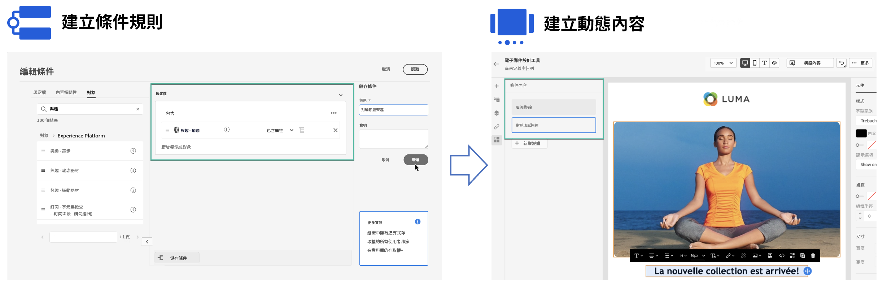

# 開始使用動態內容 {#start-dynamic-content}

>[!CONTEXTUALHELP]
>id="ajo_conditions_list"
>title="條件"
>abstract="條件式規則可讓您根據輪廓屬性、內容事件或客群在訊息中顯示多個內容變體。"

動態內容可讓您根據&#x200B;**條件式規則**&#x200B;調整訊息內容，這些規則可由輪廓屬性、內容事件或客群組成。條件式規則是使用個人化編輯器中的視覺化規則產生器來建立，您可以在其中儲存這些規則，以便在歷程及行銷活動中重複使用。

可在電子郵件Designer和個人化編輯器中運用條件式規則，以&#x200B;**建立動態內容**，其將可調整成您訊息中鎖定的設定檔。

* [了解如何使用條件式規則](create-conditions.md)
* [了解如何建立動態內容](dynamic-content.md)

## 操作說明影片 {#video}

了解如何使用條件規則產生器建立動態內容。

>[!VIDEO](https://video.tv.adobe.com/v/3409815?quality=12)
