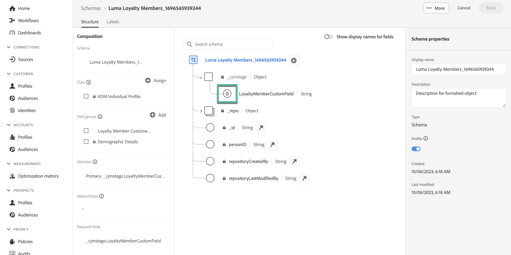

# 使用Adobe Experience Platform資料進行個人化(Beta) {#aep-data}

>[!AVAILABILITY]
>
>此功能目前僅以私人測試版的形式提供。
>
>目前，它僅適用於在您提供給Adobe的非生產沙箱中測試用途，以及針對Beta版的資料集。

Journey Optimizer可讓您在運算式編輯器中運用Adobe Experience Platform的資料，以 [個人化您的內容](../personalization/personalize.md). 步驟如下：

1. 開啟運算式編輯器，您可在每個內容中定義個人化（例如訊息），此編輯器可供使用。 [瞭解如何使用運算式編輯器](../personalization/personalization-build-expressions.md)

1. 導覽至協助程式函式清單，然後新增 **datasetLookup** 將協助程式函式新增至程式碼窗格。

   

1. 此函式提供預先定義的語法，可讓您從Adobe Experience Platform資料集呼叫欄位。 語法如下：

   ```
   {{entity.datasetId="datasetId" id="key" result="store"}}
   ```

   * **entity.datasetId** 是您使用之資料集的ID、
   * **id** 是資料集中用來作為主要身分的欄位，

     >[!NOTE]
     >
     >為此欄位輸入的值可以是欄位ID (*profile.couponValue*)，在歷程事件中傳遞的欄位(*context.journey.events.event_ID.couponValue*)或靜態值(*抵用券Abcd*)。 無論如何，系統都會使用值，並在資料集中查詢，以檢查它是否符合索引鍵)。

   * **結果** 是任意名稱，您需要提供以參考您要從資料集中擷取的所有欄位值。 此值將在您的程式碼中用於呼叫每個欄位。

   +++在哪裡擷取資料集ID？

   可在Adobe Experience Platform使用者介面中擷取資料集ID。 瞭解如何使用中的資料集 [Adobe Experience Platform檔案](https://experienceleague.adobe.com/en/docs/experience-platform/catalog/datasets/user-guide#view-datasets){target="_blank"}.

   

+++

   +++如何識別資料集中的主要身分欄位？

   在連結至資料集的結構描述中，可以找到已定義為指定資料集主要身分的欄位。 瞭解如何使用中的身分欄位 [Adobe Experience Platform檔案](https://experienceleague.adobe.com/en/docs/experience-platform/xdm/ui/fields/identity){target="_blank"}.

   

+++

1. 調整語法以符合您的需求。 在此範例中，我們要擷取和乘客航班相關的資料。 語法如下：

   ```
   {{entity.datasetId="1234567890abcdtId" id="profile.personalEmail.address" result="flight"}}
   ```

   * 我們正在處理其ID為「1234567890abcdtId」的資料集，
   * 此資料集中作為主索引鍵使用的欄位是電子郵件地址，
   * 我們想要在「飛行」參考下包含所有欄位值。

1. 一旦設定好要在Adobe Experience Platform資料集中呼叫的語法，您就可以指定要擷取的欄位。 語法如下：

   ```
   {{result.fieldId}}
   ```

   * **結果** 是您已指派給的值 **結果** 中的引數 **多實體** 輔助函式。 在此範例中，「飛行」。
   * **fieldID** 是要擷取的欄位ID。 瀏覽資料集時，此ID會顯示在Adobe Experience Platform使用者介面中。 展開下列區段以顯示範例：

     +++從何處擷取欄位ID？

     在Adobe Experience Platform使用者介面中預覽資料集時，可以擷取欄位ID。 瞭解如何在中預覽資料集 [Adobe Experience Platform檔案](https://experienceleague.adobe.com/en/docs/experience-platform/catalog/datasets/user-guide#preview){target="_blank"}.

     

+++

   在此範例中，我們想使用與乘客登機時間和登機口相關的資訊。 因此，我們新增這兩行：

   * `{{flight._myorg.booking.boardingTime}}`
   * `{{flight._myorg.booking.gate}}`

1. 現在程式碼已準備就緒，您可以照常完成內容，並使用進行測試 **模擬內容** 按鈕以檢查個人化。 [瞭解如何預覽和測試內容](../content-management/preview-test.md)


   
