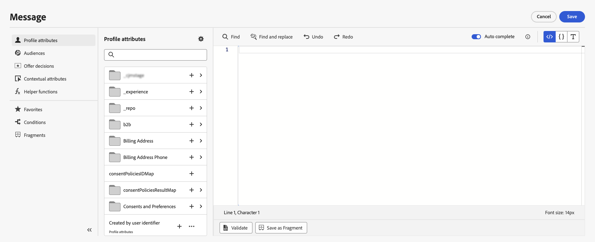
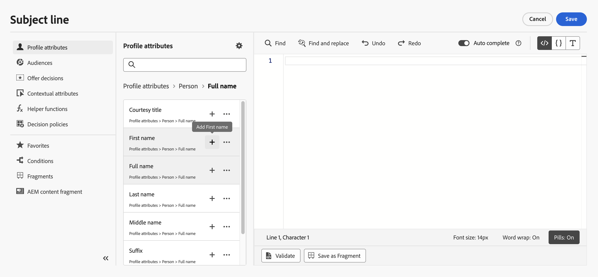
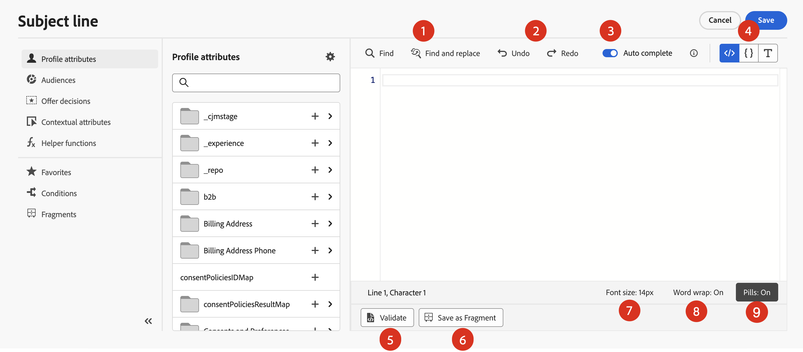
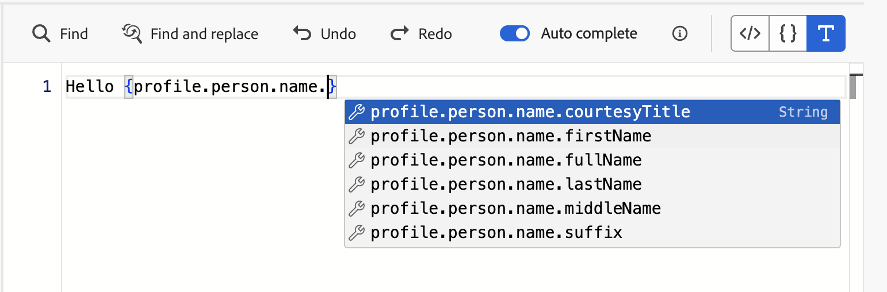
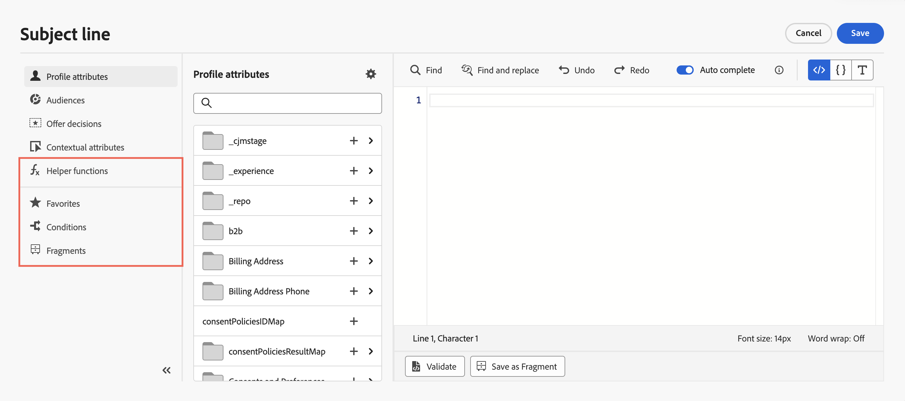

# 新增個人化 {#build-personalization-expressions}

>[!CONTEXTUALHELP]
>id="ajo_perso_editor"
>title="關於個人化編輯器"
>abstract="個人化編輯器可讓您選取、排列、自訂和驗證所有資料，打造個人化的專屬內容。"

個人化編輯器是[!DNL Journey Optimizer]中個人化的核心。 它可用於您需要定義個人化的每個內容，例如電子郵件、推播和選件。

在個人化編輯器介面中，您可以選取、排列、自訂及驗證所有資料，為您的內容建立自訂個人化。



## 我可以在哪裡新增個人化 {#where}

您可以使用&#x200B;**[!DNL Journey Optimizer]**&#x200B;新增個人化圖示中新增個人化。 請展開下列各節以取得詳細資訊。

+++訊息

在郵件中，可以在郵件的不同位置新增個人化，例如&#x200B;**[!UICONTROL 主旨列]**&#x200B;欄位。


您也可以在內容的其他區段中新增。 例如，對於[推播通知](../push/push-gs.md)，可以在&#x200B;**標題**、**內文**、**自訂聲音**、**徽章**&#x200B;和&#x200B;**自訂資料**&#x200B;欄位中新增個人化。

+++

+++電子郵件 Designer

在[電子郵件Designer](../email/get-started-email-design.md)中編輯電子郵件內容時，您可以使用內容相關工具列中的圖示，在文字區塊和URL中新增個人化。


+++

+++產品建議

在您的&#x200B;**優惠方案代表**&#x200B;中使用文字型別內容時，您可以新增個人化。 [瞭解如何建立個人化優惠](../offers/offer-library/creating-personalized-offers.md)

+++

+++URL

Journey Optimizer也可讓您個人化訊息中的&#x200B;**URL**。  個人化 URL 會根據輪廓屬性，將收件者帶往網站特定頁面或個人化微網站。 URL個人化可用於這些型別的連結： **外部連結**、**取消訂閱連結**&#x200B;和&#x200B;**選擇退出**。

個人化URL範例：

* `https://www.adobe.com/users/{{profile.person.name.lastName}}`
* `https://www.adobe.com/users?uid={{profile.person.name.firstName}}`
* `https://www.adobe.com/usera?uid={{context.journey.technicalProperties.journeyUID}}`
* `https://www.adobe.com/users?uid={{profile.person.crmid}}&token={{context.token}}`

{width="50%"}

>[!NOTE]
>
>在個人化編輯器中編輯個人化URL時，基於安全考量，會停用協助程式功能和對象成員資格。
>
>url內使用的個人化權杖不支援空格。

在有限可用性的情況下，Journey Optimizer也支援完整/基本URL個人化。 例如：

```
<a href="{{profile.social.link}}" />
<a href="{{profile.social.baseUrl}}/profile" />
<a href="https://{{profile.social.baseUrl}}/profile" />
```

>[!WARNING]
>
>接受的網域清單必須預先提供給Adobe。

+++

+++電子郵件設定

建立電子郵件通道設定時，您可以定義子網域、標題和URL追蹤引數的個人化值。 [了解更多](../email/surface-personalization.md)

+++

## Personalization來源 {#sources}

導覽窗格可讓您選取個人化的來源。 可用的來源包括：

* **[!UICONTROL 設定檔屬性]** ：列出與[Adobe Experience Platform資料模型(XDM)檔案](https://experienceleague.adobe.com/docs/experience-platform/xdm/home.html?lang=zh-Hant){target="_blank"}中說明的設定檔結構描述相關的所有參考。
* **[!UICONTROL Target屬性]** ：此資料夾專屬於「協調的行銷活動」。 它包含直接在行銷活動畫布中計算的屬性。 [瞭解如何在協調的行銷活動中新增個人化](../orchestrated/activities/channels.md#add-personalization)
* **[!UICONTROL 對象]** ：列出在Adobe Experience Platform細分服務中建立的所有對象。 [此處](https://experienceleague.adobe.com/docs/experience-platform/segmentation/home.html?lang=zh-Hant){target="_blank"}提供分段的相關詳細資訊。
* **[!UICONTROL 優惠決定]** ：列出與特定位置相關聯的所有優惠。 選取版位，然後將優惠方案插入內容中。 如需有關如何管理優惠方案的完整檔案，請參閱[本節](../offers/get-started/starting-offer-decisioning.md)。
* **[!UICONTROL 內容屬性]** ：當歷程或行銷活動中使用管道動作活動（電子郵件、推播、簡訊）時，與事件和屬性相關的內容屬性可用於個人化。 在[本節](personalization-use-case.md)中顯示了運用內容屬性的個人化範例。

>[!NOTE]
>
>如果您使用使用構成工作流程產生的擴充屬性來鎖定對象，您可以運用這些擴充屬性來個人化您的訊息。 [瞭解如何使用對象擴充屬性](../audience/about-audiences.md#enrichment)

## 新增個人化 {#add}

>[!CONTEXTUALHELP]
>id="ajo_perso_editor_autocomplete"
>title="自動完成"
>abstract="啟用此選項後，可允許系統在您輸入時自動建議並完成程式碼。此功能僅適用於 HTML 和文字格式，並支援輪廓和內容屬性。如果透過切換進行停用，編輯器將提供原生 HTML 程式碼自動完成。"

中央工作區是您建置個人化語法的位置。 若要使用屬性來個人化您的訊息，請在左側導覽窗格中找出該屬性，然後按一下`+`按鈕，將該屬性加入運算式中。



`+`圖示旁的省略符號功能表可讓您取得每個屬性的詳細資訊，並將您最常用的屬性新增至我的最愛。 可透過導覽窗格中的&#x200B;**[!UICONTROL 我的最愛]**&#x200B;功能表存取新增至我的最愛的屬性。

>[!NOTE]
>
>依預設，屬性窗格只會顯示填入的屬性。 若要顯示所有屬性，請選取搜尋欄位上方的按鈕，並關閉&#x200B;**[!UICONTROL 只顯示填入的屬性]**&#x200B;選項。

此外，您可以定義預設後援文字，當字串型別的設定檔屬性為空白時將會顯示。 若要這麼做，請按一下屬性旁的省略符號按鈕，然後選取&#x200B;**[!UICONTROL 插入後援文字]**。 如果設定檔的屬性值是空的，則寫入預設應顯示的文字，然後按一下&#x200B;**[!UICONTROL 新增]**。


在下列範例中，個人化編輯器可讓您選取今天生日的設定檔，然後插入與今天對應的特定選件來完成自訂。


## 運算式編輯選項 {#options}

中央工作區提供各種工具，協助您撰寫個人化運算式。



可選擇下列選項：

1. **[!UICONTROL 尋找]** / **[!UICONTROL 尋找並取代]**：搜尋您的運算式並自動取代部分程式碼。
1. **[!UICONTROL 還原]** / **[!UICONTROL 重做]**：還原/重做上一個操作。
1. **[!UICONTROL 自動完成]**：在您輸入時自動建議並完成程式碼。 此功能僅適用於 HTML 和文字格式，並支援輪廓和內容屬性。如果透過切換進行停用，編輯器將提供原生 HTML 程式碼自動完成。

   {width="70%" align="center" zoomable="yes"}

1. **[!UICONTROL HTML]** / **[!UICONTROL JSON]** / **[!UICONTROL 文字]**：識別您的程式碼格式。 這可讓系統根據選取的語言調整驗證及自動完成功能。
1. **[!UICONTROL 驗證]**：檢查運算式的語法。 請參閱[此章節](../personalization/personalization-build-expressions.md)深入瞭解。
1. **[!UICONTROL 另存為片段]**：將運算式另存為運算式片段。 請參閱[本節](../content-management/save-fragments.md#save-as-expression-fragment)以進一步瞭解
1. **[!UICONTROL 字型大小]**：調整編輯器內內容的字型大小，以提高可讀性。
1. **[!UICONTROL 自動換行]**：啟用或停用自動換行，允許長運算式顯示在單行或包含在編輯器中。 選項包括：
   * **關閉** （預設） — 無自動換行。 長線超出編輯器檢視範圍，需要水準捲動。
   * **On** — 以編輯器的寬度換行。
   * **自動換行** — 當行字元達到80個字元時換行。
   * **已繫結** — 以編輯器寬度或80個字元（以較小者為準）來換行。
1. **[!UICONTROL Picks]**：將屬性顯示為精簡的「Picks」，藉由隱藏長屬性路徑來改善可讀性。 按一下屬性以顯示其完整路徑。

   >[!NOTE]
   >
   >未來30天內，藥丸展示會逐步推廣到所有環境。
   >
   >此選項僅適用於設定檔屬性、內容屬性和動態媒體。

在導覽窗格中，有其他功能可協助您建置個人化運算式。



* **[!UICONTROL 輔助函式]** — 輔助函式可讓您對資料執行操作，例如計算、資料格式或轉換、條件，並在個人化的內容中操作它們。 [進一步瞭解可用的協助程式功能](functions/functions.md)

* **[!UICONTROL 我的最愛]** — 您新增至我的最愛屬性會顯示在此清單中。 這可讓您快速存取您使用頻率最高的專案。 若要新增屬性至您的最愛，請按一下省略符號選單，然後選擇&#x200B;**[!UICONTROL 新增至我的最愛]**。

* **[!UICONTROL 條件]** — 運用在程式庫中建立的條件式規則，將動態內容新增至您的訊息。 這可讓您根據條件建立訊息的多個變體。 [瞭解如何建立動態內容](../personalization/get-started-dynamic-content.md)

* **[!UICONTROL 片段]** — 運用已建立或儲存至目前沙箱的運算式片段。 片段是可重複使用的元件，可跨[!DNL Journey Optimizer]個行銷活動和歷程參照。 此功能允許預先建置多個自訂內容區塊，可供行銷使用者在改良的設計流程中快速組合內容。 [瞭解如何使用運算式片段進行個人化](../personalization/use-expression-fragments.md)

一旦您的個人化運算式準備就緒，就需要由個人化編輯器驗證。 請參閱[此章節](../personalization/personalization-build-expressions.md)深入瞭解。

## 驗證機制 {#validation-mechanisms}

當您按一下&#x200B;**新增**&#x200B;按鈕以關閉編輯器視窗時，會自動執行運算式的驗證。 您也可以使用&#x200B;**驗證**&#x200B;按鈕來檢查您的個人化語法。


展開以下區段以檢視驗證個人化時可能發生的常見錯誤。

+++常見錯誤

* **找不到「XYZ」路徑**

嘗試參照結構描述中未定義的欄位時。

在此情況下，**firstName1**&#x200B;未定義為設定檔結構描述中的屬性：

```
{{profile.person.name.firstName1}}
```

* **變數&quot;XYZ&quot;的型別不相符。 必須是陣列。 找到字串。**

嘗試對字串而非陣列重複時。

在此情況下，**product**&#x200B;不是陣列：

```
{{each profile.person.name.firstName as |product|}}
 {{product.productName}}
{{/each}}
```

* **無效的Handlebars語法。 找到`'[XYZ}}'`**

使用無效的Handlebars語法時。

Handlebars運算式周圍有&#x200B;**{{expression}}**

```
   {{[profile.person.name.firstName}}
```

* **無效的區段定義**

```
No segment definition found for 988afe9f0-d4ae-42c8-a0be-8d90e66e151
```

+++

若是選件，可能會發生特定錯誤。 展開下列區段以取得詳細資訊：

+++ 與優惠方案相關的特定錯誤

與電子郵件或推播訊息中的優惠方案整合相關的錯誤具有以下模式：

```
Offer.<offerType>.[PlacementID].[ActivityID].<offer-attribute>
```

驗證會在個人化編輯器中的個人化內容驗證期間執行。

<table> 
 <thead> 
  <tr> 
   <th> 錯誤標題<br /> </th> 
   <th> 驗證/解析度<br /> </th> 
  </tr> 
 </thead> 
 <tbody> 
  <tr> 
   <td>找不到ID為placementID且型別為OfferPlacement的資源<br/>
找不到id activityID和型別OfferActivity的資源<br/></td> 
   <td>檢查ActivityID和/或PlacementID是否可用</td> 
  </tr> 
   <tr> 
   <td>無法驗證資源。</td> 
   <td>位置中的componentType應符合offerType選件</td> 
  </tr> 
   <tr> 
   <td>offerId中未出現公用URL。</td> 
   <td>影像選件（與決定和位置配對相關的所有個人化和遞補）應填入公用URL （deliveryURL不應空白）。</td> 
  </tr> 
  <tr> 
   <td>決定包含非設定檔屬性。</td> 
   <td>選件模型使用方式應僅包含設定檔屬性。</td> 
  </tr> 
  <tr> 
   <td>擷取決策使用方式時發生錯誤。</td> 
   <td>當API嘗試擷取選件模型時，可能會發生此錯誤。</td> 
  </tr>
  <tr> 
   <td>優惠屬性offer-attribute無效。</td> 
   <td>檢查優惠方案drp中參照的優惠方案屬性是否有效。 以下是有效的屬性： <br/>
影像： deliveryURL， linkURL<br/>
文字： content<br/>
HTML：內容<br/></td> 
  </tr> 
 </tbody> 
</table>

+++
