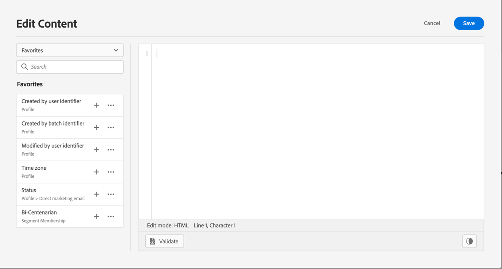

# 將屬性新增至我的最愛 {#fav}

將不同屬性加入收藏夾功能表可讓您快速存取最常使用的專案。 若要新增屬性至您的最愛，請按一下橢圓選單，然後選擇&#x200B;**[!UICONTROL 新增至我的最愛]**。

<!--

-->

若要存取您最愛的專案，請使用左窗格中的&#x200B;**[!UICONTROL 我的最愛]**&#x200B;功能表。

您可以從此清單快速將個人化物件新增至您目前的運算式。

<!--

-->

如果您不想再看到我的最愛清單中的專案，可以將它從我的最愛移除。

<!--

-->
