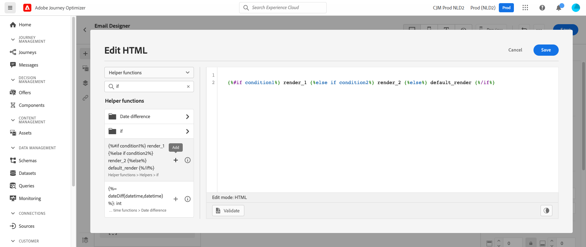

# 個性化用例：車棄用電子郵件 {#personalization-use-case-helper-functions}

在此示例中，您將個性化電子郵件的正文。 此消息針對的是那些在購物車中留有物品但尚未完成購買的客戶。

您將使用以下類型的幫助程式函式：

* 的 `upperCase` 的子菜單。 [了解更多](functions/string.md#upper)。
* 的 `each` 幫助程式，列出購物車中的項目。 [了解更多](functions/helpers.md#each)。
* 的 `if` 幫助程式，以在相關產品位於購物車中時插入特定於產品的注釋。 [了解更多](functions/helpers.md#if-function)。

<!-- **Context**: personalization based on contextual data from the journey -->

在開始之前，請確保知道如何配置這些元素：
* 電子郵件。 [進一步了解](../create-message.md)
* 電子郵件的正文。 [了解更多](../create-email-content.md)。
* 單一事件。 [了解更多](../event/about-events.md)。
* 從事件開始的旅程。 [了解更多](../building-journeys/using-the-journey-designer.md)。

執行以下步驟：
1. [建立電子郵件](#configure-email)。
1. [在大寫字母中插入客戶的名字](#uppercase-function)。
1. [建立初始事件和行程](#create-context)。
1. [將購物車內容添加到電子郵件](#each-helper)。
1. [插入特定於產品的注釋](#if-helper)。
1. [測試並發佈歷程](#test-and-publish).

## 步驟1:建立電子郵件{#configure-email}

1. 建立或修改電子郵件，然後按一下 **[!UICONTROL Email Designer]**。
   

1. 從「電子郵件設計器」首頁的左側調色板，將三個結構元件拖放到消息的正文上。

1. 將HTML內容元件拖放到每個新結構元件上。

   

## 步驟2:在大寫字母中插入客戶的名字 {#uppercase-function}

1. 在「電子郵件設計器」首頁上，按一下要添加客戶名的HTML元件。
1. 在上下文工具欄上，按一下 **[!UICONTROL Show the source code]**。

   

1. 在 **[!UICONTROL Edit HTML]** 的 `upperCase` 字串函式：
   1. 在清單中，選擇 **[!UICONTROL Helper functions]**。
   1. 使用搜索欄位查找「大寫」。
   1. 從搜索結果中，添加 `upperCase` 的子菜單。 要執行此操作，請按一下旁邊的加號(+) `: string`。

      表達式編輯器顯示此表達式：

      ```handlebars
      
      ```

      

1. 從表達式中刪除&quot;string&quot;佔位符。
1. 添加名標籤：
   1. 在清單中，選擇 **[!UICONTROL Profile]**。
   1. 選擇 **[!UICONTROL Profile]** > **[!UICONTROL Person]** > **[!UICONTROL Full name]**.
   1. 添加 **[!UICONTROL First name]** 表達式的標籤。

      表達式編輯器顯示此表達式：

      ```handlebars
      
      ```

      

      瞭解有關人員姓名資料類型的詳細資訊 [Adobe體驗平台文檔](https://experienceleague.adobe.com/docs/experience-platform/xdm/data-types/person-name.html){target=&quot;_blank&quot;}。

1. 按一下「**[!UICONTROL Validate]**」，然後按一下「**[!UICONTROL Save]**」。

   
1. 保存郵件。

## 第3步：建立初始事件和相關行程 {#create-context}

購物車內容是旅程中的上下文資訊。 因此，您必須先將初始事件和電子郵件添加到行程中，然後才能將特定於購物車的資訊添加到電子郵件中。

1. 建立其架構包括 `productListItems` 陣列。
1. 將此陣列中的所有欄位定義為此事件的負載欄位。

   瞭解有關產品清單項資料類型的詳細資訊 [Adobe Experience Platform文檔](https://experienceleague.adobe.com/docs/experience-platform/xdm/data-types/product-list-item.html){target=&quot;_blank&quot;}。

1. 建立從此事件開始的行程。
1. 將消息添加到旅程。
1. 以結束活動結束旅程。

   由於您尚未發佈該消息，因此您既不能test也不能發佈該行程。

   

1. 按一下「**[!UICONTROL OK]**」。

   一條消息通知您行程上下文已傳遞到該消息。

   

## 第4步：插入購物車中的物料清單 {#each-helper}

1. 重新開啟郵件。

   

1. 在「電子郵件設計器」首頁上，按一下要列出購物車內容的HTML元件。
1. 在上下文工具欄上，按一下 **[!UICONTROL Show the source code]**。

   

1. 在 **[!UICONTROL Edit HTML]** 的 `each` 幫助程式：
   1. 在清單中，選擇 **[!UICONTROL Helper functions]**。
   1. 使用搜索欄位查找「每個」。
   1. 從搜索結果中，添加 `each` 幫助程式。

      表達式編輯器顯示此表達式：

      ```handlebars
      {{#each someArray as |variable|}} {{/each}}
      ```

      

1. 添加 `productListItems` 陣列到表達式：

   1. 從表達式中刪除「someArray」佔位符。
   1. 在清單中，選擇 **[!UICONTROL Context]**。

      的 **[!UICONTROL Context]** 選項僅在行程上下文已傳遞到消息後才可用。

   1. 選擇 **[!UICONTROL Journey Orchestration]** > **[!UICONTROL Events]** > ***[!UICONTROL event_name]***，然後展開 **[!UICONTROL productListItems]** 的下界。

      在本例中， *事件名稱* 表示您的活動名稱。

   1. 添加 **[!UICONTROL Product]** 表達式的標籤。

      表達式編輯器顯示此表達式：

      ```handlebars
      {{#each context.journey.events.event_ID.productListItems.product as |variable|}} {{/each}}
      ```
      在本例中， *事件ID* 表示事件的ID。

      

   1. 修改表達式：
      1. 刪除&quot;。product&quot;字串。
      1. 將&quot;variable&quot;佔位符替換為&quot;product&quot;。

      此示例顯示修改後的表達式：

      ```handlebars
      {{#each context.journey.events.event_ID.productListItems as |product|}}
      ```
1. 將此代碼貼上到開啟 `{{#each}}` 標籤和結束 `{/each}}` 標籤：

   ```html
   <table>
      <tbody>
         <tr>
            <td><b>#name</b></td>
            <td><b>#quantity</b></td>
            <td><b>$#priceTotal</b></td>
         </tr>
      </tbody>
   </table>
   ```

1. 添加物料名稱、數量和價格的個性化標籤：

   1. 從HTML表中刪除佔位符「#name」。
   1. 從上一個搜索結果中，添加 **[!UICONTROL Name]** 表達式的標籤。

   重複以下步驟兩次：
   * 將佔位符「#quantity」替換為 **[!UICONTROL Quantity]** 標籤。
   * 將佔位符「#priceTotal」替換為 **[!UICONTROL Total price]** 標籤。

   此示例顯示修改後的表達式：

   ```handlebars
   {{#each context.journey.events.event_ID.productListItems as |product|}}
      <table>
         <tbody>
            <tr>
               <td><b>{{context.journey.events.event_ID.productListItems.name}}</b></td>
               <td><b>{{context.journey.events.event_ID.productListItems.quantity}}</b></td>
               <td><b>${{context.journey.events.event_ID.productListItems.priceTotal}}</b></td>
            </tr>
         </tbody>
      </table>
   {{/each}}
   ```
1. 按一下「**[!UICONTROL Validate]**」，然後按一下「**[!UICONTROL Save]**」。
   

## 第5步：插入特定於產品的注釋 {#if-helper}

1. 在「電子郵件設計器」首頁上，按一下要插入注釋的HTML元件。
1. 在上下文工具欄上，按一下 **[!UICONTROL Show the source code]**。

   

1. 在 **[!UICONTROL Edit HTML]** 的 `if` 幫助程式：
   1. 在清單中，選擇 **[!UICONTROL Helper functions]**。
   1. 使用搜索欄位查找&quot;if&quot;。
   1. 從搜索結果中，添加 `if` 幫助程式。

      表達式編輯器顯示此表達式：

      ```handlebars
       render_1
          render_2
          default_render
      
      ```
      

1. 從表達式中刪除此條件：

   ```handlebars
    render_2
   ```

   此示例顯示修改後的表達式：

   ```handlebars
    render_1
       default_render
   
   ```

1. 將產品名稱令牌添加到條件：
   1. 從表達式中刪除&quot;condition1&quot;佔位符。
   1. 在清單中，選擇 **[!UICONTROL Context]**。
   1. 選擇 **[!UICONTROL Journey Orchestration]** > **[!UICONTROL Events]** > ***[!UICONTROL event_name]***，然後展開 **[!UICONTROL productListItems]** 的下界。

      在本例中， *事件名稱* 表示您的活動名稱。

   1. 添加 **[!UICONTROL Name]** 表達式的標籤。

      表達式編輯器顯示此表達式：

      ```handlebars
      
         render_1
          default_render
      
      ```
      

1. 修改表達式：
   1. 在表達式編輯器中，在 `name` 標籤。

      使用此語法，其中 *產品名稱* 表示產品名稱：

      ```javascript
      = "product_name"
      ```

      在此示例中，產品名稱為「Juno Cacket」：

      ```handlebars
      
         render_1
          default_render
      
      ```

   1. 將&quot;render_1&quot;佔位符替換為注釋文本。

      範例：

      ```handlebars
      
         Due to longer than usual lead times on the Juno Jacket, please expect item to ship two weeks after purchase.
          default_render
      
      ```
   1. 從表達式中刪除&quot;default_render&quot;佔位符。
1. 按一下「**[!UICONTROL Validate]**」，然後按一下「**[!UICONTROL Save]**」。

   

1. 保存並發佈消息。

## 步驟6:Test並發表旅程 {#test-and-publish}

1. 開啟旅程。 如果行程已開啟，則刷新頁面。
1. 開啟 **[!UICONTROL Test]** 切換，然後按一下 **[!UICONTROL Trigger an event]**。

   只有在發佈消息後，才可以開啟test模式。

   

1. 在 **[!UICONTROL Event configuration]** ，然後按一下 **[!UICONTROL Send]**。

   test模式僅適用於test配置檔案。

   

   電子郵件將發送到test配置檔案的地址。

   在此示例中，電子郵件包含有關Juno Cacket的說明，因為此產品位於購物車中：

   

1. 驗證沒有錯誤，然後發佈行程。


## 相關主題

### 車把函式

* [輔助程式](functions/helpers.md)

* [字串函式](functions/string.md)

### 使用案例

* [個性化配置檔案資訊、上下文和服務](personalization-use-case.md)

* [基於決策的個性化服務](../offers/offers-e2e.md)

## 教程視頻{#helper-functions-video}

>[!VIDEO](https://video.tv.adobe.com/v/334244?quality=12)
