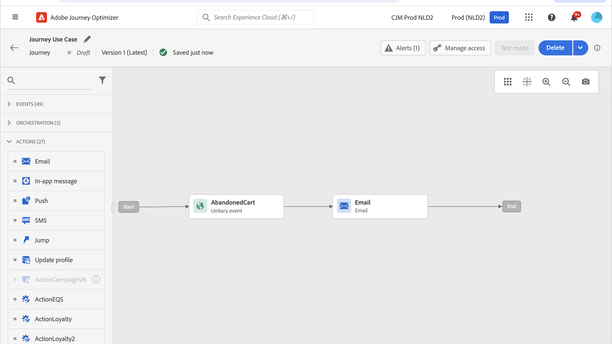
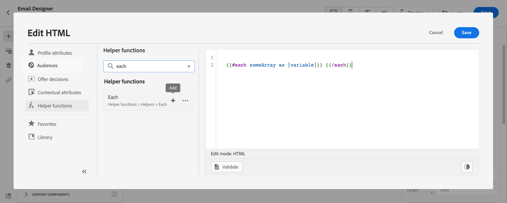
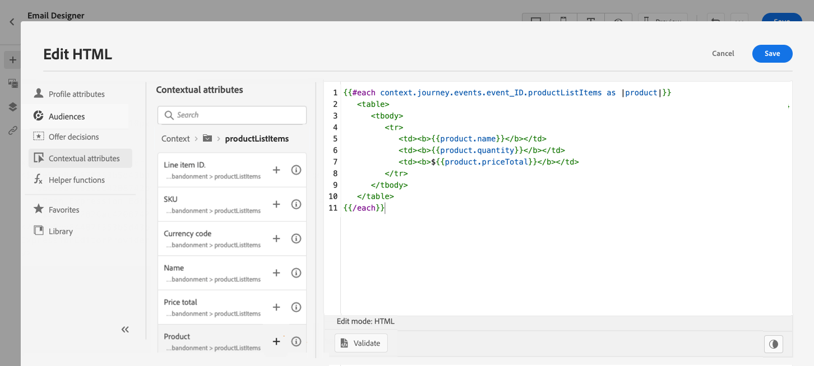
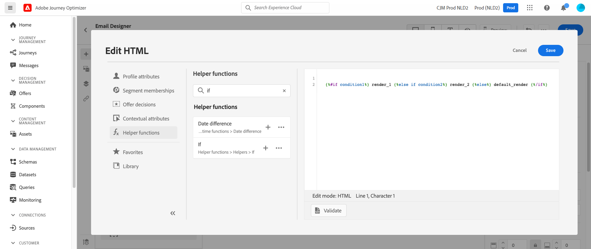
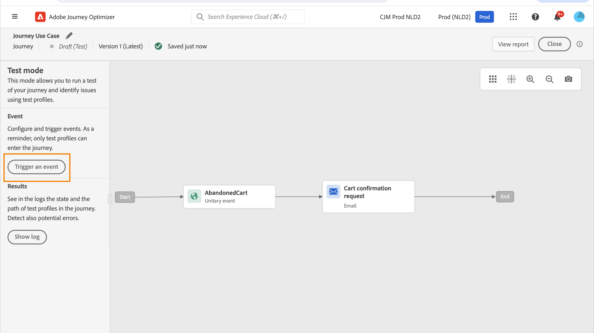

# Personalization使用案例：購物車放棄電子郵件 {#personalization-use-case-helper-functions}

在此範例中，您將個人化電子郵件內文。 此訊息會鎖定在購物車中保留商品，但尚未完成購買的客戶。

您將使用下列型別的協助程式函式：

* `upperCase`字串函式，以大寫字母插入客戶的名字。 [了解更多](functions/string.md#upper)。
* `each`協助程式，列出購物車中的專案。 [了解更多](functions/helpers.md#each)。
* `if`協助程式，在購物車中有相關產品時插入產品特定附註。 [了解更多](functions/helpers.md#if-function)。
<!-- **Context**: personalization based on contextual data from the journey -->

➡️ [在此影片中瞭解如何使用協助程式函式](#video)

開始之前，請確定您知道如何設定這些元素：

* 單一事件。 [了解更多](../event/about-events.md)。
* 以事件開始的歷程。 [了解更多](../building-journeys/using-the-journey-designer.md)。
* 歷程中的電子郵件訊息。 [了解更多](../email/create-email.md)
* 電子郵件內文。 [了解更多](../email/content-from-scratch.md)。

請依照下列步驟操作：

1. [建立初始事件和歷程](#create-context)。
1. [建立電子郵件訊息](#configure-email)。
1. [以大寫字母插入客戶的名字](#uppercase-function)。
1. [將購物車內容新增至電子郵件](#each-helper)。
1. [插入產品專屬備註](#if-helper)。
1. [測試並發佈歷程](#test-and-publish)。

## 步驟1：建立初始事件和相關歷程 {#create-context}

購物車內容是歷程中的內容相關資訊。 因此，您必須先將初始事件和電子郵件新增至歷程，才能將購物車特定資訊新增至電子郵件。

1. 建立其結構描述包含`productListItems`陣列的事件。
1. 將此陣列中的所有欄位定義為此事件的裝載欄位。

   在[Adobe Experience Platform檔案](https://experienceleague.adobe.com/docs/experience-platform/xdm/data-types/product-list-item.html?lang=zh-Hant){target="_blank"}中進一步瞭解產品清單專案資料型別。

1. 建立從此事件開始的歷程。
1. 將&#x200B;**電子郵件**&#x200B;活動新增至歷程。

   

## 步驟2：建立電子郵件{#configure-email}

1. 在&#x200B;**電子郵件**&#x200B;活動中，按一下&#x200B;**[!UICONTROL 編輯內容]**，然後按一下&#x200B;**[!UICONTROL 電子郵件Designer]**。

   

1. 從電子郵件Designer首頁的左側浮動視窗，將三個結構元件拖放至訊息內文上。

1. 將HTML內容元件拖放至每個新結構元件上。

   

## 步驟3：以大寫字母插入客戶的名字 {#uppercase-function}

1. 在電子郵件Designer首頁上，按一下您想要新增客戶名字的HTML元件。
1. 在內容工具列上，按一下&#x200B;**[!UICONTROL 顯示原始程式碼]**。

   

1. 在&#x200B;**[!UICONTROL 編輯HTML]**&#x200B;視窗中，新增`upperCase`字串函式：
   1. 在左側功能表中，選取&#x200B;**[!UICONTROL 協助程式函式]**。
   1. 使用搜尋欄位來尋找「大寫」。
   1. 從搜尋結果中新增`upperCase`函式。 若要這麼做，請按一下`: string`旁的加號(+)。

      運算式編輯器會顯示此運算式：

      ```handlebars
      
      ```

      

1. 從運算式中移除「字串」預留位置。
1. 新增名字代號：
   1. 在左側功能表中，選取&#x200B;**[!UICONTROL 設定檔屬性]**。
   1. 選取&#x200B;**[!UICONTROL 人員]** > **[!UICONTROL 全名]**。
   1. 將&#x200B;**[!UICONTROL 名字]**&#x200B;權杖新增至運算式。

      運算式編輯器會顯示此運算式：

      ```handlebars
      
      ```

      

      在[Adobe Experience Platform檔案](https://experienceleague.adobe.com/docs/experience-platform/xdm/data-types/person-name.html?lang=zh-Hant){target="_blank"}中進一步瞭解人員名稱資料型別。

1. 按一下&#x200B;**[!UICONTROL 驗證]**，然後按一下&#x200B;**[!UICONTROL 儲存]**。

   

1. 儲存訊息。

## 步驟4：從購物車插入專案清單 {#each-helper}

<!--This step demonstrates iterating over event data. For comprehensive examples of iterating over different data sources (events, custom action responses, and other contextual data), see [Iterate over contextual data with Handlebars](personalization-contexts.md).-->

1. 重新開啟訊息內容。

1. 在電子郵件Designer首頁上，按一下您要列出購物車內容的HTML元件。
1. 在內容工具列上，按一下&#x200B;**[!UICONTROL 顯示原始程式碼]**。

   

1. 在&#x200B;**[!UICONTROL 編輯HTML]**&#x200B;視窗中，新增`each`協助程式：
   1. 在左側功能表中，選取&#x200B;**[!UICONTROL 協助程式函式]**。
   1. 使用搜尋欄位來尋找「each」。
   1. 從搜尋結果中新增`each`協助程式。

      運算式編輯器會顯示此運算式：

      ```handlebars
      {{#each someArray as |variable|}} {{/each}}
      ```

      

1. 將`productListItems`陣列新增至運算式：

   1. 從運算式中移除「someArray」預留位置。
   1. 在左側功能表中，選取&#x200B;**[!UICONTROL 內容屬性]**。

      **[!UICONTROL 內容屬性]**&#x200B;只有在歷程內容已傳遞至訊息之後，才能使用。

   1. 選取&#x200B;**[!UICONTROL Journey Optimizer]** > **[!UICONTROL 事件]** > ***[!UICONTROL 事件名稱]***，然後展開&#x200B;**[!UICONTROL productListItems]**&#x200B;節點。

      在此範例中，*event_name*&#x200B;代表事件的名稱。

   1. 將&#x200B;**[!UICONTROL Product]**&#x200B;權杖新增至運算式。

      運算式編輯器會顯示此運算式：

      ```handlebars
      {{#each context.journey.events.event_ID.productListItems.product as |variable|}} {{/each}}
      ```

      在此範例中，*event_ID*&#x200B;代表您事件的識別碼。

      

   1. 修改運算式：
      1. 移除「.product」字串。
      1. 將「變數」預留位置取代為「產品」。

      此範例顯示修改後的運算式：

      ```handlebars
      {{#each context.journey.events.event_ID.productListItems as |product|}}
      ```

1. 在開頭`{{#each}}`標籤和結尾`{/each}}`標籤之間貼上此程式碼：

   ```html
   <table>
      <tbody>
         <tr>
            <td><b>#name</b></td>
            <td><b>#quantity</b></td>
            <td><b>$#priceTotal</b></td>
         </tr>
      </tbody>
   </table>
   ```

1. 新增專案名稱、數量和價格的個人化代號：

   1. 從HTML表格中移除預留位置「#name」。
   1. 從先前的搜尋結果中，將&#x200B;**[!UICONTROL Name]**&#x200B;權杖新增至運算式。

   重複這些步驟兩次：

   * 將預留位置「#quantity」取代為&#x200B;**[!UICONTROL 數量]**&#x200B;權杖。
   * 將預留位置「#priceTotal」取代為&#x200B;**[!UICONTROL 總價]**&#x200B;代號。

   此範例顯示修改後的運算式：

   ```handlebars
   {{#each context.journey.events.event_ID.productListItems as |product|}}
      <table>
         <tbody>
            <tr>
            <td><b>{{product.name}}</b></td>
            <td><b>{{product.quantity}}</b></td>
            <td><b>${{product.priceTotal}}</b></td>
            </tr>
         </tbody>
      </table>
   {{/each}}
   ```

1. 按一下&#x200B;**[!UICONTROL 驗證]**，然後按一下&#x200B;**[!UICONTROL 儲存]**。

   

## 步驟5：插入產品專屬附註 {#if-helper}

1. 在電子郵件Designer首頁上，按一下您要插入附註的HTML元件。
1. 在內容工具列上，按一下&#x200B;**[!UICONTROL 顯示原始程式碼]**。

   

1. 在&#x200B;**[!UICONTROL 編輯HTML]**&#x200B;視窗中，新增`if`協助程式：
   1. 在左側功能表中，選取&#x200B;**[!UICONTROL 協助程式函式]**。
   1. 使用搜尋欄位來尋找「if」。
   1. 從搜尋結果中新增`if`協助程式。

      運算式編輯器會顯示此運算式：

      ```handlebars
       render_1
          render_2
          default_render
      
      ```

      

1. 從運算式移除此條件：

   ```handlebars
    render_2
   ```

   此範例顯示修改後的運算式：

   ```handlebars
    render_1
       default_render
   
   ```

1. 將產品名稱Token新增至條件：
   1. 從運算式中移除「condition1」預留位置。
   1. 在左側功能表中，選取&#x200B;**[!UICONTROL 內容屬性]**。
   1. 選取&#x200B;**[!UICONTROL Journey Orchestration]** > **[!UICONTROL 事件]** > ***[!UICONTROL 事件名稱]***，然後展開&#x200B;**[!UICONTROL productListItems]**&#x200B;節點。

      在此範例中，*event_name*&#x200B;代表事件的名稱。

   1. 將&#x200B;**[!UICONTROL Name]**&#x200B;權杖新增至運算式。

      運算式編輯器會顯示此運算式：

      ```handlebars
      
         render_1
          default_render
      
      ```

      

1. 修改運算式：
   1. 在運算式編輯器中，在`name` Token後面指定產品名稱。

      使用此語法，其中&#x200B;*product_name*&#x200B;代表產品的名稱：

      ```javascript
      = "product_name"
      ```

      在此範例中，產品名稱為「Juno Jacket」：

      ```handlebars
      
         render_1
          default_render
      
      ```

   1. 將「render_1」預留位置取代為註記文字。

      範例：

      ```handlebars
      
         Due to longer than usual lead times on the Juno Jacket, please expect item to ship two weeks after purchase.
          default_render
      
      ```

   1. 從運算式中移除「default_render」預留位置。
1. 按一下&#x200B;**[!UICONTROL 驗證]**，然後按一下&#x200B;**[!UICONTROL 儲存]**。

   

1. 儲存訊息。

## 步驟6：測試並發佈歷程 {#test-and-publish}

1. 開啟&#x200B;**[!UICONTROL 測試]**&#x200B;切換，然後按一下&#x200B;**[!UICONTROL 觸發事件]**。

   

1. 在&#x200B;**[!UICONTROL 事件組態]**&#x200B;視窗中輸入輸入值，然後按一下&#x200B;**[!UICONTROL 傳送]**。

   測試模式僅適用於測試設定檔。

   

   電子郵件會傳送至測試設定檔的地址。

   在此範例中，電子郵件會包含有關Juno Jacket的備註，因為此產品已在購物車中：

   

1. 確認沒有錯誤，然後發佈歷程。


## 相關主題 {#related-topics}

### Handlebars函式 {#handlebars}

* [輔助程式](functions/helpers.md)

* [字串函式](functions/string.md)

### 使用案例 {#use-case}

* [Personalization包含設定檔資訊、內容和選件](personalization-use-case.md)

* [Personalization搭配決策型優惠](../offers/offers-e2e.md)

## 作法影片{#video}

瞭解如何使用協助程式函式。

>[!VIDEO](https://video.tv.adobe.com/v/334244?quality=12)
