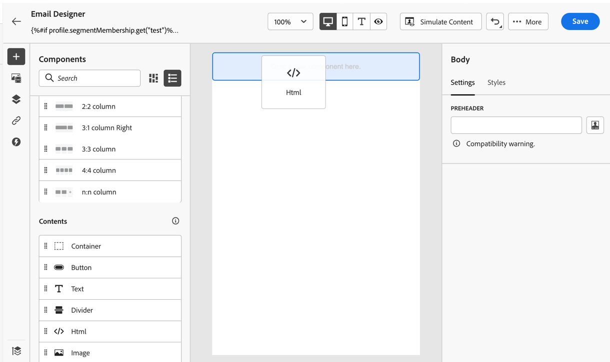
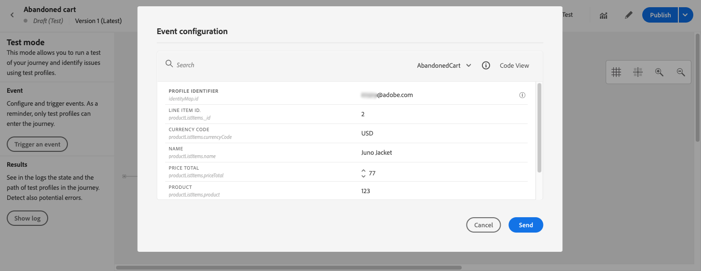

# 個人化使用案例：購物車放棄電子郵件 {#personalization-use-case-helper-functions}

在此範例中，您將個人化電子郵件訊息的內文。 此訊息會鎖定已在購物車中留下項目，但尚未完成購買的客戶。

您將使用以下類型的協助程式函式：

* 此 `upperCase` 字串函式，以在大寫字母中插入客戶的名字。 [了解更多](functions/string.md#upper)。
* 此 `each` 協助工具，列出購物車中的項目。 [了解更多](functions/helpers.md#each)。
* 此 `if` 協助工具，以在相關產品在購物車中時插入產品專屬備注。 [了解更多](functions/helpers.md#if-function)。

<!-- **Context**: personalization based on contextual data from the journey -->

➡️ [了解如何在此影片中使用協助程式功能](#video)

開始之前，請確定您知道如何設定這些元素：

* 單一事件。 [了解更多](../event/about-events.md)。
* 以事件開始的歷程。 [了解更多](../building-journeys/using-the-journey-designer.md)。
* 您歷程中的電子郵件訊息。 [了解更多](../messages/get-started-content.md)
* 電子郵件的正文。 [了解更多](../design/create-email-content.md)。

請依照下列步驟操作：

1. [建立初始事件和歷程](#create-context).
1. [建立電子郵件訊息](#configure-email).
1. [在大寫字母中插入客戶的名字](#uppercase-function).
1. [將購物車內容新增至電子郵件](#each-helper).
1. [插入產品特定附註](#if-helper).
1. [測試並發佈歷程](#test-and-publish).

## 步驟1:建立初始事件和相關歷程 {#create-context}

購物車內容是歷程的情境資訊。 因此，您必須先新增初始事件和電子郵件至歷程，才能將購物車專屬資訊新增至電子郵件。

1. 建立其架構包含 `productListItems` 陣列。
1. 將此陣列中的所有欄位定義為此事件的有效負載欄位。

   深入了解產品清單項目資料類型 [Adobe Experience Platform檔案](https://experienceleague.adobe.com/docs/experience-platform/xdm/data-types/product-list-item.html){target=&quot;_blank&quot;}。

1. 建立以此事件開始的歷程。
1. 新增 **電子郵件** 活動至歷程。

   

## 步驟2:建立電子郵件{#configure-email}

1. 在 **電子郵件** 活動，按一下 **[!UICONTROL 編輯內容]**，然後按一下 **[!UICONTROL 電子郵件設計工具]**.
   

1. 從電子郵件設計工具首頁的左側浮動視窗，將三個結構元件拖放至訊息內文。

1. 將HTML內容元件拖放至每個新結構元件。

   

## 步驟3:在大寫字母中插入客戶的名字 {#uppercase-function}

1. 在電子郵件設計工具首頁上，按一下要添加HTML名的客戶元件。
1. 在內容工具列上，按一下 **[!UICONTROL 顯示原始碼]**.

   

1. 在 **[!UICONTROL 編輯HTML]** 窗口，添加 `upperCase` 字串函式：
   1. 在左側功能表中，選取 **[!UICONTROL 輔助函式]**.
   1. 使用搜尋欄位來尋找「大寫」。
   1. 從搜尋結果中，新增 `upperCase` 函式。 要執行此操作，請按一下旁邊的加號(+) `: string`.

      運算式編輯器會顯示此運算式：

      ```handlebars
      
      ```

      

1. 從運算式中移除「字串」預留位置。
1. 新增名字代號：
   1. 在左側功能表中，選取 **[!UICONTROL 設定檔屬性]**.
   1. 選擇 **[!UICONTROL 人員]** > **[!UICONTROL 全名]**.
   1. 新增 **[!UICONTROL 名字]** 代號至運算式。

      運算式編輯器會顯示此運算式：

      ```handlebars
      
      ```

      

      深入了解人員名稱資料類型，位於 [Adobe Experience Platform檔案](https://experienceleague.adobe.com/docs/experience-platform/xdm/data-types/person-name.html){target=&quot;_blank&quot;}。

1. 按一下 **[!UICONTROL 驗證]**，然後按一下 **[!UICONTROL 儲存]**.

   
1. 儲存訊息。

## 步驟4:插入購物車中的項目清單 {#each-helper}

1. 重新開啟訊息內容。

1. 在電子郵件設計工具首頁上，按一下您要列出購物車內容的HTML元件。
1. 在內容工具列上，按一下 **[!UICONTROL 顯示原始碼]**.

   

1. 在 **[!UICONTROL 編輯HTML]** 窗口，添加 `each` 幫助者：
   1. 在左側功能表中，選取 **[!UICONTROL 輔助函式]**.
   1. 使用搜尋欄位來尋找「每個」。
   1. 從搜尋結果中，新增 `each` 幫手。

      運算式編輯器會顯示此運算式：

      ```handlebars
      {{#each someArray as |variable|}} {{/each}}
      ```

      

1. 新增 `productListItems` array到運算式：

   1. 從運算式中移除「someArray」預留位置。
   1. 在左側功能表中，選取 **[!UICONTROL 內容屬性]**.

      **[!UICONTROL 內容屬性]** 只有在歷程內容已傳遞至訊息後，才可使用。

   1. 選擇 **[!UICONTROL Journey Optimizer]** > **[!UICONTROL 事件]** > ***[!UICONTROL event_name]***，然後展開 **[!UICONTROL productListItems]** 節點。

      在此範例中， *event_name* 代表事件的名稱。

   1. 新增 **[!UICONTROL 產品]** 代號至運算式。

      運算式編輯器會顯示此運算式：

      ```handlebars
      {{#each context.journey.events.event_ID.productListItems.product as |variable|}} {{/each}}
      ```
      在此範例中， *event_ID* 代表事件的ID。

      

   1. 修改運算式：
      1. 移除「.product」字串。
      1. 將「變數」預留位置取代為「product」。

      此示例顯示修改後的表達式：

      ```handlebars
      {{#each context.journey.events.event_ID.productListItems as |product|}}
      ```
1. 將此程式碼貼到開頭 `{{#each}}` 標籤和結尾 `{/each}}` 標籤：

   ```html
   <table>
      <tbody>
         <tr>
            <td><b>#name</b></td>
            <td><b>#quantity</b></td>
            <td><b>$#priceTotal</b></td>
         </tr>
      </tbody>
   </table>
   ```

1. 為項目名稱、數量和價格新增個人化代號：

   1. 從HTML表格中移除預留位置「#name」。
   1. 從先前的搜尋結果中，新增 **[!UICONTROL 名稱]** 代號至運算式。

   重複這些步驟兩次：
   * 將預留位置「#quantity」取代為 **[!UICONTROL 數量]** 代號。
   * 將預留位置「#priceTotal」取代為 **[!UICONTROL 總價]** 代號。

   此示例顯示修改後的表達式：

   ```handlebars
   {{#each context.journey.events.event_ID.productListItems as |product|}}
      <table>
         <tbody>
            <tr>
               <td><b>{{context.journey.events.event_ID.productListItems.name}}</b></td>
               <td><b>{{context.journey.events.event_ID.productListItems.quantity}}</b></td>
               <td><b>${{context.journey.events.event_ID.productListItems.priceTotal}}</b></td>
            </tr>
         </tbody>
      </table>
   {{/each}}
   ```
1. 按一下 **[!UICONTROL 驗證]**，然後按一下 **[!UICONTROL 儲存]**.
   

## 步驟5:插入產品特定附註 {#if-helper}

1. 在電子郵件設計工具首頁上，按一下要插入注釋的HTML元件。
1. 在內容工具列上，按一下 **[!UICONTROL 顯示原始碼]**.

   

1. 在 **[!UICONTROL 編輯HTML]** 窗口，添加 `if` 幫助者：
   1. 在左側功能表中，選取 **[!UICONTROL 輔助函式]**.
   1. 使用搜尋欄位來尋找&quot;if&quot;。
   1. 從搜尋結果中，新增 `if` 幫手。

      運算式編輯器會顯示此運算式：

      ```handlebars
       render_1
          render_2
          default_render
      
      ```
      

1. 從運算式中移除此條件：

   ```handlebars
    render_2
   ```

   此示例顯示修改後的表達式：

   ```handlebars
    render_1
       default_render
   
   ```

1. 將產品名稱代號新增至條件：
   1. 從運算式中移除「condition1」預留位置。
   1. 在左側功能表中，選取 **[!UICONTROL 內容屬性]**.
   1. 選擇 **[!UICONTROL Journey Orchestration]** > **[!UICONTROL 事件]** > ***[!UICONTROL event_name]***，然後展開 **[!UICONTROL productListItems]** 節點。

      在此範例中， *event_name* 代表事件的名稱。

   1. 新增 **[!UICONTROL 名稱]** 代號至運算式。

      運算式編輯器會顯示此運算式：

      ```handlebars
      
         render_1
          default_render
      
      ```
      

1. 修改運算式：
   1. 在運算式編輯器中，指定產品名稱后方的 `name` 代號。

      請使用此語法，其中 *product_name* 代表您的產品名稱：

      ```javascript
      = "product_name"
      ```

      在此範例中，產品名稱為「Juno Jacket」：

      ```handlebars
      
         render_1
          default_render
      
      ```

   1. 將「render_1」預留位置替換為注釋的文本。

      範例：

      ```handlebars
      
         Due to longer than usual lead times on the Juno Jacket, please expect item to ship two weeks after purchase.
          default_render
      
      ```
   1. 從運算式中移除「default_render」預留位置。
1. 按一下 **[!UICONTROL 驗證]**，然後按一下 **[!UICONTROL 儲存]**.

   

1. 儲存訊息。

## 步驟6:測試並發佈歷程 {#test-and-publish}

1. 開啟 **[!UICONTROL 測試]** 切換，然後按一下 **[!UICONTROL 觸發事件]**.

   

1. 在 **[!UICONTROL 事件設定]** ，輸入輸入值，然後按一下 **[!UICONTROL 傳送]**.

   測試模式僅適用於測試設定檔。

   

   電子郵件會傳送至測試設定檔的地址。

   在此範例中，電子郵件包含關於Juno Jacket的附註，因為此產品位於購物車中：

   

1. 確認沒有錯誤，然後發佈歷程。


## 相關主題 {#related-topics}

### Handlebars函式 {#handlebars}

* [輔助程式](functions/helpers.md)

* [字串函式](functions/string.md)

### 使用案例 {#use-case}

* [使用設定檔資訊、內容和選件進行個人化](personalization-use-case.md)

* [使用決策型選件進行個人化](../offers/offers-e2e.md)

## 作法影片{#video}

了解如何使用協助程式功能。

>[!VIDEO](https://video.tv.adobe.com/v/334244?quality=12)
