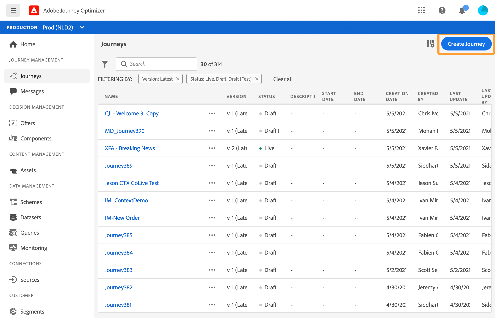
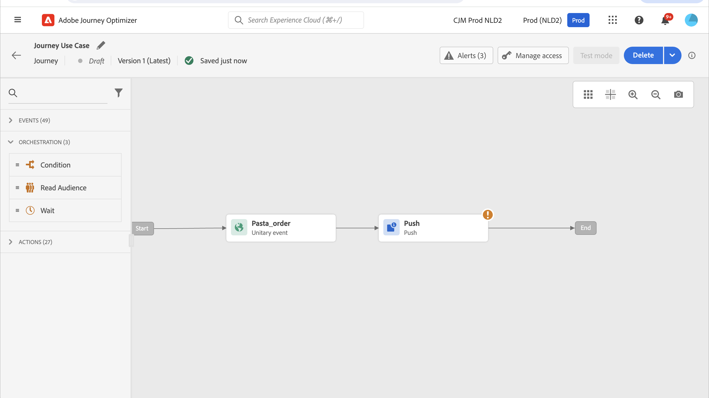
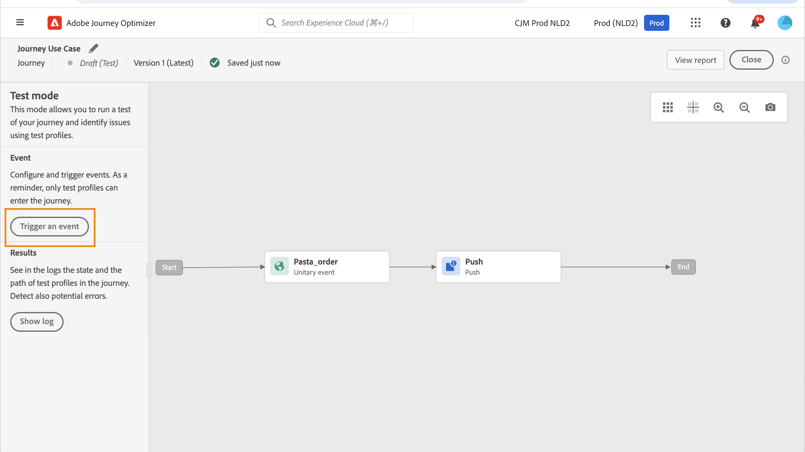
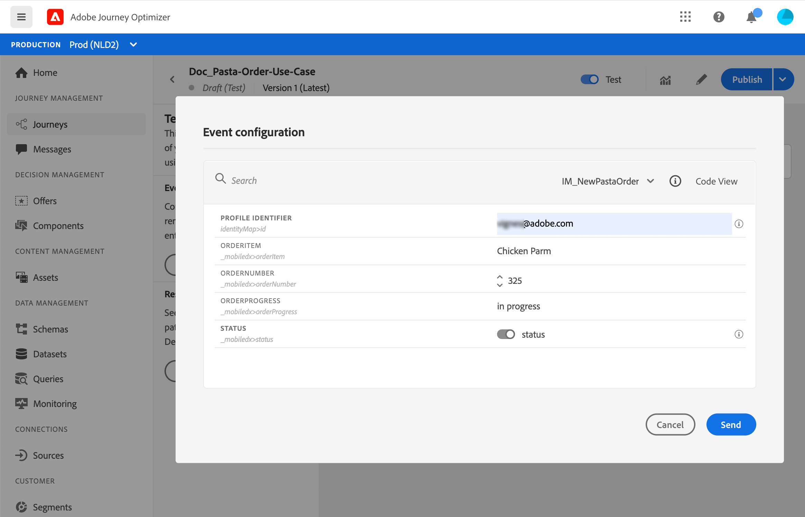

# Personalization使用案例：訂單狀態通知 {#personalization-use-case}

在此使用案例中，您將會瞭解如何在單一推播通知訊息中使用多種型別的個人化。 將使用三種型別的個人化：

* **設定檔**：根據設定檔欄位的訊息個人化
* **優惠決定**：以決定管理變數為基礎的個人化
* **內容**：以歷程中的內容資料為基礎的個人化

此範例的目標是在每次更新客戶訂單時將事件推送至[!DNL Journey Optimizer]。 然後，推播通知會傳送給客戶，其中包含訂單和個人化優惠的相關資訊。

對於此使用案例，需要下列先決條件：

* 設定訂單事件，包含訂單編號、狀態及料號名稱。 請參閱本[章節](../event/about-events.md)。
* 建立決定，請參閱此[區段](../offers/offer-activities/create-offer-activities.md)。

➡️ [探索視訊中的類似使用案例](#video)

## 步驟1 — 建立歷程 {#create-journey}

1. 按一下&#x200B;**[!UICONTROL 歷程]**&#x200B;功能表並建立新歷程。

   

1. 新增您的進入事件和&#x200B;**推播**&#x200B;動作活動。

   

1. 設定並設計您的推播通知訊息。 請參閱本[章節](../push/create-push.md)。

## 步驟2 — 在設定檔中新增個人化 {#add-perso}

1. 在&#x200B;**推播**&#x200B;活動中，按一下&#x200B;**編輯內容**。

1. 按一下&#x200B;**標題**&#x200B;欄位。

   

1. 輸入主旨並新增個人化設定檔。 使用搜尋列來尋找設定檔的名字欄位。 在主旨文字中，將游標置於要插入個人化欄位的位置，然後按一下&#x200B;**+**&#x200B;圖示。 按一下&#x200B;**儲存**。

   

## 步驟3 — 在內容資料上新增個人化 {#add-perso-contextual-data}

1. 在&#x200B;**推播**&#x200B;活動中，按一下&#x200B;**編輯內容**，然後按一下&#x200B;**標題**&#x200B;欄位。

   

1. 選取&#x200B;**內容屬性**&#x200B;功能表。 只有在歷程將內容資料傳遞至訊息時，內容屬性才可用。 按一下&#x200B;**Journey Orchestration**。 下列內容相關資訊隨即顯示：

   * **事件**：此類別會重新分組歷程中置於頻道動作活動之前之事件中的所有欄位。
   * **歷程屬性**：與特定設定檔之歷程相關的技術欄位，例如歷程ID或遇到的特定錯誤。 進一步瞭解[Journey Orchestration檔案](../building-journeys/expression/journey-properties.md)。

   

1. 展開&#x200B;**事件**&#x200B;專案，並尋找與您的事件相關的訂單編號欄位。 您也可以使用搜尋方塊。 按一下&#x200B;**+**&#x200B;圖示，在主旨文字中插入個人化欄位。 按一下&#x200B;**儲存**。

   

1. 現在按一下&#x200B;**內文**&#x200B;欄位。

   

1. 輸入訊息，然後從&#x200B;**[!UICONTROL 內容屬性]**&#x200B;功能表插入訂單專案名稱和訂單進度。

   

1. 從左側功能表選取&#x200B;**優惠決定**&#x200B;以插入決定變數。 選取位置，然後按一下決定旁邊的&#x200B;**+**&#x200B;圖示以將其新增到內文。

   

1. 按一下驗證以確定沒有錯誤，然後按一下[儲存]。**&#x200B;**

   

## 步驟4 — 測試並發佈歷程 {#test-publish}

1. 按一下&#x200B;**測試**&#x200B;按鈕，然後按一下&#x200B;**觸發事件**。

   

1. 輸入測試中要傳遞的不同值。 測試模式僅適用於測試設定檔。 設定檔識別碼必須對應至測試設定檔。 按一下&#x200B;**傳送**。

   

   推播通知會傳送並顯示在測試設定檔的行動電話上。

   

1. 確認沒有錯誤並發佈歷程。

## 作法影片 {#video}

以下影片顯示了一個類似的使用案例，運用歷程中的內容資料來個人化電子郵件。

>[!VIDEO](https://video.tv.adobe.com/v/3425027?quality=12)
